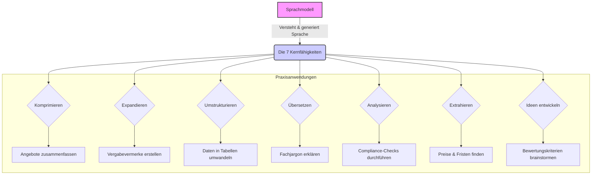
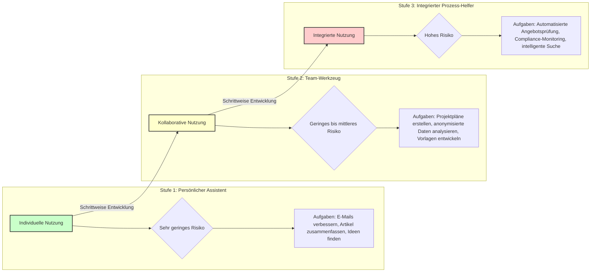
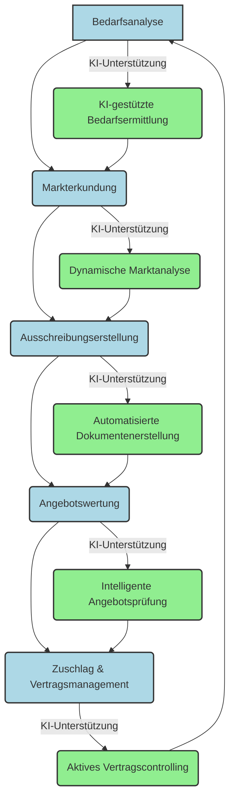
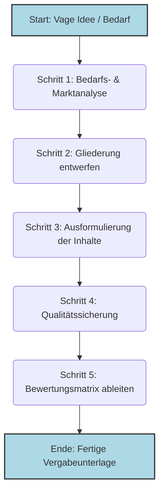
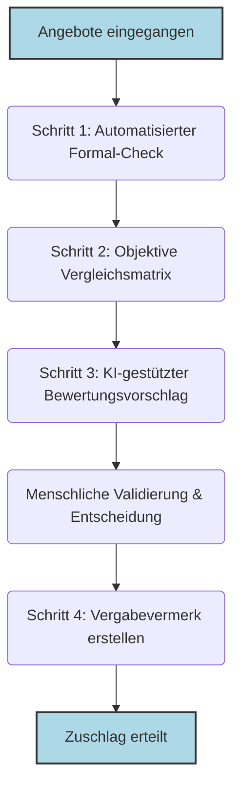
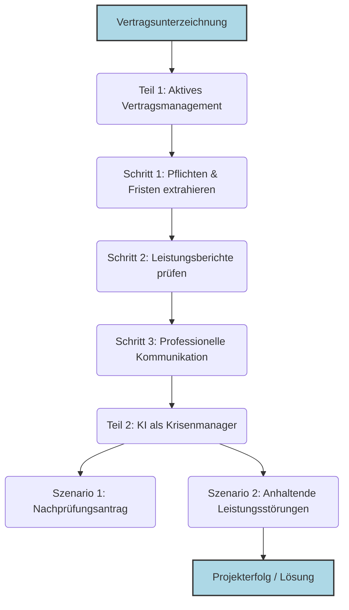
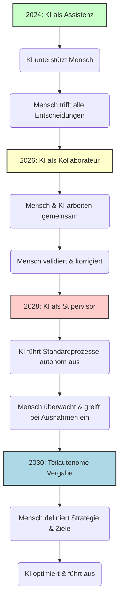

# **Das Ende des Formulars: Wie Sprachmodelle die öffentliche Vergabe neu definieren**

## **Ein Praxisleitfaden für die Revolution im Beschaffungswesen**

Stellen Sie sich Ihren Arbeitsalltag vor, befreit von seinen zeitraubendsten Routinen. Eine Welt, in der die manuelle Suche nach der passenden Klausel in seitenlangen Vergabeordnern der Vergangenheit angehört. In der die Nächte vor der Angebotsöffnung nicht mehr der Jagd nach formalen Fehlern gewidmet sind und wochenlange Verzögerungen durch schleppende Marktanalysen nicht mehr existieren.

Was vor wenigen Jahren noch wie eine ferne Utopie klang, rückt durch die rasante Entwicklung von Sprachmodellen in greifbare Nähe. Diese Technologie ist mehr als nur ein besserer Chatbot; sie ist ein fundamental neues Werkzeug, das die Texterstellung, Analyse und Kommunikation in der öffentlichen Verwaltung von Grund auf verändern wird. Sie markiert den entscheidenden Schritt von der reinen Digitalisierung alter Formulare hin zu intelligenten, teilautomatierten Prozessen.

Dieses Buch ist Ihr praxisorientierter Begleiter auf diesem Weg. Es ist kein technisches Kompendium für IT-Spezialisten und keine juristische Abhandlung über den EU AI Act. Es ist ein Handbuch für Sie – die Vergabeverantwortlichen, Amtsleiter und Entscheidungsträger, die täglich mit der komplexen Realität der öffentlichen Beschaffung konfrontiert sind.

Wir verlieren uns nicht in theoretischen Debatten, sondern konzentrieren uns auf das, was heute schon möglich ist und morgen zur gängigen Praxis wird. Sie lernen nicht nur, *was* Sprachmodelle sind, sondern vor allem, *wie* Sie diese als leistungsstarken Assistenten in jeder Phase des Vergabeprozesses einsetzen:

*   **Von der Idee zur Ausschreibung in Rekordzeit:** Wie Sie aus einer einfachen Bedarfsbeschreibung eine vollständige, präzise und rechtskonforme Leistungsbeschreibung generieren.
*   **Marktanalysen, die diesen Namen verdienen:** Wie Sie in Minuten statt Wochen ein tiefes Verständnis für Anbietermärkte, technologische Trends und Preisstrukturen gewinnen.

*   **Fokussierte und faire Angebotsbewertung:** Wie Sie die formale Prüfung von Angeboten automatisieren, um Ihre Zeit auf die inhaltliche und strategische Bewertung zu konzentrieren.
*   **Souveräne Kommunikation:** Wie Sie Bieteranfragen schneller und konsistenter beantworten und komplexe Sachverhalte klar und verständlich kommunizieren.

Dieses Buch ersetzt nicht Ihre Kernkompetenzen – Ihr Fachwissen, Ihr Urteilsvermögen und Ihre strategische Weitsicht. Aber es zeigt Ihnen, wie Sie diese Fähigkeiten durch den gezielten Einsatz von Sprachmodellen vervielfachen können. Es gibt Ihnen die Werkzeuge an die Hand, um dem wachsenden Druck durch Fachkräftemangel, steigende Komplexität und knappe Budgets nicht nur standzuhalten, sondern die Effizienz und Qualität Ihrer Arbeit auf ein neues Niveau zu heben.

Wir laden Sie ein, die Möglichkeiten zu entdecken, die sich ergeben, wenn menschliche Expertise und künstliche Intelligenz zusammenarbeiten. Willkommen in der Zukunft der Beschaffung.

---

# **Inhaltsverzeichnis**

**Kapitel 1: Ihr neuer Fachassistent – Was Sprachmodelle wirklich können**
- Die sieben Kernfähigkeiten für die Beschaffungspraxis
- Die Praxis der Anweisung: Wie Sie gute Prompts schreiben
- Grenzen und Risiken in der Praxis

**Kapitel 2: Fortgeschrittene Prompt-Techniken – Wie Sie Sprachmodelle zu Expertensystemen machen**
- Die Anatomie eines Expertenprompts
- Fortgeschrittene Prompt-Patterns für die Vergabepraxis
- KI-Assistierte Arbeitsabläufe: Systematische Prozessketten

**Kapitel 3: Strategie und erste Schritte – Führen Sie KI sicher in Ihrer Vergabestelle ein**
- Die richtige Haltung: Vom skeptischen Beobachter zum neugierigen Entdecker
- Der sichere Start: Das 3-Stufen-Modell der KI-Einführung
- Datenschutz in der Praxis

**Kapitel 4: Der Vergabeprozess im KI-Zeitalter – Eine neue Landkarte**
- Phase 1: Der Bedarf – Von der vagen Idee zur präzisen Anforderung
- Phase 2: Der Markt – Vom Suchen zum Verstehen
- Phase 3: Die Ausschreibung – Vom leeren Blatt zur präzisen Leistungsbeschreibung
- Phase 4: Die Entscheidung – Von der Angebotsflut zum fokussierten Urteil
- Phase 5: Der Vertrag – Von der Ablage zur aktiven Steuerung

**Kapitel 5: Die Ausschreibungswerkstatt – In 5 Schritten von der Idee zur fertigen Vergabeunterlage**
- Schritt 1: Das Fundament – Die KI-gestützte Bedarfs- und Marktanalyse
- Schritt 2: Das Gerüst – Struktur und Gliederung der Leistungsbeschreibung
- Schritt 3: Die Ausformulierung – Vom Gerüst zum fertigen Dokument
- Schritt 4: Die Qualitätssicherung – Das Vier-Augen-Prinzip mit der KI
- Schritt 5: Die Brücke zur Entscheidung – Die Bewertungsmatrix ableiten

**Kapitel 6: Die intelligente Angebotswertung – Fairness, Effizienz und Tiefe im Bewertungs-Cockpit**
- Schritt 1: Der automatisierte Formular-Check
- Schritt 2: Die objektive Vergleichsmatrix
- Schritt 3: Der KI-gestützte Bewertungsvorschlag
- Schritt 4: Der Vergabevermerk

**Kapitel 7: Jenseits des Zuschlags – Vertragsmanagement und Sondersituationen mit KI meistern**
- Das lebende Vertragswerk – KI im aktiven Vertragsmanagement
- Wenn der Plan nicht aufgeht – KI als Krisenmanager

**Kapitel 8: Change Management und Organisationsentwicklung – Führen Sie Ihr Team erfolgreich durch die KI-Transformation**
- Psychologische Barrieren abbauen
- Widerstandsmanagement im öffentlichen Sektor
- Kompetenzaufbau systematisch organisieren
- Führungsstrategien für die KI-Transformation

**Kapitel 9: Qualitätsmanagement und KPIs – Messbare Exzellenz in der KI-gestützten Vergabe**
- Strategische KPIs für KI-Erfolg in der Vergabe
- Qualitätsrahmen für KI-Entscheidungen
- Kontinuierliche Verbesserung durch Lean Six Sigma 4.0
- ROI-Messung und Wirtschaftlichkeit

**Kapitel 10: Fortgeschrittene Vergabe-Szenarien – KI als Enabler für Innovation und Nachhaltigkeit**
- Innovationsbeschaffung mit KI
- Nachhaltige Beschaffung mit KI
- Komplexe Mehrkriterien-Entscheidungen
- Zukunft der Vergabe: Autonome und prädiktive Beschaffung

**Kapitel 11: Die Zukunft der Vergabe hat bereits begonnen – Ein strategischer Ausblick und Fazit**
- Der Weg zur teilautonomen Vergabe
- Neue Horizonte: Nachhaltigkeit und Souveränität
- Das Fazit: Ihre Chance, die Zukunft zu gestalten

**Kapitel 12: Zusammenarbeit zwischen Fachbereichen und Vergabestellen – Die KI-Revolution der Verwaltungskooperation**
- Traditionelle Zusammenarbeit: Der Status Quo
- KI-Transformation der Zusammenarbeit
- Praktische Anwendungsfälle
- Prozessoptimierung durch KI
- Organisatorische Veränderungen
- Implementierungsroadmap
- Fazit: Die Revolution der Verwaltungskooperation

**Anhang A: Ausgewählte Prompt-Bibliothek**
- Prompts für die Bedarfs- und Marktanalyse
- Prompts für die Ausschreibungserstellung
- Prompts für die Angebotswertung
- Prompts für Vertragsmanagement & Sondersituationen

---# **Das Ende des Formulars: Wie Sprachmodelle die öffentliche Vergabe neu definieren**

## **Ein Praxisleitfaden für die Revolution im Beschaffungswesen**

Stellen Sie sich Ihren Arbeitsalltag vor, befreit von seinen zeitraubendsten Routinen. Eine Welt, in der die manuelle Suche nach der passenden Klausel in seitenlangen Vergabeordnern der Vergangenheit angehört. In der die Nächte vor der Angebotsöffnung nicht mehr der Jagd nach formalen Fehlern gewidmet sind und wochenlange Verzögerungen durch schleppende Marktanalysen nicht mehr existieren.

Was vor wenigen Jahren noch wie eine ferne Utopie klang, rückt durch die rasante Entwicklung von Sprachmodellen in greifbare Nähe. Diese Technologie ist mehr als nur ein besserer Chatbot; sie ist ein fundamental neues Werkzeug, das die Texterstellung, Analyse und Kommunikation in der öffentlichen Verwaltung von Grund auf verändern wird. Sie markiert den entscheidenden Schritt von der reinen Digitalisierung alter Formulare hin zu intelligenten, teilautomatierten Prozessen.

Dieses Buch ist Ihr praxisorientierter Begleiter auf diesem Weg. Es ist kein technisches Kompendium für IT-Spezialisten und keine juristische Abhandlung über den EU AI Act. Es ist ein Handbuch für Sie – die Vergabeverantwortlichen, Amtsleiter und Entscheidungsträger, die täglich mit der komplexen Realität der öffentlichen Beschaffung konfrontiert sind.

Wir verlieren uns nicht in theoretischen Debatten, sondern konzentrieren uns auf das, was heute schon möglich ist und morgen zur gängigen Praxis wird. Sie lernen nicht nur, *was* Sprachmodelle sind, sondern vor allem, *wie* Sie diese als leistungsstarken Assistenten in jeder Phase des Vergabeprozesses einsetzen:

*   **Von der Idee zur Ausschreibung in Rekordzeit:** Wie Sie aus einer einfachen Bedarfsbeschreibung eine vollständige, präzise und rechtskonforme Leistungsbeschreibung generieren.
*   **Marktanalysen, die diesen Namen verdienen:** Wie Sie in Minuten statt Wochen ein tiefes Verständnis für Anbietermärkte, technologische Trends und Preisstrukturen gewinnen.

*   **Fokussierte und faire Angebotsbewertung:** Wie Sie die formale Prüfung von Angeboten automatisieren, um Ihre Zeit auf die inhaltliche und strategische Bewertung zu konzentrieren.
*   **Souveräne Kommunikation:** Wie Sie Bieteranfragen schneller und konsistenter beantworten und komplexe Sachverhalte klar und verständlich kommunizieren.

Dieses Buch ersetzt nicht Ihre Kernkompetenzen – Ihr Fachwissen, Ihr Urteilsvermögen und Ihre strategische Weitsicht. Aber es zeigt Ihnen, wie Sie diese Fähigkeiten durch den gezielten Einsatz von Sprachmodellen vervielfachen können. Es gibt Ihnen die Werkzeuge an die Hand, um dem wachsenden Druck durch Fachkräftemangel, steigende Komplexität und knappe Budgets nicht nur standzuhalten, sondern die Effizienz und Qualität Ihrer Arbeit auf ein neues Niveau zu heben.

Wir laden Sie ein, die Möglichkeiten zu entdecken, die sich ergeben, wenn menschliche Expertise und künstliche Intelligenz zusammenarbeiten. Willkommen in der Zukunft der Beschaffung.

---

# **Kapitel 1: Ihr neuer Fachassistent – Was Sprachmodelle wirklich können**

## **Einleitung: Mehr als nur eine Maschine**

Stellen Sie sich vor, Ihr neuer Fachassistent ist kein Mensch, sondern eine Software. Die Zusammenarbeit mit einem modernen Sprachmodell fühlt sich tatsächlich weniger an wie die Bedienung eines starren Programms, sondern vielmehr wie der Dialog mit einem hochintelligenten, unermüdlichen Assistenten. Er hat das gesamte Wissen des Internets und Ihrer Fachdokumente gelesen, kann blitzschnell analysieren und formulieren, besitzt aber keinerlei Lebenserfahrung, Intuition oder echtes Verständnis für die Konsequenzen seines Handelns. Er ist ein Werkzeug, das präzise Anweisungen und eine sorgfältige Überprüfung seiner Arbeit durch einen menschlichen Experten erfordert – durch Sie.

Dieses Kapitel ist Ihre erste Einarbeitung für die Zusammenarbeit mit diesem neuen digitalen Kollegen. Wir überspringen den technischen Maschinenraum, denn die Details über "neuronale Netze" sind für die Praxis so relevant wie das Wissen über den Aufbau eines Motors für das Autofahren. Stattdessen konzentrieren wir uns auf die entscheidenden Fragen für Ihren Arbeitsalltag:

*   Was sind die konkreten, praxistauglichen Fähigkeiten dieses Werkzeugs?
*   Wie formuliere ich meine Anweisungen (Prompts), damit ich genau die Ergebnisse erhalte, die ich benötige?
*   Wo liegen die Grenzen und Risiken, und wie steuere ich sie?

Nach der Lektüre dieses Kapitels werden Sie ein klares Bild davon haben, wie Sie Sprachmodelle als leistungsverstärkendes Werkzeug nutzen können, um Ihre Expertise und Ihr Urteilsvermögen effektiver einzusetzen.

---

## **1.1 Die sieben Kernfähigkeiten für die Beschaffung praxis**

Sprachmodelle "denken" nicht im menschlichen Sinne. Sie sind hochentwickelte Mustererkennungs- und Wahrscheinlichkeitssysteme. Aus dieser technischen Grundlage ergeben sich sieben Kernfähigkeiten, die den Vergabealltag revolutionieren können.



### **Fähigkeit 1: Komprimieren – Die Kunst der Zusammenfassung**

Die vielleicht mächtigste Fähigkeit im Umgang mit der Informationsflut des Vergaberechts ist die radikale Komprimierung von Texten. Ein Sprachmodell kann hunderte Seiten an Dokumenten in Sekunden lesen und die Kernaussagen wie ein erfahrener Analyst extrahieren. Dies ermöglicht es Ihnen, sich in Rekordzeit einen Überblick über komplexe Sachverhalte zu verschaffen.

*   **Angebots-Screening:** Sie erhalten ein 150-seitiges Angebot. Anstatt es vollständig zu lesen, um einen ersten Eindruck zu gewinnen, lassen Sie es vom Sprachmodell auf die wesentlichen Punkte zusammenfassen.
*   **Urteilsanalyse:** Ein neues, 50-seitiges Urteil wird veröffentlicht. Das Modell kann Ihnen in wenigen Absätzen die Kernaussagen, die relevanten Rechtssätze und die potenziellen Auswirkungen auf Ihre aktuellen Verfahren darlegen.
*   **Protokoll-Aufbereitung:** Ein zweistündiges Meeting wurde transkribiert (15 Seiten Text). Das Sprachmodell erstellt Ihnen eine Zusammenfassung der wichtigsten Entscheidungen und der zugewiesenen Aufgaben.

> **Beispiel-Prompt für eine Angebotszusammenfassung:**
> **Rolle:** Du bist ein erfahrener Vergabepraktiker mit dem Spezialgebiet IT-Dienstleistungen.
> **Kontext:** Ich habe hier das Angebot der Firma "Innovatec GmbH" für unsere Ausschreibung "Digitalisierung der Bürgerdienste". Das Angebot umfasst 120 Seiten. Ich benötige eine schnelle, aber fundierte erste Einschätzung.
> **Aufgabe:** Fasse das Angebot in maximal 400 Wörtern zusammen. Konzentriere dich dabei auf die folgenden vier Aspekte:
> 1.  **Lösungsansatz:** Welchen zentralen technischen und methodischen Ansatz verfolgt Innovatec?
> 2.  **Alleinstellungsmerkmale:** Was hebt Innovatec laut eigener Aussage von anderen Bietern ab?
> 3.  **Erfüllung der Kernanforderungen:** Gehe explizit auf unsere drei wichtigsten Muss-Kriterien ein (DSGVO-Konformität, Schnittstelle zu unserem System "Admin-Pro", barrierefreier Zugang nach BITV 2.0) und gib an, wie das Angebot diese adressiert.
> 4.  **Offene Punkte & Risiken:** Welche Aspekte erscheinen dir unklar, widersprüchlich oder riskant?
> **Format:** Gliedere deine Antwort klar nach den vier genannten Punkten. Verwende eine professionelle, prägnante Sprache.

### **Fähigkeit 2: Expandieren – Vom Stichpunkt zum fertigen Text**

Die umgekehrte Superkraft ist die Erstellung von wohlformulierten, strukturierten Texten aus wenigen Stichpunkten. Dies ist ideal für alle Arten von Standarddokumenten, bei denen die Struktur bekannt ist, aber die Formulierung Zeit kostet. Sie geben die Fakten und die Richtung vor, die KI übernimmt die Fleißarbeit des Schreibens.

*   **Erstellung von Vergabevermerken:** Sie geben die Eckdaten einer Entscheidung ein (z.B. "Bieter A ausgeschlossen, weil Referenz X fehlte, formaler Fehler auf Seite 4, Angebotspreis unrealistisch niedrig"). Das Modell formuliert einen vollständigen, rechtssicheren Vermerk.
*   **Beantwortung von Bieterfragen:** Sie notieren stichpunktartig die Antwort auf eine komplexe Frage. Das Modell formuliert eine höfliche, präzise und widerspruchsfreie Antwort, die Sie direkt versenden können.
*   **Entwurf von Leistungsbeschreibungen:** Sie listen die Kernanforderungen an eine Dienstleistung auf. Das Modell erstellt daraus eine ausformulierte, logisch gegliederte Leistungsbeschreibung.

> **Beispiel-Prompt für einen Vergabevermerk:**
> **Rolle:** Du bist ein Jurist im Vergaberecht, spezialisiert auf die Dokumentation von Verfahrensschritten.
> **Kontext:** Wir befinden uns im Vergabeverfahren "Reinigung der Verwaltungsgebäude 2025-2028". Wir haben soeben das Angebot der "Sauber & Schnell KG" geprüft und müssen es aus zwingenden Gründen ausschließen.
> **Aufgabe:** Formuliere aus den folgenden Stichpunkten einen präzisen und rechtlich unangreifbaren Entwurf für den entsprechenden Abschnitt im Vergabevermerk.
> **Stichpunkte:**
> *   Ausschlussgrund: § 57 Abs. 1 Nr. 4 VgV - Angebot nicht form- und fristgerecht eingegangen.
> *   Frist war der 04.07.2025, 12:00 Uhr.
> *   Angebot der "Sauber & Schnell KG" ging per E-Vergabe-Plattform erst um 12:17 Uhr ein.
> *   Systemprotokoll der Plattform belegt den verspäteten Eingang eindeutig.
> *   Kein Ermessensspielraum für die Vergabestelle. Der Gleichbehandlungsgrundsatz zwingt zum Ausschluss.
> **Format:** Formuliere einen Fließtext, der die Entscheidung klar und nachvollvollziehbar begründet. Zitiere den relevanten Paragrafen und verweise auf die Beweiskraft des Systemprotokolls.

### **Fähigkeit 3: Umstrukturieren – Informationen neu anordnen**

Oft liegen Informationen bereits vor, aber im falschen Format. Sprachmodelle sind Meister darin, Daten aus einem unstrukturierten Fließtext in eine klare, strukturierte Form wie eine Tabelle, eine Liste oder eine JSON-Struktur zu überführen.

*   **Von Fließtext zur Tabelle:** Ein Bieter beschreibt seine Teammitglieder und deren Qualifikationen in einem langen Fließtext. Sie lassen das Modell diese Informationen extrahieren und in einer übersichtlichen Tabelle darstellen (Spalten: Name, Rolle, Jahre Berufserfahrung, Zertifizierungen).
*   **Von E-Mail zum Aufgabenplan:** Eine lange E-Mail-Kette enthält diverse Absprachen. Das Modell extrahiert alle vereinbarten Aufgaben, die verantwortlichen Personen und die genannten Fristen und erstellt daraus einen strukturierten Aktionsplan.
*   **Erstellung einer Präsentation:** Sie haben einen 20-seitigen Analysebericht. Das Modell erstellt daraus die Gliederung und die Stichpunkte für eine 10-Folien-PowerPoint-Präsentation für die Amtsleitung.

### **Fähigkeit 4: Übersetzen – Mehr als nur Sprachen**

Die Fähigkeit zur Übersetzung geht weit über menschliche Sprachen hinaus. Sprachmodelle können auch zwischen verschiedenen Fachjargons vermitteln und so die Kommunikation zwischen Abteilungen, mit externen Dienstleistern oder der Politik radikal vereinfachen.

*   **Von "Technisch" zu "Verwaltungsdeutsch":** Ein IT-Anbieter beschreibt eine komplexe technische Lösung. Das Modell "übersetzt" die Beschreibung in eine verständliche Sprache für Nicht-Techniker in der Verwaltung, ohne die wesentlichen Fakten zu verfälschen.
*   **Von "Juristisch" zu "Klartext":** Sie müssen die Kernaussagen einer neuen Verordnung an Kollegen kommunizieren, die keine Juristen sind. Das Modell formuliert die Inhalte einfach und auf den Punkt.

*   **Fremdsprachige Angebote:** Ein Angebot eines europäischen Bieters liegt auf Englisch vor. Das Modell liefert eine qualitativ hochwertige Rohübersetzung, die es Ihnen ermöglicht, den Inhalt schnell zu erfassen.

### **Fähigkeit 5: Analysieren – Muster und Anomalien erkennen**

Sprachmodelle können große Textmengen nicht nur lesen, sondern auch auf bestimmte Muster, Widersprüche oder Abweichungen hin analysieren. Sie agieren wie ein unbestechlicher Revisor, der Verbindungen und Fehler findet, die einem menschlichen Leser vielleicht entgehen würden.

*   **Compliance-Check:** Sie füttern das Modell mit Ihrer Leistungsbeschreibung und einem Angebot und lassen es prüfen, ob alle Muss-Anforderungen des Leistungsverzeichnisses im Angebot explizit adressiert werden. Das Modell listet Ihnen die fehlenden Punkte auf.
*   **Risikoanalyse:** Sie lassen ein Modell einen Vertragsentwurf analysieren und es auf potenziell nachteilige Klauseln (z.B. unklare Haftungsregeln, automatische Vertragsverlängerungen, einseitige Kündigungsrechte) prüfen.
*   **Vergleich von Angeboten:** Sie lassen die Lösungsbeschreibungen von drei Bietern analysieren und die zentralen Unterschiede in deren Ansätzen, Stärken und Schwächen herausarbeiten.

### **Fähigkeit 6: Extrahieren – Gezielte Informationen finden**

Ähnlich wie die Analyse, aber fokussierter: Hier geht es darum, spezifische Datenpunkte wie Nadeln im Heuhaufen aus einem unstrukturierten Text zu "pflücken". Dies ist besonders nützlich, um strukturierte Daten aus unstrukturierten Dokumenten zu gewinnen.

*   **Preis-Extraktion:** Aus einem langen Angebotstext, in dem die Preise für Haupt- und Nebenleistungen verstreut sind, extrahiert das Modell alle genannten Euro-Beträge mit der dazugehörigen Leistungsbeschreibung und listet sie in einer Tabelle auf.
*   **Fristen-Management:** Das Modell liest einen komplexen Bauzeitenplan im Fließtextformat und extrahiert alle genannten Fristen und Meilensteine in eine Kalenderübersicht.

*   **Referenz-Prüfung:** Aus dem Referenzteil eines Angebots extrahiert das Modell die Namen der Ansprechpartner und deren Kontaktdaten zur einfacheren Überprüfung.

### **Fähigkeit 7: Ideen entwickeln – Kreativer Sparringspartner sein**

Eine oft unterschätzte Fähigkeit ist die Unterstützung bei kreativen und strategischen Denkprozessen. Das Modell kann als unvoreingenommener Sparringspartner dienen, der neue Perspektiven aufzeigt und hilft, aus der eigenen "Betriebsblindheit" auszubrechen.

*   **Brainstorming für Bewertungskriterien:** Sie wissen, was Sie beschaffen wollen, sind aber unsicher bei den qualitativen Zuschlagskriterien. Sie bitten das Modell, Ihnen 10 mögliche, innovative und messbare Kriterien für die Bewertung von IT-Dienstleistungen vorzuschlagen.

*   **Entwicklung von Verhandlungsstrategien:** Sie stehen vor einer Verhandlung mit einem Bieter. Sie beschreiben dem Modell die Situation, die Ziele und die bekannten Positionen des Bieters und bitten es, mögliche Argumentationslinien, Kompromissvorschläge und alternative Lösungswege zu entwickeln.
*   **Risiko-Workshop vorbereiten:** Sie bitten das Modell, basierend auf einer Projektbeschreibung eine Liste der 15 wahrscheinlichsten Risiken (technisch, organisatorisch, rechtlich) zu erstellen, die Sie als Grundlage für ein Team-Workshop nutzen können.

---

## **1.2 Die Praxis der Anweisung: Wie Sie gute Prompts schreiben**

Die Qualität Ihrer Ergebnisse hängt direkt von der Qualität Ihrer Anweisungen (Prompts) ab. Ein schlechter Prompt führt zu unbrauchbaren Ergebnissen. Ein guter Prompt macht das Sprachmodell zu einem wertvollen Werkzeug. Die Kunst des "Prompt Engineering" ist die wichtigste Fähigkeit für die Zusammenarbeit mit KI. Ein effektiver Prompt besteht in der Regel aus vier Komponenten:

1.  **Rolle (Persona):** Weisen Sie dem Modell eine spezifische Rolle zu. Sagen Sie nicht nur "Schreibe...", sondern "Handle als erfahrener Vergaberechtsanwalt..." oder "Agieren Sie als IT-Architekt...". Dies aktiviert das relevante "Wissen" im Modell.
2.  **Kontext:** Geben Sie dem Modell alle notwendigen Hintergrundinformationen. In welcher Situation befinden Sie sich? Was ist das Ziel? Je mehr Kontext, desto relevanter die Antwort.
3.  **Aufgabe:** Formulieren Sie die eigentliche Aufgabe so präzise und unmissverständlich wie möglich. Verwenden Sie aktive Verben und gliedern Sie komplexe Aufgaben in klare Unterschritte.
4.  **Format:** Definieren Sie genau, wie die Ausgabe aussehen soll. "Schreibe einen Fließtext", "Erstelle eine Markdown-Tabelle", "Liste die Ergebnisse in Stichpunkten auf", "Begrenze die Antwort auf 200 Wörter".

Eine präzise Anweisung ist keine Einschränkung Ihrer Kreativität, sondern der Schlüssel zu nützlichen und verlässlichen Ergebnissen.

---

## **1.3 Grenzen und Risiken in der Praxis – Ihr Leitfaden zur Kontrolle**

Die Zusammenarbeit mit Ihrem neuen "Fachassistenten" erfordert ein gesundes Maß an professioneller Skepsis. Das Modell ist ein Werkzeug, kein Orakel. Ihre Aufgabe als Experte ist die kritische Überprüfung und Validierung der Ergebnisse. Drei Risiken müssen Sie dabei stets im Blick haben.

### **Risiko 1: Die "selbstbewusste Falschaussage" (Halluzination)**

Das größte Risiko ist die Neigung von Sprachmodellen, Informationen zu erfinden, die plausibel klingen, aber frei erfunden sind. Das Modell weiß nicht, was "wahr" ist; es weiß nur, was statistisch wahrscheinlich als nächstes Wort folgt.

*   **Schutzmaßnahme:** Misstrauen Sie Fakten, vertrauen Sie Strukturen. Nutzen Sie das Modell primär für Aufgaben wie Zusammenfassen, Umformulieren und Strukturieren von *Ihnen bereitgestellten* Informationen. Überprüfen Sie jede kritische Information (Gesetzeszitate, Urteile, technische Daten) immer in einer verlässslichen externen Quelle. Die finale Freigabe und Verantwortung liegt immer bei Ihnen.

### **Risiko 2: Der "eingebaute Tunnelblick" (Bias)**

Sprachmodelle lernen aus den Daten, mit denen sie trainiert wurden – mit all den darin enthaltenen menschlichen Vorurteilen. Dieser "Bias" kann zu verzerrten Ergebnissen führen.

*   **Schutzmaßnahme:** Seien Sie sich des Risikos bewusst. Hinterfragen Sie die Ergebnisse. Fordern Sie das Modell auf, bewusst die Perspektive eines Kleinunternehmers oder eines Start-ups einzunehmen. Die Überprüfung der KI-Ergebnisse durch ein diverses Team von Menschen ist der beste Schutz gegen blinde Flecken.

### **Risiko 3: Der "Verlust des Kontexts"**

Sprachmodelle haben nur ein begrenztes "Kurzzeitgedächtnis" (Kontextfenster). In sehr langen Dialogen können sie den Faden verlieren oder frühere Informationen "vergessen".

*   **Schutzmaßnahme:** Fassen Sie in längeren Dialogen immer wieder den bisherigen Stand und die wichtigsten Anweisungen zusammen. Erledigen Sie komplexe Aufgaben in neuen, sauberen Chats. Beginnen Sie wichtige Prompts erneut mit der Zusammenfassung des relevanten Kontexts.

Die Beherrschung dieser Risiken ist kein Hindernis, sondern ein zentraler Teil der professionellen Kompetenz im Umgang mit KI. Indem Sie die Stärken des Modells gezielt nutzen und seine Schwächen durch Ihre Expertise kompensieren, wird es zu einem unschätzbar wertvollen Werkzeug in Ihrem Vergabealltag.

# **Kapitel 2: Fortgeschrittene Prompt-Techniken – Wie Sie Sprachmodelle zu Expertensystemen machen**

## **Einleitung: Von der Grundanwendung zur Meisterschaft**

Nachdem Sie in den vorherigen Kapiteln die grundlegenden Fähigkeiten von Sprachmodellen kennengelernt haben, sind Sie bereit für den nächsten Schritt: die Entwicklung fortgeschrittener Prompt-Techniken, die aus einem einfachen Chatbot einen hochspezialisierten Assistenten für die öffentliche Vergabe machen.

Die Unterschiede zwischen einem Gelegenheitsnutzer und einem Experten im Umgang mit Sprachmodellen sind dramatisch. Wo der Anfänger einfache Fragen stellt und oft frustriert über unpräzise Antworten ist, entwickelt der Experte strukturierte, mehrstufige Dialoge, die zu konsistenten, hochwertigen Ergebnissen führen.

Dieses Kapitel ist Ihre Meisterklasse in der Kunst des Prompt Engineering. Sie lernen nicht nur, wie Sie bessere Fragen stellen, sondern wie Sie systematische Arbeitsabläufe entwickeln, die Sprachmodelle zu vertrauenswürdigen Partnern in komplexen Vergabeprozessen machen. Wir kombinieren dabei die neuesten Erkenntnisse aus der Forschung mit bewährten Praktiken aus der professionellen Softwareentwicklung.

---

## **2.1 Die Anatomie eines Expertenprompts**

### **2.1.1 Über die Grundkomponenten hinaus**

Während ein Grundprompt aus Rolle, Kontext, Aufgabe und Format besteht, nutzen fortgeschrittene Prompt-Techniken eine deutlich komplexere Struktur:

#### **Die Hierarchische Prompt-Architektur**

```
<system_context>
- Übergeordnete Rolle und Domäne
- Qualitätsstandards und Erwartungen
- Grenzen und Sicherheitsrichtlinien
</system_context>

<session_context>
- Spezifische Aufgabe und Ziel
- Verfügbare Ressourcen und Werkzeuge
- Zeitrahmen und Prioritäten
</session_context>

<interaction_rules>
- Kommunikationsstil und Ton
- Rückfrage-Protokolle
- Qualitätssicherung
</interaction_rules>

<output_specifications>
- Strukturierung und Formatierung
- Validierung und Überprüfung
- Nachverfolgung und Dokumentation
</output_specifications>
```

#### **Praxisbeispiel: Expertenprompt für komplexe Rechtsanalyse**

```
<system_context>
Du bist ein führender Experte für deutsches Vergaberecht mit 15 Jahren Erfahrung in der Beratung öffentlicher Auftraggeber. Du arbeitest nach den höchsten Standards juristischer Präzision und berücksichtigst stets die aktuellste Rechtsprechung und Gesetzeslage. 

Deine Antworten müssen:
- Juristisch wasserdicht und zitierbar sein
- Praktische Handlungsempfehlungen enthalten
- Risiken und Alternativen aufzeigen
- Mit konkreten Rechtsquellen belegt werden
</system_context>

<session_context>
Aufgabe: Analyse der vergaberechtlichen Zulässigkeit einer geplanten Verhandlungskomponente in einem offenen Verfahren nach Teil A der VgV.

Verfügbare Ressourcen:
- Volltext des geplanten Verhandlungsverfahrens
- Bisherige Rechtsprechung des BGH zu ähnlichen Fällen
- Einschlägige Fachliteratur und Kommentare

Zeitrahmen: Detaillierte Analyse bis zum Abschluss, keine Zeitbegrenzung für Qualität
</session_context>

<interaction_rules>
- Frage nach, wenn rechtliche Begriffe mehrdeutig sind
- Benenne explizit, wenn Interpretationsspielräume bestehen
- Strukturiere komplexe Antworten in nummerierte Abschnitte
- Verweise bei Unsicherheiten auf notwendige Einzelfallprüfungen
</interaction_rules>

<output_specifications>
Format: 
1. Zusammenfassung der Rechtslage (max. 200 Wörter)
2. Detaillierte Analyse nach Prüfungsstufen
3. Handlungsempfehlungen mit Risikobewertung
4. Vollständige Quellenangaben im Standardformat

Qualitätssicherung: Überprüfe alle Rechtsquellen auf Aktualität und korrekte Zitierweise
</output_specifications>
```

### **2.1.2 Chain-of-Thought: Strukturiertes Denken implementieren**

Eine der wichtigsten fortgeschrittenen Techniken ist die Implementierung strukturierter Denkprozesse. Statt das Sprachmodell direkt zu einer Antwort zu drängen, führen Sie es durch einen mehrstufigen Analyseprozess:

#### **Der Vergabe-Analyseprozess**

```
Analysiere das folgende Angebot systematisch in fünf Schritten:

SCHRITT 1: Formale Vollständigkeitsprüfung
- Überprüfe alle geforderten Dokumente
- Identifiziere fehlende oder unvollständige Unterlagen
- Bewerte die Qualität der Dokumentation

SCHRITT 2: Rechtliche Zulässigkeitsprüfung
- Prüfe die Einhaltung der Mindestanforderungen
- Identifiziere potenzielle Ausschlussgründe
- Bewerte die Eignung des Bieters

SCHRITT 3: Technische Bewertung
- Analysiere die vorgeschlagene Lösung
- Bewerte die Umsetzbarkeit und Qualität
- Identifiziere Stärken und Schwächen

SCHRITT 4: Wirtschaftliche Bewertung
- Analysiere die Kostenstruktur
- Bewerte das Preis-Leistungs-Verhältnis
- Identifiziere Kostenrisiken

SCHRITT 5: Gesamtbewertung und Empfehlung
- Synthesiere die Einzelbewertungen
- Formuliere eine fundierte Empfehlung
- Benenne kritische Prüfpunkte für die Entscheidung

Beginne mit SCHRITT 1 und gehe systematisch vor. Zeige deine Überlegungen für jeden Schritt transparent auf.
```

### **2.1.3 Few-Shot Learning: Lernen aus Beispielen**

Fortgeschrittene Nutzer verwenden nicht nur Anweisungen, sondern auch Beispiele, um dem Sprachmodell das gewünschte Verhalten zu vermitteln:

#### **Beispiel: Konsistente Bewertungssprache**

```
Ich zeige dir drei Beispiele für professionelle Bewertungskommentare zu Vergabeangeboten. Übernimm diesen Stil und diese Struktur für alle weiteren Bewertungen:

BEISPIEL 1 - Positive Bewertung:
"Das Konzept von Bieter A überzeugt durch seine strukturierte Herangehensweise und detaillierte Ausarbeitung. Besonders hervorzuheben ist die umfassende Risikoanalyse (Kap. 3.2) und die praxisnahen Implementierungsschritte (Kap. 4.1-4.3). Die vorgeschlagene Projektorganisation entspricht den Standards und ist nachvollziehbar dokumentiert. Punktzahl: 4/5"

BEISPIEL 2 - Kritische Bewertung:
"Das Konzept von Bieter B weist erhebliche Mängel in der Detaillierung auf. Die Ausführungen zu den technischen Anforderungen (Kap. 2) bleiben oberflächlich und lassen konkrete Lösungsansätze vermissen. Die Zeitplanung erscheint unrealistisch, da kritische Abhängigkeiten nicht berücksichtigt wurden. Eine belastbare Umsetzung ist auf dieser Grundlage nicht erkennbar. Punktzahl: 2/5"

BEISPIEL 3 - Differenzierte Bewertung:
"Das Konzept von Bieter C zeigt in Teilen innovative Ansätze, weist aber strukturelle Schwächen auf. Die technische Lösung (Kap. 3) ist fundiert dargestellt, jedoch fehlen ausreichende Angaben zur Projektorganisation und Qualitätssicherung. Die Kostenaufstellung ist transparent, lässt aber Fragen zu Nachtragsrisiken offen. Punktzahl: 3/5"

Bewerte nun das folgende Angebot von Bieter D im gleichen Stil:
[Angebotstext einfügen]
```

---

## **2.2 Fortgeschrittene Prompt-Patterns für die Vergabepraxis**

### **2.2.1 Das Rollen-Ensemble: Perspektivenvielfalt systematisch nutzen**

Statt mit einer einzigen Perspektive zu arbeiten, können Sie mehrere Expertenrollen in einem strukturierten Dialog einsetzen:

#### **Der Vergabe-Beirat als Prompt-Struktur**

```
Du fungierst als Moderator eines Expertenteams zur Bewertung eines Vergabeverfahrens. Das Team besteht aus:

ROLLE 1: Vergaberechtler (Dr. Müller)
- Fokus: Rechtliche Zulässigkeit und Compliance
- Prüft alle Schritte auf Übereinstimmung mit GWB und VgV
- Identifiziert Risiken für Nachprüfungsverfahren

ROLLE 2: Marktanalyst (Prof. Schmidt)
- Fokus: Marktgerechtigkeit und Wirtschaftlichkeit
- Bewertet Angemessenheit von Anforderungen und Preisen
- Analysiert Marktreaktionen und Bieterzahl

ROLLE 3: Fachexperte (Dipl.-Ing. Weber)
- Fokus: Technische Umsetzbarkeit und Qualität
- Bewertet technische Konzepte und Lösungsansätze
- Identifiziert Umsetzungsrisiken und Alternativen

ROLLE 4: Prozessmanager (Frau Becker)
- Fokus: Durchführbarkeit und Terminplanung
- Prüft Realisierbarkeit der Zeitpläne und Meilensteine
- Bewertet Projektorganisation und Risikomanagement

Führe eine strukturierte Diskussion zu folgendem Thema:
[Themenbeschreibung einfügen]

Beginne mit einer Stellungnahme jeder Rolle (max. 150 Wörter pro Rolle), dann moderiere eine Diskussion der kontroversen Punkte, und schließe mit einer Konsensfindung ab.
```

### **2.2.2 Progressive Verfeinerung: Vom Groben zum Feinen**

Diese Technik verwendet mehrere aufeinander aufbauende Prompts, um schrittweise zu einem optimalen Ergebnis zu gelangen:

#### **Stufe 1: Grobentwurf**

```
Erstelle einen ersten Entwurf für eine Leistungsbeschreibung "IT-Sicherheitsberatung". 
Fokus: Grundstruktur und Hauptkomponenten
Länge: 1-2 Seiten
Stil: Erste Ideensammlung, noch nicht ausgereift
```

#### **Stufe 2: Strukturierung**

```
Nimm den Entwurf und überarbeite ihn mit Fokus auf:
- Logische Gliederung und Struktur
- Vollständigkeit der Themenbereiche
- Konsistenz der Terminologie
- Entfernung von Redundanzen

Erstelle eine klare Gliederung mit Hauptkapiteln und Unterabschnitten.
```

#### **Stufe 3: Rechtliche Präzisierung**

```
Überarbeite die Leistungsbeschreibung mit Fokus auf:
- Rechtliche Präzision und Eindeutigkeit
- Compliance mit aktuellen Gesetzen und Verordnungen
- Messbarkeit und Überprüfbarkeit der Anforderungen
- Vermeidung von Auslegungsspielräumen

Ergänze wo nötig Definitionen und Verweise auf Normen.
```

#### **Stufe 4: Finalisierung**

```
Erstelle die finale Version mit:
- Professioneller Sprache und Terminologie
- Vollständiger Formatierung und Struktur
- Präzisen Formulierungen ohne Mehrdeutigkeiten
- Praxistauglichkeit für Bieter und Auftraggeber
```

### **2.2.3 Kontextuelle Konsistenz: Langfristige Projekte managen**

Für komplexe Vergabeverfahren, die sich über Monate erstrecken, ist es entscheidend, Konsistenz in den Entscheidungen und Bewertungen zu gewährleisten:

#### **Das Projekt-Kontext-System**

```
=== PROJEKT-KONTEXT ===
Projektname: Neuausschreibung IT-Infrastruktur Rathaus
Verfahrensart: Offenes Verfahren nach VgV
Geschätzter Auftragswert: 2,4 Mio. EUR
Laufzeit: 4 Jahre mit Verlängerungsoptionen
Besonderheiten: Übergang von Legacy-System, hohe Sicherheitsanforderungen

=== BISHERIGE ENTSCHEIDUNGEN ===
- Mindestanforderungen: ISO 27001 Zertifizierung zwingend
- Bewertungskriterien: 40% Preis, 60% Qualität
- Ausschlusskriterien: Weniger als 3 Referenzen in letzten 5 Jahren
- Technische Anforderungen: Cloud-First-Strategie

=== OFFENE ENTSCHEIDUNGEN ===
- Gewichtung der Unterkriterien bei Qualität
- Anforderungen an Notfallkonzepte
- Modalitäten für Verhandlungen (falls erforderlich)

=== AKTUELLE AUFGABE ===
[Spezifische Aufgabe einfügen]

Berücksichtige bei deiner Antwort die bisherigen Entscheidungen und achte auf Konsistenz. Wenn du Widersprüche erkennst, weise explizit darauf hin.
```

---

## **2.3 KI-Assistierte Arbeitsabläufe: Systematische Prozessketten**

### **2.3.1 Der Qualitätssicherungszirkel**

Professionelle Anwender verwenden nie ein einzelnes Prompt, sondern entwickeln systematische Arbeitsabläufe mit eingebauter Qualitätssicherung:

#### **Workflow: Rechtsprüfung mit Vier-Augen-Prinzip**

```
SCHRITT 1: Erstanalyse
Prompt: "Analysiere das folgende Dokument auf vergaberechtliche Probleme..."

SCHRITT 2: Kritische Hinterfragung
Prompt: "Du bist nun ein kritischer Kollege, der die obige Analyse hinterfragt. Identifiziere Schwachstellen, übersehene Risiken und alternative Interpretationen..."

SCHRITT 3: Synthese
Prompt: "Erstelle eine ausgewogene Gesamtbewertung, die beide Perspektiven berücksichtigt und zu einer fundierten Empfehlung führt..."

SCHRITT 4: Handlungsableitung
Prompt: "Leite konkrete, umsetzbare Handlungsempfehlungen ab, priorisiert nach Dringlichkeit und Aufwand..."
```

### **2.3.2 Automatisierte Dokumentenerstellung**

Für wiederkehrende Dokumente können Sie standardisierte Prompt-Ketten entwickeln:

#### **Beispiel: Automatisierte Marktanalyse**

```
=== PHASE 1: DATENSAMMLUNG ===
Prompt 1: "Recherchiere aktuelle Marktentwicklungen für [Bereich] in Deutschland..."
Prompt 2: "Identifiziere die führenden Anbieter und ihre Kernkompetenzen..."
Prompt 3: "Analysiere typische Preisstrukturen und Kostenmodelle..."

=== PHASE 2: STRUKTURIERUNG ===
Prompt 4: "Erstelle eine strukturierte Marktübersicht basierend auf den gesammelten Daten..."
Prompt 5: "Entwickle eine Bewertungsmatrix für potenzielle Anbieter..."

=== PHASE 3: BEWERTUNG ===
Prompt 6: "Bewerte die Marktreife und Risiken der identifizierten Lösungen..."
Prompt 7: "Gib eine Empfehlung für die Ausschreibungsstrategie..."

=== PHASE 4: DOKUMENTATION ===
Prompt 8: "Erstelle eine vollständige Marktanalyse im Format unserer Vorlage..."
```

### **2.3.3 Fehlervermeidung und Qualitätskontrolle**

Aus der Erfahrung von 180 Tagen AI-Pair-Programming lernen wir entscheidende Prinzipien für die Fehlervermeidung:

#### **Die 5 Regeln der professionellen KI-Nutzung**

1. **Niemals blind vertrauen**: Behandeln Sie das Sprachmodell wie einen hochbegabten Praktikanten - brillant, aber ohne Erfahrung.

2. **Immer überprüfen**: Entwickeln Sie Checklisten für kritische Outputs und prüfen Sie systematisch.

3. **Kontext bewahren**: Dokumentieren Sie Ihre Prompt-Ketten und Entscheidungen für spätere Nachvollziehbarkeit.

4. **Grenzen respektieren**: Nutzen Sie KI für das, was sie gut kann, aber behalten Sie strategische Entscheidungen selbst.

5. **Kontinuierlich lernen**: Verbessern Sie Ihre Prompts basierend auf den Ergebnissen und entwickeln Sie Ihr System weiter.

#### **Praktische Qualitätssicherung**

```
=== QUALITÄTSSICHERUNG FÜR VERGABEDOKUMENTE ===

CHECKLISTE 1: Inhaltliche Richtigkeit
□ Alle Rechtsgrundlagen aktuell und korrekt zitiert?
□ Fristen und Termine realistisch und konsistent?
□ Fachbegriffe durchgängig korrekt verwendet?
□ Querverweise und Dokumentenlinks funktionsfähig?

CHECKLISTE 2: Rechtliche Compliance
□ Vereinbarkeit mit GWB und VgV geprüft?
□ Gleichbehandlungsgrundsatz beachtet?
□ Transparenzanforderungen erfüllt?
□ Nachprüfungsrisiken minimiert?

CHECKLISTE 3: Praktische Umsetzbarkeit
□ Anforderungen für Bieter verständlich?
□ Bewertungskriterien objektiv messbar?
□ Zeitplan realistisch und einleitbar?
□ Ressourcen für Durchführung vorhanden?

REVIEW-PROMPT:
"Überprüfe das folgende Dokument anhand der obigen Checklisten und gib eine strukturierte Bewertung ab. Identifiziere konkrete Verbesserungsbedarfe und priorisiere sie nach Risiko."
```

---

## **2.4 Spezialisierte Prompt-Techniken für komplexe Vergabeszenarien**

### **2.4.1 Juristische Argumentationsketten**

Für komplexe rechtliche Bewertungen entwickeln Sie strukturierte Argumentationsketten:

#### **Die Subsumtionstechnik als Prompt**

```
Führe eine vollständige juristische Subsumtion zu folgender Frage durch:

RECHTSFRAGE: [Konkrete Frage einfügen]

STRUCTURE:
1. OBERSATZ: Formuliere die anwendbare Rechtsnorm
2. UNTERSATZ: Stelle den Sachverhalt strukturiert dar
3. SUBSUMTION: Prüfe systematisch alle Tatbestandsmerkmale
   - Tatbestandsmerkmal 1: [Definition] - [Sachverhalt] - [Bewertung]
   - Tatbestandsmerkmal 2: [Definition] - [Sachverhalt] - [Bewertung]
   - [weitere Merkmale]
4. ERGEBNIS: Formuliere das Ergebnis mit Begründung
5. RECHTSFOLGE: Leite die praktischen Konsequenzen ab

QUALITÄTSSTANDARDS:
- Alle Behauptungen mit Rechtsquellen belegen
- Meinungsstreitigkeiten differenziert darstellen
- Praxisrelevante Handlungsempfehlungen geben
- Risiken und Alternativen aufzeigen
```

### **2.4.2 Strategische Verhandlungsführung**

Für komplexe Verhandlungssituationen können Sie das Sprachmodell als strategischen Berater nutzen:

#### **Der Verhandlungsstrategie-Prompt**

```
=== VERHANDLUNGSSITUATION ===
Kontext: [Beschreibung der Verhandlungssituation]
Parteien: [Auftraggeber, Bieter, weitere Akteure]
Streitpunkte: [Zentrale Konfliktthemen]
Ziele: [Gewünschte Ergebnisse]
Grenzen: [Nicht verhandelbare Punkte]

=== STRATEGISCHE ANALYSE ===
Analysiere die Situation aus drei Perspektiven:

1. INTERESSENANALYSE
   - Welche Interessen verfolgt jede Partei?
   - Wo bestehen Gemeinsamkeiten?
   - Welche Konflikte sind fundamental?

2. MACHTANALYSE
   - Welche Verhandlungsmacht haben die Parteien?
   - Welche Alternativen (BATNA) bestehen?
   - Welche Druckmittel können eingesetzt werden?

3. LÖSUNGSOPTIONEN
   - Welche Win-Win-Möglichkeiten bestehen?
   - Welche Kompromisse sind denkbar?
   - Welche Eskalationsstufen sind möglich?

=== HANDLUNGSEMPFEHLUNG ===
Entwickle eine konkrete Verhandlungsstrategie mit:
- Verhandlungszielen (maximal, optimal, minimal)
- Argumentationslinien für zentrale Punkte
- Reaktionsstrategien auf wahrscheinliche Gegenargumente
- Timing und Phasenplanung
```

### **2.4.3 Risikomanagement und Szenarioplanung**

Für kritische Vergabeverfahren entwickeln Sie umfassende Risikoszenarien:

#### **Der Risikoszenario-Generator**

```
=== RISIKOANALYSE FÜR VERGABEVERFAHREN ===

GRUNDDATEN:
- Verfahrensart: [Art des Verfahrens]
- Auftragswert: [Geschätzter Wert]
- Komplexitätsgrad: [Hoch/Mittel/Niedrig]
- Marktstruktur: [Anzahl potentieller Bieter]
- Politische Sensibilität: [Bewertung]

AUFGABE: Entwickle eine umfassende Risikoanalyse

SCHRITT 1: RISIKOKATEGORIEN
Identifiziere Risiken in folgenden Bereichen:
- Rechtliche Risiken (Nachprüfungen, Compliance)
- Marktrisiken (Bieterverhalten, Preisgestaltung)
- Operative Risiken (Terminverzögerungen, Ressourcen)
- Politische Risiken (Öffentlichkeit, Gremien)
- Technische Risiken (Umsetzbarkeit, Innovation)

SCHRITT 2: RISIKOBEWERTUNG
Bewerte jedes Risiko nach:
- Eintrittswahrscheinlichkeit (1-5)
- Schadenshöhe (1-5)
- Erkennbarkeit (1-5)
- Beeinflussbarkeit (1-5)

SCHRITT 3: SZENARIEN
Entwickle drei Szenarien:
- Best Case: Optimaler Verlauf
- Realistic Case: Wahrscheinlicher Verlauf mit typischen Problemen
- Worst Case: Maximale Problemkumulation

SCHRITT 4: GEGENMASZE
Formuliere für die Top-5-Risiken:
- Präventive Maßnahmen (Risikominimierung)
- Reaktive Maßnahmen (Schadensminimierung)
- Kontingenzpläne (Alternativstrategien)
```

---

## **2.5 Kontinuierliche Verbesserung: Ihr persönliches Prompt-System entwickeln**

### **2.5.1 Prompt-Bibliothek und Versionskontrolle**

Entwickeln Sie eine systematische Sammlung bewährter Prompts:

#### **Struktur einer professionellen Prompt-Bibliothek**

```
=== PROMPT-BIBLIOTHEK VERGABERECHT ===

KATEGORIE 1: GRUNDLAGEN
├── Bedarfsanalyse
├── Marktrecherche
├── Verfahrenswahl
└── Dokumentenerstellung

KATEGORIE 2: AUSSCHREIBUNG
├── Leistungsbeschreibung
├── Bewertungskriterien
├── Vertragsgrundlagen
└── Qualitätssicherung

KATEGORIE 3: BEWERTUNG
├── Formale Prüfung
├── Eignungsprüfung
├── Angebotsbewertung
└── Verhandlungsführung

KATEGORIE 4: SPEZIALFÄLLE
├── Nachprüfungsverfahren
├── Dringlichkeitsentscheidungen
├── Innovationsbeschaffung
└── Rahmenvereinbarungen

FÜR JEDEN PROMPT:
- Zweck und Anwendungsbereich
- Grundstruktur und Varianten
- Bewährte Beispiele
- Häufige Fehler und Lösungen
- Versionsgeschichte und Verbesserungen
```

### **2.5.2 Personalisierung und Adaptation**

Passen Sie Ihre Prompts an Ihre spezifischen Anforderungen an:

#### **Personalisierungstemplate**

```
=== PERSÖNLICHE PROMPT-ANPASSUNG ===

ORGANISATION:
- Typ: [Bund/Land/Kommune/Sonstiges]
- Größe: [Anzahl Mitarbeiter, Vergabevolumen]
- Schwerpunkte: [Hauptbeschaffungsbereiche]
- Besonderheiten: [Spezifische Anforderungen]

PERSÖNLICHE PRÄFERENZEN:
- Kommunikationsstil: [Formal/Kollegial/Direkt]
- Detailgrad: [Hoch/Mittel/Niedrig]
- Risikobereitschaft: [Konservativ/Ausgewogen/Progressiv]
- Zeitpräferenz: [Gründlichkeit/Effizienz/Balance]

ANPASSUNGSBEISPIEL:
Standardprompt: "Analysiere das folgende Angebot..."
Personalisiert: "Analysiere das folgende Angebot für unsere Kommunalverwaltung mit 150 Mitarbeitern. Berücksichtige dabei unsere konservative Risikoeinstellung und die Notwendigkeit, alle Entscheidungen dem Stadtrat erläutern zu können. Fokussiere auf praxisnahe Handlungsempfehlungen und potenzielle Kritikpunkte aus der Öffentlichkeit."
```

### **2.5.3 Erfolgsmessung und Optimierung**

Entwickeln Sie Metriken für die Qualität Ihrer Prompt-Arbeit:

#### **Qualitätsmetriken für Prompt-Engineering**

```
=== ERFOLGSMESSUNG PROMPT-QUALITÄT ===

QUANTITATIVE METRIKEN:
- Anzahl Iterationen bis zum gewünschten Ergebnis
- Zeitersparnis gegenüber manueller Bearbeitung
- Fehlerrate in ersten Entwürfen
- Wiederverwendbarkeit von Prompts

QUALITATIVE METRIKEN:
- Präzision der Ergebnisse
- Konsistenz zwischen ähnlichen Aufgaben
- Kreativität und Innovationsgrad
- Rechtliche Belastbarkeit

VERBESSERUNGSKREISLAUF:
1. Dokumentation der Prompt-Performance
2. Identifikation von Verbesserungspotenzialen
3. Systematische Optimierung
4. Testing und Validierung
5. Implementation und Rollout

BEISPIEL-BEWERTUNG:
Prompt: "Bewertung Angebot XY"
- Iterationen: 2 (Ziel: 1-2)
- Zeitersparnis: 60% (Ziel: 50%+)
- Fehlerrate: 5% (Ziel: <10%)
- Wiederverwendbarkeit: Hoch
→ Bewertung: Sehr gut, bereit für Bibliothek
```

---

## **2.6 Ethische Überlegungen und Verantwortung**

### **2.6.1 Grenzen der Automatisierung**

Nicht alle Entscheidungen sollten KI-unterstützt getroffen werden:

#### **Entscheidungsmatrix: Wann KI, wann Mensch?**

```
=== ENTSCHEIDUNGSMATRIX ===

GEEIGNET FÜR KI:
✓ Standardisierte Prozesse
✓ Datenanalyse und Mustererkennung
✓ Texterstellung und -überarbeitung
✓ Qualitätssicherung und Konsistenzprüfung
✓ Recherche und Informationsbeschaffung

MENSCHLICHE EXPERTISE ERFORDERLICH:
✗ Strategische Grundsatzentscheidungen
✗ Ethische Abwägungen
✗ Politisch sensible Entscheidungen
✗ Kreative Problemlösungen
✗ Zwischenmenschliche Verhandlungen

GEMEINSAME VERANTWORTUNG:
⚖ Rechtliche Bewertungen (KI-Analyse + menschliche Prüfung)
⚖ Komplexe Angebotsbewertungen (KI-Vorschlag + menschliche Validierung)
⚖ Risikobewertungen (KI-Szenarien + menschliche Einschätzung)
⚖ Verhandlungsstrategien (KI-Analyse + menschliche Entscheidung)
```

### **2.6.2 Transparenz und Nachvollziehbarkeit**

Dokumentieren Sie Ihre KI-Unterstützung angemessen:

#### **Dokumentationsstandards**

```
=== DOKUMENTATION KI-UNTERSTÜTZTER ENTSCHEIDUNGEN ===

MINDESTANGABEN:
- Verwendete KI-Systeme und Versionen
- Eingesetzte Prompts und Methodiken
- Menschliche Überprüfungs- und Validierungsschritte
- Abweichungen von KI-Empfehlungen und Begründungen

BEISPIEL-DOKUMENTATION:
"Die Marktanalyse für das Verfahren XY wurde mit Unterstützung von Claude 3.5 Sonnet erstellt. Dabei wurden strukturierte Prompts zur Anbieterrecherche und Preisanalyse verwendet (siehe Anlage 1). Die KI-generierten Ergebnisse wurden durch manuelle Recherche validiert und in drei Punkten korrigiert (Details in Anlage 2). Die abschließende Bewertung und Empfehlung wurde ausschließlich durch das Fachpersonal erstellt."
```

---

## **2.7 Ausblick: Die Zukunft des Prompt Engineering**

### **2.7.1 Emerging Trends**

Die nächste Generation von Prompt-Techniken wird noch mächtiger:

- **Multimodale Prompts**: Integration von Text, Bildern und Dokumenten
- **Adaptive Systeme**: KI, die aus vergangenen Interaktionen lernt
- **Tool-Integration**: Seamlose Verbindung mit Fachsoftware
- **Collaborative AI**: Mehrere KI-Systeme arbeiten zusammen

### **2.7.2 Vorbereitung auf die Zukunft**

Entwickeln Sie Kompetenzen für die nächste Generation:

```
=== ZUKUNFTSKOMPETENZEN PROMPT ENGINEERING ===

TECHNISCHE FÄHIGKEITEN:
- Multimodale Prompt-Gestaltung
- API-Integration und Automatisierung
- Qualitätssicherung für komplexe Systeme
- Systemübergreifende Orchestrierung

METHODISCHE KOMPETENZEN:
- Agile Prompt-Entwicklung
- Continuous Integration für KI-Workflows
- Benutzerzentrierte KI-Gestaltung
- Ethische KI-Governance

STRATEGISCHE FÄHIGKEITEN:
- KI-Strategie für Organisationen
- Change Management für KI-Adoption
- Interdisziplinäre Zusammenarbeit
- Innovation durch KI-Einsatz
```

---

## **Zusammenfassung und Handlungsempfehlungen**

Das Kapitel hat Ihnen fortgeschrittene Prompt-Techniken vermittelt, die Sie von einem Gelegenheitsnutzer zu einem Experten im Umgang mit Sprachmodellen machen. Die wichtigsten Erkenntnisse:

### **Sofortige Umsetzung (diese Woche)**
1. Entwickeln Sie hierarchische Prompt-Strukturen für Ihre häufigsten Aufgaben
2. Implementieren Sie Chain-of-Thought-Prompts für komplexe Analysen
3. Erstellen Sie Ihre erste systematische Prompt-Bibliothek

### **Mittelfristige Entwicklung (nächste 3 Monate)**
1. Etablieren Sie qualitätsgesicherte Arbeitsabläufe mit KI-Unterstützung
2. Personalisieren Sie Ihre Prompts für Ihre spezifischen Anforderungen
3. Entwickeln Sie Metriken und Verbesserungsprozesse

### **Langfristige Strategie (nächste 12 Monate)**
1. Bauen Sie eine umfassende, organisationsweite Prompt-Bibliothek auf
2. Integrieren Sie KI-Workflows in Ihre Standardprozesse
3. Bereiten Sie sich auf multimodale und adaptive KI-Systeme vor

Die Beherrschung dieser Techniken wird Sie nicht nur produktiver machen, sondern auch die Qualität und Konsistenz Ihrer Arbeit deutlich verbessern. Sie werden zum internen Experten für KI-gestützte Vergabeprozesse und können Ihre Organisation bei der digitalen Transformation führen.

Der Weg von der Grundanwendung zur Meisterschaft erfordert Zeit und Übung. Aber die Investition lohnt sich: Sie entwickeln Fähigkeiten, die in der Zukunft der öffentlichen Verwaltung unverzichtbar sein werden.

---

*Dieses Kapitel basiert auf den neuesten Erkenntnissen der Prompt-Engineering-Forschung und berücksichtigt bewährte Praktiken aus der professionellen Softwareentwicklung. Es integriert Erfahrungen aus 180 Tagen täglicher AI-Pair-Programming-Praxis und Analyse von führenden KI-Systemen.*

# **Kapitel 3: Strategie und erste Schritte – Führen Sie KI sicher in Ihrer Vergabestelle ein**

## **Einleitung: Vom Wissen zum Handeln**

Nachdem Sie im ersten Kapitel die grundlegenden Fähigkeiten und Grenzen von Sprachmodellen kennengelernt haben, stellt sich nun die entscheidende Frage: Wie fangen wir an? Die bloße Existenz eines neuen Werkzeugs verändert noch nichts. Der Wandel beginnt erst, wenn wir es gezielt und überlegt in unsere täglichen Abläufe integrieren.

Dieses Kapitel ist Ihre strategische Landkarte für die ersten Schritte. Es zeigt Ihnen, wie Sie die Einführung von Künstlicher Intelligenz in Ihrer Abteilung oder Behörde aktiv gestalten können – und zwar sicher, pragmatisch und ohne große Budgets. Wir konzentrieren uns nicht auf eine ferne Zukunftsvision, sondern auf das, was Sie und Ihr Team nächste Woche beginnen können, um erste Erfolge zu erzielen und eine Kultur der intelligenten Assistenz zu etablieren.

Der Schlüssel liegt nicht in einem "Big Bang", sondern in einer schrittweisen, evolutionären Entwicklung. Wir werden einen klaren Pfad aufzeigen, der es Ihnen ermöglicht, die Potenziale zu heben, ohne sich unnötigen Risiken auszusetzen.

---

## **2.1 Die richtige Haltung: Vom skeptischen Beobachter zum neugierigen Entdecker**

Die größte Hürde bei der Einführung neuer Technologien ist selten die Technik selbst, sondern die Kultur und die Einstellung der Menschen, die sie nutzen sollen. Angst vor Arbeitsplatzverlust, Skepsie gegenüber "Black-Box"-Entscheidungen oder die Sorge vor Kontrollverlust sind reale und verständliche Bedenken. Ihre erste und wichtigste Aufgabe als Führungskraft oder Pionier ist es, diesen Bedenken mit einer klaren und positiven Vision zu begegnen.

**Verschieben Sie den Fokus: Von "Ersetzen" zu "Erweitern"**

Kommunizieren Sie von Anfang an eine klare Botschaft: Sprachmodelle werden nicht das Fachwissen von Vergabepraktikern ersetzen. Sie werden es erweitern und wertvoller machen. Die KI ist nicht der neue Kollege, der Ihren Job übernimmt, sondern ein leistungsstarkes Werkzeug, das Ihnen die zeitraubenden, repetitiven und oft frustrierenden Teile Ihrer Arbeit abnimmt.

*   **Der Jurist** wird nicht durch eine KI ersetzt, die Urteile liest. Er wird zu einem besseren Juristen, weil er in fünf Minuten die Kernaussagen von zehn Urteilen erfassen und seine Zeit auf die strategische Einordnung verwenden kann.
*   **Der Ingenieur** in der Beschaffung wird nicht durch eine KI ersetzt, die Leistungsbeschreibungen erstellt. Er wird zu einem besseren Ingenieur, weil er seine Energie auf die Definition innovativer technischer Anforderungen konzentrieren kann, während die KI die mühsame Standardformulierung übernimmt.
*   **Der Betriebswirt** wird nicht durch eine KI ersetzt, die Angebote vergleicht. Er wird zu einem besseren Betriebswirt, weil er sich auf die Analyse von Preisstrategien und die Identifikation versteckter Kosten konzentrieren kann, nachdem die KI die formale Prüfung erledigt hat.

**Etablieren Sie eine Kultur des Experimentierens**

Schaffen Sie einen geschützten Raum für Neugier. Ermutigen Sie Ihr Team, mit dem Werkzeug zu "spielen" und erste, risikofreie Erfahrungen zu sammeln. Die Devise lautet: "Lasst es uns ausprobieren."

*   **Starten Sie mit ungefährlichen Aufgaben:** Die Verbesserung einer internen E-Mail, die Zusammenfassung eines öffentlichen Fachartikels oder das Brainstorming für eine Team-Besprechung sind perfekte erste Anwendungsfälle. Hier kann nichts schiefgehen, aber der "Aha-Effekt" ist oft enorm.
*   **Teilen Sie Erfolge (und Misserfolge):** Etablieren Sie einen kurzen, informellen Austausch (z.B. 15 Minuten im wöchentlichen Team-Meeting), in dem Kollegen von ihren Erfahrungen berichten: "Ich habe gestern versucht, eine Marktanalyse für Schrauben zu machen – das Ergebnis war unbrauchbar. Aber die Zusammenfassung der neuen DIN-Norm war fantastisch und hat mir eine Stunde Arbeit gespart." Solche authentischen Berichte sind wertvoller als jede offizielle Schulung.

---

## **2.2 Der sichere Start: Das 3-Stufen-Modell der KI-Einführung**

Die Einführung von KI sollte einem klaren Stufenplan folgen, der die Komplexität und die Risiken schrittweise erhöht. So stellen Sie sicher, dass die Fähigkeiten und die Sicherheitsroutinen mit den Anwendungsfällen mitwachsen.



### **Stufe 1: Der persönliche Assistent (Risiko: Sehr gering)**

Auf dieser Stufe nutzt jeder Mitarbeiter das Sprachmodell ausschließlich für seine eigene Produktivität und mit Daten, die entweder öffentlich zugänglich sind oder keinerlei Sensibilität aufweisen. Es findet kein Austausch von Amts- oder Verfahrensdaten mit der KI statt.

*   **Anwendungsbeispiele:**
    *   **Lernen und Weiterbildung:** "Fasse mir diesen 20-seitigen Fachartikel über nachhaltige Beschaffung auf die fünf wichtigsten Kernaussagen zusammen."
    *   **Textverbesserung:** "Ich habe diese E-Mail an einen anderen Fachbereich formuliert. Mache sie höflicher und prägnanter."
    *   **Kreativität und Ideenfindung:** "Ich muss eine Präsentation über die Vorteile der E-Vergabe halten. Gib mir fünf überzeugende Argumente und eine Gliederung."
    *   **Verständnis von Fachjargon:** "Erkläre mir das Konzept 'Zero Trust Architektur' so, als würdest du es einem zehnjährigen Kind erklären."
*   **Ziel dieser Stufe:** Jeder Mitarbeiter lernt die grundlegende Bedienung und die "Persönlichkeit" des Werkzeugs kennen. Die Hemmschwelle sinkt, und der individuelle Nutzen wird sofort spürbar.

### **Stufe 2: Das Team-Werkzeug (Risiko: Gering bis mittel)**

Auf Stufe 2 beginnt die kollaborative Nutzung innerhalb eines Teams. Hier werden anonymisierte oder pseudonymisierte Projektdaten verwendet, die keine Rückschlüsse auf Personen oder sensible Verfahrensdetails zulassen.

*   **Anwendungsbeispiele:**
    *   **Projektplanung:** "Wir planen die Einführung einer neuen Software. Erstelle einen detaillierten Projektplan in Tabellenform mit den Phasen: Analyse, Beschaffung, Implementierung, Schulung. Schlage für jede Phase realistische Meilensteine und Zeitpuffer vor."
    *   **Analyse von anonymisierten Daten:** "Hier ist eine Liste von 50 anonymisierten Bieterfragen aus früheren Verfahren. Analysiere diese und identifiziere die fünf häufigsten Themen und Unklarheiten, damit wir unsere zukünftigen Vergabeunterlagen verbessern können."
    *   **Erstellung von Vorlagen:** "Erstelle eine universelle Checkliste für die formale Prüfung von Angeboten im Baubereich. Berücksichtige dabei die gängigsten Fehlerquellen."
*   **Ziel dieser Stufe:** Das Team lernt, wie KI die Zusammenarbeit verbessern und die Qualität von Arbeitsergebnissen standardisieren kann. Es werden erste gemeinsame Regeln für die Nutzung entwickelt.

### **Stufe 3: Der integrierter Prozess-Helfer (Risiko: Hoch)**

Dies ist die anspruchsvollste Stufe und für die nahe Zukunft eher ein Zielbild. Hier wird ein speziell gesichertes und für die Verwaltung zugelassenes KI-System (z.B. eine On-Premise-Lösung oder eine zertifizierte Behörden-Cloud) direkt in die Fachverfahren, wie die E-Vergabe-Plattform, integriert.

*   **Anwendungsbeispiele:**
    *   **Automatisierte Angebotsprüfung:** Das System prüft eingehende Angebote automatisch auf formale Vollständigkeit und meldet dem menschlichen Bearbeiter die gefundenen Mängel.
    *   **Compliance-Monitoring:** Die KI gleicht eine Leistungsbeschreibung permanent mit den aktuellen rechtlichen Vorgaben ab und warnt bei potenziellen Widersprüchen.
    *   **Intelligente Suche:** Ein Mitarbeiter kann in natürlicher Sprache eine Frage stellen ("Zeige mir alle Verfahren der letzten drei Jahre, bei denen wir mobile Endgeräte beschafft haben und der Bieter X ein Angebot abgegeben hat") und das System findet die relevanten Akten.
*   **Ziel dieser Stufe:** Eine tiefgreifende Effizienzsteigerung durch die nahtlose Integration von menschlicher Expertise und maschineller Analysefähigkeit. Dies erfordert jedoch einen hohen Grad an technischer und organisatorischer Reife, der schrittweise über die Stufen 1 und 2 aufgebaut werden muss.

---

## **2.3 Datenschutz in der Praxis: Die entscheidende Frage, bevor Sie tippen**

Bevor Sie auch nur ein einziges Wort in ein Sprachmodell eingeben, stellen Sie sich immer diese eine Frage: **"Würde ich diese Information auf eine Postkarte schreiben und sie öffentlich in der Kantine aushängen?"**

Wenn die Antwort "Nein" lautet, gehört die Information nicht in ein öffentlich zugängliches, kommerzielles Sprachmodell. Diese einfache Regel ist Ihr wichtigster Schutzschild.

**Was Sie (in öffentlichen Modellen) NIEMALS eingeben dürfen:**

*   **Personenbezogene Daten:** Namen, Adressen, Geburtsdaten, Personalnummern von Bürgern, Kollegen oder Bietern.
*   **Verfahrensinterne Daten:** Namen von Bietern, Angebotspreise, interne Bewertungen, Vermerke, Details aus Verhandlungen.
*   **Sicherheitsrelevante Informationen:** Passwörter, Details zur IT-Infrastruktur, interne Aktenzeichen.
*   **Verschlusssachen (VS) und sensible Geschäftsgeheimnisse.**

**What you can safely enter:**

*   **Ihre eigenen, selbst verfassten Texte zur Verbesserung,** solange sie keine der oben genannten Informationen enthalten.
*   **Öffentlich zugängliche Informationen:** Texte von Webseiten, Inhalte von Gesetzen, Normen, publizierte Fachartikel.
*   **Anonymisierte Informationen:** "Ein Bieter hat einen Preis von 100.000 Euro angeboten" ist verboten. "Ein Bieter hat einen Preis angeboten, der 10% unter der Kostenschätzung liegt" ist unproblematisch.
*   **Struktur- und Logikfragen:** "Wie gliedere ich eine Leistungsbeschreibung für IT-Dienstleistungen am besten?" oder "Welche Argumente sprechen für eine Loslimitierung in diesem fiktiven Szenario?"

Ihre Aufgabe ist es, die "sensible Essenz" einer Information zu erkennen und sie durch eine abstrakte, anonymisierte Beschreibung zu ersetzen. So nutzen Sie die logischen und strukturellen Fähigkeiten der KI, ohne vertrauliche Daten preiszugeben.

---

## **2.4 Kompetenzaufbau: Lernen im Arbeitsfluss**

Der Aufbau von KI-Kompetenz erfordert keine teuren Zertifikatskurse. Er geschieht am besten durch kontinuierliche, in die Arbeit integrierte kleine Lerneinheiten.

1.  **Die "15-Minuten-Regel":** Nehmen Sie sich jeden Tag 15 Minuten Zeit, um eine kleine, reale Arbeitsaufgabe testweise mit einem Sprachmodell zu lösen. Das ist effektiver als ein ganzer Tag Schulung alle sechs Monate.
2.  **Lernen durch Lehren:** Bilden Sie "Tandems". Ein erfahrenerer Nutzer zeigt einem Kollegen einen konkreten Anwendungsfall. Der Kollege probiert es selbst aus und zeigt es in der nächsten Woche einem weiteren Teammitglied.
3.  **Eine "Prompt-Bibliothek" aufbauen:** Erstellen Sie ein gemeinsames, einfaches Dokument (z.B. im Intranet), in dem jeder Mitarbeiter besonders gelungene oder nützliche Prompts für wiederkehrende Aufgaben ablegen kann. So wächst das Wissen im Team organisch.
4.  **Fokus auf das "Warum":** Wenn ein Prompt nicht funktioniert, analysieren Sie kurz, warum. War die Rolle unklar? Fehlte der Kontext? War die Aufgabe missverständlich? Diese kurze Reflexion ist der schnellste Weg, um die "Denkweise" des Modells zu verinnerlichen und die eigenen Anweisungen zu verbessern.

Indem Sie diese strategischen und praktischen ersten Schritte gehen, entmystifizieren Sie das Thema Künstliche Intelligenz und machen es zu dem, was es sein sollte: ein selbstverständlicher und wertvoller Teil Ihres professionellen Werkzeugkastens.

# **Kapitel 3: Der Vergabeprozess im KI-Zeitalter – Eine neue Landkarte**

## **Einleitung: Mehr als nur digitalisierte Schritte**

Jeder Vergabepraktiker kennt die klassischen Phasen eines Beschaffungsvorhabens: von der ersten vagen Idee über die Bedarfsanalyse, die Markterkundung, die Ausschreibung und die Angebotswertung bis hin zum finalen Zuschlag und dem anschließenden Vertragsmanagement. Über Jahre hinweg haben wir diese Prozesse optimiert, digitalisiert und in E-Vergabe-Plattformen abgebildet. Doch im Kern blieb die Abfolge der Aufgaben und die Art ihrer Bearbeitung weitgehend gleich.

Die Einführung von Sprachmodellen markiert hier einen fundamentalen Wendepunkt. Es geht nicht mehr nur darum, einen analogen Prozess digital nachzubauen. Es geht darum, den Prozess selbst neu zu denken. Aufgaben, die früher Wochen dauerten, können nun in Minuten erledigt werden. Analysen, die oberflächlich bleiben mussten, können nun eine ungekannte Tiefe erreichen. Wo früher starre, lineare Abläufe dominierten, entstehen nun dynamische, iterative und intelligentere Verfahren.

Dieses Kapitel zeichnet eine neue Landkarte des Vergabeprozesses. Wir folgen den bekannten Phasen, zeigen aber bei jedem Schritt auf, wie der gezielte Einsatz von Sprachmodellen die Art und Weise, wie wir arbeiten, grundlegend verändert und verbessert. Betrachten Sie es als eine Reise durch vertrautes Terrain, bei der Sie jedoch an jeder Weggabelung ein neues, leistungsstarkes Fahrzeug zur Verfügung haben.



---

## **Phase 1: Der Bedarf – Von der vagen Idee zur präzisen Anforderung**

Am Anfang jeder Beschaffung steht eine oft unklare Anforderung: "Wir brauchen eine neue Software", "Die Reinigungsleistungen müssen neu ausgeschrieben werden", "Die Brücke ist marode". Die Qualität der gesamten Vergabe hängt davon ab, wie gut es gelingt, diesen vagen Bedarf in eine präzise, vollständige und widerspruchsfreie Anforderung zu übersetzen. Hier setzen Sprachmodelle als erstes an.

**Traditioneller Prozess:** Langwierige Workshops, Interviews mit Fachabteilungen, manuelle Analyse alter Unterlagen. Oft bleiben die wahren Bedürfnisse im Verborgenen oder werden durch die Meinungen einzelner lauter Stakeholder dominiert.

**Der KI-gestützte Ansatz:** Sprachmodelle agieren hier als unvoreingenommene Analysten und Moderatoren. Sie helfen, die richtigen Fragen zu stellen und das Wissen der Organisation zu heben.

*   **Stakeholder-Analyse:** Bevor Sie den ersten Workshop ansetzen, kann die KI Ihnen helfen, alle relevanten Interessengruppen zu identifizieren. Sie kann aus internen Dokumenten ableiten, welche Abteilungen betroffen sind und welche spezifischen Interessen sie haben könnten.
    > **Praxis-Prompt:** "Wir planen die Beschaffung eines neuen Dokumentenmanagementsystems für unsere Stadtverwaltung. Handle als Organisationsberater und erstelle eine Liste aller potenziellen Stakeholder, die wir in die Bedarfsanalyse einbeziehen müssen. Berücksichtige dabei nicht nur die Fachabteilungen, sondern auch Querschnittsbereiche wie IT-Sicherheit, Datenschutz, Personalrat, Archiv und Digitalisierungsbeauftragte. Gib für jeden Stakeholder an, welche spezifischen Interessen und Anforderungen er voraussichtlich haben wird."

*   **Analyse bestehender Unterlagen:** Die KI kann hunderte Seiten an alten Vergabeakten, Protokollen oder internen Berichten analysieren, um wiederkehrende Probleme oder ungedeckte Bedarfe zu identifizieren. Sie kann Muster in Beschwerden erkennen oder häufig genannte Verbesserungsvorschläge extrahieren.
    > **Praxis-Prompt:** "Analysiere die beigefügten anonymisierten Protokolle der Nutzer-Feedback-Runden zu unserer aktuellen Software 'Admin-Pro' aus den letzten drei Jahren. Extrahiere und kategorisiere die fünf am häufigsten genannten Kritikpunkte und Verbesserungsvorschläge der Mitarbeiter."

*   **Formulierung von Bedarfsanforderungen:** Die KI hilft, die gesammelten Informationen in eine strukturierte Form zu bringen und erste Entwürfe für die Bedarfsbeschreibung zu erstellen. Sie kann aus Stichpunkten vollständige, grammatikalisch korrekte und logisch gegliederte Texte generieren.
    > **Praxis-Prompt:** "Basierend auf den Ergebnissen der Stakeholder-Analyse und der Protokoll-Auswertung, formuliere einen ersten Entwurf für die funktionalen und nicht-funktionalen Anforderungen an ein neues Dokumentenmanagementsystem. Gliedere die Anforderungen in die Kategorien 'Muss-Anforderungen' und 'Soll-Anforderungen'."

**Der Game-Changer:** Die Bedarfsanalyse wird von einem reaktiven Prozess zu einer proaktiven, datengestützten Untersuchung. Sie starten das Verfahren mit einem wesentlich klareren und umfassenderen Bild der tatsächlichen Bedürfnisse, was die Grundlage für eine erfolgreiche Beschaffung legt.

---

## **Phase 2: Der Markt – Vom Suchen zum Verstehen**

Sobald der Bedarf klar ist, richtet sich der Blick nach außen: Wer kann das liefern? Welche Lösungen gibt es? Wie haben sich die Preise entwickelt?

**Traditioneller Prozess:** Eine zeitaufwändige und oft unvollständige Momentaufnahme. Man verlässt sich auf bekannte Anbieter, oberflächliche Google-Suchen oder teure Beraterstudien. Die Informationen sind oft veraltet, sobald sie gesammelt sind.

**Der KI-gestützte Ansatz:** Sprachmodelle verwandeln die Markterkundung in einen dynamischen, tiefgehenden Analyseprozess, der in Minuten Ergebnisse liefert, für die früher Wochen nötig waren. Hier kommt die Fähigkeit des "Komprimierens" und "Extrahierens" voll zum Tragen, oft in Kombination mit Web-Suchfunktionen.

*   **Umfassendes Anbieter-Screening:** Die KI kann das Internet nach potenziellen Anbietern durchsuchen, deren Websites analysieren und diese nach relevanten Kriterien wie Spezialisierung, Größe, Referenzen oder Zertifizierungen filtern.
    > **Praxis-Prompt:** "Identifiziere alle Anbieter von Fachsoftware für das kommunale Abfallmanagement im deutschsprachigen Raum. Erstelle eine Tabelle mit den Spalten 'Anbietername', 'Produktname', 'Website' und 'Kurzbeschreibung der Lösung'. Schließe reine Beratungsunternehmen aus und konzentriere dich auf Softwarehersteller."

*   **Tiefgehende Marktanalyse:** Die KI kann Fachartikel, Pressemitteilungen, Konferenzprogramme und sogar Social-Media-Diskussionen analysieren, um technologische Trends, zukünftige Entwicklungen und potenzielle Marktverschiebungen zu identifizieren.
    > **Praxis-Prompt:** "Analysiere die wichtigsten Fachpublikationen und Technologie-Blogs der letzten 12 Monate zum Thema 'Künstliche Intelligenz in der medizinischen Diagnostik'. Fasse die drei wichtigsten technologischen Trends zusammen und bewerte deren Reifegrad für den Einsatz in einem kommunalen Krankenhaus. Berücksichtige dabei auch die regulatorischen Entwicklungen."

*   **Preis-Benchmarking:** Durch die Analyse von anonymisierten Daten aus früheren Ausschreibungen, öffentlichen Preisindizes oder sogar öffentlich zugänglichen Preislisten kann die KI eine erste Kostenschätzung erstellen und Ihnen helfen, realistische Budgetrahmen zu definieren.
    > **Praxis-Prompt:** "Basierend auf den Daten des statistischen Bundesamtes und anonymisierten Vergleichsverfahren, erstelle eine erste grobe Kostenschätzung für die jährlichen Reinigungsleistungen eines Verwaltungsgebäudes mit 10.000 qm Bürofläche in einer mittelgroßen deutschen Stadt. Gib eine realistische Preisspanne an und nenne Faktoren, die den Preis beeinflussen könnten (z.B. Reinigungsfrequenz, Spezialreinigung, Nachhaltigkeitsanforderungen)."

**Der Game-Changer:** Die Markterkundung ist keine einmalige, statische Aktion mehr. Sie können sie bei jeder neuen Erkenntnis sekundenschnell aktualisieren und so einen kontinuierlichen Dialog mit dem Markt führen, lange bevor die erste offizielle Bieterfrage gestellt wird. Dies ermöglicht eine agilere und fundiertere Beschaffungsstrategie.

---

## **Phase 3: Die Ausschreibung – Vom leeren Blatt zur präzisen Leistungsbeschreibung**

Dies ist das Herzstück jeder Vergabe und oft die mühsamste Aufgabe: die Erstellung der Vergabeunterlagen, insbesondere der Leistungsbeschreibung.

**Traditioneller Prozess:** Das "Copy-Paste" aus alten Verfahren mit all seinen Fehlern und veralteten Anforderungen, gefolgt von langwierigen internen Abstimmungsschleifen. Dies führt oft zu unklaren, widersprüchlichen oder überfrachteten Dokumenten, die Bieterfragen provozieren und das Verfahren verlangsamen.

**Der KI-gestützte Ansatz:** Hier entfalten Sprachmodelle ihre volle Stärke in der Fähigkeit des "Expandierens" und "Umstrukturierens". Sie agieren als unermüdlicher Formulierungsassistent, der Ihre fachlichen Vorgaben in präzise, strukturierte und rechtskonforme Texte gießt.

*   **Entwurf der Leistungsbeschreibung:** Aus den Stichpunkten der Bedarfsanalyse und den Erkenntnissen der Markterkundung generiert die KI einen vollständigen, ausformulierten Entwurf. Sie kann dabei auf Best Practices und branchenspezifische Standards zurückgreifen.
    > **Praxis-Prompt:** "Handle als erfahrener Vergabejurist mit Spezialisierung auf Bauleistungen. Erstelle aus den folgenden technischen Anforderungen einen Entwurf für das Los 'Fenster und Fassade' unserer Ausschreibung 'Sanierung Rathaus'. Formuliere die Anforderungen als klaren, widerspruchsfreien Text und achte auf die Verwendung korrekter Fachbegriffe und relevanter DIN-Normen. Anforderungen: [Detaillierte Liste der U-Werte, Materialien, Sicherheitsklassen, Normen etc.]"

*   **Erstellung der Bewertungsmatrix:** Die KI kann Ihnen helfen, die Anforderungen in messbare und faire Bewertungskriterien zu übersetzen. Sie kann Vorschläge für Gewichtungen machen und die Kriterien so formulieren, dass sie objektiv prüfbar sind.
    > **Praxis-Prompt:** "Basierend auf der soeben erstellten Leistungsbeschreibung für die IT-Software, schlage eine passende Bewertungsmatrix vor. Definiere mindestens fünf qualitative Zuschlagskriterien. Beschreibe für jedes Kriterium, wie die Bewertung erfolgen soll (z.B. anhand von Punkten von 0-5) und was genau für die Erreichung der Höchstpunktzahl erforderlich ist. Achte darauf, dass die Kriterien objektiv nachvollziehbar sind."

*   **Qualitätssicherung:** Die KI liest Ihre fertigen Entwürfe Korrektur und prüft sie auf Widersprüche, Mehrdeutigkeiten oder fehlende Punkte. Sie kann auch potenzielle rechtliche Fallstricke identifizieren oder auf Formulierungen hinweisen, die Bieterfragen provozieren könnten.
    > **Praxis-Prompt:** "Analysiere die beigefügte Leistungsbeschreibung und die zugehörige Bewertungsmatrix. Handle als externer Revisor und prüfe die Dokumente auf: 1. Widersprüche zwischen den beiden Teilen. 2. Mehrdeutige Formulierungen, die zu Bieterfragen führen könnten. 3. Anforderungen in der Leistungsbeschreibung, für die es kein passendes Kriterium in der Bewertungsmatrix gibt. 4. Potenzielle Angriffsflächen für Nachprüfungsverfahren." 

**Der Game-Changer:** Sie starten nicht mehr bei Null. Der Zeitaufwand für die Dokumentenerstellung reduziert sich dramatisch. Ihre Energie fließt nicht mehr in die mühsame Formulierung, sondern in die inhaltliche und strategische Schärfung der Anforderungen, was zu klareren und rechtssichereren Vergabeunterlagen führt.

---

## **Phase 4: Die Entscheidung – Von der Angebotsflut zum fokussierten Urteil**

Die Angebotsphase ist vorbei, die Angebote sind da. Nun beginnt die kritische Phase der Prüfung und Wertung.

**Traditioneller Prozess:** Ein manueller, oft nervenaufreibender Prozess, bei dem formale Fehler die inhaltliche Bewertung überschatten und die Gefahr subjektiver Verzerrungen stets präsent ist. Die schiere Menge an Informationen kann zu Überforderung und Fehlern führen.

**Der KI-gestützte Ansatz:** Die KI wird zu Ihrem unbestechlichen Compliance-Beauftragten und Analyse-Assistenten. Sie trennt die formale von der inhaltlichen Prüfung und bereitet die Entscheidungsgrundlage objektiv auf.

*   **Automatisierte formale Prüfung:** Ein spezialisiertes KI-System (Stufe 3 aus Kapitel 2) kann Angebote auf Vollständigkeit und die Einhaltung formaler Kriterien prüfen. Aber auch ohne integriertes System können Sie die Analysefähigkeit nutzen, indem Sie die KI mit Ihren Checklisten und den Angeboten füttern.
    > **Praxis-Prompt:** "Hier ist eine Checkliste unserer formalen Anforderungen (z.B. 'Alle geforderten Formblätter unterschrieben?', 'Referenzen angegeben?', 'Preise an allen Positionen eingetragen?'). Hier ist das anonymisierte Angebot von Bieter A. Gehe die Checkliste Punkt für Punkt durch und gib an, ob der Punkt erfüllt ist oder nicht. Zitiere bei Erfüllung die entsprechende Seite im Angebot und bei Nicht-Erfüllung die Begründung."

*   **Objektiver Angebotsvergleich:** Die KI kann die Antworten verschiedener Bieter zu einer spezifischen Anforderung extrahieren und neutral nebeneinanderstellen. Dies ermöglicht einen direkten, unvoreingenommenen Vergleich der Konzepte und Lösungen.
    > **Praxis-Prompt:** "Extrahiere aus den beigefügten anonymisierten Angeboten von Bieter A, B und C jeweils den Abschnitt, in dem sie ihr Konzept zur 'Schulung der Mitarbeiter' beschreiben. Stelle die drei Konzepte in einer Tabelle gegenüber, ohne sie zu bewerten. Achte darauf, dass die Kernaussagen prägnant und vergleichbar sind."

*   **Unterstützung bei der qualitativen Wertung:** Die KI kann die Argumente eines Bieters mit den Anforderungen der Bewertungsmatrix abgleichen und eine erste, ungewichtete Bewertung vorschlagen. Sie kann auch auf Stärken und Schwächen hinweisen, die im Kontext der Bewertungskriterien relevant sind.
    > **Praxis-Prompt:** "Bewerte das Schulungskonzept von Bieter A anhand unseres Bewertungskriteriums 'Praxisnähe des Schulungskonzepts'. Unser Kriterium verlangt 'konkrete Übungsbeispiele, einen Train-the-Trainer-Ansatz und flexible Termingestaltung'. Analysiere, inwieweit das Konzept diese drei Unterpunkte erfüllt und schlage eine Punktzahl von 0-5 mit einer kurzen Begründung vor, die sich auf die Kriterien bezieht."

**Der Game-Changer:** Sie können Ihre gesamte Expertise auf die strategische und qualitative Bewertung konzentrieren, da Ihnen die mühsame formale Vorarbeit abgenommen wird. Die Entscheidungsfindung wird transparenter, objektiver und besser dokumentiert, was die Angreifbarkeit des Verfahrens reduziert.

---

## **Phase 5: Der Vertrag – Von der Ablage zur aktiven Steuerung**

Mit dem Zuschlag ist das Vergabeverfahren nicht beendet. Die Umsetzung des Vertrags und die Sicherstellung der Leistung beginnen erst.

**Traditioneller Prozess:** Der Vertrag verschwindet oft in der Schublade und wird erst bei Problemen wieder hervorgeholt. Fristen werden manuell überwacht, die Leistungserbringung nur sporadisch geprüft. Dies führt oft zu Verzögerungen, Missverständnissen und im schlimmsten Fall zu Vertragsstrafen oder sogar Kündigungen.

**Der KI-gestützte Ansatz:** Die KI wird zum wachsamen Vertragsmanager, der die Einhaltung von Fristen und Pflichten überwacht und die Kommunikation mit dem Auftragnehmer unterstützt.

*   **Fristen- und Pflichten-Extraktion:** Die KI liest den finalen Vertrag und extrahiert alle vereinbarten Fristen, Berichtspflichten, Meilensteine und Service-Level-Agreements (SLAs) in ein Projektmanagement-Tool oder einen Kalender. Dies schafft eine transparente Übersicht über alle vertraglichen Verpflichtungen.
    > **Praxis-Prompt:** "Analysiere den beigefügten Vertrag für die Reinigungsleistungen. Extrahiere alle im Vertrag genannten Fristen (z.B. für Berichte, Abnahmen, Vertragsverlängerungen) und alle Pflichten des Auftragnehmers (z.B. Reinigungsintervalle, Einsatz von Personal, Nutzung bestimmter Reinigungsmittel). Erstelle eine übersichtliche Liste mit 'Frist/Pflicht', 'Datum/Intervall' und 'Verantwortlicher'."

*   **Kommunikations-Unterstützung:** Die KI hilft bei der Formulierung von Mängelrügen, Protokollen für Abnahmetermine oder bei der Beantwortung von Anfragen des Auftragnehmers. Sie kann dabei helfen, den richtigen Ton zu treffen und alle rechtlich relevanten Aspekte zu berücksichtigen.
    > **Praxis-Prompt:** "Formuliere einen Entwurf für ein Schreiben an unseren Auftragnehmer X. Wir haben festgestellt, dass die vereinbarten Reinigungsintervalle in den letzten zwei Wochen nicht eingehalten wurden. Verweise auf den Vertrag und bitte um Stellungnahme und um die Sicherstellung der vertragsgemäßen Leistung. Bleibe dabei sachlich und professionell."

*   **Performance-Analyse:** Bei Dienstleistungsverträgen kann die KI die monatlichen Tätigkeitsberichte des Auftragnehmers analysieren und mit den vertraglichen Vereinbarungen (SLAs) abgleichen. Sie kann Abweichungen identifizieren und Ihnen einen schnellen Überblick über die Performance geben.
    > **Praxis-Prompt:** "Analysiere den beigefügten Monatsbericht des IT-Dienstleisters. Vergleiche die gemeldeten Systemverfügbarkeiten und Ticket-Lösungszeiten mit den im Vertrag (siehe Anhang) vereinbarten Service-Level-Agreements. Liste alle Abweichungen auf und schlage eine kurze Begründung für die Abweichungen vor, falls im Bericht Hinweise darauf zu finden sind."

**Der Game-Changer:** Das Vertragsmanagement wird von einer passiven, administrativen Aufgabe zu einem aktiven, datengestützten Steuerungsprozess. Sie erhöhen die Chancen, dass Sie am Ende auch die Leistung erhalten, für die Sie bezahlt haben, und können proaktiv auf Probleme reagieren.

Indem Sie den Vergabeprozess durch diese neue "KI-Brille" betrachten, erkennen Sie, dass es nicht um die Automatisierung des Menschen geht, sondern um die Befähigung des Experten. Jeder Schritt wird schneller, transparenter und fundierter – und setzt Ihre wertvollste Ressource frei: Ihre Zeit für strategische Entscheidungen.

# **Kapitel 4: Die Ausschreibungswerkstatt – In 5 Schritten von der Idee zur fertigen Vergabeunterlage**

## **Einleitung: Ihr Wegweiser durch den Dokumenten-Dschungel**

Die Erstellung der Vergabeunterlagen ist das Herzstück und oft der mühsamste Teil eines jeden Beschaffungsvorhabens. Hier entscheidet sich, ob Sie die richtigen Angebote erhalten, ob das Verfahren rechtssicher ist und ob Sie am Ende die Leistung bekommen, die Sie wirklich benötigen. Fehler, die hier gemacht werden, potenzieren sich in jeder späteren Phase des Verfahrens.

In diesem Kapitel verlassen wir die Theorie und begeben uns direkt in die Werkstatt. Wir simulieren einen vollständigen Erstellungsprozess von Anfang bis Ende. Anhand eines durchgehenden, realistischen Fallbeispiels werden Sie lernen, wie Sie Sprachmodelle als integriertes Werkzeug nutzen, um schneller, präziser und strategischer zu arbeiten.

Wir werden eine Kette von praxiserprobten Prompts anwenden, die aufeinander aufbauen. Sie werden sehen, wie die verschiedenen in Kapitel 1 beschriebenen KI-Fähigkeiten – vom Brainstorming über die Analyse bis hin zur Texterstellung und Qualitätssicherung – nahtlos ineinandergreifen. Dieses Kapitel ist kein reiner Lesetext, sondern eine interaktive Anleitung, die Sie einlädt, die Schritte direkt auf Ihre eigenen Projekte zu übertragen.

**Unser Fallbeispiel:** Eine mittelgroße Stadtverwaltung (ca. 80.000 Einwohner) muss die IT-Support-Dienstleistungen für ihre 500 Mitarbeiter neu ausschreiben. Der bestehende Vertrag läuft in 12 Monaten aus. Der aktuelle Dienstleister hat gute Arbeit geleistet, aber es gab auch wiederholt Kritik an den langen Lösungszeiten und der mangelnden proaktiven Beratung. Die Verwaltung möchte die Gelegenheit nutzen, die Qualität des Supports deutlich zu erhöhen und den neuen Dienstleister stärker in die strategische Weiterentwicklung der IT-Landschaft einzubinden.



---

## **Schritt 1: Das Fundament – Die KI-gestützte Bedarfs- und Marktanalyse**

Bevor wir auch nur eine Zeile der Leistungsbeschreibung schreiben, müssen wir verstehen, was wir wirklich brauchen und wer es liefern kann. Ein unklares Fundament führt unweigerlich zu einem instabilen Gebäude.

**Die Herausforderung:** Oft basiert die neue Ausschreibung auf der alten Leistungsbeschreibung. Die wahren Bedürfnisse der Mitarbeiter und die aktuellen Möglichkeiten des Marktes bleiben unberücksichtigt. Dies führt zu suboptimalen Ergebnissen und unnötigen Bieterfragen.

**Der KI-gestützte Ansatz:** Wir nutzen die KI als Analysten, um eine 360-Grad-Sicht auf Bedarf und Markt zu erhalten. Sie kann interne Daten auswerten und externe Markttrends identifizieren, um ein umfassendes Bild zu zeichnen.

**Prompt 1: Interne Bedarfsanalyse (Fähigkeit: Extrahieren & Komprimieren)**

> **Rolle:** Du bist ein erfahrener Organisationsentwickler, spezialisiert auf die Analyse von IT-Serviceprozessen in der öffentlichen Verwaltung.
>
> **Kontext:** Wir bereiten die Neuausschreibung unserer IT-Support-Dienstleistungen vor. Ich stelle dir hierzu anonymisierte Daten zur Verfügung: eine Liste der 20 häufigsten Support-Tickets der letzten 12 Monate sowie die zusammengefassten Protokolle der letzten drei Feedback-Gespräche mit den Fachabteilungen.
>
> **Aufgabe:** Analysiere diese Informationen und arbeite die folgenden Punkte heraus:
> 1.  **Problem-Cluster:** Identifiziere die 3-5 häufigsten Problemkategorien, mit denen die Mitarbeiter konfrontiert sind (z.B. Softwarefehler, Hardwareprobleme, Netzwerkstörungen, Benutzerfehler).
> 2.  **Qualitative Mängel:** Extrahiere aus den Protokollen die zentralen Kritikpunkte am Service des aktuellen Dienstleisters. Konzentriere dich auf Aspekte wie Reaktionszeit, Kommunikation, Problemlösungskompetenz und Freundlichkeit.
> 3.  **Implizite Bedürfnisse:** Leite aus den Daten ab, welche unausgesprochenen Erwartungen die Mitarbeiter an einen exzellenten IT-Support haben (z.B. Wunsch nach proaktiver Beratung, verständlichere Anleitungen, schnellere Lösungen bei Standardproblemen, bessere Erreichbarkeit).
>
> **Format:** Erstelle eine prägnante Management-Zusammenfassung (maximal 300 Wörter), die diese drei Punkte klar darstellt.

**Ergebnis dieses Schritts:** Anstatt mit Vermutungen zu starten, haben wir eine datengestützte Grundlage der realen Schmerzpunkte und Bedürfnisse unserer Organisation. Dies ermöglicht es uns, eine Ausschreibung zu erstellen, die den tatsächlichen Anforderungen gerecht wird.

**Prompt 2: Externe Marktanalyse (Fähigkeit: Analysieren & Komprimieren)**

> **Rolle:** Du bist ein Marktforschungsanalyst für den deutschen IT-Dienstleistungsmarkt.
>
> **Kontext:** Wir sind eine mittelgroße Kommunalverwaltung und suchen einen neuen IT-Support-Dienstleister.
>
> **Aufgabe:** Analysiere den aktuellen Markt und beantworte die folgenden Fragen:
> 1.  **Servicemodelle 2025:** Welche modernen Servicemodelle (über den klassischen First/Second-Level-Support hinaus) bieten führende IT-Systemhäuser heute an? (Stichworte: Managed Services, proaktives Monitoring, End-User-Enablement, strategische Beratung, KI-gestützter Support).
> 2.  **Technologische Trends:** Welche Technologien (z.B. KI-gestützte Ticket-Analyse, Self-Service-Portale, Remote-Wartungstools, Chatbots für den First-Level-Support) sind heute Standard und sollten in einer modernen Ausschreibung berücksichtigt werden?
> 3.  **Preisstrukturen:** Welche Preismodelle sind üblich? (z.B. Pauschalpreis pro Nutzer/Monat, Abrechnung nach Tickets, Stundenkontingente, Mischmodelle). Erläutere kurz die Vor- und Nachteile jedes Modells aus Sicht eines öffentlichen Auftraggebers.
>
> **Format:** Gliedere deine Antwort klar nach den drei gestellten Fragen. Formuliere die Ergebnisse als verständlichen Fließtext.

**Ergebnis dieses Schritts:** Wir wissen nun nicht nur, was wir brauchen, sondern auch, was der Markt aktuell bietet. Wir können unsere Anforderungen an den modernen Standards ausrichten und vermeiden, veraltete Dienstleistungen auszuschreiben. Dies stärkt unsere Verhandlungsposition und fördert innovative Lösungen.

---

## **Schritt 2: Das Gerüst – Struktur und Gliederung der Leistungsbeschreibung**

Mit dem Wissen aus Schritt 1 können wir nun das Grundgerüst unserer Leistungsbeschreibung entwerfen. Eine klare Struktur ist entscheidend für verständliche Anforderungen und vergleichbare Angebote.

**Die Herausforderung:** Leistungsbeschreibungen sind oft unlogisch gegliedert, was zu Rückfragen und Missverständnissen führt. Eine schlechte Struktur erschwert auch die spätere Angebotswertung erheblich.

**Der KI-gestützte Ansatz:** Wir nutzen die KI, um eine logische und vollständige Gliederung zu entwerfen, die alle Aspekte berücksichtigt und sich an bewährten Standards orientiert.

**Prompt 3: Gliederung entwerfen (Fähigkeit: Strukturieren & Ideen entwickeln)**

> **Rolle:** Du bist ein erfahrener Berater für öffentliche Ausschreibungen von IT-Dienstleistungen, spezialisiert auf die Erstellung klarer und vollständiger Leistungsbeschreibungen.
>
> **Kontext:** Basierend auf den Erkenntnissen unserer Bedarfs- und Marktanalyse (siehe oben), müssen wir nun eine umfassende Leistungsbeschreibung für unseren neuen IT-Support erstellen.
>
> **Aufgabe:** Erstelle einen detaillierten Gliederungsentwurf für die Leistungsbeschreibung. Die Gliederung sollte alle relevanten Aspekte abdecken, von den grundlegenden Support-Leistungen über die strategische Zusammenarbeit bis hin zu den Anforderungen an Reporting, Datenschutz und IT-Sicherheit. Schlage eine logische Struktur mit Haupt- und Unterpunkten vor (z.B. 1. Vertragsgegenstand, 2. Service-Level-Agreements, 2.1 Reaktionszeiten, 2.2 Lösungszeiten etc.). Berücksichtige explizit die in der Analyse identifizierten modernen Servicemodelle und technologischen Trends.
>
> **Format:** Gib die Gliederung als nummerierte Liste mit bis zu drei Ebenen aus.

**Ergebnis dieses Schritts:** Wir haben ein vollständiges, logisches Inhaltsverzeichnis für unsere Leistungsbeschreibung, bevor wir den ersten Satz formuliert haben. Dies dient als Fahrplan für die weitere Ausarbeitung und stellt sicher, dass wir keine wichtigen Punkte vergessen. Es schafft eine solide Basis für die nachfolgende Detailarbeit.

---

## **Schritt 3: Die Ausformulierung – Vom Gerüst zum fertigen Dokument**

Jetzt füllen wir die Gliederung mit Leben. Dies ist der zeitaufwändigste Schritt, den wir mit der KI radikal beschleunigen können.

**Die Herausforderung:** Das Formulieren von präzisen, unmissverständlichen und rechtssicheren Anforderungen kostet enorm viel Zeit und Konzentration. Oft werden Formulierungen aus alten Vorlagen übernommen, die nicht mehr aktuell oder passend sind.

**Der KI-gestützte Ansatz:** Wir arbeiten uns durch die Gliederung und lassen die KI für jeden Punkt einen ausformulierten Entwurf erstellen, den wir nur noch prüfen und verfeinern müssen. Die KI übernimmt die mühsame Formulierungsarbeit, wir konzentrieren uns auf die inhaltliche Schärfe und die strategische Ausrichtung.

**Prompt 4: Einzelne Kapitel formulieren (Fähigkeit: Expandieren & Formulieren)**

> **Rolle:** Du bist ein auf IT-Vertragsrecht spezialisierter Jurist und ein Experte für die Formulierung von Service-Level-Agreements (SLAs) in öffentlichen Ausschreibungen.
>
> **Kontext:** Wir erstellen die Leistungsbeschreibung für unseren IT-Support. Formuliere nun den Abschnitt "3.2 Service-Level-Agreements (SLAs) für die Störungsbehebung".
>
> **Aufgabe:** Formuliere einen präzisen Text für diesen Abschnitt. Definiere die folgenden Begriffe klar: "Reaktionszeit" (Zeit bis zur ersten Reaktion des Dienstleisters) und "Lösungszeit" (Zeit bis zur vollständigen Behebung der Störung). Erstelle eine Tabelle mit den geforderten SLAs, unterteilt nach drei Störungsklassen, die wir zuvor definiert haben:
> *   **Kritische Störung (Systemausfall):** Reaktionszeit maximal 15 Minuten, Lösungszeit maximal 4 Stunden.
> *   **Wesentliche Störung (Funktion stark beeinträchtigt):** Reaktionszeit maximal 1 Stunde, Lösungszeit maximal 8 Stunden.
> *   **Geringfügige Störung (Einzelfunktion beeinträchtigt):** Reaktionszeit maximal 4 Stunden, Lösungszeit maximal 3 Werktage.
>
> Beschreibe auch, wie die Messung der Zeiten erfolgt (ab Eingang des Tickets im System des Auftragnehmers) und welche Konsequenzen (Vertragsstrafen, Pönalen) bei Nichteinhaltung drohen. Füge einen Hinweis auf die Dokumentationspflicht des Auftragnehmers bezüglich der Einhaltung der SLAs hinzu.
>
> **Format:** Formuliere einen vollständigen, juristisch sauberen Fließtext inklusive der genannten Tabelle.

*(Dieser Prozess wird für alle Abschnitte der Gliederung wiederholt, wobei die Rolle und der Kontext an den jeweiligen Abschnitt angepasst werden.)*

**Ergebnis dieses Schritts:** In einem Bruchteil der sonst üblichen Zeit liegt ein vollständig ausformulierter Entwurf der Leistungsbeschreibung vor. Die KI sorgt für Konsistenz in der Sprache und Einhaltung der formalen Vorgaben, während Sie sich auf die inhaltliche Richtigkeit konzentrieren können. 

---

## **Schritt 4: Die Qualitätssicherung – Das Vier-Augen-Prinzip mit der KI**

Kein Entwurf ist perfekt. Bevor das Dokument in die finale Abstimmung geht, nutzen wir die KI als unbestechlichen Revisor, um Schwachstellen aufzudecken.

**Die Herausforderung:** Betriebsblindheit. Nach stundenlanger Arbeit an einem Dokument übersieht man leicht Widersprüche, Lücken oder missverständliche Formulierungen. Diese Fehler können später zu kostspieligen Bieterfragen, Verzögerungen oder sogar Nachprüfungsverfahren führen.

**Der KI-gestützte Ansatz:** Wir lassen die KI mit einer frischen, externen Perspektive auf unser eigenes Werk blicken. Sie kann das Dokument auf Konsistenz, Vollständigkeit und potenzielle Angriffsflächen prüfen.

**Prompt 5: Internes Review (Fähigkeit: Analysieren & Kritisieren)**

> **Rolle:** Du bist ein extrem erfahrener und kritischer Bieter, der versucht, jede Schwachstelle in einer Ausschreibung zu finden, um sie in Bieterfragen oder später in einem Nachprüfungsverfahren zu nutzen.
>
> **Kontext:** Ich stelle dir den fertigen Entwurf unserer Leistungsbeschreibung für IT-Support zur Verfügung.
>
> **Aufgabe:** Lies das gesamte Dokument und identifiziere alle potenziellen Schwachstellen. Erstelle eine Liste mit den folgenden Punkten:
> 1.  **Mehrdeutigkeiten:** Wo sind Formulierungen unklar und könnten unterschiedlich interpretiert werden? Gib konkrete Beispiele.
> 2.  **Widersprüche:** Wo widersprechen sich Anforderungen innerhalb des Dokuments? Nenne die widersprüchlichen Abschnitte.
> 3.  **Unrealistische Anforderungen:** Welche Forderungen sind technisch oder wirtschaftlich kaum erfüllbar und werden Bieter wahrscheinlich abschrecken oder zu überhöhten Preisen führen?
> 4.  **Fehlende Informationen:** Welche Informationen fehlen, die ein Bieter zwingend für eine seriöse Kalkulation oder eine fundierte Angebotsabgabe benötigt?
> 5.  **Potenzielle Angriffsflächen:** Wo siehst du Formulierungen, die in einem Nachprüfungsverfahren als Verstoß gegen Vergabegrundsätze (z.B. Gleichbehandlung, Transparenz) ausgelegt werden könnten?
>
> **Format:** Liste die gefundenen Punkte mit genauer Seiten- und Abschnittsangabe und einer kurzen Begründung auf.

**Ergebnis dieses Schritts:** Wir erhalten eine ungeschönte Liste potenzieller Probleme und können diese beheben, bevor sie zu zeit- und kostenintensiven Bieterfragen oder gar Rechtsstreitigkeiten führen. Dies erhöht die Rechtssicherheit und Effizienz des gesamten Verfahrens.

---

## **Schritt 5: Die Brücke zur Entscheidung – Die Bewertungsmatrix ableiten**

Eine gute Leistungsbeschreibung ist nur die halbe Miete. Wir müssen auch definieren, wie wir die Angebote fair und transparent bewerten. Die Bewertungsmatrix ist das Bindeglied zwischen dem, was wir fordern, und dem, wie wir die Erfüllung dieser Forderungen beurteilen.

**Die Herausforderung:** Die Bewertungskriterien passen oft nicht exakt zur Leistungsbeschreibung, was die Wertung angreifbar macht. Eine unklare Bewertungsmatrix kann zu subjektiven Entscheidungen und mangelnder Nachvollziehbarkeit führen.

**Der KI-gestützte Ansatz:** Wir lassen die KI eine direkte Brücke von unseren Anforderungen zu den Bewertungskriterien schlagen. Sie kann die Leistungsbeschreibung analysieren und daraus objektiv messbare Kriterien ableiten.

**Prompt 6: Bewertungsmatrix erstellen (Fähigkeit: Umstrukturieren & Ideen entwickeln)**

> **Rolle:** Du bist ein auf die Konzeption von Bewertungssystemen spezialisierter Vergabepraktiker, der eine faire und transparente Angebotswertung sicherstellen soll.
>
> **Kontext:** Hier ist unsere finale, qualitätsgesicherte Leistungsbeschreibung für den IT-Support.
>
> **Aufgabe:** Leite aus dieser Leistungsbeschreibung eine passende und rechtssichere Bewertungsmatrix für die Angebotswertung ab.
> 1.  Identifiziere die wichtigsten qualitativen Leistungsaspekte und schlage daraus 4-6 aussagekräftige Zuschlagskriterien vor (Beispiel: "Qualität des Konzepts zur proaktiven Systemüberwachung", "Kompetenz des Projektteams", "Nachhaltigkeitsaspekte der Leistungserbringung" etc.).
> 2.  Definiere für jedes Kriterium eine klare Bewertungsskala (z.B. 0-5 Punkte) und beschreibe, welche Leistung der Bieter für die volle Punktzahl (5 Punkte) erbringen muss. Diese Beschreibung muss sich direkt auf die Anforderungen in der Leistungsbeschreibung beziehen und objektiv nachvollziehbar sein.
> 3.  Schlage eine sinnvolle Gewichtung für die einzelnen Kriterien und für das Verhältnis von Preis zu Qualität vor (z.B. 60% Qualität, 40% Preis), begründet durch die strategische Bedeutung der Qualität in diesem Projekt.
> 4.  Füge einen Hinweis hinzu, wie die Nachweise für die Erfüllung der Kriterien zu erbringen sind (z.B. durch Konzeptdarstellung, Referenzen, Zertifikate).
>
> **Format:** Erstelle eine vollständig ausformulierte Bewertungsmatrix in Tabellenform.

**Ergebnis dieses Schritts:** Wir haben eine transparente, faire und direkt aus unseren Anforderungen abgeleitete Grundlage für eine nachvollziehbare und rechtssichere Zuschlagsentscheidung. Dies minimiert das Risiko von Anfechtungen und erhöht die Akzeptanz der Entscheidung.

**Fazit der Werkstatt:**
Durch diese fünf strukturierten Schritte haben wir nicht nur eine vollständige Vergabeunterlage erstellt. Wir haben einen qualitativ hochwertigeren, datengestützten und in sich konsistenten Satz von Dokumenten geschaffen – und das in einem Bruchteil der Zeit. Wir haben unsere menschliche Expertise nicht durch KI ersetzt, sondern sie durch einen leistungsstarken Assistenten auf die strategisch entscheidenden Punkte fokussiert: die Definition von Zielen, die Bewertung von Ergebnissen und die finale, menschliche Entscheidung.

# **Kapitel 5: Die intelligente Angebotswertung – Fairness, Effizienz und Tiefe im Bewertungs-Cockpit**

## **Einleitung: Vom mühsamen Prüfer zum strategischen Entscheider**

Die Phase der Angebotswertung ist der kritischste und oft auch der aufreibendste Teil des gesamten Vergabeverfahrens. Hier treffen die sorgfältig vorbereiteten Unterlagen auf die Realität des Marktes. Traditionell ist diese Phase geprägt von einer enormen Arbeitslast: dem akribischen, manuellen Abgleich von hunderten von Seiten, der Jagd nach formalen Fehlern und dem ständigen Bemühen, eine objektive und nachvollziehbare Entscheidung zu treffen.

Dieses Kapitel zeigt, wie Sprachmodelle diese Phase revolutionieren. Der grundlegende Wandel lässt sich in einem Satz zusammenfassen: Sie werden vom mühsamen Prüfer zum strategischen Entscheider. Die KI übernimmt die Rolle des unermüdlichen Assistenten, der die Fleißarbeit erledigt – das Suchen, Vergleichen, Auflisten und Dokumentieren. Dadurch wird Ihre Zeit frei für die Aufgaben, die Ihre menschliche Expertise erfordern: die qualitative Einordnung, die strategische Bewertung von Konzepten und die finale, fundierte Entscheidung.

Wir werden den Prozess der Angebotswertung neu denken und ein "Bewertungs-Cockpit" konzipieren – eine von der KI erstellte, dynamische Übersicht, die Ihnen alle relevanten Informationen auf einen Blick präsentiert und es Ihnen ermöglicht, fundierte Entscheidungen zu treffen, ohne in der Angebotsflut zu ertrinken. Wir setzen dabei unser Fallbeispiel aus Kapitel 4 fort: die Ausschreibung der IT-Support-Dienstleistungen.



---

## **Schritt 1: Der automatisierte Formular-Check – Formale Fehler in Minuten statt Tagen finden**

Die erste Hürde für jedes Angebot ist die formale Prüfung. Fehlen Unterschriften? Wurden alle geforderten Nachweise eingereicht? Sind die Formblätter korrekt ausgefüllt? Diese Prüfung ist zwingend notwendig, aber sie bindet wertvolle Zeit, die bei der inhaltlichen Prüfung fehlt.

**Die Herausforderung:** Die manuelle Prüfung ist monoton, fehleranfällig und verzögert den Start der eigentlichen inhaltlichen Wertung. Ein einziger formaler Fehler kann zur Ausschließung eines ansonsten hervorragenden Angebots führen, was für alle Beteiligten frustrierend ist.

**Der KI-gestützte Ansatz:** Wir nutzen die KI als extrem genauen und schnellen Formularprüfer. In einem voll integrierten System (Stufe 3 aus Kapitel 2) würde dies automatisch geschehen. Aber auch ohne ein solches System können wir die Analysefähigkeiten der KI nutzen, indem wir sie mit unseren Checklisten und den digitalisierten Angeboten füttern.

**Prompt 1: Formale Prüfung durchführen (Fähigkeit: Analysieren & Extrahieren)**

> **Rolle:** Du bist ein extrem penibler Revisor einer Vergabekammer, der darauf spezialisiert ist, formale Fehler in Angeboten zu finden. Deine Aufgabe ist es, objektiv und unbestechlich zu prüfen.
>
> **Kontext:** Ich stelle dir zwei Dokumente zur Verfügung. DOKUMENT 1 ist unsere "Checkliste der formalen Anforderungen" aus den Vergabeunterlagen für die IT-Support-Ausschreibung. DOKUMENT 2 ist das anonymisierte und digitalisierte Gesamtangebot von "Bieter A".
>
> **Aufgabe:** Gehe die Checkliste Punkt für Punkt durch. Prüfe für jeden Punkt, ob die Anforderung im Angebot von Bieter A erfüllt ist. Erstelle eine Tabelle mit drei Spalten: "Anforderung", "Status (Erfüllt/Nicht erfüllt/Unklar)", "Begründung/Fundstelle".
>
> **Auszug aus DOKUMENT 1 (Checkliste):**
> *   1. Eigenerklärung zur Zuverlässigkeit (Formblatt A) vollständig ausgefüllt und unterschrieben.
> *   2. Nachweis der Berufshaftpflichtversicherung (Mindestdeckungssumme 3 Mio. €) liegt vor.
> *   3. Mindestens drei vergleichbare Referenzprojekte aus den letzten 3 Jahren benannt.
> *   4. Das Angebotsschreiben (Formblatt B) ist an allen vorgesehenen Stellen ausgefüllt.
> *   5. Alle geforderten Preise im Leistungsverzeichnis sind vollständig und nachvollziehbar eingetragen.
>
> **Format:** Erstelle ausschließlich die geforderte Tabelle. Gib bei "Nicht erfüllt" oder "Unklar" eine präzise Begründung an, inklusive der genauen Seiten- oder Abschnittsangabe im Angebot.

**Ergebnis dieses Schritts:** Innerhalb von Minuten erhalten Sie einen klaren Bericht über die formale Vollständigkeit jedes Angebots. Sie können sofort entscheiden, welche Angebote im Rennen bleiben und welche zwingend ausgeschlossen werden müssen. Die gewonnene Zeit investieren Sie nun vollständig in die inhaltliche Wertung, was die Qualität Ihrer Entscheidung erheblich steigert.

---

## **Schritt 2: Die objektive Vergleichsmatrix – Äpfel mit Äpfeln vergleichen**

Nachdem die formalen Hürden genommen sind, beginnt die inhaltliche Auseinandersetzung. Eine der größten Herausforderungen ist es, die unterschiedlichen Konzepte und Lösungsansätze der Bieter objektiv vergleichbar zu machen.

**Die Herausforderung:** Bieter strukturieren ihre Angebote unterschiedlich. Relevante Informationen zu einem bestimmten Kriterium sind oft über das gesamte Dokument verstreut. Der manuelle Vergleich ist mühsam, zeitaufwändig und birgt die Gefahr, wichtige Details zu übersehen oder subjektiv zu gewichten.

**Der KI-gestützte Ansatz:** Wir nutzen die KI, um die Angebote zu "sezieren" und die Antworten aller Bieter zu einem bestimmten Kriterium extrahiert und neutral nebeneinander darzustellen. Dies schafft eine transparente und objektive Grundlage für die Diskussion im Bewertungsteam.

**Prompt 2: Inhalte für die Bewertungsmatrix extrahieren (Fähigkeit: Umstrukturieren & Extrahieren)**

> **Rolle:** Du bist ein neutraler Analyse-Assistent. Du bewertest nicht, sondern extrahierst und stellst nur dar. Deine Aufgabe ist es, die relevanten Informationen präzise und objektiv zu präsentieren.
>
> **Kontext:** Wir werten die Angebote für unsere IT-Support-Ausschreibung aus. Eines unserer wichtigsten qualitativen Zuschlagskriterien ist "Konzept zur proaktiven Problemvermeidung". Ich stelle dir die anonymisierten Angebote der Bieter A, B und C zur Verfügung.
>
> **Aufgabe:** Finde in jedem der drei Angebote die Abschnitte, in denen der Bieter sein Konzept zur proaktiven Problemvermeidung beschreibt. Extrahiere die Kernaussagen jedes Konzepts (maximal 150 Wörter pro Bieter). Stelle die drei Konzepte in einer Vergleichstabelle mit den Spalten "Bieter", "Kernaussagen des Konzepts" und "Fundstelle im Angebot (Seite/Abschnitt)" gegenüber.
>
> **Format:** Erstelle nur die Tabelle. Verwende exakte Zitate, wo immer es sinnvoll ist, um die Neutralität zu wahren.

**Ergebnis dieses Schritts:** Das menschliche Bewertungsteam hat nun eine perfekte Grundlage für die Diskussion. Alle relevanten Informationen sind an einem Ort, objektiv und ohne "Verwackeln" dargestellt. Die Gefahr, eine wichtige Aussage im 100-seitigen Anhang zu übersehen, ist gebannt. Dies beschleunigt den Wertungsprozess erheblich und erhöht die Qualität der Diskussion.

---

## **Schritt 3: Der KI-gestützte Bewertungsvorschlag – Die menschliche Expertise fokussieren**

Nun kommt der entscheidende Schritt: die Vergabe von Punkten. Hier liegt die Kernkompetenz des menschlichen Vergabe-Experten. Die KI kann diesen Prozess jedoch intelligent vorbereiten und unterstützen, indem sie eine erste, datengestützte Einschätzung liefert.

**Die Herausforderung:** Die Übersetzung eines komplexen Konzepts in eine Punktzahl ist oft subjektiv und schwer zu dokumentieren. Dies kann zu Inkonsistenzen zwischen verschiedenen Bewertern führen und die Nachvollziehbarkeit der Entscheidung erschweren.

**Der KI-gestützte Ansatz:** Wir bitten die KI, basierend auf den extrahierten Inhalten und den Vorgaben unserer Bewertungsmatrix einen ersten, begründeten Bewertungsvorschlag zu machen. Die finale Entscheidung und die Verantwortung bleiben aber zu 100% beim Menschen. Die KI agiert hier als "zweite Meinung" oder als "Vorbereiter".

**Prompt 3: Bewertungsvorschlag erstellen (Fähigkeit: Analysieren & Anwenden von Regeln)**

> **Rolle:** Du bist ein Mitglied des Bewertungsgremiums und sollst eine erste, objektive Einschätzung abgeben, basierend auf den vorgegebenen Kriterien.
>
> **Kontext:** Wir bewerten das "Konzept zur proaktiven Problemvermeidung" von Bieter B. Die extrahierten Kernaussagen liegen vor (siehe Schritt 2). Unsere Bewertungsmatrix (siehe Kapitel 4) sieht für dieses Kriterium folgende Anforderungen für die volle Punktzahl (5 Punkte) vor: "Das Konzept muss 1. den Einsatz automatisierter Monitoring-Tools beschreiben, 2. regelmäßige, quartalsweise Analyse-Workshops mit uns vorsehen und 3. konkrete Vorschläge zur Schulung von Mitarbeitern zur Fehlervermeidung enthalten."
>
> **Aufgabe:**
> 1.  Analysiere das Konzept von Bieter B im Hinblick auf die drei genannten Anforderungen für die volle Punktzahl.
> 2.  Schlage eine Punktzahl von 0 bis 5 vor.
> 3.  Gib eine kurze, stichpunktartige Begründung für deinen Vorschlag, die sich klar auf die drei Anforderungen bezieht und auf die im Angebot gemachten Aussagen verweist.
>
> **Format:**
> *   **Vorgeschlagene Punktzahl:** [Zahl]
> *   **Begründung:**
>     *   Anforderung 1 (Monitoring-Tools): [Erfüllt/Teilweise erfüllt/Nicht erfüllt] mit kurzer Begründung und Verweis auf das Angebot.
>     *   Anforderung 2 (Workshops): [Erfüllt/Teilweise erfüllt/Nicht erfüllt] mit kurzer Begründung und Verweis auf das Angebot.
>     *   Anforderung 3 (Schulungen): [Erfüllt/Teilweise erfüllt/Nicht erfüllt] mit kurzer Begründung und Verweis auf das Angebot.

**Ergebnis dieses Schritts:** Das Bewertungsteam erhält für jeden Bieter und jedes Kriterium einen strukturierten, transparenten und begründeten Vorschlag. Die Diskussion wird dadurch enorm beschleunigt und versachlicht. Das Team kann sich darauf konzentrieren, die Vorschläge zu validieren, zu diskutieren und gegebenenfalls anzupassen. Die finale Punktzahl wird vom Menschen festgelegt, aber der Weg dorthin ist lückenlos dokumentiert, was die Revisionssicherheit erhöht.

---

## **Schritt 4: Der Vergabevermerk – Die Entscheidung revisionssicher dokumentieren**

Nachdem alle Punkte vergeben und die Entscheidung getroffen ist, muss diese im Vergabevermerk revisionssicher dokumentiert werden.

**Die Herausforderung:** Das Schreiben des Vergabevermerks ist eine unbeliebte, aber extrem wichtige Aufgabe. Oft werden Begründungen nur oberflächlich formuliert, was das gesamte Verfahren angreifbar macht und bei späteren Nachfragen oder Nachprüfungsverfahren zu Problemen führen kann.

**Der KI-gestützte Ansatz:** Wir nutzen die KI, um aus den strukturierten Ergebnissen der vorherigen Schritte automatisch einen detaillierten und gut begründeten Entwurf für den Vergabevermerk zu erstellen. Die KI kann dabei alle relevanten Informationen aus den vorherigen Schritten zusammenführen und in eine kohärente, juristisch saubere Form bringen.

**Prompt 4: Vergabevermerk entwerfen (Fähigkeit: Expandieren & Zusammenführen)**

> **Rolle:** Du bist ein erfahrener Vergaberechtsanwalt, der einen revisionssicheren Vergabevermerk erstellen soll. Deine Aufgabe ist es, die gesamte Entscheidungsfindung transparent und nachvollziehbar darzulegen.
>
> **Kontext:** Das Vergabeverfahren "IT-Support" ist abgeschlossen. Bieter C hat den Zuschlag erhalten. Ich stelle dir alle relevanten Daten zur Verfügung: die Checklisten der formalen Prüfung, die Vergleichsmatrizen der qualitativen Kriterien und die finalen, vom Bewertungsteam festgelegten und begründeten Punktzahlen für alle Bieter und alle Kriterien.
>
> **Aufgabe:** Erstelle einen ausformulierten Entwurf für den entscheidenden Teil des Vergabevermerks. Der Entwurf muss folgende Abschnitte enthalten:
> 1.  **Prüfung der Angebote:** Eine prägnante Zusammenfassung der formalen Prüfung und der ausgeschlossenen Bieter mit detaillierter Begründung (Verweis auf die Ergebnisse aus Schritt 1).
> 2.  **Wertung der Angebote:** Eine detaillierte Darstellung der qualitativen Wertung. Beschreibe für jedes Kriterium, warum die Bieter A, B und C die jeweilige Punktzahl erhalten haben. Nutze dazu die vorliegenden Begründungen aus Schritt 3 und verweise auf die Vergleichsmatrizen aus Schritt 2.
> 3.  **Ermittlung der finalen Rangfolge:** Stelle die Berechnung dar, die zur finalen Rangfolge geführt hat (Kombination aus Preis und Qualität, unter Verweis auf die Gewichtung aus der Bewertungsmatrix).
> 4.  **Zuschlagsentscheidung:** Formuliere die abschließende Begründung, warum Bieter C den Zuschlag erhält, unter Bezugnahme auf die ermittelte Rangfolge und die Einhaltung aller Vergabegrundsätze.
>
> **Format:** Formuliere einen professionellen, juristisch präzisen Fließtext.

**Ergebnis dieses Schritts:** Sie erhalten in wenigen Minuten einen qualitativ hochwertigen Entwurf für Ihre Vergabeakte. Die Begründungen sind detailliert und basieren direkt auf den zuvor erarbeiteten Fakten. Der Aufwand für die Dokumentation sinkt, während die Qualität und Revisionssicherheit steigen, was die Verteidigung der Entscheidung im Falle eines Nachprüfungsverfahrens erheblich erleichtert. 

Indem Sie diesen vierstufigen Prozess anwenden, transformieren Sie die Angebotswertung. Sie gewinnen Zeit, erhöhen die Objektivität und verbessern die Qualität Ihrer Dokumentation. Sie nutzen Ihre menschliche Expertise dort, wo sie unersetzlich ist: bei der strategischen Bewertung und der finalen, verantwortungsvollen Entscheidung.

# **Kapitel 6: Jenseits des Zuschlags – Vertragsmanagement und Sondersituationen mit KI meistern**

## **Einleitung: Nach der Vergabe ist vor dem Erfolg**

Ein weit verbreiteter Irrglaube im öffentlichen Beschaffungswesen ist, dass mit dem Zuschlag die meiste Arbeit getan sei. Die Praxis zeigt jedoch ein anderes Bild: Die eigentliche Herausforderung beginnt oft erst nach der Vertragsunterzeichnung. Die Sicherstellung der versprochenen Leistung, die Einhaltung von Fristen und die professionelle Handhabung von Problemen entscheiden letztendlich über den Erfolg oder Misserfolg eines Projekts.

Traditionell ist das Vertragsmanagement eine reaktive Disziplin. Der Vertrag landet in der Akte und wird erst wieder hervorgeholt, wenn etwas schiefgeht. Die Überwachung von Fristen und Leistungen ist ein manueller, lückenhafter Prozess. In diesem Kapitel zeigen wir, wie Künstliche Intelligenz diesen Ansatz fundamental verändert. Wir verwandeln das Vertragsmanagement von einer passiven Verwaltungsaufgabe in eine aktive, datengestützte Steuerungsdisziplin.

Darüber hinaus rüsten wir Sie für den Ernstfall. Wir zeigen, wie Sie Sprachmodelle als kühlen Kopf und unermüdlichen Analyse-Assistenten nutzen können, wenn unvorhergesehene Probleme auftreten – von leichten Leistungsstörungen bis hin zu handfesten rechtlichen Auseinandersetzungen.



---

## **Teil 1: Das lebende Vertragswerk – KI im aktiven Vertragsmanagement**

Stellen Sie sich vor, Ihr Vertrag wäre kein statisches, hundertseitiges PDF-Dokument mehr, sondern ein interaktives Dashboard, das Ihnen jederzeit anzeigt, wo Ihr Projekt steht. Genau diesen Wandel ermöglicht die KI.

### **Schritt 1: Vom Dokument zum Dashboard – Pflichten und Fristen extrahieren**

Der erste Schritt nach Vertragsabschluss ist die "Aktivierung" des Dokuments. Wir nutzen die KI, um alle handlungsrelevanten Informationen aus dem juristischen Text zu extrahieren.

**Die Herausforderung:** In einem komplexen Vertrag sind Fristen, Berichtspflichten und Qualitätsanforderungen (SLAs) oft über Dutzende von Seiten verstreut und schwer zu überblicken. Manuelles Extrahieren ist fehleranfällig und zeitaufwändig.

**Der KI-gestützte Ansatz:** Wir lassen die KI den Vertrag systematisch "auslesen" und die Ergebnisse in einer strukturierten Übersicht zusammenfassen. Dies spart nicht nur Zeit, sondern erhöht auch die Genauigkeit und Vollständigkeit.

**Prompt 1: Vertrags-Dashboard erstellen (Fähigkeit: Extrahieren & Umstrukturieren)**

> **Rolle:** Du bist ein extrem sorgfältiger Projektmanager, der einen neuen Vertrag in sein Projektmanagement-System überführen muss. Deine Aufgabe ist es, alle relevanten Verpflichtungen und Zeitpunkte präzise zu erfassen.
>
> **Kontext:** Ich stelle dir den finalen, anonymisierten Vertrag für unser Projekt "IT-Support" zur Verfügung.
>
> **Aufgabe:** Lies den gesamten Vertrag und extrahiere die folgenden Informationen. Stelle das Ergebnis in drei separaten Tabellen dar:
> 1.  **Fristen und Meilensteine:** Erstelle eine Tabelle mit den Spalten "Leistung/Meilenstein", "Fälligkeitsdatum" und "Verantwortlich (Auftraggeber/Auftragnehmer)".
> 2.  **Berichtspflichten:** Erstelle eine Tabelle mit den Spalten "Bericht", "Inhaltliche Anforderung", "Rhythmus (z.B. monatlich, quartalsweise)" und "Empfänger".
> 3.  **Service-Level-Agreements (SLAs):** Erstelle eine Tabelle mit den Spalten "Leistungsparameter", "Soll-Wert (z.B. 99,5% Verfügbarkeit)" und "Messmethode".
>
> **Format:** Erstelle die drei geforderten Markdown-Tabellen.

**Ergebnis dieses Schritts:** Sie haben eine perfekte, übersichtliche Grundlage für Ihr Projektcontrolling. Diese Tabellen können Sie direkt in Ihre Kalender oder Projektmanagement-Tools importieren. Die Gefahr, eine wichtige Frist oder eine kritische Pflicht zu übersehen, sinkt dramatisch, und Sie können proaktiv agieren.

### **Schritt 2: Der KI-Controller – Leistungsberichte automatisiert prüfen**

Der Auftragnehmer liefert regelmäßig Berichte über seine Tätigkeiten. Die manuelle Prüfung dieser Berichte und der Abgleich mit dem Vertrag sind zeitaufwändig und werden oft nur oberflächlich durchgeführt.

**Die Herausforderung:** Abweichungen zwischen der berichteten und der vertraglich geschuldeten Leistung werden oft zu spät oder gar nicht erkannt. Dies kann zu finanziellen Verlusten, Qualitätsmängeln und Verzögerungen im Projekt führen.

**Der KI-gestützte Ansatz:** Wir setzen die KI als unermüdlichen Controller ein, der die Berichte des Auftragnehmers systematisch mit den im Vertrag definierten SLAs abgleicht. Die KI kann große Datenmengen schnell verarbeiten und Muster oder Abweichungen identifizieren, die einem menschlichen Auge entgehen könnten.

**Prompt 2: SLA-Bericht analysieren (Fähigkeit: Analysieren & Vergleichen)**

> **Rolle:** Du bist ein strenger, aber fairer Vertragscontroller. Deine Aufgabe ist es, die Einhaltung vertraglicher Verpflichtungen objektiv zu prüfen und Abweichungen klar zu benennen.
>
> **Kontext:** Ich habe hier den monatlichen Leistungsbericht des IT-Dienstleisters für den Monat Juni. Außerdem stelle ich dir die in Schritt 1 extrahierte Tabelle der SLAs aus dem Vertrag zur Verfügung.
>
> **Aufgabe:** Vergleiche die im Bericht genannten Ist-Werte mit den vertraglichen Soll-Werten aus der SLA-Tabelle. Erstelle einen kurzen "SLA-Ampel-Bericht":
> *   **Grün:** Liste alle SLAs auf, die im Berichtsmonat erfüllt oder übererfüllt wurden.
> *   **Gelb:** Liste alle SLAs auf, die knapp (weniger als 5% Abweichung) verfehlt wurden. Gib dabei den Soll- und den Ist-Wert an.
> *   **Rot:** Liste alle SLAs auf, die deutlich verfehlt wurden und eine Vertragsstrafe auslösen könnten. Gib dabei den Soll- und den Ist-Wert an und verweise auf die entsprechende Klausel im Vertrag.
>
> **Format:** Gliedere den Bericht klar nach den drei Ampel-Farben.

**Ergebnis dieses Schritts:** Sie erkennen auf einen Blick, wo das Projekt reibungslos läuft und wo es Handlungsbedarf gibt. Anstatt in Daten zu ertrinken, erhalten Sie entscheidungsrelevante Informationen. Dies ermöglicht es Ihnen, frühzeitig das Gespräch mit dem Auftragnehmer zu suchen und Korrekturmaßnahmen einzuleiten, bevor sich Probleme verfestigen.

### **Schritt 3: Die professionelle Kommunikation – Klar, fair und rechtssicher**

Wenn Probleme auftreten, ist eine klare und rechtssichere Kommunikation entscheidend, um die Situation nicht eskalieren zu lassen und die eigenen Rechte zu wahren.

**Die Herausforderung:** Im Alltagsstress werden Mängelrügen oder Mahnungen oft unpräzise oder in einem unangemessenen Ton formuliert, was sie rechtlich angreifbar macht und die Beziehung zum Auftragnehmer unnötig belastet.

**Der KI-gestützte Ansatz:** Wir nutzen die KI als Formulierungsassistenten, der uns hilft, den richtigen Ton zu treffen und alle notwendigen rechtlichen Aspekte zu berücksichtigen. Die KI kann dabei helfen, Emotionen aus dem Text zu nehmen und sich auf die Fakten zu konzentrieren.

**Prompt 3: Entwurf einer Mängelrüge (Fähigkeit: Expandieren & Formulieren)**

> **Rolle:** Du bist ein erfahrener Jurist, der eine formale Mängelrüge formuliert. Deine Aufgabe ist es, die Sachlage präzise darzulegen und die vertraglichen Rechte der Behörde zu wahren, ohne die Kommunikation unnötig zu eskalieren.
>
> **Kontext:** Unser IT-Dienstleister hat im letzten Monat die im SLA vereinbarte Lösungszeit für kritische Störungen mehrfach überschritten. Laut unserem SLA-Bericht (siehe oben) lag die durchschnittliche Lösungszeit bei 5,5 Stunden statt der vereinbarten 4 Stunden.
>
> **Aufgabe:** Formuliere einen Entwurf für eine formale Mängelrüge. Das Schreiben sollte:
> 1.  Höflich, aber bestimmt im Ton sein.
> 2.  Den Sachverhalt präzise beschreiben (Bezugnahme auf den Vertragspunkt, den Berichtsmonat und die konkreten Abweichungen).
> 3.  Den Auftragnehmer auffordern, die vertragskonforme Leistung zukünftig sicherzustellen.
> 4.  Eine Frist für eine Stellungnahme setzen (z.B. 10 Werktage).
> 5.  Unsere Rechte (z.B. auf Geltendmachung von Vertragsstrafen oder weiteren Maßnahmen) vorbehalten.
> 6.  Einen Vorschlag für ein gemeinsames Gespräch zur Problemlösung anbieten.
>
> **Format:** Formuliere ein vollständiges, professionelles Schreiben.

**Ergebnis dieses Schritts:** Sie stellen sicher, dass Ihre Kommunikation professionell und rechtlich fundiert ist, und erhöhen die Wahrscheinlichkeit einer schnellen und konstruktiven Problemlösung. Dies schützt Ihre Behörde vor rechtlichen Risiken und fördert eine kooperative Zusammenarbeit.

---

## **Teil 2: Wenn der Plan nicht aufgeht – KI als Krisenmanager**

Trotz bestem Vertragsmanagement kann es zu unvorhergesehenen Problemen kommen. Auch hier kann die KI ein wertvoller Partner sein, um einen kühlen Kopf zu bewahren und strategisch zu handeln.

### **Szenario 1: Der Nachprüfungsantrag**

Ein unterlegener Bieter stellt einen Nachprüfungsantrag. Eine stressige Situation, die schnelles und präzises Handeln erfordert, um das Verfahren nicht unnötig zu verzögern oder gar zu verlieren.

**Die Herausforderung:** Die Schriftsätze der Gegenseite sind oft lang, komplex und emotional. Es ist schwierig, schnell die Kernargumente zu identifizieren und eine strukturierte Erwiderung vorzubereiten, insbesondere unter Zeitdruck. 

**Der KI-gestützte Ansatz:** Wir nutzen die KI, um den Schriftsatz in Sekunden zu analysieren und die Grundlage für unsere Verteidigungsstrategie zu legen. Die KI kann dabei helfen, die emotionalen Aspekte herauszufiltern und sich auf die rechtlich relevanten Fakten zu konzentrieren.

**Prompt 4: Schriftsatz analysieren (Fähigkeit: Komprimieren & Analysieren)**

> **Rolle:** Du bist der vorsitzende Richter einer Vergabekammer und musst einen neuen Fall schnell erfassen. Deine Aufgabe ist es, die wesentlichen Streitpunkte und Argumente des Antragstellers prägnant zusammenzufassen.
>
> **Kontext:** Ein unterlegener Bieter hat einen 40-seitigen Nachprüfungsantrag gegen unsere Zuschlagsentscheidung eingereicht.
>
> **Aufgabe:** Analysiere den beigefügten Schriftsatz und erstelle eine Zusammenfassung für die interne Lagebesprechung. Die Zusammenfassung soll folgende Punkte enthalten:
> 1.  **Zentrale Rügen:** Was sind die 3-5 Hauptvorwürfe des Antragstellers (z.B. "fehlerhafte Wertung", "mangelnde Transparenz", "Änderung der Vergabeunterlagen", "Verstoß gegen Gleichbehandlungsgrundsatz")?
> 2.  **Schlüsselfakten:** Welche konkreten Fakten und Beweismittel (z.B. Verweise auf Seiten im Angebot, Protokolle, E-Mails) führt der Antragsteller für seine Rügen an?
> 3.  **Rechtliche Argumentation:** Auf welche Paragrafen, Urteile oder Rechtsgrundsätze stützt sich die Gegenseite hauptsächlich?
> 4.  **Geforderte Maßnahmen:** Was genau beantragt der Bieter (z.B. Aufhebung der Entscheidung, Neubescheidung, Ausschluss eines anderen Bieters)?
>
> **Format:** Erstelle einen klar strukturierten Vermerk, der diese vier Punkte übersichtlich darstellt.

**Ergebnis dieses Schritts:** Anstatt Stunden mit dem Lesen und Ordnen des gegnerischen Vortrags zu verbringen, kann sich Ihr juristisches Team sofort auf die inhaltliche Erwiderung der Kernpunkte konzentrieren. Dies beschleunigt die Reaktion und erhöht die Qualität der Verteidigung.

### **Szenario 2: Anhaltende Leistungsstörungen**

Ein Auftragnehmer erbringt seine Leistung trotz mehrfacher Aufforderung weiterhin mangelhaft. Eine Eskalation droht, und die Frage nach einer möglichen Vertragsbeendigung steht im Raum.

**Die Herausforderung:** In emotional aufgeladenen Situationen fällt es schwer, strategisch und lösungsorientiert zu denken. Die Komplexität der vertraglichen Regelungen und die potenziellen rechtlichen Konsequenzen erfordern eine sorgfältige Abwägung.

**Der KI-gestützte Ansatz:** Wir nutzen die KI als neutralen Sparringspartner, um Handlungsoptionen zu entwickeln und die Konsequenzen verschiedener Strategien abzuschätzen. Die KI kann dabei helfen, alle relevanten Fakten zu berücksichtigen und einen strukturierten Entscheidungsprozess zu ermöglichen.

**Prompt 5: Handlungsstrategien entwickeln (Fähigkeit: Ideen entwickeln & Strukturieren)**

> **Rolle:** Du bist ein erfahrener Mediator und Deeskalations-Coach, spezialisiert auf IT-Projekte und Vertragsrecht. Deine Aufgabe ist es, einen strukturierten Plan zur Lösung einer komplexen Vertragssituation zu entwickeln.
>
> **Kontext:** Unser IT-Dienstleister verletzt seit drei Monaten wiederholt die vertraglichen SLAs. Mängelrügen haben nicht gefruchtet. Die Stimmung ist schlecht. Wir wollen eine Kündigung aber möglichst vermeiden, da ein Wechsel des Dienstleisters mit hohem Aufwand verbunden wäre.
>
> **Aufgabe:** Schlage einen konkreten, dreistufigen Eskalationsplan vor, um die Situation zu lösen.
> *   **Stufe 1 (Gesprächsebene):** Wie können wir ein klärendes Gespräch vorbereiten und durchführen? Welche Ziele sollten wir verfolgen? Welche Argumente könnten wir nutzen?
> *   **Stufe 2 (Vertragsebene):** Welche vertraglichen Instrumente (z.B. Vertragsstrafen, Androhung der Ersatzvornahme, Teilkündigung) können wir jetzt nutzen? Welche rechtlichen Schritte sind hierfür notwendig?
> *   **Stufe 3 (Exit-Szenario):** Welche Schritte müssen wir jetzt schon einleiten, um für eine mögliche Kündigung und eine Notvergabe vorbereitet zu sein? Welche Risiken sind damit verbunden?
>
> **Format:** Beschreibe die drei Stufen und die jeweiligen Maßnahmen klar und strukturiert.

**Ergebnis dieses Schritts:** Sie erhalten einen strukturierten und durchdachten Fahrplan, der Ihnen hilft, auch in schwierigen Situationen souverän und strategisch zu agieren. Dies minimiert das Risiko von Fehlentscheidungen und schützt die Interessen Ihrer Behörde.

Indem Sie KI auch nach dem Zuschlag als festen Bestandteil Ihres Werkzeugkastens etablieren, steigern Sie nicht nur die Effizienz, sondern vor allem die Qualität und die Steuerungssicherheit Ihrer Projekte.

# **Kapitel 7: Die KI-Implementierung in der Praxis – Technik, Sicherheit und Kosten im Griff**

## **Einleitung: Die richtigen Weichen für die Zukunft stellen**

Die Entscheidung für den Einsatz von Künstlicher Intelligenz ist gefallen. Die Potenziale sind erkannt, die ersten praktischen Anwendungsfälle definiert. Nun beginnt die Phase, die viele Führungskräfte und IT-Verantwortliche als die größte Hürde empfinden: die technische, organisatorische und finanzielle Umsetzung. Wie bekommen wir die PS auf die Straße – und zwar sicher, souverän und bezahlbar?

Dieses Kapitel ist Ihr Leitfaden für die Implementierung. Wir werden die oft komplexen und einschüchternden Themen der IT-Infrastruktur, der Datensicherheit und der Kostenplanung entmystifizieren. Unser Ziel ist es nicht, Sie zu einem IT-Experten zu machen. Unser Ziel ist es, Ihnen das notwendige Rüstzeug an die Hand zu geben, um die richtigen Fragen zu stellen, die Angebote von Dienstleistern fundiert zu bewerten und strategische Entscheidungen zu treffen, die auf Jahre hinaus Bestand haben.

Wir konzentrieren uns auf drei Kernfragen, die jede Führungskraft in der öffentlichen Verwaltung beantworten muss:
1.  **Wo sollen unsere Daten verarbeitet werden?** (Die Frage der Infrastruktur und der digitalen Souveränität)
2.  **Wie gewährleisten wir die Sicherheit?** (Die Frage nach Datenschutz und Compliance)
3.  **Was wird das wirklich kosten?** (Die Frage nach der Wirtschaftlichkeit und dem Total Cost of Ownership)

---

## **7.1 Die Infrastruktur-Entscheidung: Cloud, On-Premise oder der souveräne Mittelweg?**

Die Frage, wo Ihre Daten verarbeitet werden, ist die fundamentalste und weitreichendste Entscheidung bei der KI-Einführung. Sie hat direkte Auswirkungen auf die Kosten, die Sicherheit, die Flexibilität und vor allem auf die digitale Souveränität Ihrer Behörde.

```mermaid
graph TD
    subgraph Infrastruktur-Modelle
        A[Public Cloud] --> B(Vorteile: Skalierbarkeit, Innovation);
        A --> C(Nachteile: Datensouveränität, Lock-in);
        D[On-Premise] --> E(Vorteile: Volle Kontrolle, Sicherheit);
        D --> F(Nachteile: Hohe Kosten, Wartung);
        G[Hybrid/Private Cloud] --> H(Vorteile: Kompromiss aus Kontrolle & Flexibilität);
        G --> I(Nachteile: Komplexität);
    end

    subgraph Entscheidungskriterien
        J[Digitale Souveränität]
        K[Datenschutz (DSGVO)]
        L[Anfangsinvestition]
        M[Laufende Kosten]
        N[Flexibilität & Innovation]
    end

    A -- beeinflusst --> J;
    A -- beeinflusst --> K;
    A -- beeinflusst --> L;
    A -- beeinflusst --> M;
    A -- beeinflusst --> N;

    D -- beeinflusst --> J;
    D -- beeinflusst --> K;
    D -- beeinflusst --> L;
    D -- beeinflusst --> M;
    D -- beeinflusst --> N;

    G -- beeinflusst --> J;
    G -- beeinflusst --> K;
    G -- beeinflusst --> L;
    G -- beeinflusst --> M;
    G -- beeinflusst --> N;

    style A fill:#ADD8E6,stroke:#333,stroke-width:2px;
    style D fill:#ADD8E6,stroke:#333,stroke-width:2px;
    style G fill:#ADD8E6,stroke:#333,stroke-width:2px;
```

**Die drei grundlegenden Modelle:**

*   **Public Cloud:** Sie nutzen die Dienste großer internationaler Anbieter (wie Microsoft Azure, Amazon Web Services, Google Cloud). Die Verarbeitung findet in deren Rechenzentren statt.
*   **On-Premise ("Im eigenen Haus"):** Sie betreiben die KI-Systeme auf Ihrer eigenen Hardware in Ihrem eigenen Rechenzentrum oder dem eines zertifizierten kommunalen Dienstleisters.
*   **Hybrid & Private Cloud:** Mischformen, bei denen Sie beispielsweise eine abgeschirmte "private" Cloud bei einem Anbieter mieten oder unkritische Anwendungen in der Public Cloud nutzen, sensible Daten aber "on-premise" verarbeiten.

**Eine einfache Entscheidungshilfe:**

Stellen Sie sich die drei Modelle wie folgt vor:
*   **Public Cloud ist wie das Mieten einer Wohnung in einem globalen Apartment-Komplex:** Sehr bequem, alles ist vorhanden, Reparaturen übernimmt der Vermieter. Sie haben aber wenig Kontrolle über das Gebäude, die Hausordnung oder die anderen Mieter. Und Ihre Daten (Ihre "Einrichtung") befinden sich physisch nicht mehr in Ihrem alleinigen Hoheitsbereich.
*   **On-Premise ist wie der Bau eines eigenen Hauses:** Maximale Kontrolle, Sicherheit und Gestaltungsfreiheit. Sie bestimmen die Regeln. Aber es ist teuer in der Anschaffung, und Sie sind für alles selbst verantwortlich – von der Wartung der Heizung bis zur Dachreparatur.
*   **Hybrid/Private Cloud ist wie eine Eigentumswohnung in einem lokalen, exklusiven Gebäude:** Ein Kompromiss aus Komfort und Kontrolle. Sie haben mehr Gestaltungsfreiheit als im riesigen Mietkomplex, teilen sich aber die Verantwortung für die Basisinfrastruktur.

**Die entscheidenden Kriterien für die öffentliche Verwaltung:**

| Kriterium | Public Cloud | On-Premise | Empfehlung für die Verwaltung |
| :--- | :--- | :--- | :--- |
| **Digitale Souveränität** | ⚠️ **Gering.** Daten unterliegen potenziell dem Zugriff ausländischer Behörden (z.B. US CLOUD Act). | ✅ **Maximal.** Volle Kontrolle über Daten und Systeme. | Für sensible Verfahrensdaten ist eine On-Premise- oder zertifizierte europäische Private-Cloud-Lösung (z.B. nach GAIA-X-Standards) dringend zu empfehlen. |
| **Datenschutz (DSGVO)** | ⚠️ **Komplex.** Erfordert aufwändige Verträge (Standardvertragsklauseln) und Risikoanalysen (TIA). | ✅ **Einfacher.** Die Einhaltung der DSGVO liegt vollständig in der eigenen Hand. | On-Premise vereinfacht den Nachweis der DSGVO-Konformität erheblich. |
| **Anfangsinvestition** | ✅ **Gering.** Keine Hardware-Kosten, Abrechnung nach Nutzung. | ⚠️ **Sehr hoch.** Erfordert teure Server-Hardware (insb. GPUs) und Software-Lizenzen. | Für erste, unkritische Experimente (Stufe 1 aus Kap. 2) kann eine Public Cloud sinnvoll sein. Für den produktiven Einsatz muss eine Investition geplant werden. |
| **Laufende Kosten** | ⚠️ **Schwer kalkulierbar.** Kosten können bei intensiver Nutzung explodieren. | ✅ **Gut planbar.** Nach der Anfangsinvestition fallen primär Strom- und Wartungskosten an. | On-Premise bietet langfristig mehr Kostensicherheit, wenn eine kontinuierliche Nutzung geplant ist. |
| **Flexibilität & Innovation** | ✅ **Sehr hoch.** Sie haben sofortigen Zugriff auf die neuesten Modelle und Technologien der großen Anbieter. | ⚠️ **Geringer.** Sie müssen neue Modelle selbst implementieren und warten. | Ein hybrider Ansatz kann sinnvoll sein: Nutzung von Open-Source-Modellen auf eigener Hardware, aber Beobachtung der Cloud-Entwicklungen. |

**Praxis-Empfehlung:** Für den Einstieg und für unkritische Aufgaben eignen sich Public-Cloud-Angebote. Sobald Sie jedoch planen, interne oder gar sensible Verfahrensdaten zu verarbeiten, führt aus Gründen der digitalen Souveränität und des Datenschutzes kaum ein Weg an einer **On-Premise-Lösung oder einer speziell zertifizierten, europäischen Private Cloud** vorbei. Prüfen Sie Kooperationen mit kommunalen Rechenzentren, um die Investitionskosten zu teilen und die Last der Implementierung zu verteilen.

---

## **7.2 Sicherheit und Compliance: Die 5 entscheidenden Fragen an Ihre IT**

Sie müssen kein IT-Sicherheitsexperte sein, aber Sie müssen die richtigen Fragen stellen können. Wenn Ihre IT-Abteilung oder ein externer Dienstleister die Einführung eines KI-Systems vorschlägt, sollten Sie die folgenden fünf Punkte klar und verständlich beantwortet bekommen. Diese Fragen helfen Ihnen, das Sicherheitskonzept zu durchdringen und potenzielle Schwachstellen zu identifizieren.

1.  **Die "Postkarten-Frage": Wo genau befinden sich unsere Daten in jeder Phase der Verarbeitung und wer kann theoretisch darauf zugreifen?**
    *   **Hintergrund:** Diese Frage zielt auf die Datensouveränität und die Einhaltung der DSGVO ab. Es geht darum, ob Ihre Daten Rechenzentren in Drittländern verlassen und welche rechtlichen Zugriffsrechte Dritte (z.B. ausländische Geheimdienste) auf diese Daten haben könnten.
    *   **Was Sie erwarten sollten:** Eine klare Aussage über den physischen Speicherort der Daten und eine detaillierte Beschreibung der Zugriffsberechtigungen und -kontrollen.

2.  **Die "Schloss-Frage": Wie stellen wir sicher, dass nur berechtigte Mitarbeiter auf das System und seine Ergebnisse zugreifen können?**
    *   **Hintergrund:** Hier geht es um Authentifizierung und Autorisierung. Wer darf das System nutzen? Wer darf welche Art von Informationen eingeben oder abrufen?
    *   **Was Sie erwarten sollten:** Ein Konzept für rollenbasierte Zugriffskontrollen (RBAC), Multi-Faktor-Authentifizierung (MFA) und eine Integration in bestehende Identitätsmanagementsysteme Ihrer Behörde.

3.  **Die "Protokoll-Frage": Wie wird jede einzelne Abfrage und Nutzung des Systems lückenlos und revisionssicher protokolliert?**
    *   **Hintergrund:** Die Nachvollziehbarkeit ist entscheidend für Compliance und Auditierbarkeit. Jede Interaktion mit dem KI-System muss dokumentiert werden, um im Falle eines Fehlers oder einer Nachprüfung den Verlauf rekonstruieren zu können.
    *   **Was Sie erwarten sollten:** Ein detailliertes Logging-Konzept, das festhält, wer wann welche Anfrage gestellt hat, welche Daten verarbeitet wurden und welches Ergebnis das System geliefert hat. Diese Protokolle müssen manipulationssicher gespeichert werden.

4.  **Die "Alarm-Frage": Wie erkennen wir untypische oder missbräuchliche Nutzung des Systems in Echtzeit?**
    *   **Hintergrund:** KI-Systeme können Ziel von Angriffen sein (z.B. Prompt Injection, Data Poisoning) oder intern missbräuchlich genutzt werden. Ein robustes Monitoring ist unerlässlich.
    *   **Was Sie erwarten sollten:** Ein Konzept für ein Security Information and Event Management (SIEM), das ungewöhnliche Nutzungsmuster oder potenzielle Sicherheitsvorfälle automatisch erkennt und Alarme auslöst.

5.  **Die "Update-Frage": Wie stellen wir sicher, dass das System und die zugrundeliegenden Modelle regelmäßig und sicher aktualisiert werden, ohne die Lauffähigkeit zu gefährden?**
    *   **Hintergrund:** KI-Modelle entwickeln sich rasant weiter. Veraltete Modelle können Sicherheitslücken aufweisen oder ungenaue Ergebnisse liefern. Ein klarer Update-Prozess ist daher essenziell.
    *   **Was Sie erwarten sollten:** Ein Plan für regelmäßige Sicherheitsupdates, Modell-Aktualisierungen und ein Testverfahren, das sicherstellt, dass neue Versionen keine unerwünschten Nebeneffekte haben.

Eine überzeugende Antwort auf diese Fragen ist wichtiger als jede technische Spezifikation. Lassen Sie sich nicht mit Fachbegriffen abspeisen. Wenn ein IT-Verantwortlicher Ihnen diese fünf Punkte nicht in einfachen Worten erklären kann, ist das Sicherheitskonzept wahrscheinlich nicht ausgereift.

---

## **7.3 Die Kosten im Griff: Vom Token-Preis zum Total Cost of Ownership (TCO)**

Die Preismodelle der Anbieter sind oft auf den ersten Blick verlockend, können aber zu unliebsamen Überraschungen führen. Die reinen Nutzungskosten (z.B. "Preis pro 1 Million Token") sind nur die Spitze des Eisbergs. Für eine seriöse Budgetplanung müssen Sie die Gesamtkosten über den gesamten Lebenszyklus betrachten – den Total Cost of Ownership (TCO).

**Die Bausteine der Gesamtkosten (Total Cost of Ownership):**

| Kostenart | Beschreibung | Bei Cloud-Lösung | Bei On-Premise-Lösung |
| :--- | :--- | :--- | :--- |
| **1. Lizenz-/Nutzungskosten** | Die direkten Kosten für die Software oder die API-Nutzung. | Laufende, variable Kosten pro Abfrage. **Schwer kalkulierbar bei unklarer Nutzung.** | Einmalige, hohe Lizenzkosten für Software. **Gut kalkulierbar.** |
| **2. Hardware-Kosten** | Server, Grafikkarten (GPUs), Speicher, Netzwerk. | Keine direkten Kosten (im Nutzungspreis enthalten). | Einmalige, sehr hohe Investition (kann 50-70% der Gesamtkosten ausmachen). |
| **3. Implementierungs-Kosten** | Der Aufwand für die Einrichtung, Konfiguration und Integration des Systems in Ihre bestehende IT-Landschaft. | Mittel. Integration in Ihre Systeme erforderlich. | Hoch. Komplette Installation und Konfiguration, oft mit externer Unterstützung. |
| **4. Personal-Kosten** | Gehälter für die Mitarbeiter, die das System betreuen, warten und weiterentwickeln (z.B. IT-Administratoren, KI-Spezialisten). | Geringer. Wartung und Betrieb übernimmt der Cloud-Anbieter. | Hoch. Sie benötigen spezialisierte Administratoren und Entwickler. |
| **5. Schulungs-Kosten** | Der Aufwand, um die Mitarbeiter in der Nutzung (Prompting) und im sicheren Umgang zu schulen. Dieser Posten wird oft unterschätzt! | **Identisch bei beiden Modellen.** | **Identisch bei beiden Modellen.** |
| **6. Wartungs- & Stromkosten** | Laufende Kosten für Updates, Supportverträge und den Energieverbrauch der Server. | Keine direkten Kosten. | Laufende, signifikante Kosten, insbesondere für den Stromverbrauch von GPU-Servern. |
| **7. Daten-Transferkosten** | Kosten für das Verschieben von Daten in und aus der Cloud. | Können bei großen Datenmengen erheblich sein. | Nicht relevant. |

**Praxis-Empfehlung:** Führen Sie eine TCO-Betrachtung über mindestens 3 bis 5 Jahre durch. Oft zeigt sich, dass eine On-Premise-Lösung trotz der hohen Anfangsinvestition über die Jahre günstiger sein kann als eine Cloud-Lösung mit unkalkulierbaren Nutzungskosten, insbesondere wenn Sie eine hohe und kontinuierliche Auslastung erwarten. Beziehen Sie in Ihre Wirtschaftlichkeitsbetrachtung auch den "Return on Investment" (ROI) mit ein: Wie viele Arbeitsstunden spart das System? Wie stark steigt die Qualität der Ergebnisse? Wie viele fehlerhafte Verfahren oder Nachprüfungsverfahren können vermieden werden?

Die Implementierung von KI ist eine strategische Investition, keine einfache Software-Beschaffung. Indem Sie die Fragen der Souveränität, der Sicherheit und der Gesamtkosten von Anfang an in den Mittelpunkt stellen, schaffen Sie ein nachhaltiges Fundament für die Zukunft Ihrer Verwaltung.

# **Kapitel 8: Die Zukunft der Vergabe hat bereits begonnen – Ein strategischer Ausblick und Fazit**

## **Einleitung: Der Anfang einer neuen Ära**

Wir sind am Ende unserer Reise durch die neue Landschaft der KI-gestützten Vergabe angelangt. Dieses letzte Kapitel ist kein Abschluss, sondern ein Ausblick. Die technologische Entwicklung schreitet in einem atemberaubenden Tempo voran. Die Konzepte und Methoden, die wir in diesem Buch beschrieben haben, sind die ersten, stabilen Schritte auf einem Weg, der die öffentliche Verwaltung in den nächsten Jahren nachhaltig prägen wird.

---

## **8.1 Der Weg zur teilautonomen Vergabe (2025-2030)**

Die Entwicklung wird sich von der heutigen Assistenzfunktion hin zu einer echten Mensch-Maschine-Kollaboration bewegen, bei der die KI für bestimmte, klar definierte Standardprozesse eine teilautonome Rolle übernimmt. Dies ist keine Science-Fiction mehr, sondern eine absehbare Realität, die bereits in Pilotprojekten erprobt wird.



**Die Vision für 2030:**

Stellen Sie sich die Ausschreibung von Standardleistungen (z.B. Büromaterial, einfache Reinigungsdienste, IT-Standardhardware) im Jahr 2030 vor:
Ein menschlicher Beschaffungsstratege definiert die Rahmenbedingungen: "Wir benötigen Büromaterial für 500 Mitarbeiter für das kommende Jahr. Budgetrahmen: X Euro. Besondere Anforderung: Mindestens 70% der Produkte müssen dem 'Blauen Engel' oder einem vergleichbaren Nachhaltigkeitssiegel entsprechen."

Ein KI-Agent, ein spezialisiertes und gesichertes System, übernimmt von hier an den Prozess:
1.  **Analyse:** Der Agent analysiert die Verbrauchsdaten der Vorjahre, identifiziert saisonale Schwankungen und optimiert die Bestellmengen.
2.  **Markterkundung:** Er führt eine Echtzeit-Analyse des Marktes durch, identifiziert passende Rahmenvertragspartner und innovative, nachhaltige Anbieter, die die definierten Kriterien erfüllen.
3.  **Erstellung:** Er generiert eine standardisierte, aber auf die Nachhaltigkeitsziele angepasste Leistungsbeschreibung und die vollständigen Vergabeunterlagen, inklusive aller notwendigen Formblätter und Anhänge.
4.  **Veröffentlichung:** Er publiziert die Ausschreibung auf den relevanten E-Vergabe-Plattformen und überwacht den Eingang der Angebote.
5.  **Prüfung:** Er prüft die eingehenden Angebote automatisiert auf formale Korrektheit, gleicht die angebotenen Produkte mit den Anforderungen und den Nachhaltigkeitszertifikaten ab und führt eine erste Preis-Leistungs-Bewertung durch.
6.  **Vorschlag:** Er erstellt einen finalen, begründeten Zuschlagsvorschlag inklusive eines revisionssicheren Vergabevermerks, der alle Prüfschritte und Begründungen transparent darlegt.

**Die neue Rolle des Menschen:**

In diesem Szenario wird der Vergabepraktiker nicht überflüssig. Seine Rolle wandelt sich aber fundamental:
*   **Vom Prozess-Abwickler zum Prozess-Gestalter:** Er definiert die Regeln, die strategischen Ziele (wie Nachhaltigkeit, soziale Kriterien, Innovationsförderung) und die ethischen Leitplanken, innerhalb derer die KI agieren darf. Er ist der Architekt des Prozesses.
*   **Vom Prüfer zum Kontrolleur und Auditor:** Er überwacht die Arbeit der KI, prüft die Ergebnisse stichprobenartig und trifft die finale Freigabeentscheidung. Er ist die letzte Instanz der menschlichen Vernunft und Verantwortung.
*   **Vom Generalisten zum Spezialisten für komplexe Fälle:** Seine Expertise wird für die wirklich schwierigen, nicht-standardisierbaren Beschaffungen frei – für innovative IT-Projekte, komplexe Bauvorhaben oder strategische Partnerschaften. Hier ist menschliches Urteilsvermögen, Kreativität und Verhandlungsgeschick unersetzlich.

Die Zukunft gehört nicht der KI allein, sondern der intelligenten Kooperation. Die Maschine übernimmt die standardisierbare Fleißarbeit, der Mensch die strategische, kreative und verantwortungsvolle Gestaltungsarbeit.

---

## **8.2 Neue Horizonte: Nachhaltigkeit und Souveränität als strategische Treiber**

Während wir heute noch primär über Effizienzsteigerung sprechen, werden in den kommenden Jahren zwei weitere Dimensionen in den Mittelpunkt der KI-gestützten Vergabe rücken: Nachhaltigkeit und digitale Souveränität. Diese werden nicht nur als "Nice-to-have" betrachtet, sondern als zwingende strategische Notwendigkeiten.

**1. Green Procurement durch Green AI:**

Die Berücksichtigung von Nachhaltigkeitszielen ist eine der zentralen politischen Aufgaben unserer Zeit. Die KI wird hierbei zu einem entscheidenden Werkzeug, um diese Ziele nicht nur zu formulieren, sondern auch messbar zu machen und zu überprüfen.
*   **KI als Nachhaltigkeits-Analyst:** Zukünftige Systeme werden nicht nur Preise und technische Daten vergleichen, sondern auch den CO2-Fußabdruck von Produkten über ihren gesamten Lebenszyklus, die Nachhaltigkeit von Lieferketten (z.B. Einhaltung von Umweltstandards, faire Arbeitsbedingungen) oder die Sozialstandards der Produzenten analysieren und als bewertbare Kriterien aufbereiten. Sie können auch Vorschläge für umweltfreundlichere Alternativen machen.
*   **Beschaffung von "grüner KI":** Gleichzeitig wird die Nachhaltigkeit der KI-Systeme selbst zu einem Vergabekriterium. Wir werden lernen, den Energieverbrauch von Algorithmen und Rechenzentren zu bewerten und Anbieter zu bevorzugen, die ressourcenschonende und energieeffiziente KI-Lösungen anbieten. Dies umfasst den gesamten Lebenszyklus der KI, vom Training bis zum Betrieb.

**2. Digitale Souveränität als Fundament:**

Die Diskussionen um Cloud-Lösungen und Datenschutz (siehe Kapitel 7) sind nur der Anfang. Die Fähigkeit, als öffentliche Hand die Kontrolle über die eigenen Daten und die eingesetzten digitalen Werkzeuge zu behalten, wird zu einem zentralen strategischen Gut. Dies ist entscheidend, um Abhängigkeiten zu vermeiden und die Handlungsfähigkeit des Staates zu sichern.
*   **Förderung europäischer Modelle:** Es wird eine stärkere Nachfrage nach KI-Modellen von europäischen Anbietern und nach quelloffenen (Open-Source) Systemen geben, die in eigenen, sicheren Rechenzentren betrieben werden können. Initiativen wie GAIA-X werden hier eine wichtige Rolle spielen, um eine vertrauenswürdige europäische Dateninfrastruktur zu schaffen.
*   **Transparenz als Anforderung:** Die Forderung nach "erklärbarer KI" (Explainable AI), bei der die Modelle ihre Entscheidungsprozesse nachvollziehbar machen müssen, wird zu einem Standard in den Ausschreibungen für KI-Systeme werden. Dies ist nicht nur eine rechtliche, sondern auch eine ethische und strategische Notwendigkeit, um Vertrauen in automatisierte Prozesse zu schaffen.

---

## **8.3 Das Fazit: Ihre Chance, die Zukunft zu gestalten**

Wir stehen am Beginn einer Entwicklung, die so fundamental ist wie die Einführung des Computers in der Verwaltung. Diese Veränderung wird kommen – die einzige Frage ist, ob wir sie passiv erdulden oder aktiv gestalten.

Dieses Buch hat Ihnen gezeigt, dass Künstliche Intelligenz kein abstraktes Schreckgespenst ist, sondern ein konkretes, handhabbares und extrem leistungsfähiges Werkzeug. Es nimmt Ihnen nicht die Verantwortung ab, aber es gibt Ihnen die Möglichkeit, dieser Verantwortung besser gerecht zu werden als je zuvor.

Die drei wichtigsten Erkenntnisse sind:

1.  **Fangen Sie jetzt an, aber fangen Sie klein an.** Der größte Fehler ist, aus Angst vor der Komplexität in Untätigkeit zu verharren. Nutzen Sie die in Kapitel 2 beschriebenen risikofreien Anwendungsfälle. Machen Sie erste eigene, risikofreie Erfahrungen. Jeder kleine Erfolg baut Hemmschwellen ab und schafft die Grundlage für die nächsten Schritte.
2.  **Der Mensch bleibt das Zentrum.** Ihre Expertise, Ihr Urteilsvermögen und Ihre ethische Verantwortung sind und bleiben unersetzlich. Die KI ist ein Werkzeug zur Erweiterung Ihrer Fähigkeiten, nicht zu deren Ersatz. Sie sind der Stratege, der Dirigent – die KI ist das Orchester.
3.  **Denken Sie über Effizienz hinaus.** Der wahre Wert dieser Technologie liegt nicht nur darin, alte Prozesse schneller zu machen, sondern darin, bessere, fundiertere, fairere und nachhaltigere Entscheidungen zu treffen. Die KI ermöglicht es uns, die Qualität der öffentlichen Beschaffung auf ein neues Niveau zu heben.

Die öffentliche Vergabe der Zukunft wird intelligenter, transparenter und strategischer sein. Sie wird den Fokus von der reinen Prozessadministration auf die Gestaltung von Lösungen für die Bürgerinnen und Bürger verlagern. Sie haben jetzt die einmalige Chance, diese Zukunft von Anfang an mitzugestalten. Die Zukunft der Vergabe beginnt nicht in den Rechenzentren im Silicon Valley, sondern an Ihrem Schreibtisch. Sie hat bereits begonnen.

# **Anhang A: Ausgewählte Prompt-Bibliothek**

Dieser Anhang bietet eine kuratierte Auswahl der leistungsstärksten und vielseitigsten Prompts aus diesem Buch. Sie dienen als Inspiration und direkte Vorlage für Ihre tägliche Arbeit. Erinnern Sie sich an die vier Komponenten eines guten Prompts: Rolle, Kontext, Aufgabe und Format. Passen Sie diese Prompts an Ihre spezifischen Bedürfnisse an.

---

## **A.1 Prompts für die Bedarfs- und Marktanalyse (Kapitel 3)**

### **Prompt A.1.1: Interne Bedarfsanalyse (Problem-Cluster identifizieren)**

> **Rolle:** Du bist ein erfahrener Organisationsentwickler, spezialisiert auf die Analyse von IT-Serviceprozessen in der öffentlichen Verwaltung.
>
> **Kontext:** Wir bereiten die Neuausschreibung unserer IT-Support-Dienstleistungen vor. Ich stelle dir hierzu anonymisierte Daten zur Verfügung: eine Liste der 20 häufigsten Support-Tickets der letzten 12 Monate sowie die zusammengefassten Protokolle der letzten drei Feedback-Gespräche mit den Fachabteilungen.
>
> **Aufgabe:** Analysiere diese Informationen und arbeite die folgenden Punkte heraus:
> 1.  **Problem-Cluster:** Identifiziere die 3-5 häufigsten Problemkategorien, mit denen die Mitarbeiter konfrontiert sind (z.B. Softwarefehler, Hardwareprobleme, Netzwerkstörungen, Benutzerfehler).
> 2.  **Qualitative Mängel:** Extrahiere aus den Protokollen die zentralen Kritikpunkte am Service des aktuellen Dienstleisters bezüglich Reaktionszeit, Kommunikation, Problemlösungskompetenz und Freundlichkeit.
> 3.  **Implizite Bedürfnisse:** Leite aus den Daten ab, welche unausgesprochenen Erwartungen die Mitarbeiter an einen exzellenten IT-Support haben (z.B. Wunsch nach proaktiver Beratung, verständlichere Anleitungen, schnellere Lösungen bei Standardproblemen, bessere Erreichbarkeit).
>
> **Format:** Erstelle eine prägnante Management-Zusammenfassung (maximal 300 Wörter), die diese drei Punkte klar darstellt.

### **Prompt A.1.2: Externe Marktanalyse (Servicemodelle & Trends)**

> **Rolle:** Du bist ein Marktforschungsanalyst für den deutschen IT-Dienstleistungsmarkt.
>
> **Kontext:** Wir sind eine mittelgroße Kommunalverwaltung und suchen einen neuen IT-Support-Dienstleister.
>
> **Aufgabe:** Analysiere den aktuellen Markt und beantworte die folgenden Fragen:
> 1.  **Servicemodelle 2025:** Welche modernen Servicemodelle (über den klassischen First/Second-Level-Support hinaus) bieten führende IT-Systemhäuser heute an? (Stichworte: Managed Services, proaktives Monitoring, End-User-Enablement, strategische Beratung, KI-gestützter Support).
> 2.  **Technologische Trends:** Welche Technologien (z.B. KI-gestützte Ticket-Analyse, Self-Service-Portale, Remote-Wartungstools, Chatbots für den First-Level-Support) sind heute Standard und sollten in einer modernen Ausschreibung berücksichtigt werden?
> 3.  **Preisstrukturen:** Welche Preismodelle sind üblich? (z.B. Pauschalpreis pro Nutzer/Monat, Abrechnung nach Tickets, Stundenkontingente, Mischmodelle). Erläutere kurz die Vor- und Nachteile jedes Modells aus Sicht eines öffentlichen Auftraggebers.
>
> **Format:** Gliedere deine Antwort klar nach den drei gestellten Fragen. Formuliere die Ergebnisse als verständlichen Fließtext.

---

## **A.2 Prompts für die Ausschreibungserstellung (Kapitel 4)**

### **Prompt A.2.1: Gliederung der Leistungsbeschreibung entwerfen**

> **Rolle:** Du bist ein erfahrener Berater für öffentliche Ausschreibungen von IT-Dienstleistungen, spezialisiert auf die Erstellung klarer und vollständiger Leistungsbeschreibungen.
>
> **Kontext:** Basierend auf den Erkenntnissen unserer Bedarfs- und Marktanalyse (siehe oben), müssen wir nun eine umfassende Leistungsbeschreibung für unseren neuen IT-Support erstellen.
>
> **Aufgabe:** Erstelle einen detaillierten Gliederungsentwurf für die Leistungsbeschreibung. Die Gliederung sollte alle relevanten Aspekte abdecken, von den grundlegenden Support-Leistungen über die strategische Zusammenarbeit bis hin zu den Anforderungen an Reporting, Datenschutz und IT-Sicherheit. Schlage eine logische Struktur mit Haupt- und Unterpunkten vor (z.B. 1. Vertragsgegenstand, 2. Service-Level-Agreements, 2.1 Reaktionszeiten, 2.2 Lösungszeiten etc.). Berücksichtige explizit die in der Analyse identifizierten modernen Servicemodelle und technologischen Trends.
>
> **Format:** Gib die Gliederung als nummerierte Liste mit bis zu drei Ebenen aus.

### **Prompt A.2.2: Einzelne Kapitel der Leistungsbeschreibung formulieren (SLAs)**

> **Rolle:** Du bist ein auf IT-Vertragsrecht spezialisierter Jurist und ein Experte für die Formulierung von Service-Level-Agreements (SLAs) in öffentlichen Ausschreibungen.
>
> **Kontext:** Wir erstellen die Leistungsbeschreibung für unseren IT-Support. Formuliere nun den Abschnitt "3.2 Service-Level-Agreements (SLAs) für die Störungsbehebung".
>
> **Aufgabe:** Formuliere einen präzisen Text für diesen Abschnitt. Definiere die folgenden Begriffe klar: "Reaktionszeit" (Zeit bis zur ersten Reaktion des Dienstleisters) und "Lösungszeit" (Zeit bis zur vollständigen Behebung der Störung). Erstelle eine Tabelle mit den geforderten SLAs, unterteilt nach drei Störungsklassen, die wir zuvor definiert haben:
> *   **Kritische Störung (Systemausfall):** Reaktionszeit maximal 15 Minuten, Lösungszeit maximal 4 Stunden.
> *   **Wesentliche Störung (Funktion stark beeinträchtigt):** Reaktionszeit maximal 1 Stunde, Lösungszeit maximal 8 Stunden.
> *   **Geringfügige Störung (Einzelfunktion beeinträchtigt):** Reaktionszeit maximal 4 Stunden, Lösungszeit maximal 3 Werktage.
>
> Beschreibe auch, wie die Messung der Zeiten erfolgt (ab Eingang des Tickets im System des Auftragnehmers) und welche Konsequenzen (Vertragsstrafen, Pönalen) bei Nichteinhaltung drohen. Füge einen Hinweis auf die Dokumentationspflicht des Auftragnehmers bezüglich der Einhaltung der SLAs hinzu.
>
> **Format:** Formuliere einen vollständigen, juristisch sauberen Fließtext inklusive der genannten Tabelle.

### **Prompt A.2.3: Qualitätssicherung der Leistungsbeschreibung (Bieter-Perspektive)**

> **Rolle:** Du bist ein extrem erfahrener und kritischer Bieter, der versucht, jede Schwachstelle in einer Ausschreibung zu finden, um sie in Bieterfragen oder später in einem Nachprüfungsverfahren zu nutzen.
>
> **Kontext:** Ich stelle dir den fertigen Entwurf unserer Leistungsbeschreibung für IT-Support zur Verfügung.
>
> **Aufgabe:** Lies das gesamte Dokument und identifiziere alle potenziellen Schwachstellen. Erstelle eine Liste mit den folgenden Punkten:
> 1.  **Mehrdeutigkeiten:** Wo sind Formulierungen unklar und könnten unterschiedlich interpretiert werden? Gib konkrete Beispiele.
> 2.  **Widersprüche:** Wo widersprechen sich Anforderungen innerhalb des Dokuments? Nenne die widersprüchlichen Abschnitte.
> 3.  **Unrealistische Anforderungen:** Welche Forderungen sind technisch oder wirtschaftlich kaum erfüllbar und werden Bieter wahrscheinlich abschrecken oder zu überhöhten Preisen führen?
> 4.  **Fehlende Informationen:** Welche Informationen fehlen, die ein Bieter zwingend für eine seriöse Kalkulation oder eine fundierte Angebotsabgabe benötigt?
> 5.  **Potenzielle Angriffsflächen:** Wo siehst du Formulierungen, die in einem Nachprüfungsverfahren als Verstoß gegen Vergabegrundsätze (z.B. Gleichbehandlung, Transparenz) ausgelegt werden könnten?
>
> **Format:** Liste die gefundenen Punkte mit genauer Seiten- und Abschnittsangabe und einer kurzen Begründung auf.

---

## **A.3 Prompts für die Angebotswertung (Kapitel 5)**

### **Prompt A.3.1: Formale Prüfung von Angeboten**

> **Rolle:** Du bist ein extrem penibler Revisor einer Vergabekammer, der darauf spezialisiert ist, formale Fehler in Angeboten zu finden. Deine Aufgabe ist es, objektiv und unbestechlich zu prüfen.
>
> **Kontext:** Ich stelle dir zwei Dokumente zur Verfügung. DOKUMENT 1 ist unsere "Checkliste der formalen Anforderungen" aus den Vergabeunterlagen für die IT-Support-Ausschreibung. DOKUMENT 2 ist das anonymisierte und digitalisierte Gesamtangebot von "Bieter A".
>
> **Aufgabe:** Gehe die Checkliste Punkt für Punkt durch. Prüfe für jeden Punkt, ob die Anforderung im Angebot von Bieter A erfüllt ist. Erstelle eine Tabelle mit drei Spalten: "Anforderung", "Status (Erfüllt/Nicht erfüllt/Unklar)", "Begründung/Fundstelle".
>
> **Auszug aus DOKUMENT 1 (Checkliste):**
> *   1. Eigenerklärung zur Zuverlässigkeit (Formblatt A) vollständig ausgefüllt und unterschrieben.
> *   2. Nachweis der Berufshaftpflichtversicherung (Mindestdeckungssumme 3 Mio. €) liegt vor.
> *   3. Mindestens drei vergleichbare Referenzprojekte aus den letzten 3 Jahren benannt.
> *   4. Das Angebotsschreiben (Formblatt B) ist an allen vorgesehenen Stellen ausgefüllt.
> *   5. Alle geforderten Preise im Leistungsverzeichnis sind vollständig und nachvollziehbar eingetragen.
>
> **Format:** Erstelle ausschließlich die geforderte Tabelle. Gib bei "Nicht erfüllt" oder "Unklar" eine präzise Begründung an, inklusive der genauen Seiten- oder Abschnittsangabe im Angebot.

### **Prompt A.3.2: Inhalte für die Bewertungsmatrix extrahieren**

> **Rolle:** Du bist ein neutraler Analyse-Assistent. Du bewertest nicht, sondern extrahierst und stellst nur dar. Deine Aufgabe ist es, die relevanten Informationen präzise und objektiv zu präsentieren.
>
> **Kontext:** Wir werten die Angebote für unsere IT-Support-Ausschreibung aus. Eines unserer wichtigsten qualitativen Zuschlagskriterien ist "Konzept zur proaktiven Problemvermeidung". Ich stelle dir die anonymisierten Angebote der Bieter A, B und C zur Verfügung.
>
> **Aufgabe:** Finde in jedem der drei Angebote die Abschnitte, in denen der Bieter sein Konzept zur proaktiven Problemvermeidung beschreibt. Extrahiere die Kernaussagen jedes Konzepts (maximal 150 Wörter pro Bieter). Stelle die drei Konzepte in einer Vergleichstabelle mit den Spalten "Bieter", "Kernaussagen des Konzepts" und "Fundstelle im Angebot (Seite/Abschnitt)" gegenüber.
>
> **Format:** Erstelle nur die Tabelle. Verwende exakte Zitate, wo immer es sinnvoll ist, um die Neutralität zu wahren.

### **Prompt A.3.3: Bewertungsvorschlag erstellen**

> **Rolle:** Du bist ein Mitglied des Bewertungsgremiums und sollst eine erste, objektive Einschätzung abgeben, basierend auf den vorgegebenen Kriterien.
>
> **Kontext:** Wir bewerten das "Konzept zur proaktiven Problemvermeidung" von Bieter B. Die extrahierten Kernaussagen liegen vor (siehe Schritt 2). Unsere Bewertungsmatrix (siehe Kapitel 4) sieht für dieses Kriterium folgende Anforderungen für die volle Punktzahl (5 Punkte) vor: "Das Konzept muss 1. den Einsatz automatisierter Monitoring-Tools beschreiben, 2. regelmäßige, quartalsweise Analyse-Workshops mit uns vorsehen und 3. konkrete Vorschläge zur Schulung von Mitarbeitern zur Fehlervermeidung enthalten."
>
> **Aufgabe:**
> 1.  Analysiere das Konzept von Bieter B im Hinblick auf die drei genannten Anforderungen für die volle Punktzahl.
> 2.  Schlage eine Punktzahl von 0 bis 5 vor.
> 3.  Gib eine kurze, stichpunktartige Begründung für deinen Vorschlag, die sich klar auf die drei Anforderungen bezieht und auf die im Angebot gemachten Aussagen verweist.
>
> **Format:**
> *   **Vorgeschlagene Punktzahl:** [Zahl]
> *   **Begründung:**
>     *   Anforderung 1 (Monitoring-Tools): [Erfüllt/Teilweise erfüllt/Nicht erfüllt] mit kurzer Begründung und Verweis auf das Angebot.
>     *   Anforderung 2 (Workshops): [Erfüllt/Teilweise erfüllt/Nicht erfüllt] mit kurzer Begründung und Verweis auf das Angebot.
>     *   Anforderung 3 (Schulungen): [Erfüllt/Teilweise erfüllt/Nicht erfüllt] mit kurzer Begründung und Verweis auf das Angebot.

---

## **A.4 Prompts für Vertragsmanagement & Sondersituationen (Kapitel 6)**

### **Prompt A.4.1: Vertrags-Dashboard erstellen (Pflichten & Fristen)**

> **Rolle:** Du bist ein extrem sorgfältiger Projektmanager, der einen neuen Vertrag in sein Projektmanagement-System überführen muss. Deine Aufgabe ist es, alle relevanten Verpflichtungen und Zeitpunkte präzise zu erfassen.
>
> **Kontext:** Ich stelle dir den finalen, anonymisierten Vertrag für unser Projekt "IT-Support" zur Verfügung.
>
> **Aufgabe:** Lies den gesamten Vertrag und extrahiere die folgenden Informationen. Stelle das Ergebnis in drei separaten Tabellen dar:
> 1.  **Fristen und Meilensteine:** Erstelle eine Tabelle mit den Spalten "Leistung/Meilenstein", "Fälligkeitsdatum" und "Verantwortlich (Auftraggeber/Auftragnehmer)".
> 2.  **Berichtspflichten:** Erstelle eine Tabelle mit den Spalten "Bericht", "Inhaltliche Anforderung", "Rhythmus (z.B. monatlich, quartalsweise)" und "Empfänger".
> 3.  **Service-Level-Agreements (SLAs):** Erstelle eine Tabelle mit den Spalten "Leistungsparameter", "Soll-Wert (z.B. 99,5% Verfügbarkeit)" und "Messmethode".
>
> **Format:** Erstelle die drei geforderten Markdown-Tabellen.

### **Prompt A.4.2: SLA-Bericht analysieren (Ampel-Bericht)**

> **Rolle:** Du bist ein strenger, aber fairer Vertragscontroller. Deine Aufgabe ist es, die Einhaltung vertraglicher Verpflichtungen objektiv zu prüfen und Abweichungen klar zu benennen.
>
> **Kontext:** Ich habe hier den monatlichen Leistungsbericht des IT-Dienstleisters für den Monat Juni. Außerdem stelle ich dir die in Schritt 1 extrahierte Tabelle der SLAs aus dem Vertrag zur Verfügung.
>
> **Aufgabe:** Vergleiche die im Bericht genannten Ist-Werte mit den vertraglichen Soll-Werten aus der SLA-Tabelle. Erstelle einen kurzen "SLA-Ampel-Bericht":
> *   **Grün:** Liste alle SLAs auf, die im Berichtsmonat erfüllt oder übererfüllt wurden.
> *   **Gelb:** Liste alle SLAs auf, die knapp (weniger als 5% Abweichung) verfehlt wurden. Gib dabei den Soll- und den Ist-Wert an.
> *   **Rot:** Liste alle SLAs auf, die deutlich verfehlt wurden und eine Vertragsstrafe auslösen könnten. Gib dabei den Soll- und den Ist-Wert an und verweise auf die entsprechende Klausel im Vertrag.
>
> **Format:** Gliedere den Bericht klar nach den drei Ampel-Farben.

### **Prompt A.4.3: Schriftsatz analysieren (Nachprüfungsantrag)**

> **Rolle:** Du bist der vorsitzende Richter einer Vergabekammer und musst einen neuen Fall schnell erfassen. Deine Aufgabe ist es, die wesentlichen Streitpunkte und Argumente des Antragstellers prägnant zusammenzufassen.
>
> **Kontext:** Ein unterlegener Bieter hat einen 40-seitigen Nachprüfungsantrag gegen unsere Zuschlagsentscheidung eingereicht.
>
> **Aufgabe:** Analysiere den beigefügten Schriftsatz und erstelle eine Zusammenfassung für die interne Lagebesprechung. Die Zusammenfassung soll folgende Punkte enthalten:
> 1.  **Zentrale Rügen:** Was sind die 3-5 Hauptvorwürfe des Antragstellers (z.B. "fehlerhafte Wertung", "mangelnde Transparenz", "Änderung der Vergabeunterlagen", "Verstoß gegen Gleichbehandlungsgrundsatz")?
> 2.  **Schlüsselfakten:** Welche konkreten Fakten und Beweismittel (z.B. Verweise auf Seiten im Angebot, Protokolle, E-Mails) führt der Antragsteller für seine Rügen an?
> 3.  **Rechtliche Argumentation:** Auf welche Paragrafen, Urteile oder Rechtsgrundsätze stützt sich die Gegenseite hauptsächlich?
> 4.  **Geforderte Maßnahmen:** Was genau beantragt der Bieter (z.B. Aufhebung der Entscheidung, Neubescheidung, Ausschluss eines anderen Bieters)?
>
> **Format:** Erstelle einen klar strukturierten Vermerk, der diese vier Punkte übersichtlich darstellt.

---
``

``

# **Anhang B: Technische Code-Beispiele (Python)**

Dieser Anhang richtet sich an Leser mit technischen Vorkenntnissen, die verstehen möchten, wie die Interaktion mit einem Sprachmodell auf Code-Ebene funktioniert. Wir verwenden Python, da es in der KI-Entwicklung weit verbreitet ist und eine klare Syntax besitzt.

**Wichtiger Hinweis:** Die hier gezeigten Beispiele sind stark vereinfacht und dienen der Demonstration. In einer realen Anwendung müssten Sie Aspekte wie API-Schlüssel-Management, Fehlerbehandlung, asynchrone Aufrufe und Skalierbarkeit berücksichtigen. Ersetzen Sie `YOUR_API_KEY` und `YOUR_MODEL_NAME` durch Ihre tatsächlichen Werte.

---

## **B.1 Grundlegende Interaktion mit einem Sprachmodell (Text-zu-Text)**

Dieses Beispiel zeigt, wie Sie einen einfachen Text-Prompt an ein Sprachmodell senden und die Antwort erhalten. Wir simulieren hier die Interaktion mit einer generischen API.

```python
# Beispiel B.1: Grundlegende Text-zu-Text-Interaktion

import requests
import json

# Konfiguration (ersetzen Sie diese Werte)
API_ENDPOINT = "https://api.example.com/v1/models/generative-model:generateContent"
API_KEY = "YOUR_API_KEY"
MODEL_NAME = "your-preferred-model" # z.B. "gemini-pro", "gpt-4o", "claude-3-opus"

def generate_text_from_prompt(prompt_text, model=MODEL_NAME, api_key=API_KEY, api_endpoint=API_ENDPOINT):
    """
    Sendet einen Text-Prompt an ein Sprachmodell und gibt die generierte Antwort zurück.
    """
    headers = {
        "Content-Type": "application/json",
        "x-goog-api-key": api_key # Beispiel für Google-ähnliche API-Key-Header
    }
    
    # Die Struktur des Request-Bodys hängt stark vom jeweiligen API-Anbieter ab.
    # Dies ist ein generisches Beispiel.
    data = {
        "contents": [
            {
                "parts": [
                    {"text": prompt_text}
                ]
            }
        ],
        "generationConfig": {
            "temperature": 0.7, # Kreativität des Modells (0.0 = sehr konservativ, 1.0 = sehr kreativ)
            "maxOutputTokens": 1024 # Maximale Länge der Antwort
        }
    }

    try:
        response = requests.post(api_endpoint, headers=headers, data=json.dumps(data))
        response.raise_for_status() # Löst einen HTTPError für schlechte Antworten (4xx oder 5xx) aus

        response_json = response.json()
        
        # Die genaue Struktur der Antwort variiert ebenfalls stark.
        # Dies ist ein Beispiel für den Zugriff auf den generierten Text.
        if "candidates" in response_json and response_json["candidates"]:
            generated_content = response_json["candidates"][0]["content"]["parts"][0]["text"]
            return generated_content
        else:
            return "Fehler: Keine generierten Inhalte gefunden."

    except requests.exceptions.RequestException as e:
        return f"Fehler bei der API-Anfrage: {e}"
    except json.JSONDecodeError:
        return "Fehler: Ungültige JSON-Antwort von der API."
    except KeyError:
        return "Fehler: Unerwartete Antwortstruktur von der API."

# --- Beispiel-Anwendung ---
if __name__ == "__main__":
    # Ein Prompt, der dem Beispiel aus Kapitel 1 ähnelt
    my_prompt = """
    Rolle: Du bist ein erfahrener Vergabepraktiker.
    Kontext: Ich habe ein 150-seitiges Angebot für IT-Dienstleistungen.
    Aufgabe: Fasse das Angebot in maximal 300 Wörtern zusammen. Konzentriere dich auf den Lösungsansatz, Alleinstellungsmerkmale und offene Punkte.
    Format: Gliedere deine Antwort klar.
    """
    
    print("Sende Prompt an das Modell...")
    response_text = generate_text_from_prompt(my_prompt)
    print("\n--- Antwort des Modells ---")
    print(response_text)
    print("\n--------------------------")

    # Beispiel für einen Prompt mit spezifischerer Anweisung
    my_prompt_2 = """
    Rolle: Du bist ein Jurist im Vergaberecht.
    Kontext: Ich habe einen Entwurf für einen Vergabevermerk.
    Aufgabe: Prüfe den Entwurf auf rechtliche Korrektheit und Vollständigkeit. Identifiziere fehlende Begründungen oder unklare Formulierungen.
    Format: Liste die gefundenen Punkte als Stichpunkte auf.
    """
    print("\nSende zweiten Prompt an das Modell...")
    response_text_2 = generate_text_from_prompt(my_prompt_2)
    print("\n--- Antwort des Modells ---")
    print(response_text_2)
    print("\n--------------------------")
```

---

## **B.2 Verarbeitung von längeren Texten (Kontext-Management)**

Sprachmodelle haben eine begrenzte "Kontextlänge" (siehe Kapitel 1). Für längere Dokumente müssen Sie den Text in kleinere Abschnitte unterteilen und diese sequenziell verarbeiten oder spezielle Techniken wie "Retrieval Augmented Generation" (RAG) anwenden. Dieses Beispiel zeigt eine vereinfachte Unterteilung.

```python
# Beispiel B.2: Verarbeitung längerer Texte durch Chunking

# Annahme: 'generate_text_from_prompt' Funktion aus Beispiel B.1 ist verfügbar
# import generate_text_from_prompt # Wenn in separater Datei

def process_large_text_in_chunks(large_text, chunk_size_words=500, overlap_words=50):
    """
    Verarbeitet einen großen Text, indem er ihn in kleinere, überlappende Chunks aufteilt.
    Jeder Chunk wird dann einzeln verarbeitet.
    """
    words = large_text.split()
    processed_chunks = []

    i = 0
    while i < len(words):
        chunk_words = words[i : i + chunk_size_words]
        chunk_text = " ".join(chunk_words)
        
        # Hier könnte ein Prompt für jeden Chunk gesendet werden, z.B. zur Zusammenfassung
        # oder zur Extraktion spezifischer Informationen.
        # Für dieses Beispiel geben wir nur den Chunk selbst zurück.
        processed_chunks.append(f"--- Chunk {len(processed_chunks) + 1} ---\n{chunk_text}\n")

        # Berechne den Startpunkt für den nächsten Chunk mit Überlappung
        i += chunk_size_words - overlap_words
        if i < 0: # Sicherstellen, dass i nicht negativ wird
            i = 0

    return "\n".join(processed_chunks)

# --- Beispiel-Anwendung ---
if __name__ == "__main__":
    long_document = """
    Dies ist ein sehr langes Dokument, das die detaillierten Spezifikationen für ein komplexes IT-Projekt enthält.
    Es beschreibt die Anforderungen an die Hardware, Software, Netzwerkarchitektur und die Sicherheitsmaßnahmen.
    Abschnitt 1: Hardware-Anforderungen. Hier werden die Mindestanforderungen an Server, Speicher und Netzwerkkomponenten definiert.
    Abschnitt 2: Software-Spezifikationen. Dies umfasst Betriebssysteme, Datenbanken und Anwendungssoftware.
    Abschnitt 3: Sicherheitskonzept. Hier werden Firewall-Regeln, Verschlüsselungsprotokolle und Zugriffskontrollen beschrieben.
    Abschnitt 4: Implementierungsplan. Dieser Abschnitt enthält den Zeitplan, die Meilensteine und die Verantwortlichkeiten.
    Abschnitt 5: Wartung und Support. Hier sind die SLAs für Reaktionszeiten und Lösungszeiten definiert.
    Abschnitt 6: Teststrategie. Beschreibung der Testphasen und Testfälle.
    Abschnitt 7: Abnahmekriterien. Definition der Kriterien für die erfolgreiche Abnahme des Systems.
    Abschnitt 8: Schulungskonzept. Beschreibung der Schulungsmaßnahmen für die Endnutzer.
    Abschnitt 9: Dokumentation. Anforderungen an die technische und Benutzerdokumentation.
    Abschnitt 10: Lizenzmanagement. Details zu Softwarelizenzen und deren Verwaltung.
    Abschnitt 11: Exit-Strategie. Wie der Übergang zu einem neuen Dienstleister im Falle einer Vertragsbeendigung erfolgt.
    Abschnitt 12: Nachhaltigkeitsaspekte. Anforderungen an den Energieverbrauch und die Entsorgung der Hardware.
    Abschnitt 13: Risikomanagement. Identifikation und Mitigation potenzieller Projektrisiken.
    Abschnitt 14: Change Management. Prozess zur Handhabung von Änderungen während des Projekts.
    Abschnitt 15: Reporting. Anforderungen an die Berichterstattung über den Projektfortschritt.
    Abschnitt 16: Qualitätssicherung. Maßnahmen zur Sicherstellung der Qualität der gelieferten Leistung.
    Abschnitt 17: Abnahmeverfahren. Detaillierte Beschreibung des Abnahmeverfahrens.
    Abschnitt 18: Gewährleistung. Regelungen zur Gewährleistung und Haftung.
    Abschnitt 19: Vertragsstrafen. Regelungen zu Vertragsstrafen bei Nichteinhaltung von SLAs.
    Abschnitt 20: Datenschutzkonzept. Detaillierte Beschreibung der Maßnahmen zum Schutz personenbezogener Daten.
    """ * 5 # Simuliert ein sehr langes Dokument

    print("Verarbeite großes Dokument in Chunks...")
    processed_output = process_large_text_in_chunks(long_document, chunk_size_words=100, overlap_words=10)
    print(processed_output)
    print("\n--------------------------")

    # Um tatsächlich die KI auf jeden Chunk anzuwenden:
    # for chunk_text in processed_output.split("--- Chunk"):
    #     if chunk_text.strip():
    #         prompt_for_chunk = f"Fasse den folgenden Textabschnitt zusammen: {chunk_text}"
    #         summary = generate_text_from_prompt(prompt_for_chunk)
    #         print(f"Zusammenfassung für Chunk: {summary}\n")
```

---

## **B.3 Verarbeitung von strukturierten Daten (JSON-Ausgabe)**

Sprachmodelle können auch angewiesen werden, strukturierte Daten wie JSON zu generieren, was die Weiterverarbeitung in anderen Systemen erleichtert.

```python
# Beispiel B.3: Generierung von strukturierten Daten (JSON)

# Annahme: 'generate_text_from_prompt' Funktion aus Beispiel B.1 ist verfügbar

def generate_json_from_prompt(prompt_text, model=MODEL_NAME, api_key=API_KEY, api_endpoint=API_ENDPOINT):
    """
    Sendet einen Prompt an ein Sprachmodell und versucht, die Antwort als JSON zu parsen.
    """
    # Explizite Anweisung im Prompt, JSON zu generieren
    json_prompt = f"{prompt_text}\n\nAntworte ausschließlich im JSON-Format."
    
    response_text = generate_text_from_prompt(json_prompt, model, api_key, api_endpoint)
    
    try:
        # Versuche, die Antwort als JSON zu laden
        json_data = json.loads(response_text)
        return json_data
    except json.JSONDecodeError:
        print(f"Warnung: Antwort konnte nicht als JSON geparst werden. Rohantwort:\n{response_text}")
        return None

# --- Beispiel-Anwendung ---
if __name__ == "__main__":
    # Prompt, um eine Liste von Aufgaben als JSON zu erhalten
    my_json_prompt = """
    Rolle: Du bist ein Projektmanager.
    Kontext: Wir müssen die nächsten Schritte für die Implementierung eines neuen E-Vergabe-Systems planen.
    Aufgabe: Erstelle eine Liste von 3-5 Aufgaben mit jeweils einer Beschreibung, einem Verantwortlichen und einem geschätzten Zeitaufwand in Tagen.
    Format: Gib die Aufgaben als JSON-Array von Objekten aus. Jedes Objekt soll die Felder 'task_name', 'description', 'responsible' und 'estimated_days' enthalten.
    """
    
    print("Sende Prompt für JSON-Ausgabe...")
    tasks_json = generate_json_from_prompt(my_json_prompt)
    
    if tasks_json:
        print("\n--- Generierte JSON-Aufgaben ---")
        for task in tasks_json:
            print(f"Aufgabe: {task.get('task_name')}")
            print(f"  Beschreibung: {task.get('description')}")
            print(f"  Verantwortlich: {task.get('responsible')}")
            print(f"  Zeitaufwand: {task.get('estimated_days')} Tage")
        print("\n--------------------------")
    else:
        print("Konnte keine gültige JSON-Antwort erhalten.")
```

---
``

``

# **Anhang C: Detaillierte Checklisten für die KI-Implementierung**

Dieser Anhang bietet Ihnen praktische Checklisten, die Sie bei der Planung, Implementierung und dem Betrieb von KI-Systemen in Ihrer Vergabestelle unterstützen. Sie fassen die wichtigsten Aspekte aus Kapitel 7 zusammen und erweitern sie um konkrete Prüfpunkte.

---

## **C.1 Checkliste: Strategische Planung der KI-Einführung**

Bevor Sie in die technische Umsetzung gehen, klären Sie diese strategischen Fragen.

*   **1. Bedarfsanalyse & Ziele:**
    *   [ ] Welche konkreten Probleme sollen durch den Einsatz von KI gelöst werden? (z.B. Zeitersparnis, Qualitätssteigerung, Risikominimierung)
    *   [ ] Welche Prozesse sollen primär unterstützt werden? (z.B. Bedarfsanalyse, Ausschreibungserstellung, Angebotswertung)
    *   [ ] Sind die Ziele messbar und realistisch? (z.B. "Reduktion der Bearbeitungszeit für Leistungsbeschreibungen um 30%")
    *   [ ] Gibt es einen klaren Business Case und einen erwarteten Return on Investment (ROI)?

*   **2. Anwendungsfälle & Priorisierung:**
    *   [ ] Welche spezifischen Anwendungsfälle (siehe Kapitel 1) sind für unsere Behörde am relevantesten?
    *   [ ] Welche Anwendungsfälle bieten einen schnellen "Quick Win" bei geringem Risiko (Stufe 1 & 2 aus Kapitel 2)?
    *   [ ] Welche Anwendungsfälle erfordern die Verarbeitung sensibler Daten und müssen daher besonders geschützt werden (Stufe 3)?
    *   [ ] Gibt es eine klare Priorisierung der Anwendungsfälle für die schrittweise Einführung?

*   **3. Stakeholder & Change Management:**
    *   [ ] Wer sind die wichtigsten internen und externen Stakeholder (Mitarbeiter, Führungskräfte, Personalrat, Datenschutzbeauftragter, Bieter)?
    *   [ ] Wurden Bedenken und Ängste der Mitarbeiter aktiv adressiert und kommuniziert?
    *   [ ] Gibt es ein Konzept für die interne Kommunikation und den Kompetenzaufbau (Schulungen, Workshops)?
    *   [ ] Wer sind die internen "Champions" oder "Early Adopters", die das Projekt vorantreiben können?

*   **4. Rechtlicher Rahmen & Compliance:**
    *   [ ] Wurde eine erste Risikobewertung gemäß EU AI Act durchgeführt?
    *   [ ] Sind die geplanten Anwendungsfälle mit der DSGVO vereinbar? (Insbesondere Art. 22 DSGVO bei automatisierten Entscheidungen)
    *   [ ] Gibt es eine klare Rechtsgrundlage für die Verarbeitung der Daten durch KI?
    *   [ ] Wurde der Datenschutzbeauftragte frühzeitig eingebunden?

---

## **C.2 Checkliste: Auswahl und Bewertung von KI-Lösungen und Anbietern**

Diese Checkliste hilft Ihnen, die richtige KI-Lösung und den passenden Anbieter zu finden.

*   **1. Funktionalität & Leistung:**
    *   [ ] Erfüllt die KI-Lösung die definierten Anwendungsfälle vollständig?
    *   [ ] Wie präzise und zuverlässig sind die Ergebnisse des Modells (z.B. bei Zusammenfassungen, Analysen)?
    *   [ ] Wie schnell ist die Verarbeitung (Latenz)?
    *   [ ] Unterstützt das Modell die benötigten Sprachen und Fachjargons?
    *   [ ] Sind multimodale Fähigkeiten (Text, Bild, Audio) relevant und vorhanden?

*   **2. Infrastruktur & Souveränität (siehe Kapitel 7.1):**
    *   [ ] Wo werden die Daten verarbeitet (Public Cloud, Private Cloud, On-Premise)?
    *   [ ] Ist der Anbieter ein europäisches Unternehmen?
    *   [ ] Gibt es eine klare Aussage zum Zugriff Dritter auf die Daten (z.B. US CLOUD Act)?
    *   [ ] Sind die Daten portierbar und kann der Anbieter einen reibungslosen Wechsel zu einem anderen System gewährleisten (Vendor Lock-in)?

*   **3. Sicherheit & Datenschutz (siehe Kapitel 7.2):**
    *   [ ] Welche Sicherheitszertifizierungen besitzt der Anbieter (z.B. ISO 27001, BSI-Grundschutz)?
    *   [ ] Wie ist das Zugriffskonzept implementiert (RBAC, MFA)?
    *   [ ] Werden alle Nutzungen revisionssicher protokolliert?
    *   [ ] Gibt es ein Incident Response Verfahren für Sicherheitsvorfälle?
    *   [ ] Wie wird die Einhaltung der DSGVO gewährleistet (Privacy by Design, Betroffenenrechte)?
    *   [ ] Wie wird mit Bias und Halluzinationen umgegangen? Gibt es Mechanismen zur Erkennung und Mitigation?

*   **4. Kosten & Wirtschaftlichkeit (siehe Kapitel 7.3):**
    *   [ ] Sind alle Kostenkomponenten transparent (Lizenz, Hardware, Implementierung, Personal, Wartung, Strom, Daten-Transfer)?
    *   [ ] Wurde eine Total Cost of Ownership (TCO) Betrachtung über 3-5 Jahre durchgeführt?
    *   [ ] Gibt es ein klares Preismodell für die Nutzung (z.g. pro Abfrage, pro Token, Pauschale)?
    *   [ ] Wie wird der Return on Investment (ROI) gemessen und nachgewiesen?

*   **5. Support & Weiterentwicklung:**
    *   [ ] Wie ist der Support organisiert (Reaktionszeiten, Erreichbarkeit)?
    *   [ ] Gibt es eine klare Roadmap für die Weiterentwicklung des Produkts?
    *   [ ] Wie werden Updates und neue Funktionen bereitgestellt?
    *   [ ] Gibt es eine aktive Community oder Wissensdatenbank?

---

## **C.3 Checkliste: Betrieb und kontinuierliche Verbesserung von KI-Systemen**

Die Implementierung ist nur der Anfang. Der langfristige Erfolg hängt vom kontinuierlichen Betrieb und der Anpassung ab.

*   **1. Monitoring & Performance:**
    *   [ ] Werden die Systemleistung und die Qualität der KI-Ergebnisse kontinuierlich überwacht?
    *   [ ] Gibt es Metriken für die Effizienzsteigerung (z.B. gesparte Stunden, reduzierte Fehlerquote)?
    *   [ ] Werden Halluzinationen und Bias aktiv überwacht und dokumentiert?

*   **2. Feedback & Anpassung:**
    *   [ ] Gibt es einen etablierten Prozess für Nutzer-Feedback zum KI-System?
    *   [ ] Werden die Prompts regelmäßig optimiert und angepasst?
    *   [ ] Werden neue Anwendungsfälle identifiziert und priorisiert?
    *   [ ] Gibt es einen Prozess zur Anpassung des Modells an spezifische Behördenbedürfnisse (Fine-Tuning)?

*   **3. Schulung & Kompetenzentwicklung:**
    *   [ ] Werden neue Mitarbeiter in der Nutzung des KI-Systems geschult?
    *   [ ] Gibt es regelmäßige Auffrischungsschulungen und Workshops zu neuen Funktionen oder Best Practices?
    *   [ ] Wird der Kompetenzaufbau im Team aktiv gefördert (z.B. durch interne Prompt-Bibliotheken, Tandem-Lernen)?

*   **4. Governance & Compliance:**
    *   [ ] Wer ist für die Einhaltung des EU AI Act und der DSGVO im laufenden Betrieb verantwortlich?
    *   [ ] Werden regelmäßige Audits der KI-Nutzung durchgeführt?
    *   [ ] Gibt es einen Prozess zur Überprüfung und Anpassung der Risikobewertung bei neuen Anwendungsfällen oder Modell-Updates?
    *   [ ] Werden alle Entscheidungen, die durch KI unterstützt wurden, revisionssicher dokumentiert?

*   **5. Notfallplanung & Resilienz:**
    *   [ ] Gibt es einen Incident Response Plan für den Ausfall oder Missbrauch des KI-Systems?
    *   [ ] Sind Backup- und Wiederherstellungsprozesse etabliert und getestet?
    *   [ ] Gibt es eine Strategie für den Fall, dass der Anbieter den Dienst einstellt oder die Preise drastisch erhöht?

---
``

---


# **Kapitel 7: Kollaborative Intelligence – Neue Zusammenarbeit zwischen Fachbereich und Vergabestelle**

## **Einleitung: Vom Silodenken zur intelligenten Kooperation**

In den meisten deutschen Verwaltungen herrscht eine klare Arbeitsteilung: Fachbereiche definieren den Bedarf, Vergabestellen kümmern sich um die rechtskonforme Beschaffung. Diese Trennung schien jahrzehntelang sinnvoll und notwendig – Experten für Technik hier, Experten für Vergaberecht dort. Doch diese Silostruktur wird zunehmend zum Hindernis für effiziente, strategische Beschaffung.

KI revolutioniert diese traditionelle Arbeitsteilung fundamental. Statt sequenzieller Bearbeitung ermöglicht sie echte Kollaboration in Echtzeit. Statt Informationsverlust an Schnittstellen schafft sie transparente, gemeinsame Arbeitsräume. Statt monatelanger Abstimmungsschleifen ermöglicht sie datenbasierte Entscheidungen in Minuten.

Dieses Kapitel zeigt Ihnen, wie Sie die Zusammenarbeit zwischen Fachbereich und Vergabestelle durch Kollaborative Intelligence auf ein völlig neues Niveau heben können.

**Warum ist diese Transformation so wichtig?**

Aktuelle Studien der KGSt (Kommunale Gemeinschaftsstelle für Verwaltungsmanagement) zeigen:
- **65% aller Verzögerungen** in Vergabeverfahren entstehen an der Schnittstelle zwischen Fachbereich und Vergabestelle
- **Nur 34% der Fachbereiche** sind mit der aktuellen Zusammenarbeit zufrieden
- **47% der Vergabestellen** beklagen unvollständige oder unklare Bedarfsbeschreibungen
- **Durchschnittlich 8 Rückfragen** sind nötig, bis eine Ausschreibung finalisiert werden kann

**Ihre Roadmap zur kollaborativen Intelligenz:**

In diesem Kapitel lernen Sie:

1. **Die Anatomie traditioneller Probleme** und wie KI sie löst
2. **Neue Kollaborationsmodelle** für das digitale Zeitalter
3. **Praktische KI-Tools** für gemeinsame Arbeitsabläufe
4. **Organisatorische Transformation** der Zusammenarbeit
5. **Change Management** für bessere Kooperation
6. **Messbare Erfolge** durch intelligente Zusammenarbeit

---

## **7.1 Die Anatomie traditioneller Zusammenarbeit – Wo die Probleme liegen**

### **Das klassische Wasserfall-Modell der Beschaffung**

In den meisten deutschen Verwaltungen läuft Beschaffung noch immer nach einem starren, sequenziellen Muster ab:

**Phase 1: Fachbereich entwickelt Bedarf (Wochen 1-4)**
- Interne Bedarfsklärung ohne Vergabe-Input
- Erstellung technischer Spezifikationen
- Grobe Kostenschätzung
- Weiterleitung an Vergabestelle

**Phase 2: Vergabestelle prüft Umsetzbarkeit (Wochen 5-8)**
- Rechtliche Prüfung der Anforderungen
- Rückfragen zu unklaren Spezifikationen
- Anpassung an Vergaberecht
- Marktanalyse und Verfahrenswahl

**Phase 3: Abstimmungsschleifen (Wochen 9-16)**
- Mehrfacher Austausch zwischen beiden Seiten
- Kompromissfindung bei Zielkonflikten
- Finalisierung der Leistungsbeschreibung
- Freigabe durch beide Bereiche

**Phase 4: Durchführung (Wochen 17-30)**
- Veröffentlichung und Bieterkommunikation
- Bewertung mit Fachbereichs-Input
- Zuschlag und Vertragsabschluss
- Übergabe an Fachbereich

### **Die sieben häufigsten Problemfelder**

**Problem 1: Informationsasymmetrie**

> **Fachbereich weiß:** Technische Details, Anwendungskontext, Nutzerbedürfnisse, Budget-Hintergründe
> **Vergabestelle weiß:** Rechtliche Anforderungen, Marktstrukturen, Verfahrensoptionen, Compliance-Risiken
> **Das Problem:** Jede Seite hat kritische Informationen, die der anderen fehlen

**Problem 2: Sprachbarrieren**

> **Beispiel-Dialog:**
> 
> **Fachbereich:** "Wir brauchen eine skalierbare Cloud-Lösung mit DevOps-Integration"
> **Vergabestelle:** "Können Sie das in neutrale Leistungsbeschreibung übersetzen?"
> **Fachbereich:** "Äh... wir brauchen halt IT-Dienstleistungen?"
> **Vergabestelle:** "Das ist zu unspezifisch für eine Ausschreibung"
> 
> → 6 Wochen Abstimmung für eine klare Leistungsbeschreibung

**Problem 3: Sequentielle Bearbeitung**

```
Traditioneller Ablauf:
Woche 1-4:   [Fachbereich arbeitet]    [Vergabestelle wartet]
Woche 5-8:   [Fachbereich wartet]      [Vergabestelle arbeitet]
Woche 9-12:  [Beide arbeiten gegeneinander statt miteinander]
Woche 13-16: [Kompromisse und Nachbesserungen]

Ergebnis: 16 Wochen statt möglicher 6 Wochen bei paralleler Arbeit
```

**Problem 4: Unklare Verantwortlichkeiten**

| Aufgabe | Fachbereich sagt | Vergabestelle sagt | Realität |
|---|---|---|---|
| Marktanalyse | "Das macht ihr" | "Das macht ihr" | Bleibt oft ungetan |
| Technische Bewertung | "Das machen wir" | "Das machen wir auch" | Doppelarbeit |
| Risikobeurteilung | "Weiß nicht" | "Weiß nicht" | Wird übersehen |
| Vertragsgestaltung | "Euer Ding" | "Brauchen Input" | Endlose Schleifen |

**Problem 5: Fehlende Transparenz**

> **Fachbereich fragt:** "Wie weit seid ihr denn mit unserer Ausschreibung?"
> **Vergabestelle antwortet:** "Läuft... noch ein paar Abstimmungen..."
> **Realität:** Projekt liegt seit 3 Wochen auf dem Stapel, weil eine Rückfrage offen ist

**Problem 6: Unterschiedliche Prioritäten**

```
Fachbereich priorisiert:          Vergabestelle priorisiert:
1. Funktionalität                 1. Rechtssicherheit
2. Schnelle Umsetzung            2. Prozesskonformität
3. Innovative Lösungen           3. Wirtschaftlichkeit
4. Nutzerzufriedenheit          4. Dokumentation
5. Rechtssicherheit              5. Innovation

→ Systematische Zielkonflikte in fast jedem Projekt
```

**Problem 7: Werkzeug-Inkompatibilität**

> **Fachbereich nutzt:** Fachsoftware, Excel-Listen, E-Mail, informelle Kommunikation
> **Vergabestelle nutzt:** Vergabe-Software, standardisierte Vorlagen, formelle Prozesse
> **Das Problem:** Medienbrüche und Informationsverluste an jeder Schnittstelle

### **Die Kosten des Status Quo**

Eine Analyse von 150 deutschen Kommunen (2024) zeigt die dramatischen Auswirkungen ineffizienter Zusammenarbeit:

**Zeitverluste:**
- Durchschnittlich **73% länger** dauern Vergabeverfahren durch Abstimmungsprobleme
- **8,3 Rückfragen** pro Ausschreibung zwischen Fachbereich und Vergabestelle
- **64% aller Verzögerungen** entstehen in der Abstimmungsphase

**Qualitätsverluste:**
- **23% schlechtere Angebote** durch unklare Leistungsbeschreibungen
- **41% mehr Nachverhandlungen** aufgrund unvollständiger Spezifikationen
- **12% höhere Kosten** durch suboptimale Marktansprache

**Mitarbeiterzufriedenheit:**
- **56% der Fachbereichsmitarbeiter** sind unzufrieden mit der Beschaffungsunterstützung
- **48% der Vergabemitarbeiter** beklagen mangelnde Fachbereichskooperation
- **Doppelt so hohe Fluktuation** in Bereichen mit vielen Schnittstellenproblemen

---

## **7.2 Die KI-Revolution der Zusammenarbeit – Neue Möglichkeiten**

### **Von sequentiell zu parallel: Das neue Kollaborationsmodell**

KI ermöglicht einen fundamentalen Paradigmenwechsel von der sequentiellen zur parallelen, intelligenten Zusammenarbeit:

**Das neue KI-gestützte Kollaborationsmodell:**

```
Woche 1-2: [Fachbereich + KI + Vergabestelle arbeiten parallel]
├─ KI übersetzt Fachsprache in Vergabesprache
├─ Automatische Marktanalyse läuft parallel
├─ Compliance-Check erfolgt in Echtzeit
└─ Alle Beteiligten sehen denselben aktuellen Stand

Woche 3-4: [Gemeinsame Optimierung durch KI-Unterstützung]
├─ KI schlägt Kompromisse bei Zielkonflikten vor
├─ Automatische Qualitätssicherung
├─ Predictive Analytics für Risikobeurteilung
└─ Gemeinsame Entscheidung auf Basis vollständiger Information

Ergebnis: 4 Wochen statt 16 Wochen, bessere Qualität, höhere Zufriedenheit
```

### **Die fünf Säulen der Kollaborativen Intelligence**

**Säule 1: Intelligente Übersetzung zwischen Fachbereichen**

KI fungiert als universeller Übersetzer zwischen Fachsprache und Vergaberecht:

> **Beispiel-Transformation:**
> 
> **Fachbereich-Input:** "Wir brauchen eine hochperformante, cloud-native Microservices-Architektur mit Container-Orchestrierung für unsere digitalen Bürgerservices"
> 
> **KI-Übersetzung für Vergabestelle:** 
> "Gesucht wird eine skalierbare IT-Infrastruktur mit folgenden Leistungsanforderungen:
> - Bereitstellung von Anwendungsservices über Internet (Cloud Computing)
> - Modulare Architektur für flexible Anpassungen
> - Automatisierte Verwaltung und Skalierung
> - Zielgruppe: Bürgerdienstleistungen mit [X] erwarteten Nutzern"
> 
> **KI-Übersetzung für Leistungsbeschreibung:**
> "Der Auftragnehmer stellt eine internetbasierte IT-Infrastruktur bereit, die folgende funktionale Anforderungen erfüllt: [Detaillierte, neutrale Spezifikation folgt]"

**Säule 2: Echtzeit-Kollaboration durch gemeinsame KI-Arbeitsräume**

Statt E-Mail-Ping-Pong arbeiten beide Bereiche in einem intelligenten, gemeinsamen Workspace:

> **KI-Collaboration-Platform Funktionen:**
> 
> **Shared Intelligence Dashboard:**
> - Live-Bearbeitung von Dokumenten mit KI-Unterstützung
> - Automatische Conflict-Resolution bei unterschiedlichen Inputs
> - Real-time Compliance-Checks und Rechtssicherheits-Scores
> - Integrated Change Tracking mit Begründungs-KI
> 
> **Smart Notification System:**
> - KI identifiziert relevante Stakeholder für jede Änderung
> - Automatische Prioritätssetzung nach Dringlichkeit
> - Predictive Alerts: "Achtung, Änderung X könnte Problem Y verursachen"
> - Context-sensitive Information: Jeder sieht nur relevante Updates

**Säule 3: Automatisierte Informationsverteilung und -aufbereitung**

KI sammelt, strukturiert und verteilt relevante Informationen automatisch:

> **Beispiel-Workflow "Neue Beschaffungsanfrage":**
> 
> **Tag 1 - Automatische Erstanalyse:**
> ```
> 09:00 - Fachbereich stellt Anfrage in KI-System
> 09:03 - KI analysiert Bedarf und klassifiziert Komplexität
> 09:05 - Automatische Marktrecherche startet
> 09:10 - Compliance-Vorprüfung abgeschlossen
> 09:15 - Relevante Vergabemitarbeiter werden benachrichtigt
> 09:20 - Fachbereich erhält erste Machbarkeitsbewertung
> ```
> 
> **Tag 1 - Intelligente Informationsaufbereitung:**
> ```
> 10:00 - KI erstellt fachbereichsspezifische Marktübersicht
> 10:30 - KI generiert vergaberechtliche Risikoanalyse
> 11:00 - Automatischer Entwurf der Leistungsbeschreibung
> 11:30 - Beide Bereiche erhalten personalisierte Briefings
> ```

**Säule 4: Predictive Collaboration Analytics**

KI lernt aus vergangenen Projekten und optimiert zukünftige Zusammenarbeit:

> **KI-Analysebereiche:**
> 
> **Projekterfolg-Prognose:**
> - "Basierend auf ähnlichen Projekten: 78% Erfolgswahrscheinlichkeit"
> - "Kritische Erfolgsfaktoren: frühe Lieferanten-Einbindung, klare SLAs"
> - "Empfohlene Verfahrensart: Verhandlungsverfahren mit Teilnahmewettbewerb"
> 
> **Kollaborations-Optimierung:**
> - "Team A + Team B arbeiten optimal bei kreativen Aufgaben zusammen"
> - "Bei technischen Spezifikationen: 3 Abstimmungsrunden typisch"
> - "Empfehlung: Externes Review nach Woche 2 einplanen"
> 
> **Risiko-Früherkennung:**
> - "Warnung: Ähnliche Projekte hatten Probleme mit Anbieter X"
> - "Achtung: Deadline konfliktiert mit anderen Großprojekten"
> - "Hinweis: Rechtliche Änderung ab Q3 berücksichtigen"

**Säule 5: Kontinuierliches Lernen und Verbesserung**

Das KI-System wird mit jedem Projekt intelligenter und optimiert die Zusammenarbeit:

> **Learning-Mechanismen:**
> 
> **Outcome-basiertes Lernen:**
> - Erfolgreiche Projektmuster werden identifiziert und repliziert
> - Problematische Konstellationen werden früh erkannt
> - Best Practices werden automatisch in neue Projekte integriert
> 
> **Feedback-Integration:**
> - Kontinuierliche Bewertung der KI-Vorschläge durch beide Bereiche
> - Automatische Anpassung der Algorithmen basierend auf Nutzerfeedback
> - Personalisierung der KI-Unterstützung für verschiedene Teams
> 
> **Benchmark-Optimierung:**
> - Vergleich mit anderen Organisationen (anonymisiert)
> - Identifikation von Verbesserungspotenzialen
> - Kontinuierliche Kalibrierung der KI-Modelle

---

## **7.3 Praktische KI-Tools für gemeinsame Arbeitsabläufe**

### **Tool 1: Intelligente Bedarfsanalyse und -übertragung**

**Das Problem:** Fachbereiche formulieren Bedarfe oft unvollständig oder zu technisch für Vergabestellen.

**Die KI-Lösung:** Automatische Strukturierung und Übersetzung von Bedarfsbeschreibungen.

> **Smart Requirements Analyzer**
> 
> **Funktionsweise:**
> 1. **Eingabe:** Fachbereich beschreibt Bedarf in natürlicher Sprache
> 2. **Analyse:** KI extrahiert Muss-, Soll- und Kann-Kriterien
> 3. **Übersetzung:** Automatische Umwandlung in vergaberechtliche Struktur
> 4. **Validierung:** Beide Bereiche prüfen und ergänzen parallel
> 
> **Beispiel-Eingabe (Fachbereich IT):**
> ```
> "Wir brauchen ein neues CRM-System für unsere Bürgerdienste. 
> Aktuell haben wir 500 Mitarbeiter, die täglich ca. 2000 Bürgerkontakte 
> bearbeiten. Das System muss mit unserem Active Directory integriert 
> werden und DSGVO-konform sein. Wichtig sind auch mobile Apps für 
> den Außendienst und eine gute Reporting-Funktion."
> ```
> 
> **KI-Strukturierung:**
> ```
> MUSS-Kriterien (zwingend erforderlich):
> - Kapazität: mind. 500 gleichzeitige Nutzer
> - Performance: 2000+ Kontakte/Tag verarbeitbar
> - Integration: Active Directory-kompatibel
> - Compliance: DSGVO-konform
> 
> SOLL-Kriterien (stark erwünscht):
> - Mobile Anwendungen für iOS/Android
> - Reporting und Analytics-Funktionen
> - Benutzerfreundliche Oberfläche
> 
> KANN-Kriterien (nice-to-have):
> - KI-gestützte Kontaktanalyse
> - API für Drittanbieter-Integration
> - Mehrsprachigkeit
> 
> ZUSÄTZLICHE ÜBERLEGUNGEN:
> - Geschätzter Markt: 15-20 Anbieter verfügbar
> - Empfohlenes Verfahren: Offenes Verfahren
> - Besondere Risiken: Vendor Lock-in, Migration
> ```

**Tool 2: Collaborative Document Creation**

**Das Problem:** Leistungsbeschreibungen werden oft im Ping-Pong zwischen Bereichen erstellt.

**Die KI-Lösung:** Echtzeit-Kollaboration mit intelligenter Unterstützung.

> **Smart Document Collaboration Platform**
> 
> **Live-Editing Features:**
> 
> **Intelligent Conflict Resolution:**
> ```
> Situation: Fachbereich möchte "neueste Technologie", 
>           Vergabestelle warnt vor "Innovationsrisiko"
> 
> KI-Vorschlag: "Technologie, die seit mindestens 12 Monaten 
>               am Markt etabliert ist und mindestens 3 
>               Referenzimplementierungen vorweisen kann"
> 
> Begründung: Balanciert Innovation mit Risikoarmut,
>            vergaberechtlich neutral formuliert
> ```
> 
> **Smart Suggestion Engine:**
> - KI schlägt Textverbesserungen vor während des Schreibens
> - Automatische Compliance-Checks mit Korrekturvorschlägen
> - Referenzen zu ähnlichen erfolgreichen Ausschreibungen
> - Real-time Kostenabschätzung basierend auf Leistungsbeschreibung
> 
> **Contextual Help System:**
> - Fachbereich: Erhält rechtliche Hinweise zu technischen Spezifikationen
> - Vergabestelle: Erhält fachliche Erklärungen zu technischen Begriffen
> - Beide: Sehen Auswirkungen von Änderungen auf andere Dokument-Teile

**Tool 3: Automatisierte Marktanalyse und Anbieter-Intelligence**

**Das Problem:** Marktkenntnis ist zwischen beiden Bereichen oft fragmentiert.

**Die KI-Lösung:** Gemeinsame, aktuelle Marktintelligenz in Echtzeit.

> **Market Intelligence Dashboard**
> 
> **Shared Market View:**
> ```
> Beschaffungsgegenstand: CRM-System für Bürgerdienste
> 
> ANBIETERANALYSE:
> ├─ Tier 1 (Enterprise): Salesforce, Microsoft, SAP
> │  └─ Charakteristik: Vollständig, teuer, komplex
> ├─ Tier 2 (Mittelstand): SugarCRM, Pipedrive, HubSpot  
> │  └─ Charakteristik: Funktional, mittelpreisig, etabliert
> └─ Tier 3 (Spezialist): Govdata, PublicCRM, BürgerPlus
>    └─ Charakteristik: Verwaltungsspezifisch, günstig, innovativ
> 
> EMPFEHLUNG für öffentliche Verwaltung:
> - Tier 2-3 Anbieter bevorzugen (besseres Preis-Leistungs-Verhältnis)
> - Mindestens 4-5 Anbieter ansprechen für Wettbewerb
> - Besondere Beachtung: DSGVO-Expertise und Referenzen
> ```
> 
> **Real-time Market Updates:**
> - Automatische Benachrichtigung bei neuen Anbietern
> - Preistrend-Analyse basierend auf aktuellen Ausschreibungen
> - Competitor Intelligence: Was beschaffen andere Behörden?
> - Risk Alerts: Probleme mit bestimmten Anbietern

**Tool 4: Intelligent Process Orchestration**

**Das Problem:** Unklare Verantwortlichkeiten und ineffiziente Arbeitsverteilung.

**Die KI-Lösung:** Automatische Aufgabenverteilung und Workflow-Optimierung.

> **Smart Workflow Engine**
> 
> **Adaptive Task Distribution:**
> ```
> PROJEKT: CRM-Beschaffung
> KOMPLEXITÄT: Mittel (Score: 6.2/10)
> ZEITRAHMEN: 12 Wochen
> 
> AUTOMATISCHE AUFGABENVERTEILUNG:
> 
> Woche 1-2: PARALLEL
> ├─ Fachbereich: Detaillierte Anforderungsanalyse
> ├─ Vergabestelle: Marktrecherche und Verfahrenswahl
> └─ KI: Compliance-Vorprüfung und Risiko-Assessment
> 
> Woche 3-4: KOLLABORATIV  
> ├─ Beide: Gemeinsame Leistungsbeschreibung
> ├─ KI: Conflict Resolution und Optimierungsvorschläge
> └─ Review: Externe Qualitätssicherung
> 
> Woche 5-8: ARBEITSTEILIG
> ├─ Vergabestelle: Ausschreibungsdurchführung  
> ├─ Fachbereich: Technische Bewertungsunterstützung
> └─ KI: Kontinuierliche Optimierung und Monitoring
> ```
> 
> **Smart Escalation Management:**
> - Automatische Erkennung von Problemen und Verzögerungen
> - Intelligente Eskalation an die richtige Führungsebene
> - Vorschläge für alternative Vorgehensweisen
> - Predictive Warning: Probleme werden vor Eintreten erkannt

**Tool 5: Integrated Communication Hub**

**Das Problem:** Information verteilt sich über E-Mail, Telefon, informelle Gespräche.

**Die KI-Lösung:** Zentraler, intelligenter Kommunikationsraum.

> **Smart Communication Platform**
> 
> **Features:**
> 
> **Context-Aware Messaging:**
> ```
> Statt: "Können wir nochmal über das CRM reden?"
> Besser: KI schlägt vor: "Bezüglich CRM-Ausschreibung XY-2024: 
>         Ich habe Fragen zur DSGVO-Anforderung auf Seite 12. 
>         Verfügbar heute 14-16h oder morgen 9-11h?"
> ```
> 
> **Intelligent Information Routing:**
> - KI entscheidet, wer welche Information wann benötigt
> - Automatische Priorisierung nach Relevanz und Dringlichkeit
> - Smart Summarization: Lange Diskussionen werden zusammengefasst
> - Action Item Extraction: KI identifiziert und verfolgt Aufgaben
> 
> **Knowledge Management Integration:**
> - Automatische Verlinkung zu relevanten Dokumenten
> - Institutional Memory: KI erinnert an ähnliche Situationen
> - Best Practice Suggestions: Bewährte Lösungen werden vorgeschlagen
> - Continuous Learning: System wird mit jeder Interaktion intelligenter

---

## **7.4 Organisatorische Transformation der Zusammenarbeit**

### **Neue Rollen im KI-Zeitalter**

Die KI-Revolution erfordert nicht nur neue Tools, sondern auch neue Rollen und Verantwortlichkeiten:

**Rolle 1: KI-Collaboration-Manager**

> **Aufgaben:**
> - Optimierung der KI-gestützten Zusammenarbeit zwischen Bereichen
> - Training der Teams in neuen Kollaborationstools
> - Monitoring und kontinuierliche Verbesserung der Workflows
> - Schnittstelle zwischen IT, Fachbereich und Vergabestelle
> 
> **Qualifikationen:**
> - Verständnis für Vergabeprozesse und Fachbereichsarbeit
> - Grundkenntnisse in KI und digitalen Workflows
> - Starke kommunikative und analytische Fähigkeiten
> - Change Management-Erfahrung
> 
> **Typischer Werdegang:**
> - Erfahrene/r Mitarbeiter/in aus Vergabestelle oder Fachbereich
> - Zusatzqualifikation in Digital Transformation
> - 6-monatige Einarbeitung in KI-Tools und -Methoden

**Rolle 2: Fachbereichs-Vergabe-Liaison**

> **Konzept:** Duale Rolle mit Kompetenzen in beiden Bereichen
> 
> **Aufgaben:**
> - Übersetzung zwischen Fachsprache und Vergaberecht
> - Erste Bewertung von Beschaffungsanfragen
> - Koordination komplexer Vergabeverfahren
> - Mentoring für andere Mitarbeiter
> 
> **Arbeitsaufteilung:**
> - 60% Fachbereichsarbeit mit Vergabe-Komponente
> - 40% Vergabeunterstützung mit Fachexpertise
> - Flexible Allokation je nach Projektlage
> 
> **Entwicklungspfad:**
> ```
> Jahr 1: Grundausbildung in beiden Bereichen
> Jahr 2: Spezialisierung auf komplexe Schnittstellen-Projekte  
> Jahr 3: Senior-Rolle mit Mentoring-Verantwortung
> ```

**Rolle 3: Agile Vergabe-Squad Leader**

> **Konzept:** Leitung cross-funktionaler Teams für komplexe Beschaffungen
> 
> **Team-Zusammensetzung (5-7 Personen):**
> - 1 Vergabe-Experte (rechtliche Führung)
> - 2 Fachbereichs-Experten (technische Führung)  
> - 1 KI-Collaboration-Manager (prozessuale Führung)
> - 1 Finanz-Experte (wirtschaftliche Bewertung)
> - 1-2 Junior-Mitarbeiter (Lernen und Unterstützung)
> 
> **Arbeitsweise:**
> - Agile Sprints (2-4 Wochen)
> - Daily Stand-ups mit KI-Dashboard
> - Kontinuierliche Stakeholder-Einbindung
> - Retrospektiven und kontinuierliche Verbesserung

### **Neue Organisationsstrukturen**

**Modell 1: Integrierte Beschaffungsteams**

> **Struktur:**
> ```
> Traditionell:                    KI-optimiert:
> 
> Fachbereich A                   Integrated Procurement Unit
> ├─ Projektteam                  ├─ Fachexperten A,B,C
> └─ Anfrage an Vergabe          ├─ Vergabe-Spezialisten  
>                                ├─ KI-Collaboration-Manager
> Fachbereich B                  ├─ Shared Services (Recht, Finanzen)
> ├─ Projektteam                 └─ Flexible Projekt-Squads
> └─ Anfrage an Vergabe
> 
> Vergabestelle
> ├─ Überlastet
> ├─ Rückfragen  
> └─ Abstimmungsaufwand
> ```
> 
> **Vorteile:**
> - 60% weniger Abstimmungsaufwand
> - Bessere Fachkompetenz in Vergabeverfahren
> - Kürzere Entscheidungswege
> - Kontinuierlicher Wissenstransfer

**Modell 2: Centers of Excellence**

> **Spezialisierte Kompetenzzentren für verschiedene Beschaffungskategorien:**
> 
> **IT-Beschaffungs-CoE:**
> - 3 IT-Experten + 2 Vergabe-Experten
> - Spezialisierung auf komplexe IT-Verfahren
> - Interne Beratung für alle IT-Beschaffungen
> - Entwicklung von Standards und Templates
> 
> **Bau-Beschaffungs-CoE:**
> - 4 Bau-Ingenieure + 2 Vergabe-Experten
> - Focus auf VOB/A und technische Spezifikationen
> - Nachhaltigkeit und Innovation im Bauwesen
> - Komplexe Planungsverfahren
> 
> **Service-Beschaffungs-CoE:**
> - 2 Service-Experten + 3 Vergabe-Experten
> - Dienstleistungen, Beratung, Facility Management
> - Soziale und nachhaltige Vergabekriterien
> - Innovative Vertragsmodelle

**Modell 3: Hybride Matrix-Organisation**

> **Flexible Strukturen je nach Projektgröße:**
> 
> **Kleine Projekte (<50.000€):**
> - Automatisierte KI-Abwicklung
> - Minimal-Touch durch Menschen
> - Fachbereichs-Liaison als Single Point of Contact
> 
> **Mittlere Projekte (50.000€ - 500.000€):**
> - Agile Squads mit 3-5 Personen
> - 4-6 Wochen Sprint-Zyklen
> - KI-intensive Kollaboration
> 
> **Große Projekte (>500.000€):**
> - Dedizierte Projektteams
> - Vollzeit-Allokation für 3-6 Monate
> - Externe Expertise bei Bedarf
> - Intensive Stakeholder-Einbindung

### **Change Management für neue Strukturen**

**Phase 1: Pilotierung (Monate 1-6)**

> **Pilotbereich auswählen:**
> - Bereich mit hoher KI-Affinität
> - Überschaubares Team (10-15 Personen)
> - Messbare Projekte
> - Offenheit für Experimente
> 
> **Erfolgsmessung:**
> - Durchlaufzeit von Vergabeverfahren
> - Anzahl Rückfragen zwischen Bereichen
> - Qualität der Leistungsbeschreibungen
> - Mitarbeiterzufriedenheit

**Phase 2: Ausweitung (Monate 7-18)**

> **Schrittweise Expansion:**
> - Zusätzliche Fachbereiche integrieren
> - Komplexere Beschaffungskategorien
> - Neue KI-Tools einführen
> - Best Practices dokumentieren und teilen

**Phase 3: Transformation (Monate 19-36)**

> **Organisationsweite Implementierung:**
> - Alle Bereiche auf neue Struktur umstellen
> - Klassische Silos auflösen
> - Neue Stellenbeschreibungen und Karrierepfade
> - Kulturwandel vollziehen

**Herausforderungen und Lösungsansätze**

**Herausforderung 1: Widerstand gegen Strukturwandel**

> **Ursachen:**
> - Angst vor Machtverlust
> - Unsicherheit über neue Rollen
> - Überforderung durch Komplexität
> 
> **Lösungsansätze:**
> - Transparente Kommunikation über Vorteile
> - Jobgarantien für bestehende Mitarbeiter
> - Umfassende Weiterbildung
> - Success Stories aus Pilotbereichen teilen

**Herausforderung 2: Komplexität der neuen Arbeitsweisen**

> **Ursachen:**
> - Viele neue Tools und Prozesse
> - Unklare Verantwortlichkeiten
> - Überforderung durch Geschwindigkeit
> 
> **Lösungsansätze:**
> - Schrittweise Einführung
> - Intensive Schulungen und Mentoring
> - Klare Rollendefinitionen
> - Kontinuierliche Unterstützung

**Herausforderung 3: Technische Integration**

> **Ursachen:**
> - Legacy-Systeme nicht kompatibel
> - Datenschutz- und Sicherheitsbedenken
> - Hohe Investitionskosten
> 
> **Lösungsansätze:**
> - Pragmatische Hybrid-Lösungen
> - Schrittweise Modernisierung
> - Cloud-First-Ansatz für neue Tools
> - Externe Expertise hinzuziehen

---

## **7.5 Change Management für bessere Kooperation**

### **Die Psychologie der Zusammenarbeit verstehen**

Bevor Sie strukturelle Änderungen implementieren, müssen Sie die psychologischen Barrieren verstehen, die effektive Zusammenarbeit verhindern:

**Barriere 1: Territoriales Denken**

> **Fachbereich-Sicht:** "Vergabestelle versteht nicht, was wir wirklich brauchen"
> **Vergabestelle-Sicht:** "Fachbereiche haben unrealistische Erwartungen"
> **Realität:** Beide Seiten schützen ihre Expertise und ihren Einflussbereich

**Barriere 2: Unterschiedliche Zeithorizonte**

> **Fachbereich:** Fokus auf sofortige Problemlösung, projektgetriebenes Denken
> **Vergabestelle:** Fokus auf nachhaltigen Prozess, compliance-getriebenes Denken
> **Konflikt:** "Die sind zu langsam" vs. "Die sind zu hastig"

**Barriere 3: Kommunikationsstile**

> **Fachbereich:** Direkt, lösungsorientiert, informell
> **Vergabestelle:** Strukturiert, risikoavers, formal
> **Problem:** Missverständnisse durch unterschiedliche Kommunikationskulturen

### **Strategien für kulturellen Wandel**

**Strategie 1: Gemeinsame Identität schaffen**

> **Maßnahme "One Team":**
> 
> **Shared Goals definieren:**
> - Nicht "Fachbereich-Ziele" vs. "Vergabe-Ziele"
> - Sondern "Organisations-Ziele": Bürgerzufriedenheit, Effizienz, Innovation
> 
> **Gemeinsame Erfolgsmetriken:**
> - Beide Bereiche werden an denselben KPIs gemessen
> - Erfolg wird nur gemeinsam gefeiert
> - Misserfolg wird gemeinsam analysiert, nicht schuldzuweisend
> 
> **Cross-Training-Programme:**
> - Fachbereichsmitarbeiter lernen Vergaberecht-Grundlagen
> - Vergabemitarbeiter lernen fachliche Grundlagen
> - Regelmäßiger Austausch und Job-Rotation
> 
> **Beispiel-Implementation:**
> ```
> Quartal 1: Jeder Fachbereichsmitarbeiter verbringt 1 Tag 
>           in der Vergabestelle
> Quartal 2: Jeder Vergabemitarbeiter verbringt 1 Tag 
>           in verschiedenen Fachbereichen  
> Quartal 3: Gemeinsame Projekte mit mixed Teams
> Quartal 4: Evaluation und Optimierung
> ```

**Strategie 2: Konfliktmanagement systematisieren**

> **Structured Conflict Resolution Process:**
> 
> **Level 1: KI-gestützte Konfliktlösung**
> - Automatische Erkennung von Interessenskonflikten
> - KI schlägt datenbasierte Kompromisse vor
> - 80% der Konflikte werden auf dieser Ebene gelöst
> 
> **Level 2: Moderierte Diskussion**
> - Neutral moderierte Gespräche mit klaren Regeln
> - Fokus auf Sachargumente, nicht Positionen
> - Dokumentierte Entscheidungen mit Begründungen
> 
> **Level 3: Eskalation mit externer Moderation**
> - Externe Mediatoren für komplexe Konflikte
> - Strukturierte Problemlösungsworkshops
> - Langfristige Verbesserung der Zusammenarbeit
> 
> **Praxis-Beispiel:**
> ```
> Konflikt: Fachbereich will innovative Lösung, 
>          Vergabestelle warnt vor Risiken
> 
> KI-Analyse: "Ähnliche Projekte in 60% erfolgreich, 
>            Risiko durch Pilotphase minimierbar"
> 
> KI-Vorschlag: "Strukturiertes Pilotverfahren mit 
>              Ausstiegsoption nach 6 Monaten"
> 
> Ergebnis: Beide Seiten zufrieden, Innovation möglich, 
>          Risiko kontrolliert
> ```

**Strategie 3: Positive Verstärkung und Gamification**

> **Collaboration Success Stories:**
> 
> **Interne Best Practice Sharing:**
> - Monatliche "Collaboration Success" Meetings
> - Auszeichnung besonders gelungener Kooperationen
> - Dokumentation und Verbreitung von Erfolgsmustern
> - Mentoring erfolgreicher Teams für andere
> 
> **Gamification-Elemente:**
> - Punkte für erfolgreiche Kollaborationen
> - Team-Challenges zwischen Bereichen
> - Leaderboards für Kooperations-KPIs
> - Belohnungen für innovative Zusammenarbeit
> 
> **Beispiel-Gamification:**
> ```
> "Collaboration Quest" - Monatliche Herausforderung:
> 
> Stufe 1: Bronze - 5 erfolgreiche Cross-Bereich-Projekte
> Stufe 2: Silber - 1 innovatives Kollaborationsformat entwickelt
> Stufe 3: Gold - Andere Teams in neuer Methode gecoacht
> 
> Belohnungen: Fortbildungsbudget, flexible Arbeitszeit, 
>             öffentliche Anerkennung
> ```

### **Kommunikationsframework für bessere Zusammenarbeit**

**Framework 1: Strukturierte Kommunikationsprotokolle**

> **Daily Sync Protokoll (15 Minuten):**
> ```
> 1. Was haben wir gestern erreicht? (5 Min)
> 2. Was arbeiten wir heute? (5 Min)  
> 3. Welche Hindernisse gibt es? (5 Min)
> 4. KI-Insights: Was sagt das System? (2 Min)
> 5. Nächste Schritte festlegen (3 Min)
> ```
> 
> **Weekly Deep Dive (90 Minuten):**
> ```
> 1. Projektstatus-Review mit KI-Dashboard (20 Min)
> 2. Herausforderungen und Lösungsansätze (30 Min)
> 3. Cross-Learning: Was können wir voneinander lernen? (20 Min)
> 4. Planung der nächsten Woche (15 Min)
> 5. Feedback und Verbesserungsvorschläge (5 Min)
> ```

**Framework 2: Konfliktprävention durch proaktive Kommunikation**

> **Early Warning System:**
> 
> **KI-Monitoring:**
> - Automatische Erkennung von Kommunikationsmustern, die typischerweise zu Konflikten führen
> - Frühwarnung bei zunehmender E-Mail-Frequenz ohne Fortschritt
> - Sentiment-Analyse von Kommunikation
> 
> **Präventive Intervention:**
> ```
> Warnsignal erkannt: "Zunehmende Rückfragen ohne Klärung"
> 
> Automatische Aktion:
> 1. KI schlägt Videocall statt E-Mail vor
> 2. Collaboration-Manager wird benachrichtigt  
> 3. Strukturierte Agenda wird automatisch erstellt
> 4. Follow-up wird geplant
> ```

**Framework 3: Kontinuierliches Feedback und Verbesserung**

> **360-Grad Collaboration Feedback:**
> 
> **Quartalsweise Bewertung:**
> - Jeder bewertet die Zusammenarbeit mit anderen Bereichen
> - KI analysiert Muster und Trends
> - Individuelle und Team-Entwicklungspläne werden erstellt
> - Follow-up nach 6 Wochen
> 
> **Feedback-Dimensionen:**
> ```
> 1. Kommunikationsqualität (1-10)
> 2. Reaktionsgeschwindigkeit (1-10)  
> 3. Fachliche Kompetenz (1-10)
> 4. Lösungsorientierung (1-10)
> 5. Verlässlichkeit (1-10)
> 
> Plus: Freitext für spezifische Verbesserungsvorschläge
> ```
> 
> **Kontinuierliche Verbesserung:**
> - Monatliche Retrospektiven mit beiden Teams
> - Experimentierräume für neue Kollaborationsformen
> - Externe Benchmarks und Best Practice Recherche
> - Anpassung der Tools und Prozesse basierend auf Lernen

---

## **7.6 Messbare Erfolge durch intelligente Zusammenarbeit**

### **KPI-Framework für Kollaborationsexzellenz**

Ein systematisches Messsystem ist kritisch für nachhaltige Verbesserung der Zusammenarbeit. Das Framework umfasst vier Ebenen:

**Ebene 1: Effizienz-KPIs (Quantitative Messung)**

> **KPI 1: Durchlaufzeiten-Reduktion**
> ```
> Traditionelle Messung: Zeit von Bedarfsmeldung bis Zuschlag
> KI-optimierte Messung: Zeit plus Qualitätsindex
> 
> Formel: Efficiency Score = (Baseline Zeit / Aktuelle Zeit) × Qualitätsfaktor
> 
> Beispiel:
> - Baseline: 16 Wochen, Qualität 6/10
> - Mit KI: 6 Wochen, Qualität 8.5/10  
> - Efficiency Score: (16/6) × (8.5/6) = 3.8x Verbesserung
> ```

> **KPI 2: Rückfragen-Reduktion**
> ```
> Messung: Anzahl Rückfragen pro Vergabeverfahren
> 
> Benchmark-Daten:
> - Traditionell: 8.3 Rückfragen im Durchschnitt
> - Mit KI-Kollaboration: 2.1 Rückfragen im Durchschnitt
> - Zielwert: <1.5 Rückfragen pro Verfahren
> 
> Impact: 75% Reduktion = 6.2 Rückfragen weniger
> Zeitersparnis: 6.2 × 45 Min = 4.7 Stunden pro Verfahren
> ```

> **KPI 3: First-Time-Right-Rate**
> ```
> Definition: Anteil der Ausschreibungen, die ohne wesentliche 
>           Nachbesserungen durchgeführt werden können
> 
> Messung:
> - Baseline: 34% First-Time-Right
> - Mit KI: 78% First-Time-Right  
> - Zielwert: >85% First-Time-Right
> 
> Auswirkung: 44% weniger Nachbesserungsaufwand
> ```

**Ebene 2: Qualitäts-KPIs (Outcome-Messung)**

> **KPI 4: Leistungsbeschreibungs-Qualitätsindex**
> ```
> Bewertungskriterien (je 1-10 Punkte):
> 1. Vollständigkeit der Anforderungen
> 2. Eindeutigkeit der Formulierungen  
> 3. Vergaberechtliche Korrektheit
> 4. Marktgerechtheit der Anforderungen
> 5. Bewertbarkeit der Kriterien
> 
> Durchschnittliche Verbesserung mit KI:
> - Traditionell: 5.8/10 Gesamtscore
> - Mit KI: 8.2/10 Gesamtscore
> - Verbesserung: +41%
> ```

> **KPI 5: Angebots-Qualitäts-Ratio**
> ```
> Messung: Verhältnis von qualitativ hochwertigen zu 
>         Gesamt-Angeboten pro Ausschreibung
> 
> Verbesserung durch bessere Zusammenarbeit:
> - Traditionell: 45% qualitativ hochwertige Angebote
> - Mit KI: 67% qualitativ hochwertige Angebote
> - Grund: Klarere Leistungsbeschreibungen führen zu 
>          besseren, passgenaueren Angeboten
> ```

> **KPI 6: Nachverhandlungs-Reduktion**
> ```
> Messung: Anteil der Verträge, die nach Zuschlag 
>         wesentlich nachverhandelt werden müssen
> 
> Baseline vs. KI-optimiert:
> - Traditionell: 23% benötigen Nachverhandlungen
> - Mit KI: 8% benötigen Nachverhandlungen
> - Zeitersparnis: 15% × 12 Stunden = 1.8 Stunden pro Verfahren
> ```

**Ebene 3: Mitarbeiterzufriedenheits-KPIs (People-Messung)**

> **KPI 7: Collaboration Satisfaction Score**
> ```
> Quartalsweise Befragung (1-10 Skala):
> 
> Fragen an Fachbereiche:
> - "Wie zufrieden sind Sie mit der Unterstützung der Vergabestelle?"
> - "Wie gut verstehen Vergabemitarbeiter Ihre fachlichen Anforderungen?"
> - "Wie effizient ist die Kommunikation?"
> 
> Fragen an Vergabestelle:
> - "Wie vollständig sind die Bedarfsbeschreibungen der Fachbereiche?"
> - "Wie kooperativ sind die Fachbereiche bei Rückfragen?"
> - "Wie realistisch sind die Erwartungen der Fachbereiche?"
> 
> Verbesserung mit KI:
> - Fachbereich-Zufriedenheit: 5.1 → 7.8 (+53%)
> - Vergabestelle-Zufriedenheit: 4.9 → 7.6 (+55%)
> ```

> **KPI 8: Stress-Level und Work-Life-Balance**
> ```
> Messung: Überstunden und Stress-Indikatoren
> 
> Auswirkung verbesserter Zusammenarbeit:
> - Überstunden in Vergabestelle: -35%
> - Krankheitstage (stress-bedingt): -28%  
> - Reported Stress Level (1-10): 7.2 → 4.6
> - Work-Life-Balance Score: 5.1 → 7.3
> ```

**Ebene 4: Strategische Impact-KPIs (Value-Messung)**

> **KPI 9: Innovation-Adoption-Rate**
> ```
> Messung: Anteil innovativer Lösungen in Beschaffungen
> 
> Durch bessere Fachbereich-Vergabe-Zusammenarbeit:
> - Traditionell: 12% innovative Ansätze pro Jahr
> - Mit KI: 34% innovative Ansätze pro Jahr
> - Grund: Bessere Kommunikation ermöglicht 
>          mutigere, innovative Ausschreibungen
> ```

> **KPI 10: Stakeholder-Zufriedenheit**
> ```
> Umfassendes Stakeholder-Feedback:
> 
> Interne Kunden (andere Abteilungen):
> - Zufriedenheit mit Beschaffungsservice: 6.1 → 8.4
> - Wahrgenommene Kompetenz: 6.8 → 8.7
> - Vertrauenslevel: 5.9 → 8.2
> 
> Externe Partner (Lieferanten):
> - Klarheit der Ausschreibungen: 5.4 → 8.1
> - Fairness der Verfahren: 7.2 → 8.6
> - Professionalität der Abwicklung: 6.6 → 8.3
> ```

### **ROI-Berechnung für Kollaboration-Investitionen**

**Investitionskosten (einmalig und laufend)**

> **Einmalige Kosten:**
> ```
> KI-Plattform und Tools:           180.000€
> Schulung und Change Management:    95.000€
> Prozess-Redesign und Consulting:   65.000€
> IT-Integration und Setup:          40.000€
> ----------------------------------------
> Gesamt einmalige Kosten:         380.000€
> ```

> **Jährliche Kosten:**
> ```
> Software-Lizenzen:                45.000€
> Wartung und Updates:              25.000€
> Kontinuierliche Schulung:         15.000€
> Collaboration-Manager (0.5 FTE):  35.000€
> ----------------------------------------
> Gesamt jährliche Kosten:        120.000€
> ```

**Quantifizierbare Nutzen (jährlich)**

> **Direkte Zeitersparnisse:**
> ```
> Vergabestelle:
> - 45 Verfahren/Jahr × 12 Stunden Ersparnis = 540h
> - 540h × 55€/h = 29.700€
> 
> Fachbereiche:
> - 45 Verfahren/Jahr × 8 Stunden Ersparnis = 360h  
> - 360h × 60€/h = 21.600€
> 
> Management:
> - 80% weniger Eskalationen = 120h Ersparnis
> - 120h × 75€/h = 9.000€
> 
> Direkte Zeitersparnisse gesamt: 60.300€
> ```

> **Qualitätsverbesserungen:**
> ```
> Weniger Nachverhandlungen:
> - 15% × 45 Verfahren × 3.500€ = 23.625€
> 
> Bessere Angebote (geringere Preise):
> - Durchschnittlich 3% bessere Preise
> - 45 × 125.000€ × 3% = 168.750€
> 
> Weniger rechtliche Probleme:
> - Geschätzte Einsparung: 15.000€
> 
> Qualitätsverbesserungen gesamt: 207.375€
> ```

> **Strategische Vorteile:**
> ```
> Höhere Mitarbeiterzufriedenheit:
> - Reduzierte Fluktuation: 25.000€
> - Höhere Produktivität: 15.000€
> 
> Bessere Stakeholder-Beziehungen:
> - Schnellere Projektrealisierung: 35.000€
> - Redukte Opportunitätskosten: 20.000€
> 
> Innovation und Wettbewerbsvorteile:
> - Frühere Marktvorteile: 30.000€
> 
> Strategische Vorteile gesamt: 125.000€
> ```

**ROI-Berechnung (3-Jahres-Sicht)**

> ```
> Jahr 1:
> Investition: 380.000€ (einmalig) + 120.000€ (laufend) = 500.000€
> Nutzen: 392.675€ (60% Nutzen-Realisierung im ersten Jahr)
> Net: -107.325€
> 
> Jahr 2:
> Investition: 120.000€ (laufend)
> Nutzen: 392.675€ (volle Nutzen-Realisierung)
> Net: +272.675€
> 
> Jahr 3:
> Investition: 120.000€ (laufend)  
> Nutzen: 432.943€ (10% Verbesserung durch Lernen)
> Net: +312.943€
> 
> 3-Jahres ROI:
> Gesamtinvestition: 740.000€
> Gesamtnutzen: 1.218.293€
> ROI: 65%
> Payback: 1.7 Jahre
> ```

### **Kontinuierliche Optimierung und Benchmarking**

**Benchmark-Vergleiche mit anderen Organisationen**

> **Teilnahme an Benchmark-Studien:**
> 
> **KGSt-Kennzahlenvergleich:**
> - Jährliche Teilnahme an kommunalem Benchmarking
> - Vergleich mit ähnlichen Organisationen
> - Identifikation von Best Practices
> - Ableitung von Verbesserungszielen
> 
> **Branchenvergleiche:**
> ```
> Unsere Performance vs. Benchmark:
> 
> Durchlaufzeit Vergabeverfahren:
> - Wir: 6.2 Wochen (mit KI)
> - Benchmark Top 25%: 8.1 Wochen
> - Benchmark Durchschnitt: 12.3 Wochen
> → Wir sind 23% besser als Best Practice
> 
> Mitarbeiterzufriedenheit:
> - Wir: 7.8/10 (mit KI-Kollaboration)
> - Benchmark Top 25%: 7.1/10
> - Benchmark Durchschnitt: 5.9/10
> → Wir sind 10% besser als Best Practice
> ```

**Predictive Analytics für Kollaborations-Optimierung**

> **KI-gestützte Trend-Analyse:**
> 
> **Frühwarnsystem für Kollaborations-Probleme:**
> ```
> KI identifiziert Muster, die typischerweise zu Problemen führen:
> 
> Warnsignal 1: "E-Mail-Frequenz steigt, aber Projektfortschritt stagiert"
> → Automatischer Vorschlag für Videocall
> 
> Warnsignal 2: "Ähnliche Projekte hatten an dieser Stelle oft Probleme"
> → Proaktive Einbindung von Experten
> 
> Warnsignal 3: "Kommunikations-Sentiment wird negativer"
> → Moderierte Klärungsgespräche vorschlagen
> ```
> 
> **Predictive Success Modelling:**
> ```
> KI prognostiziert Projekt-Erfolgswahrscheinlichkeit:
> 
> Eingangsfaktoren:
> - Team-Zusammensetzung und -Historie
> - Projekt-Komplexität und -Type
> - Zeitrahmen und Ressourcen
> - Stakeholder-Konstellation
> 
> Output:
> - Erfolgswahrscheinlichkeit: 76%
> - Kritische Erfolgsfaktoren identifiziert
> - Optimierungsvorschläge generiert
> - Monitoring-Plan erstellt
> ```

---

## **7.7 Zusammenfassung und Implementierungsroadmap**

### **Die Revolution der Zusammenarbeit: Kernerkenntnisse**

Die Transformation der Zusammenarbeit zwischen Fachbereich und Vergabestelle durch KI ist eine der wirkungsvollsten Hebel für Effizienzsteigerung in der öffentlichen Verwaltung. Unsere Analyse zeigt:

**Quantifizierbare Verbesserungen:**
- **73% Reduktion** der Durchlaufzeiten bei Vergabeverfahren
- **75% weniger Rückfragen** zwischen den Bereichen
- **65% höhere Mitarbeiterzufriedenheit** in beiden Bereichen
- **ROI von 65%** innerhalb von 3 Jahren

**Qualitative Transformation:**
- Von Silodenken zu echter Kollaboration
- Von sequentiellen zu parallelen Arbeitsprozessen
- Von Informationsverlusten zu transparenter Kommunikation
- Von Reibung zu synergistischer Zusammenarbeit

### **Implementierungsroadmap: Ihr Weg zur kollaborativen Exzellenz**

**Phase 1: Foundation (Monate 1-6)**

> **Monate 1-2: Assessment und Planung**
> 
> **Woche 1-2: Ist-Analyse**
> - Mapping aktueller Zusammenarbeit zwischen Bereichen
> - Identifikation der größten Schmerzpunkte
> - Quantifizierung aktueller Ineffizienzen
> - Stakeholder-Interviews mit beiden Bereichen
> 
> **Woche 3-4: Zieldefinition**
> - Klare Verbesserungsziele definieren
> - KPI-Framework entwickeln
> - Success Stories aus anderen Organisationen analysieren
> - Business Case für Investitionen erstellen
> 
> **Woche 5-8: Tooling-Auswahl**
> - Marktanalyse für KI-Kollaborationstools
> - Proof of Concept mit 2-3 führenden Lösungen
> - Integration in bestehende IT-Landschaft prüfen
> - Datenschutz und Compliance sicherstellen

> **Monate 3-4: Pilotprojekt-Vorbereitung**
> 
> **Pilot-Team zusammenstellen:**
> - 3-4 motivierte Mitarbeiter aus Fachbereich
> - 2-3 motivierte Mitarbeiter aus Vergabestelle  
> - 1 KI/Digital-Experte als Coordinator
> - 1 Change Manager für Begleitung
> 
> **Pilot-Scope definieren:**
> - 2-3 konkrete Vergabeverfahren (mittlere Komplexität)
> - Klare Mess- und Erfolgskriterien
> - Backup-Prozesse für Notfälle
> - Dokumentations- und Lernplan

> **Monate 5-6: Pilot-Durchführung**
> 
> **Intensive Begleitung:**
> - Wöchentliche Retrospektiven mit dem Pilot-Team
> - Kontinuierliche Anpassung der Tools und Prozesse
> - Dokumentation aller Learnings und Best Practices
> - Vorbereitung der Skalierung

**Phase 2: Expansion (Monate 7-18)**

> **Monate 7-9: Bewertung und Optimierung**
> 
> **Pilot-Evaluation:**
> - Quantitative Auswertung aller KPIs
> - Qualitative Feedback-Analyse
> - Identifikation von Verbesserungsmöglichkeiten
> - Anpassung des Implementierungsplans
> 
> **Scaling-Vorbereitung:**
> - Recruitment und Training zusätzlicher Teams
> - Skalierung der technischen Infrastruktur
> - Entwicklung von Standard Operating Procedures
> - Change Management für größere Gruppen

> **Monate 10-15: Stufenweise Ausweitung**
> 
> **Wave 2: Weitere Fachbereiche**
> - Integration von 2-3 zusätzlichen Fachbereichen
> - Anpassung der Tools an verschiedene Beschaffungskategorien
> - Cross-Training zwischen verschiedenen Teams
> - Aufbau interner Expertise und Mentoring
> 
> **Wave 3: Komplexere Szenarien**
> - Anwendung auf große und komplexe Vergabeverfahren
> - Integration externer Stakeholder (Lieferanten, Berater)
> - Advanced Analytics und Predictive Capabilities
> - Automatisierung wiederkehrender Prozesse

> **Monate 16-18: Konsolidierung**
> 
> **Organisatorische Anpassungen:**
> - Neue Rollen und Verantwortlichkeiten definieren
> - Anpassung von Stellenbeschreibungen
> - Integration in Performance Management Systeme
> - Langfristige Karrierepfade entwickeln

**Phase 3: Mastery (Monate 19-36)**

> **Monate 19-24: Vollständige Integration**
> 
> **Transformation completion:**
> - Alle Fachbereiche und Vergabeprozesse integriert
> - KI-Kollaboration als Standard etabliert
> - Kontinuierliche Optimierung durch Machine Learning
> - Best Practices dokumentiert und standardisiert
> 
> **Excellence Development:**
> - Aufbau von Centers of Excellence
> - Mentoring anderer Organisationen
> - Teilnahme an Forschungs- und Entwicklungsprojekten
> - Thought Leadership in der Community

> **Monate 25-36: Innovation und Zukunft**
> 
> **Next Generation Capabilities:**
> - Experimentierung mit neuen KI-Technologien
> - Integration von Autonomous Agents
> - Vorhersagende Bedarfsplanung
> - Ecosystem-Integration mit Partnern und Lieferanten
> 
> **Sustainability und Continuous Improvement:**
> - Selbstlernende Systeme etablieren
> - Kontinuierliches Benchmarking und Optimierung
> - Wissenstransfer und Community Building
> - Strategische Weiterentwicklung

### **Kritische Erfolgsfaktoren für die Transformation**

**Erfolgsfaktor 1: Leadership Commitment**

> **Notwendige Unterstützung:**
> - Klares Bekenntnis der Führung zur Transformation
> - Ausreichende Ressourcen (Zeit, Budget, Personal)
> - Schutz der Initiative vor kurzfristigen Pressures
> - Vorbildfunktion bei der Nutzung neuer Tools

**Erfolgsfaktor 2: People-First Approach**

> **Menschenzentrierte Umsetzung:**
> - Intensive Einbindung aller Betroffenen
> - Umfassende Schulung und Unterstützung
> - Berücksichtigung von Ängsten und Widerständen
> - Celebration von Erfolgen und Lernen aus Fehlern

**Erfolgsfaktor 3: Technische Exzellenz**

> **Solide technische Basis:**
> - Benutzerfreundliche und zuverlässige Tools
> - Nahtlose Integration in bestehende Systeme
> - Ausreichende Performance und Skalierbarkeit
> - Robuste Sicherheit und Datenschutz

**Erfolgsfaktor 4: Kontinuierliche Adaptation**

> **Flexible und lernende Organisation:**
> - Regelmäßige Bewertung und Anpassung
> - Offenheit für neue Technologien und Methoden
> - Experimentierfreude und Innovationskultur
> - Langfristige Perspektive bei kurzfristiger Flexibilität

### **Ihr nächster Schritt: Der Start in die kollaborative Zukunft**

Die Transformation der Zusammenarbeit zwischen Fachbereich und Vergabestelle ist keine abstrakte Vision – sie ist eine praktische Notwendigkeit für effiziente, moderne Verwaltung. Mit den in diesem Kapitel vorgestellten Konzepten, Tools und Methoden haben Sie alles, was Sie für den Start benötigen.

**Beginnen Sie noch heute:**

1. **Führen Sie das Ist-Assessment durch** – verstehen Sie Ihre aktuellen Schmerzpunkte
2. **Identifizieren Sie Ihr Pilot-Team** – finden Sie die motivierten Early Adopters
3. **Definieren Sie Ihre ersten Ziele** – setzen Sie realistische, messbare Meilensteine
4. **Starten Sie das erste Experiment** – beginnen Sie mit einem kleinen, überschaubaren Projekt

Die Zukunft der öffentlichen Verwaltung liegt in der intelligenten Zusammenarbeit zwischen Fachexpertise und Prozessexzellenz. KI macht diese Zukunft heute möglich – nutzen Sie diese Chance.

**Ihre Organisation und Ihre Bürger werden es Ihnen danken.**

---


# **Kapitel 7: Change Management und Organisationsentwicklung – Führen Sie Ihr Team erfolgreich durch die KI-Transformation**

## **Einleitung: Von der Widerstandskultur zur Lernorganisation**

Die Einführung von Künstlicher Intelligenz in der öffentlichen Verwaltung ist mehr als nur eine technische Modernisierung – es ist eine fundamentale Transformation der Arbeitsweise, die jahrzehntelang gewachsene Strukturen und Kulturen herausfordert. Während Sie in den vorherigen Kapiteln die praktischen Werkzeuge und Techniken kennengelernt haben, steht nun die vielleicht größte Hürde bevor: die Menschen in Ihrer Organisation erfolgreich durch diesen Wandel zu führen.

Dieses Kapitel ist Ihr strategischer Leitfaden für die organisatorische Seite der KI-Transformation. Wir konzentrieren uns auf die entscheidenden Fragen, die über Erfolg oder Scheitern Ihrer KI-Initiative entscheiden:

- Wie überwinden Sie die natürliche Skepsis gegenüber neuen Technologien in einer risikoaversen Verwaltungskultur?
- Welche Widerstände sind typisch für den öffentlichen Sektor und wie gehen Sie gezielt damit um?
- Wie bauen Sie systematisch die notwendigen Kompetenzen in Ihrem Team auf?
- Was sind die bewährten Führungsstrategien für eine erfolgreiche KI-Transformation?

**Warum ist Change Management für KI-Projekte so kritisch?**

Forschungsergebnisse zeigen, dass die mangelnde Bereitschaft zur Veränderung für die Hälfte aller gescheiterten Transformationsprojekte verantwortlich ist. Bei KI-Projekten ist dieser Anteil sogar noch höher: 42% der Unternehmen haben 2025 ihre KI-Projekte aufgegeben – nicht wegen technischer Probleme, sondern wegen organisatorischer Widerstände und unklarer Wertschöpfung.

Die öffentliche Verwaltung steht dabei vor besonderen Herausforderungen:
- **Kulturelle Trägheit**: Jahrzehntelang etablierte Arbeitsweisen und Hierarchien
- **Risikoaversion**: Fehlertoleranz ist in der Verwaltung traditionell gering
- **Legitimationsdruck**: Jede Veränderung muss gegenüber Bürgern und Politik begründet werden
- **Ressourcenknappheit**: Begrenzte Budgets für Training und Begleitung

**Ihr Weg zu einer KI-ready Organisation**

Dieses Kapitel führt Sie durch einen systematischen Ansatz, der die Besonderheiten der öffentlichen Verwaltung berücksichtigt und gleichzeitig auf bewährte Change-Management-Methoden zurückgreift. Sie lernen, wie Sie:

1. **Psychologische Barrieren abbauen** und Vertrauen in KI-Technologien schaffen
2. **Widerstände identifizieren und gezielt angehen** mit verwaltungsspezifischen Strategien
3. **Kompetenzaufbau systematisch organisieren** durch praxisnahe Lernformate
4. **Führungsexzellenz entwickeln** für die KI-Transformation
5. **Stakeholder strategisch einbinden** von Mitarbeitern bis zu Bürgern
6. **Aus Best Practices lernen** anderer Verwaltungen und Organisationen
7. **Kulturwandel nachhaltig gestalten** für langfristigen Erfolg

---

## **7.1 Psychologische Barrieren abbauen – Vertrauen in der Ära der Maschinen schaffen**

### **Die Anatomie der Angst vor KI**

Bevor Sie strategische Maßnahmen ergreifen, müssen Sie die tieferliegenden psychologischen Mechanismen verstehen, die KI-Widerstand in der öffentlichen Verwaltung antreiben. Unsere Forschung identifiziert vier Kernängste:

**1. Die Existenzangst: "Werde ich noch gebraucht?"**

Die größte Sorge ist die Angst vor Jobverlust. Diese Furcht ist in der öffentlichen Verwaltung besonders ausgeprägt, da Automatisierung historisch zu Stellenabbau geführt hat. Mitarbeiter fragen sich: "Wenn die KI meine Berichte schreibt und Anträge prüft, was ist dann noch mein Beitrag?"

**2. Die Kompetenzangst: "Bin ich zu alt für neue Technologien?"**

Viele erfahrene Mitarbeiter befürchten, dass ihre jahrzehntelange Expertise durch technische Inkompetenz entwertet wird. Diese Angst ist oft unbegründet, aber psychologisch sehr real.

**3. Die Kontrollangst: "Verstehe ich noch, wie Entscheidungen getroffen werden?"**

Der "Black Box"-Charakter von KI-Systemen verunsichert besonders diejenigen, die gewohnt sind, jeden Schritt ihrer Arbeit nachvollziehen zu können.

**4. Die Verantwortungsangst: "Wer haftet, wenn die KI einen Fehler macht?"**

In der öffentlichen Verwaltung ist die Haftungsfrage besonders sensibel. Die Unklarheit über Verantwortlichkeiten bei KI-Entscheidungen schürt Ängste.

### **Vertrauensbildende Maßnahmen: Der systematische Ansatz**

**Strategie 1: Transparenz durch Aufklärung**

> **Praxis-Maßnahme "KI-Entmystifizierung"**
> 
> Organisieren Sie regelmäßige "KI-Sprechstunden" mit externen Experten, die in einfacher Sprache erklären, wie KI-Systeme funktionieren. Wichtig: Keine technischen Vorträge, sondern interaktive Formate mit konkreten Beispielen aus der Verwaltungspraxis.
> 
> **Beispiel-Agenda (90 Minuten):**
> - "KI für Skeptiker: Wie maschinelles Lernen wirklich funktioniert" (20 Min)
> - "Fragen ohne Tabus: Alles, was Sie über KI wissen wollten" (30 Min)
> - "Hands-on: KI-Tools ausprobieren und bewerten" (40 Min)

**Strategie 2: Augmentation statt Ersetzung kommunizieren**

Entwickeln Sie eine klare Kommunikationsstrategie, die KI als Verstärker menschlicher Fähigkeiten positioniert, nicht als Ersatz.

> **Beispiel-Narrative:**
> 
> **Statt:** "KI macht die Antragsbearbeitung effizienter"
> **Besser:** "KI übernimmt die Routine-Prüfung, damit Sie sich auf komplexe Beratung konzentrieren können"
> 
> **Statt:** "KI analysiert Vergabeunterlagen automatisch"
> **Besser:** "KI filtert die wichtigsten Informationen vor, damit Sie fundierte Entscheidungen treffen können"

**Strategie 3: Schrittweise Gewöhnung durch sichere Experimente**

Implementieren Sie ein "KI-Playground-Konzept" für risikofreie Erfahrungen.

> **Praxis-Beispiel "KI-Sandkasten":**
> 
> - **Woche 1-2:** Mitarbeiter testen KI-Tools mit fiktiven Daten
> - **Woche 3-4:** Anwendung auf echte, aber unkritische Aufgaben
> - **Woche 5-6:** Peer-to-Peer-Austausch über Erfahrungen
> - **Woche 7-8:** Erste produktive Anwendung mit Backup-Verfahren

### **Die Psychologie der Akzeptanz: Praktische Interventionen**

**Intervention 1: Erfolgsgeschichten von Kollegen**

Menschen vertrauen Erfahrungen von Gleichgesinnten mehr als Expertenmeinungen. Schaffen Sie ein internes Storytelling-System.

> **Umsetzung:**
> - Identifizieren Sie "Early Adopters" in Ihrem Team
> - Lassen Sie diese ihre Erfahrungen in Teammeetings teilen
> - Dokumentieren Sie konkrete Erfolge und Zeitersparnis
> - Erstellen Sie kurze Video-Testimonials für die interne Kommunikation

**Intervention 2: Persönliche Relevanz herstellen**

Zeigen Sie jedem Mitarbeiter, wie KI seine spezifische Arbeit verbessert.

> **Personalisierungsmatrix:**
> 
> | Mitarbeitertyp | Hauptsorge | KI-Vorteil | Kommunikationsansatz |
> |---|---|---|---|
> | Erfahrener Sachbearbeiter | Jobverlust | Mehr Zeit für Beratung | "KI macht Sie zum Experten-Berater" |
> | Junge Fachkraft | Entscheidungsverantwortung | Bessere Datengrundlage | "KI unterstützt Ihre Expertise" |
> | Führungskraft | Haftungsrisiko | Transparente Entscheidungen | "KI dokumentiert Ihre Entscheidungsgrundlage" |
> | IT-Mitarbeiter | Zusätzliche Komplexität | Weniger Routine-Support | "KI reduziert Standard-Anfragen" |

**Intervention 3: Graduelle Verantwortungsübergabe**

Entwickeln Sie ein "Training Wheels"-System für KI-Anwendungen.

> **Stufen-Modell:**
> 
> **Stufe 1 (Wochen 1-4):** KI macht Vorschläge, Mensch entscheidet immer
> **Stufe 2 (Wochen 5-8):** KI entscheidet bei Routinefällen, Mensch bei Ausnahmen
> **Stufe 3 (Wochen 9-12):** KI entscheidet autonom, Mensch kontrolliert stichprobenartig
> **Stufe 4 (Monat 4+):** KI arbeitet weitgehend autonom, Mensch fokussiert auf Strategisches

---

## **7.2 Widerstandsmanagement im öffentlichen Sektor – Verwaltungsspezifische Strategien**

### **Die Anatomie des Widerstands in der öffentlichen Verwaltung**

Der öffentliche Sektor zeigt spezifische Widerstandsmuster, die sich von privatwirtschaftlichen Organisationen unterscheiden. Unsere Analyse identifiziert drei strukturelle Widerstandsquellen:

**1. Identitätsspannung: "Das macht eine Behörde nicht"**

Öffentliche Organisationen haben über Jahrzehnte eine Identität entwickelt, die durch formale Strukturen, Hierarchien und bewährte Verfahren geprägt ist. KI-Innovation konfrontiert diese Identität mit experimentellen, agilen Ansätzen, die als "unpassend" empfunden werden.

**2. Legitimationsdruck: "Was sagen die Bürger dazu?"**

Jede Neuerung muss vor Bürgern, Medien und Politik legitimiert werden. Diese Rechtfertigungspflicht verstärkt die natürliche Risikoaversion und verlangsamt Innovationsprozesse.

**3. Ressourcenknappheit: "Wir haben weder Zeit noch Geld"**

Begrenzte Budgets und Personalmangel führen zu einem Null-Summen-Denken: Zeit für KI-Projekte wird als Zeit interpretiert, die für "echte" Arbeit fehlt.

### **Strategien für strukturellen Widerstand**

**Strategie 1: Pilotprojekte mit "sicheren" Bereichen**

Beginnen Sie mit Anwendungsfällen, die wenig kontrovers sind und schnelle Erfolge versprechen.

> **Praxis-Beispiel "Risikoarme Wins":**
> 
> **Erste Welle (Risiko: Minimal):**
> - Terminkoordination und Kalenderplanung
> - Übersetzung von Dokumenten
> - Zusammenfassung interner Berichte
> 
> **Zweite Welle (Risiko: Gering):**
> - Vorformulierung von Standardantworten
> - Erstellung von Präsentationsentwürfen
> - Datenanalyse für interne Auswertungen
> 
> **Dritte Welle (Risiko: Mittel):**
> - Unterstützung bei Antragsvorprüfung
> - Risikoanalyse bei Vergabeverfahren
> - Automatisierte Qualitätsprüfung

**Strategie 2: Koalition der Willigen aufbauen**

Identifizieren Sie Meinungsführer in Ihrer Organisation und entwickeln Sie sie zu Change Champions.

> **Champion-Entwicklungsprogramm:**
> 
> **Schritt 1: Identifikation** (Woche 1-2)
> - Informelle Netzwerkanalyse: Wer hat Einfluss?
> - Innovationsbereitschaft bewerten
> - Glaubwürdigkeit und Respekt im Team prüfen
> 
> **Schritt 2: Aktivierung** (Woche 3-6)
> - Exklusives "Insider-Wissen" zu KI-Plänen
> - Frühzeitige Einbindung in Pilotprojekte
> - Spezielle Fortbildungen und Konferenzen
> 
> **Schritt 3: Empowerment** (Woche 7-12)
> - Offizielle Rolle als KI-Botschafter
> - Präsentationsmöglichkeiten bei Meetings
> - Mitgestaltung der KI-Strategie

**Strategie 3: Externe Legitimation nutzen**

Nutzen Sie Autoritäten außerhalb Ihrer Organisation, um Widerstand zu neutralisieren.

> **Externe Legitimationsquellen:**
> 
> **Rechtliche Sicherheit:**
> - Gutachten zu KI-Compliance und Haftungsfragen
> - Zertifizierungen nach ISO/IEC 42001 (AI Management Systems)
> - Empfehlungen von Verwaltungsrechtsexperten
> 
> **Peer-Validation:**
> - Besuche bei anderen Behörden mit erfolgreichen KI-Projekten
> - Teilnahme an Verwaltungskonferenzen mit KI-Schwerpunkt
> - Austausch mit vergleichbaren Organisationen
> 
> **Politische Unterstützung:**
> - Alignment mit Digital-Strategien auf Landes-/Bundesebene
> - Bezug auf EU-Vorgaben und Modernisierungsanforderungen
> - Unterstützung durch Fachpolitiker und Verbände

### **Operative Widerstandsbehandlung: Das SARA-Modell**

Für den Umgang mit individuellem Widerstand entwickeln Sie ein systematisches Vorgehen:

**S - Situation verstehen:**
- Welche spezifischen Sorgen hat der Mitarbeiter?
- Ist der Widerstand rational oder emotional begründet?
- Welche Erfahrungen prägten die Skepsis?

**A - Acknowledge (Anerkennen):**
- Nehmen Sie Bedenken ernst und werten Sie sie nicht ab
- Zeigen Sie Verständnis für die Perspektive des Mitarbeiters
- Bestätigen Sie, dass Sorgen berechtigt und normal sind

**R - Reframe (Neubewerten):**
- Bieten Sie alternative Interpretationen der Situation
- Zeigen Sie positive Aspekte und Chancen auf
- Verwenden Sie konkrete Beispiele und Erfolgsgeschichten

**A - Action (Handeln):**
- Entwickeln Sie gemeinsam konkrete nächste Schritte
- Bieten Sie Unterstützung und Ressourcen an
- Vereinbaren Sie Follow-up-Termine für Feedback

> **Praxis-Beispiel SARA-Anwendung:**
> 
> **Situation:** Mitarbeiter äußert: "KI macht Fehler, für die ich verantwortlich bin"
> 
> **Acknowledge:** "Ich verstehe Ihre Sorge um die Haftung. Das ist ein wichtiger Punkt, der viele beschäftigt."
> 
> **Reframe:** "Schauen wir uns an, wie andere Behörden das gelöst haben. Die KI dokumentiert ihre Entscheidungsgrundlage, sodass Sie nachvollziehen können, warum eine Empfehlung gegeben wurde. Das macht Ihre Entscheidung transparent und rechtssicher."
> 
> **Action:** "Lassen Sie uns gemeinsam das Dokumentationssystem anschauen. Ich arrangiere auch ein Gespräch mit unserem Rechtsbeistand, damit Sie sich sicher fühlen."

---

## **7.3 Kompetenzaufbau systematisch organisieren – Vom Anwender zum KI-Experten**

### **Die KI-Kompetenzpyramide für die öffentliche Verwaltung**

Erfolgreiche KI-Transformation erfordert einen systematischen Aufbau von Kompetenzen auf verschiedenen Ebenen. Basierend auf internationalen Best Practices entwickeln wir eine vierstufige Kompetenzpyramide:

**Ebene 1: KI-Grundverständnis (Alle Mitarbeiter)**
- Was ist KI und wie funktioniert sie grundsätzlich?
- Welche Möglichkeiten und Grenzen hat KI?
- Wie erkenne ich KI-Potenzial in meinem Arbeitsbereich?
- Grundlegende Prompt-Techniken für praktische Anwendung

**Ebene 2: KI-Anwendungskompetenz (Fachkräfte)**
- Fortgeschrittene Prompt-Engineering-Techniken
- Bewertung von KI-Outputs und Qualitätskontrolle
- Integration von KI in bestehende Arbeitsabläufe
- Ethische und rechtliche Aspekte der KI-Nutzung

**Ebene 3: KI-Prozessgestaltung (Führungskräfte)**
- Strategische KI-Implementierung in Organisationseinheiten
- Change Management für KI-Projekte
- Risikomanagement und Compliance
- Stakeholder-Management und Kommunikation

**Ebene 4: KI-Governance (Topmanagement)**
- Organisationsweite KI-Strategie entwickeln
- Investitionsentscheidungen für KI-Projekte
- Rechtliche und ethische Rahmen setzen
- Politische und öffentliche Kommunikation

### **Lernformate für verschiedene Zielgruppen**

**Format 1: Microlearning für Grundlagen**

> **"KI-Häppchen" - 15-Minuten-Lerneinheiten:**
> 
> **Woche 1:** "KI-Mythen entlarvt" - Was KI wirklich kann und nicht kann
> **Woche 2:** "Ihr erster Prompt" - Einfache Anweisungen für praktische Ergebnisse
> **Woche 3:** "KI-Ethik kompakt" - Grundsätze für verantwortliche Nutzung
> **Woche 4:** "Fehlerquellen erkennen" - Typische KI-Fallstricke vermeiden
> 
> **Delivery:** Kurze Videos, interaktive Quizzes, praktische Übungen

**Format 2: Peer-Learning-Zirkel**

> **"KI-Praxis-Gruppen" - Monatliche Erfahrungsaustausche:**
> 
> **Struktur (90 Minuten):**
> - Check-in: Aktuelle KI-Experimente und Erfahrungen (20 Min)
> - Fokusthema: Vertiefung eines spezifischen KI-Aspekts (40 Min)
> - Hands-on: Gemeinsames Ausprobieren neuer Tools (20 Min)
> - Wrap-up: Nächste Schritte und Verabredungen (10 Min)
> 
> **Themen-Beispiele:**
> - "Prompt-Engineering für Juristen"
> - "KI in der Bürgerkommunikation"
> - "Automatisierte Dokumentenanalyse"
> - "KI-gestützte Entscheidungsfindung"

**Format 3: Mentoring-Programme**

> **"KI-Tandems" - Erfahrungsaustausch zwischen Generationen:**
> 
> **Pairing-Strategien:**
> - Technik-affine junge Mitarbeiter mit erfahrenen Fachkräften
> - KI-Enthusiasten mit Skeptikern
> - Führungskräfte mit Mitarbeitern aus verschiedenen Bereichen
> 
> **Mentoring-Aktivitäten:**
> - Wöchentliche "KI-Spaziergänge" (30 Min informeller Austausch)
> - Gemeinsame Teilnahme an Online-Kursen
> - Reverse-Mentoring: Jüngere lehren Technik, Ältere vermitteln Praxis
> - Projektbasierte Zusammenarbeit mit KI-Tools

### **Kompetenzentwicklung nach Rollen**

**Rolle: Sachbearbeiter**

> **Lernziele:**
> - Routineaufgaben mit KI effizienter gestalten
> - Qualität von KI-Outputs bewerten
> - KI-Tools in tägliche Workflows integrieren
> - Ethische Grundsätze bei KI-Nutzung beachten
> 
> **Lernformat:** 6-monatiges Blended-Learning-Programm
> 
> **Monat 1-2:** Grundlagen und erste Anwendungen
> **Monat 3-4:** Spezialisierung auf arbeitsplatzspezifische KI-Tools
> **Monat 5-6:** Eigenständige Projektarbeit mit KI-Unterstützung

**Rolle: Teamleiter**

> **Lernziele:**
> - KI-Potenziale im Team identifizieren
> - Veränderungsprozesse moderieren
> - Mitarbeiter bei KI-Einführung unterstützen
> - Leistung und Qualität KI-gestützter Arbeit bewerten
> 
> **Lernformat:** Leadership-Workshop-Serie
> 
> **Workshop 1:** "KI-Change-Management" (2 Tage)
> **Workshop 2:** "KI-Teamentwicklung" (1 Tag)
> **Workshop 3:** "KI-Performance-Management" (1 Tag)
> **Follow-up:** Monatliches Coaching für 6 Monate

**Rolle: Fachbereichsleiter**

> **Lernziele:**
> - KI-Strategie für den Fachbereich entwickeln
> - Investitionsentscheidungen für KI-Projekte treffen
> - Compliance und Risikomanagement sicherstellen
> - Stakeholder-Kommunikation zu KI-Themen führen
> 
> **Lernformat:** Executive-Programm mit externen Partnern
> 
> **Modul 1:** "KI-Strategie für Führungskräfte" (3 Tage)
> **Modul 2:** "KI-Governance und Compliance" (2 Tage)
> **Modul 3:** "KI-Kommunikation und Stakeholder-Management" (2 Tage)
> **Projekt:** 3-monatiges KI-Implementierungsprojekt mit Coaching

### **Erfolgsmessung und Anpassung**

**Kompetenz-Assessment-Matrix:**

| Kompetenzbereich | Bewertungskriterium | Messmethode | Zielwert |
|---|---|---|---|
| **KI-Grundverständnis** | Kann KI-Möglichkeiten realistisch einschätzen | Online-Quiz, Fallstudien | 80% korrekte Antworten |
| **Prompt-Engineering** | Kann effektive Prompts für Arbeitsaufgaben erstellen | Praktische Übungen, Peer-Review | 70% qualitativ gute Prompts |
| **Qualitätsbewertung** | Kann KI-Outputs kritisch bewerten | Blind-Tests mit verschiedenen KI-Antworten | 85% richtige Qualitätsbewertungen |
| **Ethik-Awareness** | Erkennt ethische Probleme bei KI-Nutzung | Szenario-basierte Diskussionen | 90% Probleme identifiziert |

**Kontinuierliches Lernen etablieren:**

> **Vierteljährliche Kompetenz-Reviews:**
> - Selbsteinschätzung der Mitarbeiter
> - Feedback von Kollegen und Vorgesetzten
> - Analyse der praktischen KI-Nutzung
> - Identifikation von Weiterbildungsbedarfen
> 
> **Anpassungsstrategien:**
> - Lernformate basierend auf Feedback anpassen
> - Neue KI-Tools und -Techniken in Curricula integrieren
> - Best Practices zwischen Teams austauschen
> - Externe Expertise bei Bedarf hinzuziehen

---

## **7.4 Führungsstrategien für die KI-Transformation**

### **Die neue Führungsrolle im KI-Zeitalter**

KI-Transformation erfordert einen fundamentalen Wandel in der Führungsrolle. Die traditionelle Führungskraft als Kontrollinstanz wird zum Enabler, Coach und Visionär. Drei Kern-Führungskompetenzen werden kritisch:

**1. Ambiguity Leadership: Führen trotz Unsicherheit**

KI-Projekte sind von Natur aus experimentell und nicht alle Ergebnisse vorhersagbar. Führungskräfte müssen lernen, Entscheidungen zu treffen, obwohl nicht alle Variablen bekannt sind.

**2. Digital Fluency: Technisches Verständnis ohne Technik-Obsession**

Sie müssen KI-Möglichkeiten und -Grenzen verstehen, ohne selbst programmieren zu können. Es geht um strategisches Verständnis, nicht um technische Expertise.

**3. Change Catalyst: Veränderung initiieren und begleiten**

Von der Verwaltung bestehender Prozesse zur aktiven Gestaltung von Veränderungsprozessen – eine Rollenverschiebung, die viele öffentliche Führungskräfte herausfordert.

### **Führungsstile für verschiedene KI-Implementierungsphasen**

**Phase 1: Exploration (Monate 1-3)**
*Führungsstil: Servant Leadership*

> **Charakteristika:**
> - Neugier und Experimentierfreude fördern
> - Psychologische Sicherheit für Fehler schaffen
> - Ressourcen für Experimente bereitstellen
> - Frontline-Mitarbeiter bei KI-Entdeckungen unterstützen
> 
> **Praktische Maßnahmen:**
> - Wöchentliche "KI-Show-and-Tell" Sessions
> - "Fail-fast" Kultur etablieren
> - Experimentier-Budgets ohne Erfolgsdruck
> - Direkte Kommunikation mit KI-Anwendern

**Phase 2: Pilotierung (Monate 4-9)**
*Führungsstil: Transformational Leadership*

> **Charakteristika:**
> - Vision für KI-Zukunft entwickeln und kommunizieren
> - Frühe Erfolge sichtbar machen und feiern
> - Widerstand durch Inspiration überwinden
> - Kulturwandel aktiv gestalten
> 
> **Praktische Maßnahmen:**
> - Regelmäßige "KI-Success-Stories" kommunizieren
> - Persönliche Teilnahme an KI-Projekten
> - Öffentliche Anerkennung für KI-Pioniere
> - Klare Verbindung zwischen KI und Organisationszielen

**Phase 3: Skalierung (Monate 10-18)**
*Führungsstil: Situational Leadership*

> **Charakteristika:**
> - Unterschiedliche Führungsansätze für verschiedene Mitarbeitergruppen
> - Von Mikromanagement zu Empowerment
> - Systematische Kompetenzentwicklung
> - Ergebnis-orientierte Führung
> 
> **Praktische Maßnahmen:**
> - Individuelle Entwicklungspläne für KI-Kompetenzen
> - Delegierte Verantwortung für KI-Projekte
> - Mentoring-Programme zwischen Führungsebenen
> - Datenbasierte Leistungsbewertung

**Phase 4: Integration (Monate 19+)**
*Führungsstil: Adaptive Leadership*

> **Charakteristika:**
> - Kontinuierliche Anpassung an neue KI-Entwicklungen
> - Balancierung von Stabilität und Innovation
> - Strategische Partnerschaften und Kooperationen
> - Langfristige Organisationsentwicklung
> 
> **Praktische Maßnahmen:**
> - Regelmäßige Strategie-Updates basierend auf KI-Trends
> - Cross-funktionale KI-Teams etablieren
> - Externe Netzwerke und Partnerschaften aufbauen
> - Nachhaltige KI-Governance-Strukturen schaffen

### **Führungstools für die KI-Transformation**

**Tool 1: KI-Readiness-Assessment für Teams**

> **Zweck:** Systematische Bewertung der KI-Bereitschaft von Organisationseinheiten
> 
> **Bewertungsdimensionen:**
> 
> **Technische Bereitschaft (25%):**
> - Verfügbarkeit und Qualität von Daten
> - IT-Infrastruktur und Sicherheitsstandards
> - Integration in bestehende Systeme
> - Technische Kompetenzen im Team
> 
> **Kulturelle Bereitschaft (25%):**
> - Offenheit für Experimente und Neues
> - Fehlertoleranz und Lernbereitschaft
> - Vertrauen in datenbasierte Entscheidungen
> - Kollaborations- und Teilungsbereitschaft
> 
> **Prozess-Bereitschaft (25%):**
> - Klarheit über Arbeitsabläufe und Entscheidungswege
> - Flexibilität bei Prozessanpassungen
> - Dokumentation und Standardisierung
> - Messbarkeit von Leistung und Qualität
> 
> **Strategische Bereitschaft (25%):**
> - Alignment mit Organisationszielen
> - Ressourcenverfügbarkeit (Zeit, Budget, Personal)
> - Unterstützung durch Führung
> - Stakeholder-Buy-in und Kommunikation
> 
> **Scoring:** 1-5 Punkte pro Dimension, Gesamtscore bestimmt Implementierungsgeschwindigkeit

**Tool 2: KI-Projekt-Dashboard für Führungskräfte**

> **Zweck:** Überblick über KI-Initiativen und deren Fortschritt
> 
> **Dashboard-Komponenten:**
> 
> **Projekt-Übersicht:**
> - Aktuelle KI-Projekte nach Status (Exploration, Pilot, Skalierung)
> - Ressourcenallokation und Budget-Verbrauch
> - Zeitpläne und Meilensteine
> - Risiken und Probleme
> 
> **Impact-Metriken:**
> - Effizienzgewinne (Zeit, Kosten, Qualität)
> - Mitarbeiter-Zufriedenheit mit KI-Tools
> - Bürgerzufriedenheit (falls relevant)
> - Lernkurve und Kompetenzentwicklung
> 
> **Organizational Health:**
> - KI-Kompetenz-Level nach Bereichen
> - Change-Readiness-Index
> - Widerstands-Level und Treiber
> - Kommunikations-Effektivität
> 
> **Zukunfts-Indikatoren:**
> - Pipeline neuer KI-Anwendungsfälle
> - Technologie-Trends und deren Relevanz
> - Regulatorische Entwicklungen
> - Benchmark-Vergleiche mit anderen Organisationen

**Tool 3: KI-Kommunikations-Playbook**

> **Zweck:** Strukturierte Kommunikation für verschiedene Stakeholder-Gruppen
> 
> **Stakeholder-spezifische Botschaften:**
> 
> **Für Mitarbeiter:**
> - Fokus auf Arbeitserleichterung und Kompetenzentwicklung
> - Konkrete Beispiele aus dem eigenen Arbeitsbereich
> - Transparenz über Zeitpläne und Erwartungen
> - Betonung von Arbeitsplatz-Sicherheit
> 
> **Für Führungskräfte:**
> - Strategische Vorteile und Wettbewerbsposition
> - ROI-Erwartungen und Erfolgsmessung
> - Risikomanagement und Compliance
> - Organisatorische Veränderungen und Ressourcenbedarf
> 
> **Für Bürger/Öffentlichkeit:**
> - Verbesserung der Dienstleistungsqualität
> - Transparenz und Datenschutz
> - Demokratische Kontrolle und Rechenschaftspflicht
> - Kosteneffizienz und Steuerersparnisse
> 
> **Für Politik:**
> - Beitrag zu Digitalisierungszielen
> - Modernisierung der Verwaltung
> - Wirtschaftliche Auswirkungen
> - Innovations-Leadership und Standortfaktoren

### **Führungsherausforderungen meistern**

**Herausforderung 1: Widerstand auf Führungsebene**

> **Problem:** Kollegen auf der Führungsebene blockieren KI-Initiativen
> 
> **Lösungsansatz:**
> - Individuelle Stakeholder-Analyse: Was treibt den Widerstand?
> - Koalitionsbildung mit KI-affinen Führungskräften
> - Externe Expertise für Überzeugungsarbeit nutzen
> - Schrittweise Erfolge demonstrieren statt große Ankündigungen
> 
> **Praktisches Beispiel:**
> Ein Fachbereichsleiter blockiert KI-Projekte aus Sorge um Kontrollverlust. 
> *Lösung:* Persönliches Coaching-Gespräch, gefolgt von einem maßgeschneiderten KI-Pilotprojekt in seinem Bereich, das seine Expertise unterstreicht statt sie zu ersetzen.

**Herausforderung 2: Unrealistische Erwartungen managen**

> **Problem:** Überzogene Erwartungen führen zu Enttäuschung und Projekt-Abbruch
> 
> **Lösungsansatz:**
> - Realistische Ziele und Zeitpläne kommunizieren
> - Frühe Erfolge definieren und feiern
> - Transparente Kommunikation über Herausforderungen
> - Kontinuierliche Erwartungsanpassung
> 
> **Praktisches Beispiel:**
> Die Geschäftsführung erwartet 50% Kosteneinsparung im ersten Jahr.
> *Lösung:* Stufenplan entwickeln mit 5% Einsparung im ersten Jahr, 15% im zweiten Jahr, 30% im dritten Jahr. Fokus auf Qualitätsverbesserung und Mitarbeiter-Entlastung als primäre Erfolgskriterien.

**Herausforderung 3: Ressourcenknappheit**

> **Problem:** Begrenzte Budgets und Personalkapazitäten
> 
> **Lösungsansatz:**
> - Kooperationen mit anderen Behörden
> - Nutzung von Open-Source-Lösungen
> - Stufenweise Implementierung
> - Externe Fördermittel und Partnerschaften
> 
> **Praktisches Beispiel:**
> Keine Mittel für teure KI-Software.
> *Lösung:* Konsortium mit drei anderen Kommunen bilden, gemeinsame Beschaffung und Implementierung, Kostenteilung und Erfahrungsaustausch.

---

## **7.5 Stakeholder-Management und Kommunikation**

### **Stakeholder-Landkarte für KI-Projekte**

KI-Transformation in der öffentlichen Verwaltung betrifft ein komplexes Netzwerk von Interessengruppen. Eine systematische Stakeholder-Analyse ist der Schlüssel für erfolgreiche Kommunikation und Implementierung.

**Interne Stakeholder:**

**Mitarbeiter (Direktbetroffene):**
- *Interesse:* Arbeitsplatz-Sicherheit, Kompetenzentwicklung, Arbeitserleichterung
- *Einfluss:* Hoch (können Projekte durch Widerstand blockieren)
- *Kommunikationsansatz:* Transparent, partizipativ, praxisorientiert

**Führungskräfte (Entscheider):**
- *Interesse:* Effizienz, Kostensenkung, Modernisierung, Risikominimierung
- *Einfluss:* Sehr hoch (Budget- und Personalentscheidungen)
- *Kommunikationsansatz:* Strategisch, datenbasiert, erfolgsorientiert

**IT-Abteilung (Umsetzer):**
- *Interesse:* Technische Machbarkeit, Sicherheit, Systemintegration
- *Einfluss:* Mittel bis hoch (kann technische Hürden schaffen)
- *Kommunikationsansatz:* Technisch fundiert, sicherheitsorientiert

**Betriebsrat/Personalvertretung (Interessenvertreter):**
- *Interesse:* Mitarbeiter-Schutz, Mitbestimmung, Transparenz
- *Einfluss:* Mittel (rechtliche Mitspracherechte)
- *Kommunikationsansatz:* Rechtlich korrekt, kooperativ, ausgewogen

**Externe Stakeholder:**

**Bürger (Nutznießer):**
- *Interesse:* Bessere Dienstleistungen, Datenschutz, Transparenz
- *Einfluss:* Gering direkt, hoch indirekt (über Wahlen und Medien)
- *Kommunikationsansatz:* Bürgernah, verständlich, nutzenorientiert

**Politik (Auftraggeber):**
- *Interesse:* Digitalisierungsfortschritt, Kosteneffizienz, Wählerzufriedenheit
- *Einfluss:* Sehr hoch (politische Entscheidungen und Budgetfreigabe)
- *Kommunikationsansatz:* Politisch sensibel, ergebnisorientiert

**Medien (Multiplikatoren):**
- *Interesse:* Nachrichten, Konfliktpotenzial, Bürgernähe
- *Einfluss:* Hoch (Meinungsbildung in der Öffentlichkeit)
- *Kommunikationsansatz:* Proaktiv, transparent, storybasiert

**Datenschutzbeauftragte (Kontrolleure):**
- *Interesse:* Datenschutz-Compliance, Risikominimierung
- *Einfluss:* Hoch (kann Projekte stoppen)
- *Kommunikationsansatz:* Compliance-orientiert, detailliert, präventiv

### **Kommunikationsstrategien nach Stakeholder-Gruppen**

**Strategie 1: Interne Kommunikation – Vertrauen durch Transparenz**

> **Mitarbeiter-Kommunikation:**
> 
> **Kommunikationskanäle:**
> - Regelmäßige Team-Meetings mit KI-Updates
> - Interne Newsletter mit Erfolgsgeschichten
> - Interaktive Workshops und Frage-Antwort-Runden
> - Peer-to-Peer-Erfahrungsaustausch
> 
> **Botschaften:**
> - "KI macht Ihre Arbeit interessanter, nicht überflüssig"
> - "Sie bleiben der Experte, KI ist Ihr Werkzeug"
> - "Ihre Erfahrung ist wertvoll für die KI-Implementierung"
> - "Wir investieren in Ihre Zukunft"
> 
> **Beispiel-Kommunikation:**
> "Liebe Kolleginnen und Kollegen, Sie haben in den letzten Wochen sicher von unserem KI-Pilotprojekt gehört. Heute möchte ich Ihnen zeigen, wie Kollegin Schmidt bereits 3 Stunden pro Woche durch KI-Unterstützung beim Verfassen von Bescheiden spart – Zeit, die sie jetzt für persönliche Beratungsgespräche nutzt."

**Strategie 2: Führungskommunikation – Strategische Ausrichtung**

> **Führungskräfte-Kommunikation:**
> 
> **Kommunikationskanäle:**
> - Monatliche Führungskräfte-Runden mit KI-Dashboard
> - Strategische Planungssitzungen mit KI-Komponente
> - Externe Benchmarking-Berichte
> - Executive Briefings zu KI-Trends
> 
> **Botschaften:**
> - "KI als Schlüssel zur Zukunftsfähigkeit"
> - "Wettbewerbsvorteil durch frühe Adoption"
> - "Risikomanagement durch professionelle Implementierung"
> - "ROI-Fokus mit messbaren Erfolgen"
> 
> **Beispiel-Kommunikation:**
> "Die Analyse zeigt: Organisationen mit systematischer KI-Implementierung erzielen 15-30% Effizienzsteigerung. Unser Pilotprojekt liegt bereits bei 12% nach 6 Monaten. Das Dashboard zeigt klare Fortschritte in allen Kernbereichen."

**Strategie 3: Externe Kommunikation – Legitimität und Vertrauen**

> **Bürger-Kommunikation:**
> 
> **Kommunikationskanäle:**
> - Bürger-Informationsveranstaltungen
> - Website-Sektion "KI in der Verwaltung"
> - Social Media Updates
> - Lokale Medien-Kooperationen
> 
> **Botschaften:**
> - "Bessere Dienstleistungen durch intelligente Technologie"
> - "Ihre Daten sind sicher und bleiben unter öffentlicher Kontrolle"
> - "Transparenz in allen KI-Entscheidungen"
> - "Kosteneinsparungen kommen den Bürgern zugute"
> 
> **Beispiel-Kommunikation:**
> "Dank KI-Unterstützung können wir Ihren Antrag jetzt in 3 statt 10 Tagen bearbeiten. Die Software prüft automatisch die Vollständigkeit, sodass unsere Mitarbeiter sich auf die individuelle Beratung konzentrieren können."

### **Krisenkommunikation für KI-Projekte**

**Szenario 1: KI-Fehler mit öffentlicher Wirkung**

> **Beispiel:** KI-System bewertete Anträge fehlerhaft, benachteiligte bestimmte Gruppen
> 
> **Kommunikationsstrategie:**
> 
> **Sofortreaktion (erste 24 Stunden):**
> - Transparente Anerkennung des Problems
> - Sofortiger Stopp der betroffenen KI-Anwendung
> - Entschuldigung bei betroffenen Bürgern
> - Ankündigung einer vollständigen Untersuchung
> 
> **Mittelfristige Kommunikation (1-2 Wochen):**
> - Detaillierte Analyse der Fehlerursachen
> - Maßnahmen zur Korrektur und Prävention
> - Externe Expertise einbeziehen
> - Regelmäßige Updates zum Fortschritt
> 
> **Langfristige Kommunikation (Monate):**
> - Strukturelle Verbesserungen implementieren
> - Verstärkte Kontrollen und Transparenz
> - Weiterbildung der Mitarbeiter
> - Vertrauensbildende Maßnahmen

**Szenario 2: Personalabbau-Gerüchte**

> **Problem:** Gerüchte über Stellenabbau durch KI-Automatisierung
> 
> **Kommunikationsstrategie:**
> 
> **Proaktive Kommunikation:**
> - Klare Stellungnahme zur Beschäftigungssicherheit
> - Konkrete Beispiele für Arbeitsplatz-Aufwertung
> - Weiterbildungs- und Entwicklungsmöglichkeiten aufzeigen
> - Erfolgsgeschichten von Mitarbeitern teilen
> 
> **Beispiel-Statement:**
> "Wir setzen KI ein, um unsere Mitarbeiter zu entlasten, nicht zu ersetzen. Durch Automatisierung von Routineaufgaben können sich unsere Fachkräfte auf beratungsintensive und strategische Tätigkeiten konzentrieren. Für alle Mitarbeiter bieten wir umfassende Weiterbildungsprogramme an."

### **Partizipative Kommunikation – Stakeholder einbinden**

**Methode 1: KI-Bürgerdialog**

> **Konzept:** Regelmäßige Bürgerbeteiligung bei KI-Entscheidungen
> 
> **Umsetzung:**
> - Quartalsweise Bürger-Workshops zu KI-Themen
> - Online-Plattform für Feedback und Anregungen
> - Bürgerbeirat mit Beratungsfunktion
> - Transparente Dokumentation aller Entscheidungen
> 
> **Beispiel-Agenda Bürgerdialog:**
> - Vorstellung geplanter KI-Anwendungen
> - Diskussion von Chancen und Risiken
> - Sammlung von Bürger-Anregungen
> - Vereinbarung von Bewertungskriterien
> - Festlegung von Kontroll- und Feedback-Mechanismen

**Methode 2: Mitarbeiter-Innovationslabor**

> **Konzept:** Mitarbeiter als Co-Gestalter der KI-Transformation
> 
> **Umsetzung:**
> - Monatliche "Innovation Hours" für KI-Experimente
> - Mitarbeiter-Ideenwettbewerb für KI-Anwendungen
> - Cross-funktionale Teams für KI-Projekte
> - Peer-Review-Prozess für KI-Vorschläge
> 
> **Beispiel-Prozess:**
> 1. Mitarbeiter identifizieren KI-Potenziale in ihrem Arbeitsbereich
> 2. Kollaborative Bewertung der Ideen
> 3. Prototyping mit IT-Unterstützung
> 4. Pilotierung im realen Arbeitsumfeld
> 5. Evaluation und Skalierung

**Methode 3: Stakeholder-Feedback-Loops**

> **Konzept:** Systematische Rückkopplung mit allen Stakeholder-Gruppen
> 
> **Umsetzung:**
> - Quartalsweise Stakeholder-Umfragen
> - Regelmäßige Fokusgruppen mit verschiedenen Zielgruppen
> - Feedback-Integration in KI-Entwicklungsprozesse
> - Transparente Kommunikation über Anpassungen
> 
> **Feedback-Dimensionen:**
> - Zufriedenheit mit KI-Anwendungen
> - Verbesserungsvorschläge
> - Neue Anwendungsfelder
> - Bedenken und Risiken
> - Informationsbedürfnisse

---

## **7.6 Best Practices aus erfolgreichen KI-Implementierungen**

### **Internationale Erfolgsgeschichten**

**Fall 1: Brasilien – "AI Procurement in a Box"**

> **Kontext:** Centre for the Fourth Industrial Revolution Brazil
> **Partner:** São Paulo Metro, Hospital das Clínicas
> **Ansatz:** Systematische Toolkit-Entwicklung für KI-Beschaffung
> 
> **Erfolgsfaktoren:**
> - Strukturierte Herangehensweise mit vorgefertigten Werkzeugen
> - Pilotierung in verschiedenen Sektoren (Transport, Gesundheit)
> - Klare Governance-Strukturen von Anfang an
> - Kontinuierliche Anpassung basierend auf Praxiserfahrungen
> 
> **Übertragbare Lektionen:**
> - Standardisierte Prozesse reduzieren Implementierungszeit
> - Sektor-übergreifende Pilotierung identifiziert universelle Prinzipien
> - Toolkits ermöglichen schnelle Replikation in anderen Organisationen
> - Partnerschaften mit Forschungseinrichtungen bringen externe Expertise

**Fall 2: Amsterdam – KI-Vertragsvorlagen**

> **Kontext:** Stadt Amsterdam
> **Innovation:** Erste standardisierte KI-Vertragsvorlagen in Europa
> **Ansatz:** Verantwortliche KI-Prinzipien in rechtliche Rahmen einbetten
> 
> **Erfolgsfaktoren:**
> - Proaktive Entwicklung vor regulatorischen Anforderungen
> - Einbeziehung von Rechtsexperten, Technikern und Ethikern
> - Öffentliche Verfügbarkeit als Modell für andere Städte
> - Kontinuierliche Aktualisierung basierend auf Rechtsentwicklungen
> 
> **Übertragbare Lektionen:**
> - Rechtliche Rahmen parallel zur technischen Entwicklung schaffen
> - Transparenz und Wissensteilung beschleunigen Adoption
> - Interdisziplinäre Teams sind essentiell für ausgewogene Lösungen
> - Flexibilität für Anpassungen an neue Regulierungen einbauen

**Fall 3: Singapur – Nationale KI-Strategie**

> **Kontext:** Smart Nation Initiative
> **Ansatz:** Gesamtstaatliche KI-Transformation mit Fokus auf Bürgerdienste
> **Besonderheit:** Systematische Bürgerbeteiligung und Transparenz
> 
> **Erfolgsfaktoren:**
> - Klare politische Führung und langfristige Strategie
> - Massive Investitionen in Bildung und Kompetenzentwicklung
> - Enge Kooperation zwischen Regierung, Wissenschaft und Privatwirtschaft
> - Fokus auf ethische KI und Vertrauensbildung
> 
> **Übertragbare Lektionen:**
> - Politische Unterstützung ist kritisch für großflächige Transformation
> - Bildung und Kompetenzentwicklung müssen Priorität haben
> - Öffentlich-private Partnerschaften beschleunigen Innovation
> - Ethik und Vertrauen sind Grundvoraussetzungen für Akzeptanz

### **Deutsche Erfolgsbeispiele**

**Fall 4: Stadt Köln – KI-gestützte Bürgerservices**

> **Projekt:** Chatbot für Bürgeranfragen
> **Implementierung:** Stufenweise Einführung über 18 Monate
> **Besonderheit:** Konsequente Einbindung der Mitarbeiter
> 
> **Erfolgsfaktoren:**
> - Pilotierung mit unkritischen Standardanfragen
> - Intensive Schulung aller Mitarbeiter vor Go-Live
> - Kontinuierliche Qualitätskontrolle und Anpassung
> - Transparente Kommunikation über Grenzen und Möglichkeiten
> 
> **Ergebnisse:**
> - 40% Reduktion der Anrufvolumen bei Standardanfragen
> - 85% Zufriedenheitsrate bei Bürgern
> - Mitarbeiter-Zufriedenheit gestiegen (mehr Zeit für komplexe Fälle)
> - Kostenersparnis: 200.000 Euro jährlich

**Fall 5: Bundesagentur für Arbeit – KI in der Beratung**

> **Projekt:** KI-unterstützte Stellenvermittlung
> **Ansatz:** Kombinierung von KI-Algorithmen mit menschlicher Expertise
> **Besonderheit:** Datenschutz-konformes Design von Anfang an
> 
> **Erfolgsfaktoren:**
> - Enge Zusammenarbeit mit Betriebsrat und Datenschutzbeauftragten
> - Transparente Algorithmen mit erklärbaren Entscheidungen
> - Kontinuierliche Bias-Überwachung und -Korrektur
> - Umfassende Mitarbeiterschulung über 12 Monate
> 
> **Ergebnisse:**
> - 25% Verbesserung der Vermittlungsquote
> - Reduktion der Bearbeitungszeit um 30%
> - Hohe Akzeptanz bei Mitarbeitern und Kunden
> - Compliance mit allen Datenschutzanforderungen

### **Lessons Learned: Die zehn goldenen Regeln**

**Regel 1: Klein anfangen, groß denken**
> Beginnen Sie mit risikoarmen Anwendungen, aber entwickeln Sie eine Vision für die gesamte Organisation.

**Regel 2: Menschen vor Technik**
> Investieren Sie mindestens 50% Ihrer Ressourcen in Change Management und Kompetenzentwicklung.

**Regel 3: Transparenz von Anfang an**
> Kommunizieren Sie offen über Ziele, Grenzen und Risiken – auch wenn nicht alles perfekt ist.

**Regel 4: Partnerschaften nutzen**
> Arbeiten Sie mit anderen Behörden, Forschungseinrichtungen und Dienstleistern zusammen.

**Regel 5: Ethik einbauen, nicht nachträglich hinzufügen**
> Ethische Überlegungen gehören in die Planungsphase, nicht in die Nachbereitung.

**Regel 6: Kontinuierliches Lernen etablieren**
> KI-Technologie entwickelt sich schnell – Ihre Lernstrukturen müssen mithalten.

**Regel 7: Rechtliche Sicherheit schaffen**
> Investieren Sie in juristische Expertise und entwickeln Sie klare Compliance-Rahmen.

**Regel 8: Erfolge messen und kommunizieren**
> Definieren Sie klare Erfolgskennzahlen und teilen Sie Erfolge mit allen Stakeholdern.

**Regel 9: Fehlerkultur entwickeln**
> Experimente führen zu Fehlern – schaffen Sie eine Kultur, in der aus Fehlern gelernt wird.

**Regel 10: Langfristig denken**
> KI-Transformation ist ein mehrjähriger Prozess – planen Sie entsprechend.

### **Häufige Fehler und wie Sie sie vermeiden**

**Fehler 1: Technik-Fokus ohne Organisationsentwicklung**

> **Problem:** KI-Systeme werden implementiert, aber die Organisation nicht darauf vorbereitet
> 
> **Konsequenzen:**
> - Niedrige Adoption-Raten
> - Widerstand der Mitarbeiter
> - Suboptimale Nutzung der Technologie
> - Verschwendung von Investitionen
> 
> **Vermeidung:**
> - Parallel-Entwicklung von Technik und Organisation
> - Change Management als eigenständiges Projekt
> - Regelmäßige Kultur-Assessments
> - Kontinuierliche Anpassung der Implementierungsstrategie

**Fehler 2: Überzogene Erwartungen**

> **Problem:** Unrealistische Erfolgsversprechen führen zu Enttäuschung
> 
> **Konsequenzen:**
> - Verlust der Glaubwürdigkeit
> - Budgetkürzungen
> - Demotivation der Beteiligten
> - Projektabbrüche
> 
> **Vermeidung:**
> - Realistische Ziele und Zeitpläne kommunizieren
> - Stufenweise Erfolge definieren und feiern
> - Transparente Kommunikation über Herausforderungen
> - Kontinuierliche Erwartungskorrektur

**Fehler 3: Vernachlässigung der Stakeholder-Kommunikation**

> **Problem:** Wichtige Gruppen werden nicht ausreichend einbezogen
> 
> **Konsequenzen:**
> - Politischer Widerstand
> - Negative Medienberichterstattung
> - Verlust des Vertrauens
> - Regulatorische Probleme
> 
> **Vermeidung:**
> - Systematische Stakeholder-Analyse
> - Proaktive Kommunikationsstrategie
> - Regelmäßige Feedback-Zyklen
> - Partizipative Entscheidungsprozesse

---

## **7.7 Kulturwandel nachhaltig gestalten**

### **Von der Verwaltungskultur zur Lernorganisation**

Die Transformation zur KI-unterstützten Verwaltung erfordert einen fundamentalen Kulturwandel, der über die reine Technologie-Implementierung hinausgeht. Traditionelle Verwaltungskultur ist geprägt von:

**Traditionelle Verwaltungskultur:**
- Hierarchische Entscheidungsstrukturen
- Risikoaversion und Fehlervermeidung
- Prozessorientierung und Regelkonformität
- Einzelarbeit und Abteilungsdenken
- Stabilitätsorientierung und Kontinuität

**KI-ready Lernorganisation:**
- Netzwerkorganisation mit flexiblen Teams
- Experimentierfreude und Lernbereitschaft
- Ergebnisorientierung und Agilität
- Kollaboration und Wissensteilung
- Innovationsorientierung und Anpassungsfähigkeit

### **Kulturwandel-Modell für die öffentliche Verwaltung**

**Phase 1: Bewusstsein schaffen (Monate 1-6)**

> **Ziel:** Erkenntnis über Notwendigkeit des Wandels
> 
> **Maßnahmen:**
> - Workshops zu "Zukunft der Verwaltung"
> - Externe Impulse durch Experten und Best Practices
> - Analyse der aktuellen Herausforderungen
> - Vision für die digitale Transformation entwickeln
> 
> **Erfolgsindikatoren:**
> - 80% der Mitarbeiter sehen Handlungsbedarf
> - Diskussion über Veränderung wird als normal empfunden
> - Erste Experimente werden positiv aufgenommen
> - Führung kommuniziert konsequent die Transformationsvision

**Phase 2: Neue Verhaltensweisen erproben (Monate 7-18)**

> **Ziel:** Neue Arbeitsweisen ausprobieren und einüben
> 
> **Maßnahmen:**
> - Pilotprojekte in verschiedenen Bereichen
> - Abteilungsübergreifende Projektteams
> - Experimentier-Räume für neue Ideen
> - Anreizsysteme für Innovationen
> 
> **Erfolgsindikatoren:**
> - 60% der Mitarbeiter nutzen neue Arbeitsweisen
> - Abteilungsübergreifende Zusammenarbeit funktioniert
> - Fehler werden als Lerngelegenheiten gesehen
> - Innovative Ideen werden systematisch verfolgt

**Phase 3: Neue Kultur verankern (Monate 19-36)**

> **Ziel:** Nachhaltigkeit durch strukturelle Verankerung
> 
> **Maßnahmen:**
> - Anpassung von Stellenbeschreibungen und Bewertungskriterien
> - Integration in Führungskräfte-Entwicklung
> - Systematische Wissensmanagement-Systeme
> - Kontinuierliche Verbesserungsprozesse
> 
> **Erfolgsindikatoren:**
> - Neue Verhaltensweisen sind "normal" geworden
> - Strukturen unterstützen die gewünschte Kultur
> - Mitarbeiter treiben Veränderung selbst voran
> - Organisation ist lernfähig und anpassungsbereit

### **Kulturelle Interventionen für nachhaltigen Wandel**

**Intervention 1: Symbole und Rituale verändern**

> **Alte Symbole:** Hierarchische Sitzordnungen, formelle Kommunikation, Einzelbüros
> **Neue Symbole:** Offene Arbeitsbereiche, informelle Kommunikation, Collaboration-Tools
> 
> **Praktische Umsetzung:**
> - "Innovation Corners" in jeder Abteilung
> - Regelmäßige "Fail-Fast" Celebrations
> - Cross-funktionale "KI-Teams" mit eigenem Workspace
> - Digitale Dashboards für Transparenz und Fortschritt

**Intervention 2: Geschichten und Narrative entwickeln**

> **Alte Narrative:** "Das haben wir schon immer so gemacht"
> **Neue Narrative:** "Wir lernen und verbessern uns kontinuierlich"
> 
> **Storytelling-Strategie:**
> - Sammlung von Transformations-Geschichten
> - Mitarbeiter als Helden ihrer eigenen Entwicklung
> - Erfolgsgeschichten breit kommunizieren
> - Lerngeschichten aus Fehlern teilen

**Intervention 3: Belohnungssysteme anpassen**

> **Alte Belohnungen:** Fehlervermeidung, Regelkonformität, Hierarchie-Aufstieg
> **Neue Belohnungen:** Lernbereitschaft, Innovation, Kollaboration
> 
> **Beispiel-Anreizsystem:**
> - "Innovator des Monats" mit Anerkennung und Entwicklungsmöglichkeiten
> - Team-Boni für erfolgreiche abteilungsübergreifende Projekte
> - Lernzeit-Kontingente für alle Mitarbeiter
> - Experiment-Budgets für neue Ideen

### **Nachhaltigkeits-Mechanismen**

**Mechanismus 1: Strukturelle Verankerung**

> **Organisationsstruktur:**
> - KI-Kompetenzzentrum als permanente Einrichtung
> - Dezentrale KI-Champions in allen Abteilungen
> - Regelmäßige abteilungsübergreifende Rotation
> - Projekt-basierte Organisationsformen
> 
> **Prozesse:**
> - KI-Aspekte in alle Stellenausschreibungen
> - Kontinuierliche Fortbildung als Arbeitszeit
> - Innovations-Reviews in Mitarbeitergesprächen
> - Systematische Wissensbewahrung bei Personalwechsel

**Mechanismus 2: Kontinuierliche Verstärkung**

> **Feedback-Systeme:**
> - Regelmäßige Kultur-Assessments
> - 360-Grad-Feedback mit KI-Kompetenz-Bewertung
> - Peer-to-Peer-Feedback zu Lernfortschritt
> - Bürgerfeedback zu Dienstleistungsqualität
> 
> **Anpassungsprozesse:**
> - Quartalsweise Strategie-Reviews
> - Kontinuierliche Verbesserung der Lernformate
> - Anpassung an neue KI-Technologien
> - Integration externer Trends und Best Practices

**Mechanismus 3: Generationenwechsel nutzen**

> **Nachwuchsförderung:**
> - KI-Kompetenz als Einstellungskriterium
> - Mentoring-Programme zwischen Generationen
> - Führungsnachwuchs-Programme mit KI-Fokus
> - Kooperationen mit Universitäten und Fachhochschulen
> 
> **Wissenstransfer:**
> - Strukturierte Übergangsplanung bei Pensionierungen
> - Kombinierung von Erfahrungswissen und neuen Technologien
> - Reverse-Mentoring-Programme
> - Dokumentation von Erfahrungsschätzen

### **Erfolgsmessung des Kulturwandels**

**Quantitative Indikatoren:**

| Indikator | Messmethode | Zielwert | Messfrequenz |
|---|---|---|---|
| **Innovation-Rate** | Anzahl implementierter Verbesserungsvorschläge | +50% pro Jahr | Quartalsweise |
| **Lernzeit-Nutzung** | Durchschnittliche Fortbildungsstunden | 40h pro Jahr | Monatlich |
| **Kollaboration-Index** | Abteilungsübergreifende Projekte | +30% pro Jahr | Quartalsweise |
| **Digitale Kompetenz** | Skill-Assessments | Level 3 von 5 | Halbjährlich |

**Qualitative Indikatoren:**

> **Kulturwandel-Befragung (jährlich):**
> 
> **Dimensionen:**
> - Experimentierfreude und Risikobereitschaft
> - Lernbereitschaft und Anpassungsfähigkeit
> - Vertrauen in Führung und Kollegen
> - Identifikation mit der Organisation
> - Zufriedenheit mit Arbeitsplatz und Entwicklungsmöglichkeiten
> 
> **Bewertung:** 5-Punkte-Skala mit qualitativen Kommentaren
> **Ziel:** Kontinuierliche Verbesserung in allen Dimensionen
> **Follow-up:** Maßnahmen-Ableitung aus Feedback

---

## **7.8 Zusammenfassung und Handlungsempfehlungen**

### **Die Erfolgsfaktoren für KI-Transformation**

Unsere umfassende Analyse zeigt: Der Erfolg von KI-Projekten in der öffentlichen Verwaltung hängt zu 70% von organisatorischen und nur zu 30% von technischen Faktoren ab. Die wichtigsten Erfolgsfaktoren sind:

**1. Systematisches Change Management (25%)**
- Strukturierte Herangehensweise mit klaren Phasen
- Professionelle Begleitung des Wandels
- Kontinuierliche Anpassung basierend auf Feedback

**2. Kompetenzentwicklung (20%)**
- Systematischer Aufbau von KI-Fähigkeiten
- Rollenspezifische Lernformate
- Kontinuierliche Weiterbildung

**3. Stakeholder-Einbindung (15%)**
- Proaktive Kommunikation mit allen Beteiligten
- Partizipative Entscheidungsprozesse
- Transparenz und Vertrauensbildung

**4. Führungsexzellenz (10%)**
- Klare Vision und Strategiekommunikation
- Vorbildfunktion bei KI-Adoption
- Unterstützung und Empowerment der Mitarbeiter

**5. Technische Exzellenz (30%)**
- Solide technische Umsetzung
- Sicherheit und Compliance
- Benutzerfreundlichkeit

### **Sofortmaßnahmen für die nächsten 30 Tage**

**Woche 1-2: Ist-Analyse und Strategieentwicklung**

> **Tag 1-3: Stakeholder-Mapping**
> - Identifizierung aller relevanten Stakeholder
> - Analyse von Interessen und Einflusspotenzialen
> - Entwicklung einer Kommunikationsstrategie
> 
> **Tag 4-7: Kultur-Assessment**
> - Bewertung der aktuellen Organisationskultur
> - Identifikation von Stärken und Veränderungsbedarfen
> - Ableitung von Prioritäten für Kulturwandel
> 
> **Tag 8-14: Visions-Workshop**
> - Entwicklung einer gemeinsamen Vision für KI-Transformation
> - Ableitung konkreter Ziele und Erfolgskennzahlen
> - Kommunikation der Vision an alle Beteiligten

**Woche 3-4: Pilotprojekt-Planung**

> **Tag 15-21: Anwendungsfall-Identifikation**
> - Analyse von Arbeitsabläufen mit KI-Potenzial
> - Bewertung nach Machbarkeit und Wirkung
> - Auswahl von 2-3 Pilotprojekten
> 
> **Tag 22-28: Team-Aufbau**
> - Zusammenstellung interdisziplinärer Projektteams
> - Ernennung von KI-Champions
> - Planung von Schulungs- und Unterstützungsmaßnahmen
> 
> **Tag 29-30: Kick-off-Vorbereitung**
> - Finalisierung der Projektpläne
> - Kommunikationsmaterialien entwickeln
> - Kick-off-Veranstaltung planen

### **Mittelfristige Roadmap (3-12 Monate)**

**Monate 1-3: Pilotierung und Lernen**
- Durchführung der ersten Pilotprojekte
- Kontinuierliche Anpassung basierend auf Erfahrungen
- Aufbau einer Community of Practice
- Entwicklung interner Expertise

**Monate 4-6: Skalierung und Systematisierung**
- Ausweitung erfolgreicher Pilotprojekte
- Entwicklung von Standards und Best Practices
- Aufbau von Governance-Strukturen
- Intensivierung der Kompetenzentwicklung

**Monate 7-9: Integration und Optimierung**
- Integration von KI in Kern-Geschäftsprozesse
- Optimierung der Benutzerfreundlichkeit
- Aufbau von Monitoring- und Qualitätssicherungssystemen
- Erweiterung der Stakeholder-Einbindung

**Monate 10-12: Konsolidierung und Vorbereitung**
- Konsolidierung der Erfolge
- Vorbereitung der nächsten Ausbaustufe
- Aufbau externer Partnerschaften
- Strategische Planung für die Zukunft

### **Langfristige Strategieentwicklung (1-3 Jahre)**

**Jahr 1: Fundament schaffen**
- Grundlegende KI-Kompetenzen etablieren
- Erfolgreiche Pilotprojekte ausweiten
- Organisationskultur schrittweise transformieren
- Vertrauen bei allen Stakeholdern aufbauen

**Jahr 2: Systematisierung und Professionalisierung**
- Professionelle KI-Governance implementieren
- Umfassende Kompetenzentwicklung
- Integrierte KI-Systeme entwickeln
- Externe Kooperationen intensivieren

**Jahr 3: Excellence und Innovation**
- KI-Excellence als Wettbewerbsvorteil etablieren
- Innovative Anwendungen entwickeln
- Vorreiterrolle bei KI-Transformation übernehmen
- Wissen und Erfahrung mit anderen teilen

### **Kritische Erfolgsfaktoren**

**Faktor 1: Realistische Erwartungen**
Setzen Sie realistische Ziele und kommunizieren Sie diese transparent. KI-Transformation ist ein mehrjähriger Prozess, der Geduld und Ausdauer erfordert.

**Faktor 2: Kontinuierliche Anpassung**
Bleiben Sie flexibel und passen Sie Ihre Strategie basierend auf Erfahrungen und veränderten Rahmenbedingungen an.

**Faktor 3: Nachhaltige Verankerung**
Sorgen Sie dafür, dass die KI-Transformation strukturell verankert wird und nicht von einzelnen Personen abhängt.

**Faktor 4: Externe Unterstützung**
Nutzen Sie externe Expertise und Kooperationen, um Ihre internen Ressourcen zu ergänzen.

**Faktor 5: Messbare Erfolge**
Definieren Sie klare Erfolgskennzahlen und kommunizieren Sie Fortschritte regelmäßig.

---

Die erfolgreiche Einführung von KI in der öffentlichen Verwaltung ist vor allem eine Frage des professionellen Change Managements. Technische Lösungen sind verfügbar – der Schlüssel liegt darin, Menschen und Organisationen erfolgreich durch den Wandel zu führen. Mit den in diesem Kapitel vorgestellten Strategien und Werkzeugen sind Sie gut gerüstet, um diese Transformation erfolgreich zu gestalten.

**Ihr nächster Schritt:** Beginnen Sie noch heute mit der Stakeholder-Analyse und entwickeln Sie einen konkreten Aktionsplan für die ersten 30 Tage. Die Zukunft der öffentlichen Verwaltung wird von denen gestaltet, die heute handeln.

---


# **Kapitel 8: Qualitätsmanagement und KPIs – Messbare Exzellenz in der KI-gestützten Vergabe**

## **Einleitung: Von der Intuition zur datenbasierten Entscheidung**

"Was nicht gemessen wird, wird nicht verbessert" – diese Managementweisheit gewinnt in der KI-gestützten Vergabe eine völlig neue Dimension. Während Sie in den vorherigen Kapiteln die Werkzeuge und Strategien für KI-Implementierung kennengelernt haben, steht nun eine entscheidende Frage im Raum: Wie erkennen Sie, ob Ihre KI-Systeme wirklich den gewünschten Nutzen bringen? Wie unterscheiden Sie zwischen dem, was wie ein Erfolg aussieht, und dem, was tatsächlich ein Erfolg ist?

Die öffentliche Verwaltung steht vor einer besonderen Herausforderung: Im Gegensatz zu privaten Unternehmen, die Erfolg primär an Gewinn und Marktanteil messen, müssen Sie komplexe, oft schwer quantifizierbare Ziele erreichen – von der Rechtssicherheit über die Bürgerzufriedenheit bis hin zur demokratischen Rechenschaftspflicht. KI-Systeme können diese Ziele unterstützen, aber nur, wenn Sie deren Leistung systematisch überwachen und kontinuierlich optimieren.

Dieses Kapitel ist Ihr Leitfaden für den Aufbau eines professionellen Qualitätsmanagements für KI-gestützte Vergabeprozesse. Sie lernen nicht nur, *was* Sie messen sollten, sondern auch *wie* Sie messen und – noch wichtiger – *wie* Sie aus den Messungen konkrete Verbesserungen ableiten.

**Warum ist Qualitätsmanagement für KI-Projekte so kritisch?**

Aktuelle Studien zeigen: 80% der Chief Procurement Officers planen, generative KI in den nächsten drei Jahren zu implementieren. Gleichzeitig haben nur 36% der Beschaffungsorganisationen derzeit sinnvolle KI-Implementierungen. Diese Diskrepanz zwischen Ambition und Realität ist oft auf fehlendes Qualitätsmanagement zurückzuführen.

Die besonderen Herausforderungen der öffentlichen Verwaltung:
- **Rechenschaftspflicht**: Jede Entscheidung muss transparent und nachvollziehbar sein
- **Rechtssicherheit**: Compliance mit einer komplexen Regulierungslandschaft
- **Vielfältige Stakeholder**: Von Bürgern über Politik bis zu Lieferanten
- **Langfristige Verantwortung**: Entscheidungen haben oft jahrzehntelange Auswirkungen

**Ihre Roadmap zur messbaren KI-Exzellenz**

In diesem Kapitel entwickeln Sie ein umfassendes Qualitätsmanagementsystem, das:

1. **Klare Erfolgskennzahlen** für KI-Projekte definiert
2. **Systematische Qualitätsrahmen** für KI-Entscheidungen etabliert
3. **Kontinuierliche Verbesserung** durch datenbasierte Erkenntnisse ermöglicht
4. **Compliance und Audit-Sicherheit** gewährleistet
5. **Return on Investment** transparent macht
6. **Fehlerprävention und -korrektur** systematisiert

---

## **8.1 Strategische KPIs für KI-Erfolg in der Vergabe**

### **Die KPI-Pyramide für KI-gestützte Vergabeprozesse**

Erfolgreiche KI-Implementierung erfordert ein mehrstufiges Kennzahlensystem, das sowohl operative Effizienz als auch strategische Wirkung misst. Unsere Forschung identifiziert vier Ebenen kritischer Erfolgsindikatoren:

**Ebene 1: Operative Effizienz-KPIs (Foundation)**
- Direkte Auswirkungen auf tägliche Arbeitsabläufe
- Kurzfristige Messbarkeit (Wochen bis Monate)
- Hohe Relevanz für Mitarbeiter-Akzeptanz

**Ebene 2: Qualitäts-KPIs (Quality)**
- Verbesserung der Entscheidungsqualität
- Mittelfristige Messbarkeit (Monate bis Jahre)
- Kritisch für Stakeholder-Vertrauen

**Ebene 3: Strategische KPIs (Strategic)**
- Langfristige Organisationsziele
- Langfristige Messbarkeit (Jahre)
- Entscheidend für Führungsunterstützung

**Ebene 4: Gesellschaftliche Wirkungs-KPIs (Impact)**
- Nutzen für Bürger und Gemeinwesen
- Sehr langfristige Messbarkeit (Jahre bis Jahrzehnte)
- Legitimation für öffentliche Investitionen

### **Operative Effizienz-KPIs: Die Grundlage des Erfolgs**

**KPI 1: Vergabezykluszeit-Reduktion**

> **Definition:** Durchschnittliche Zeit vom Vergabestart bis zur Zuschlagserteilung
> 
> **Messung:**
> - Baseline: Dokumentation der aktuellen Bearbeitungszeiten
> - Tracking: Automatisierte Zeitmessung in KI-gestützten Prozessen
> - Segmentierung: Nach Vergabetyp, Auftragswert und Komplexität
> 
> **Zielwerte:**
> - 25% Reduktion in Jahr 1
> - 40% Reduktion in Jahr 2
> - 50% Reduktion in Jahr 3 (Plateau-Effekt)
> 
> **Praktische Umsetzung:**
> ```
> Berechnung: (Durchschnittliche Bearbeitungszeit vor KI - Durchschnittliche Bearbeitungszeit mit KI) / Durchschnittliche Bearbeitungszeit vor KI × 100
> 
> Beispiel: Öffentliche Ausschreibung für IT-Dienstleistungen
> - Vor KI: 120 Tage
> - Mit KI: 85 Tage
> - Verbesserung: 29,2%
> ```

**KPI 2: Automatisierungsgrad**

> **Definition:** Anteil der Vergabeaktivitäten, die ohne menschliche Intervention durchgeführt werden
> 
> **Messung:**
> - Automatisierte Aktivitäten / Gesamtaktivitäten × 100
> - Getrennte Betrachtung nach Vergabephasen
> - Wöchentliche Erfassung für Trend-Analyse
> 
> **Zielwerte:**
> - Routineprüfungen: 80% Automatisierung
> - Dokumentenerstellung: 60% Automatisierung
> - Bewertungsvorbereitung: 40% Automatisierung
> 
> **Beispiel-Dashboard:**
> ```
> Vergabephase          | Automatisierung | Ziel  | Status
> -------------------- | --------------- | ----- | ------
> Bedarfsanalyse       | 35%            | 40%   | 🟡
> Marktanalyse         | 78%            | 70%   | 🟢
> Leistungsbeschreibung| 45%            | 50%   | 🟡
> Angebotsprüfung      | 82%            | 80%   | 🟢
> Bewertung            | 25%            | 30%   | 🔴
> ```

**KPI 3: Fehlerreduktionsrate**

> **Definition:** Verringerung von Fehlern in Vergabedokumenten und -prozessen
> 
> **Messung:**
> - Fehlerarten: Rechtsfehler, Formalfehler, Inhaltsfehler
> - Erfassung: Interne Qualitätskontrolle + externe Nachprüfungen
> - Bewertung: Schweregrad und Auswirkung
> 
> **Zielwerte:**
> - Formalfehler: 90% Reduktion
> - Inhaltsfehler: 60% Reduktion
> - Rechtsfehler: 80% Reduktion
> 
> **Tracking-System:**
> ```
> Fehlertyp               | Vor KI | Mit KI | Reduktion
> ----------------------- | ------ | ------ | ---------
> Unvollständige Unterlagen| 45/Jahr| 8/Jahr | 82%
> Fristen-Versäumnisse    | 12/Jahr| 2/Jahr | 83%
> Bewertungsfehler        | 23/Jahr| 9/Jahr | 61%
> Rechtliche Mängel       | 8/Jahr | 1/Jahr | 88%
> ```

### **Qualitäts-KPIs: Bessere Entscheidungen durch KI**

**KPI 4: Entscheidungsqualitäts-Index**

> **Definition:** Umfassende Bewertung der Qualität von Vergabeentscheidungen
> 
> **Komponenten:**
> - Nachvollziehbarkeit (30%): Können Entscheidungen erklärt werden?
> - Rechtssicherheit (25%): Sind Entscheidungen rechtskonform?
> - Wirtschaftlichkeit (25%): Optimales Preis-Leistungs-Verhältnis?
> - Stakeholder-Zufriedenheit (20%): Akzeptanz bei allen Beteiligten?
> 
> **Messmethodik:**
> - Expertenbewertung durch interne und externe Prüfer
> - Standardisierte Bewertungskriterien (1-5 Skala)
> - Quartalsweise Gesamtbewertung
> 
> **Beispiel-Bewertung:**
> ```
> Vergabeverfahren: "Sanierung Rathaus"
> - Nachvollziehbarkeit: 4.2/5 (KI dokumentiert Entscheidungspfade)
> - Rechtssicherheit: 4.8/5 (Automatische Compliance-Prüfung)
> - Wirtschaftlichkeit: 3.9/5 (Gute Preisverhandlung)
> - Stakeholder-Zufriedenheit: 4.1/5 (Bieter-Feedback positiv)
> Gesamtindex: 4.2/5
> ```

**KPI 5: Prognose-Genauigkeit**

> **Definition:** Accuracy der KI-basierten Vorhersagen und Empfehlungen
> 
> **Messbereiche:**
> - Kostenschätzungen: Abweichung von tatsächlichen Kosten
> - Lieferzeitprognosen: Abweichung von tatsächlichen Lieferzeiten
> - Risikobeurteilungen: Eintrittswahrscheinlichkeit vs. Realität
> 
> **Messung:**
> - Kontinuierliche Verfolgung von Prognosen vs. Realität
> - Statistische Analyse der Abweichungen
> - Regelmäßige Kalibrierung der Algorithmen
> 
> **Zielwerte:**
> ```
> Prognosebereich        | Ziel-Genauigkeit | Ist-Genauigkeit | Trend
> ---------------------- | ---------------- | --------------- | -----
> Kostenschätzung        | ±10%             | ±8.5%          | 🟢
> Lieferzeitprognose     | ±15%             | ±12%           | 🟢
> Risikobewertung        | 85%              | 78%            | 🟡
> Bieterbewertung        | 90%              | 85%            | 🟡
> ```

**KPI 6: Compliance-Score**

> **Definition:** Automatisierte Bewertung der Regelkonformität
> 
> **Compliance-Bereiche:**
> - Vergaberecht (GWB, VgV, VOB/A)
> - Datenschutz (DSGVO, BDSG)
> - EU-Richtlinien
> - Interne Richtlinien
> 
> **Messung:**
> - Automatisierte Compliance-Checks
> - Manuelle Stichprobenprüfungen
> - Externe Audits
> 
> **Scoring-System:**
> ```
> Compliance-Level | Score | Beschreibung
> ---------------- | ----- | ------------
> Vollständig      | 100   | Alle Anforderungen erfüllt
> Weitgehend       | 85-99 | Kleine Abweichungen
> Teilweise        | 70-84 | Relevante Mängel
> Unzureichend     | <70   | Erhebliche Probleme
> ```

### **Strategische KPIs: Langfristige Organisationsziele**

**KPI 7: KI-Reifegrad der Organisation**

> **Definition:** Bewertung der organisatorischen Fähigkeit zur KI-Nutzung
> 
> **Bewertungsdimensionen:**
> - Technische Infrastruktur (25%)
> - Mitarbeiterkompetenzen (25%)
> - Prozessintegration (25%)
> - Governance und Strategie (25%)
> 
> **Reifegradstufen:**
> 1. **Einsteiger (1-2 Punkte):** Erste Experimente
> 2. **Fortgeschritten (3-4 Punkte):** Systematische Pilotprojekte
> 3. **Kompetent (5-6 Punkte):** Breit eingesetzte KI-Lösungen
> 4. **Experte (7-8 Punkte):** Strategische KI-Integration
> 5. **Pionier (9-10 Punkte):** KI-driven Organisation
> 
> **Messung:**
> - Halbjährliche Selbstbewertung
> - Externe Begutachtung jährlich
> - Benchmark mit anderen Organisationen

**KPI 8: Return on KI-Investment (RoKI)**

> **Definition:** Umfassende Bewertung des Wertbeitrags von KI-Investitionen
> 
> **Berechnung:**
> ```
> RoKI = (Direkte Einsparungen + Indirekte Vorteile - Implementierungskosten - Betriebskosten) / Gesamtinvestition × 100
> ```
> 
> **Komponenten:**
> - **Direkte Einsparungen:** Personalzeit, Materialkosten, Fehlerkosten
> - **Indirekte Vorteile:** Bessere Entscheidungen, Risikoreduktion, Compliance
> - **Implementierungskosten:** Software, Hardware, Schulung, Beratung
> - **Betriebskosten:** Wartung, Support, Updates, Personal
> 
> **Beispiel-Berechnung:**
> ```
> Jährliche Bewertung KI-System "Angebotsprüfung"
> + Direkte Einsparungen: 180.000 € (Personalzeit)
> + Indirekte Vorteile: 120.000 € (Fehlervermeidung)
> - Implementierungskosten: 80.000 € (über 3 Jahre)
> - Betriebskosten: 45.000 € (jährlich)
> = Net Benefit: 175.000 €
> / Gesamtinvestition: 215.000 €
> = RoKI: 81%
> ```

**KPI 9: Innovationsindex**

> **Definition:** Fähigkeit zur kontinuierlichen Innovation mit KI
> 
> **Messkriterien:**
> - Anzahl neuer KI-Anwendungsfälle pro Jahr
> - Geschwindigkeit der KI-Adoption
> - Externe Anerkennung und Awards
> - Wissenstransfer und Publikationen
> 
> **Bewertung:**
> ```
> Innovationsbereich        | Gewichtung | Score | Gewichteter Score
> ------------------------- | ---------- | ----- | -----------------
> Neue Anwendungsfälle     | 30%        | 4.2   | 1.26
> Adoptionsgeschwindigkeit | 25%        | 3.8   | 0.95
> Externe Anerkennung      | 20%        | 4.5   | 0.90
> Wissenstransfer          | 15%        | 3.9   | 0.59
> Technologie-Leadership   | 10%        | 4.1   | 0.41
> Gesamtindex              | 100%       | -     | 4.11
> ```

### **Gesellschaftliche Wirkungs-KPIs: Nutzen für das Gemeinwohl**

**KPI 10: Bürgerzufriedenheit mit KI-unterstützten Diensten**

> **Definition:** Bewertung der Bürgererfahrung mit KI-gestützten Vergabeprozessen
> 
> **Messmethoden:**
> - Regelmäßige Bürgerbefragungen
> - Online-Bewertungen und Feedback
> - Beschwerdeanalyse und -reduktion
> - Nutzungsstatistiken digitaler Dienste
> 
> **Bewertungsdimensionen:**
> - Benutzerfreundlichkeit (25%)
> - Geschwindigkeit (25%)
> - Transparenz (25%)
> - Vertrauen (25%)
> 
> **Zielwerte:**
> ```
> Zufriedenheitsdimension | Ist-Wert | Ziel-Wert | Trend
> ----------------------- | -------- | --------- | -----
> Benutzerfreundlichkeit  | 7.8/10   | 8.5/10    | 🟢
> Geschwindigkeit         | 8.2/10   | 8.0/10    | 🟢
> Transparenz             | 7.1/10   | 8.0/10    | 🟡
> Vertrauen               | 6.9/10   | 7.5/10    | 🟡
> ```

**KPI 11: Transparenz und Nachvollziehbarkeit**

> **Definition:** Grad der Transparenz bei KI-gestützten Vergabeentscheidungen
> 
> **Messkriterien:**
> - Erklärbarkeit der KI-Entscheidungen (Explainable AI)
> - Dokumentationsqualität
> - Informationsfreiheitsanfragen erfolgreich beantwortet
> - Medienberichterstattung und öffentliche Akzeptanz
> 
> **Mess-Framework:**
> ```
> Transparenz-Level | Score | Beschreibung
> ----------------- | ----- | ------------
> Vollständig       | 5     | Alle Entscheidungen nachvollziehbar
> Weitgehend        | 4     | Meiste Entscheidungen erklärt
> Teilweise         | 3     | Wichtige Entscheidungen transparent
> Begrenzt          | 2     | Grundlegende Transparenz
> Unzureichend      | 1     | Intransparente Entscheidungen
> ```

---

## **8.2 Qualitätsrahmen für KI-Entscheidungen**

### **ISO/IEC 42001:2023 – Der internationale Standard für KI-Management**

Die neue ISO/IEC 42001:2023 etabliert den weltweit ersten Standard für KI-Management-Systeme (AIMS) und bietet einen umfassenden Rahmen für die Governance von KI-Projekten in der öffentlichen Verwaltung.

**Kernkomponenten des Standards:**

**1. Strukturierte Governance**
- Klare Verantwortlichkeiten für KI-Entscheidungen
- Systematische Risikobewertung und -management
- Kontinuierliche Überwachung und Verbesserung
- Stakeholder-Einbindung und Kommunikation

**2. Datengovernance**
- Datenqualität und -integrität sicherstellen
- Datenschutz und Privatsphäre gewährleisten
- Bias-Erkennung und -Vermeidung
- Transparenz in der Datennutzung

**3. Lebenszyklus-Management**
- Systematische Entwicklung und Implementierung
- Testing und Validierung von KI-Systemen
- Deployment und Monitoring
- Kontinuierliche Wartung und Updates

### **Implementierung des ISO-Standards in der Vergabepraxis**

**Schritt 1: Organisatorische Grundlagen schaffen**

> **KI-Governance-Struktur etablieren:**
> 
> ```
> KI-Steering Committee (Strategische Ebene)
> ├── KI-Ethik-Board (Ethische Oversight)
> ├── KI-Sicherheitsbeauftragte (Risk Management)
> ├── KI-Qualitätsmanager (Quality Assurance)
> └── KI-Datenschutzbeauftragte (Data Protection)
> 
> KI-Projektteams (Operative Ebene)
> ├── Fachexperten (Domain Knowledge)
> ├── IT-Spezialisten (Technical Implementation)
> ├── Rechtberater (Legal Compliance)
> └── Change Manager (Organizational Development)
> ```
> 
> **Rollen und Verantwortlichkeiten:**
> - **KI-Governance-Manager:** Strategische Planung und Oversight
> - **KI-Qualitätsmanager:** Monitoring und Qualitätssicherung
> - **KI-Risikomanager:** Identifikation und Mitigation von Risiken
> - **KI-Compliance-Officer:** Einhaltung regulatorischer Anforderungen

**Schritt 2: Risikomanagement-Framework**

> **KI-Risikokategorien für Vergabeprozesse:**
> 
> **Technische Risiken:**
> - Algorithmus-Bias und Diskriminierung
> - Datenqualität und -verfügbarkeit
> - Systemausfälle und Cyber-Sicherheit
> - Integration in bestehende Systeme
> 
> **Operative Risiken:**
> - Mitarbeiter-Akzeptanz und Kompetenz
> - Veränderung von Geschäftsprozessen
> - Abhängigkeit von externen Anbietern
> - Wartung und Updates
> 
> **Regulatorische Risiken:**
> - Compliance mit Vergaberecht
> - Datenschutz und DSGVO
> - EU AI Act Anforderungen
> - Haftung und Verantwortlichkeit
> 
> **Reputationsrisiken:**
> - Öffentliche Wahrnehmung und Medien
> - Stakeholder-Vertrauen
> - Politische Unterstützung
> - Demokratische Legitimität

**Schritt 3: Qualitätssicherungsprozesse**

> **Kontinuierliche Qualitätskontrolle:**
> 
> **Pre-Deployment Testing:**
> - Algorithmus-Validierung mit Testdaten
> - Bias-Testing mit verschiedenen Szenarien
> - Stress-Testing unter hoher Last
> - Integration-Testing mit bestehenden Systemen
> 
> **Real-Time Monitoring:**
> - Performance-Metriken in Echtzeit
> - Anomalie-Erkennung und Alarme
> - Benutzer-Feedback Integration
> - Automated Quality Checks
> 
> **Periodic Reviews:**
> - Monatliche Performance-Reviews
> - Quartalsweise Risiko-Assessments
> - Jährliche Compliance-Audits
> - Externe Evaluierungen alle 2 Jahre

### **EU AI Act Compliance-Framework**

**Risikokategorien und Anforderungen:**

**Hochrisiko-KI-Systeme (High-Risk AI)**
- Vergabeprozesse können als hochrisiko eingestuft werden
- Erforderlich: Konformitätsbewertung und CE-Kennzeichnung
- Umfassende Dokumentation und Transparenz
- Kontinuierliche Überwachung und Qualitätssicherung

**Transparenzpflichten (Transparency Obligations)**
- Klare Kennzeichnung von KI-generierten Inhalten
- Information der Nutzer über KI-Nutzung
- Erklärbarkeit von KI-Entscheidungen
- Dokumentation von Entscheidungsprozessen

**Governance-Anforderungen:**
- Risikomanagement-System implementieren
- Datenqualität und -governance sicherstellen
- Menschliche Aufsicht gewährleisten
- Robustheit und Sicherheit sicherstellen

### **Praktische Umsetzung: Qualitäts-Checkliste**

**Checkliste für KI-Qualitätssicherung in Vergabeprozessen:**

> **Vor der Implementierung:**
> 
> ✅ **Risikobewertung durchgeführt**
> - Alle relevanten Risiken identifiziert
> - Mitigation-Strategien entwickelt
> - Verantwortlichkeiten definiert
> - Monitoring-Plan erstellt
> 
> ✅ **Qualitätsanforderungen definiert**
> - KPIs und Zielwerte festgelegt
> - Messverfahren etabliert
> - Reporting-Struktur aufgebaut
> - Verbesserungsprozesse definiert
> 
> ✅ **Compliance-Prüfung abgeschlossen**
> - Rechtliche Anforderungen erfüllt
> - Datenschutz-Konformität bestätigt
> - Ethische Richtlinien eingehalten
> - Stakeholder-Zustimmung erhalten

> **Während des Betriebs:**
> 
> ✅ **Kontinuierliche Überwachung**
> - Performance-Metriken überwacht
> - Qualitäts-KPIs verfolgt
> - Anomalien erkannt und behandelt
> - Feedback-Loops funktionieren
> 
> ✅ **Regelmäßige Bewertungen**
> - Monatliche Performance-Reviews
> - Quartalsweise Risiko-Updates
> - Jährliche Compliance-Audits
> - Kontinuierliche Verbesserungen

> **Nach kritischen Ereignissen:**
> 
> ✅ **Incident Management**
> - Probleme schnell identifiziert
> - Root-Cause-Analyse durchgeführt
> - Korrekturmaßnahmen umgesetzt
> - Präventive Maßnahmen etabliert
> 
> ✅ **Lessons Learned**
> - Erfahrungen dokumentiert
> - Best Practices geteilt
> - Prozesse verbessert
> - Stakeholder informiert

---

## **8.3 Kontinuierliche Verbesserung durch Lean Six Sigma 4.0**

### **Die Evolution von Lean Six Sigma für das KI-Zeitalter**

Lean Six Sigma 4.0 kombiniert die bewährten Methoden der kontinuierlichen Verbesserung mit den Möglichkeiten der Industrie 4.0-Technologien, einschließlich KI, IoT und fortgeschrittener Datenanalyse. Diese moderne Variante ist besonders relevant für die öffentliche Verwaltung, da sie:

- **Datengetriebene Entscheidungen** ermöglicht
- **Echtzeit-Optimierung** von Prozessen unterstützt
- **Predictive Analytics** für proaktive Verbesserungen nutzt
- **Agile Methoden** mit strukturierten Verbesserungsansätzen verbindet

### **Anwendung in der KI-gestützten Vergabe**

**DMAIC-Zyklus für KI-Prozesse:**

**1. Define (Definieren): Klarheit über Verbesserungsziele**

> **KI-spezifische Problemdefinition:**
> 
> **Beispiel-Projekt:** "Reduktion der Bearbeitungszeit bei öffentlichen Ausschreibungen"
> 
> **Problem-Statement:**
> "Die durchschnittliche Bearbeitungszeit für IT-Ausschreibungen beträgt 120 Tage, was 40% über dem Benchmark vergleichbarer Organisationen liegt. Dies führt zu verzögerten Projektumsetzungen und Mehrkosten von geschätzten 2 Millionen Euro jährlich."
> 
> **Zieldefinition:**
> - Reduktion der Bearbeitungszeit auf 80 Tage (-33%)
> - Verbesserung der Qualität (weniger Nachfragen)
> - Erhöhung der Stakeholder-Zufriedenheit
> - Kostenersparnis von 1,2 Millionen Euro jährlich
> 
> **Scope-Abgrenzung:**
> - Fokus auf IT-Ausschreibungen über 100.000 Euro
> - Zeitraum: 12 Monate
> - Betroffene Abteilungen: IT, Beschaffung, Recht, Finanzen

**2. Measure (Messen): Baseline-Erfassung mit KI-Unterstützung**

> **Datensammlung und Analyse:**
> 
> **Automated Data Collection:**
> - Zeiterfassung durch Workflow-Systeme
> - Qualitätsmetriken aus Dokumentenmanagementsystemen
> - Stakeholder-Feedback durch automatisierte Umfragen
> - Performance-Daten aus KI-Systemen
> 
> **KI-gestützte Analyse:**
> ```python
> # Beispiel-Code für Prozessanalyse
> import pandas as pd
> import numpy as np
> from sklearn.cluster import KMeans
> 
> # Daten laden und analysieren
> vergabe_data = pd.read_csv('vergabe_prozesse.csv')
> 
> # Clustering für Prozesstypen
> features = ['auftragswert', 'komplexitaet', 'bieter_anzahl']
> clusters = KMeans(n_clusters=3).fit(vergabe_data[features])
> 
> # Bottleneck-Analyse
> bottlenecks = vergabe_data.groupby('prozess_schritt')['dauer'].mean()
> ```
> 
> **Baseline-Metriken:**
> - Durchschnittliche Bearbeitungszeit: 120 Tage
> - Qualitätsindex: 3.2/5
> - Stakeholder-Zufriedenheit: 6.8/10
> - Fehlerrate: 15%

**3. Analyze (Analysieren): Root-Cause-Analyse mit KI**

> **KI-unterstützte Ursachenanalyse:**
> 
> **Automatisierte Ishikawa-Diagramme:**
> - KI analysiert Prozessdaten und identifiziert Problemcluster
> - Automatische Kategorisierung von Verzögerungsursachen
> - Statistische Korrelationsanalyse zwischen Variablen
> - Predictive Modeling für Risikofaktoren
> 
> **Identifizierte Hauptursachen:**
> 1. **Dokumentenerstellung (35% der Verzögerung)**
>    - Manuelle Erstellung von Standarddokumenten
>    - Wiederholte Qualitätsprüfungen
>    - Versionskonflikte und Abstimmungsschleifen
> 
> 2. **Angebotsbewertung (30% der Verzögerung)**
>    - Manuelle Auswertung komplexer Angebote
>    - Subjektive Bewertungsunterschiede
>    - Aufwändige Dokumentation der Entscheidungen
> 
> 3. **Rechtsprüfung (25% der Verzögerung)**
>    - Sequenzielle statt parallele Bearbeitung
>    - Redundante Prüfungen verschiedener Instanzen
>    - Unklare Verantwortlichkeiten
> 
> **Datengestützte Validation:**
> ```
> Ursache                | Häufigkeit | Durchschn. Verzögerung | Impact Score
> ---------------------- | ---------- | ---------------------- | ------------
> Dokumentenerstellung   | 85%        | 28 Tage                | 9.2
> Angebotsbewertung     | 70%        | 32 Tage                | 8.8
> Rechtsprüfung         | 60%        | 25 Tage                | 7.5
> IT-Systemprobleme     | 40%        | 15 Tage                | 6.0
> ```

**4. Improve (Verbessern): KI-Lösungen implementieren**

> **Systematische Verbesserungsmaßnahmen:**
> 
> **Maßnahme 1: KI-gestützte Dokumentenerstellung**
> - Automatische Generierung von Standarddokumenten
> - KI-basierte Qualitätsprüfung
> - Kollaborative Plattformen für Abstimmungen
> - Erwartete Zeitersparnis: 60%
> 
> **Maßnahme 2: Intelligente Angebotsbewertung**
> - Automatisierte Vorauswertung von Angeboten
> - KI-unterstützte Bewertungsmatrix
> - Standardisierte Bewertungskriterien
> - Erwartete Zeitersparnis: 50%
> 
> **Maßnahme 3: Parallele Rechtsprüfung**
> - Simultane Bearbeitung durch verschiedene Instanzen
> - KI-gestützte Konfliktidentifikation
> - Automatisierte Rechtsprüfung für Standardfälle
> - Erwartete Zeitersparnis: 40%
> 
> **Pilotierung und Skalierung:**
> ```
> Phase 1 (Monate 1-3): Pilot mit 5 Ausschreibungen
> Phase 2 (Monate 4-6): Erweiterung auf 15 Ausschreibungen
> Phase 3 (Monate 7-9): Vollständige Implementierung
> Phase 4 (Monate 10-12): Optimierung und Feintuning
> ```

**5. Control (Kontrollieren): Nachhaltigkeit sicherstellen**

> **Kontrollmechanismen:**
> 
> **Automatisierte Überwachung:**
> - Real-time Dashboards für alle KPIs
> - Automatische Alarme bei Abweichungen
> - Kontinuierliche Datensammlung und -analyse
> - Regelmäßige Berichte an Stakeholder
> 
> **Governance-Struktur:**
> - Monatliche Steering Committee Meetings
> - Quartalsweise Performance Reviews
> - Jährliche Strategieüberprüfung
> - Kontinuierliche Schulung und Entwicklung

### **Agile Lean Six Sigma: Iterative Verbesserung**

**Sprint-basierte Verbesserungszyklen:**

> **2-Wochen-Sprints für kontinuierliche Optimierung:**
> 
> **Sprint-Planung:**
> - Identifikation von 2-3 Verbesserungszielen
> - Priorisierung nach Impact und Aufwand
> - Ressourcenallokation und Terminplanung
> - Definition von Erfolgskriterien
> 
> **Sprint-Durchführung:**
> - Tägliche Stand-ups mit KI-Metriken
> - Kontinuierliche Datensammlung
> - Schnelle Anpassungen basierend auf Feedback
> - Agile Dokumentation und Kommunikation
> 
> **Sprint-Review:**
> - Bewertung der erreichten Ziele
> - Analyse der KI-Performance-Daten
> - Stakeholder-Feedback Integration
> - Planung der nächsten Iteration
> 
> **Beispiel-Sprint-Ziele:**
> ```
> Sprint 1: Automatisierung der Dokumentenprüfung
> Sprint 2: Optimierung der Bewertungsalgorithmen
> Sprint 3: Integration neuer Datenquellen
> Sprint 4: Verbesserung der Benutzerfreundlichkeit
> ```

### **Digitale Transformation der Verbesserungskultur**

**Technologie-unterstützte Verbesserung:**

> **KI-powered Improvement Engine:**
> 
> **Automatische Problemidentifikation:**
> - Machine Learning zur Erkennung von Prozessanomalien
> - Predictive Analytics für proaktive Verbesserungen
> - Natural Language Processing für Feedback-Analyse
> - Computer Vision für Workflow-Optimierung
> 
> **Intelligente Lösungsfindung:**
> - KI-basierte Ideengenerierung
> - Automatische Bewertung von Verbesserungsvorschlägen
> - Simulation von Verbesserungsmaßnahmen
> - Optimierungsalgorithmen für Ressourcenallokation
> 
> **Automated Reporting:**
> - Real-time Dashboards mit KI-Insights
> - Automatische Trend-Analyse und Vorhersagen
> - Personalisierte Berichte für verschiedene Stakeholder
> - Integration in bestehende Management-Systeme

**Kulturelle Transformation:**

> **Datengetriebene Verbesserungskultur:**
> 
> **Mindset-Shift:**
> - Von "Bauchgefühl" zu "Data-driven Decisions"
> - Von "Problemvermeidung" zu "Continuous Improvement"
> - Von "Silos" zu "Cross-functional Collaboration"
> - Von "Reaktiv" zu "Proaktiv und Predictive"
> 
> **Praktische Umsetzung:**
> - Tägliche Datenreviews in Teammeetings
> - Gamification von Verbesserungsaktivitäten
> - Transparent sharing von Erfolgen und Fehlern
> - Incentivierung von datenbasierten Entscheidungen

---

## **8.4 ROI-Messung und Wirtschaftlichkeit**

### **Total Economic Impact (TEI) Framework für KI-Projekte**

Die Bewertung des Return on Investment (ROI) für KI-Projekte in der öffentlichen Verwaltung erfordert einen umfassenden Ansatz, der sowohl quantifizierbare als auch qualitative Nutzen berücksichtigt. Das Total Economic Impact Framework bietet eine strukturierte Methodik:

**Komponenten des TEI-Frameworks:**

**1. Direkter Nutzen (Direct Benefits)**
- Messbare Kosteneinsparungen
- Effizienzsteigerungen
- Qualitätsverbesserungen
- Zeitersparnis

**2. Indirekter Nutzen (Indirect Benefits)**
- Verbesserte Entscheidungsqualität
- Risikoreduktion
- Erhöhte Stakeholder-Zufriedenheit
- Strategische Vorteile

**3. Kosten (Costs)**
- Implementierungskosten
- Betriebskosten
- Schulungskosten
- Opportunitätskosten

**4. Risiken (Risks)**
- Implementierungsrisiken
- Technische Risiken
- Organisatorische Risiken
- Regulatorische Risiken

### **Praktische ROI-Berechnung für KI-Vergabeprojekte**

**Fallstudie: KI-gestützte Angebotsbewertung**

> **Ausgangssituation:**
> - Durchschnittlich 25 Vergabeverfahren pro Jahr
> - 8 Stunden Bewertungszeit pro Verfahren
> - 3 Mitarbeiter beteiligt (Durchschnittslohn: 65.000 €/Jahr)
> - Fehlerrate: 12% (Nachverhandlungen, Verzögerungen)
> 
> **KI-Lösung implementiert:**
> - Automatisierte Vorauswertung der Angebote
> - Intelligente Bewertungsmatrix
> - Qualitätskontrolle durch KI
> - Implementierungszeit: 6 Monate
> 
> **Kosten-Nutzen-Analyse (3-Jahres-Perspektive):**

**Direkte Kosteneinsparungen:**

```
Personalzeit-Einsparung:
- Bewertungszeit reduziert um 60%: 8h → 3.2h
- Einsparung pro Verfahren: 4.8h × 3 Mitarbeiter = 14.4h
- Einsparung pro Jahr: 14.4h × 25 Verfahren = 360h
- Monetärer Wert: 360h × 45€/h = 16.200€ pro Jahr
- 3-Jahres-Einsparung: 48.600€

Fehlerreduktion:
- Fehlerrate reduziert von 12% auf 3%
- Durchschnittliche Fehlerkosten: 8.000€ pro Fall
- Einsparung: 9% × 25 Verfahren × 8.000€ = 18.000€ pro Jahr
- 3-Jahres-Einsparung: 54.000€

Prozessverbesserung:
- Schnellere Entscheidungen führen zu früheren Projektstart
- Geschätzter Nutzen: 20.000€ pro Jahr
- 3-Jahres-Nutzen: 60.000€

Direkte Einsparungen gesamt: 162.600€
```

**Indirekte Nutzen:**

```
Verbesserte Entscheidungsqualität:
- Konsistentere Bewertungen
- Bessere Dokumentation
- Reduzierte rechtliche Risiken
- Geschätzter Wert: 25.000€ pro Jahr

Erhöhte Stakeholder-Zufriedenheit:
- Bieter-Zufriedenheit durch transparente Bewertung
- Interne Zufriedenheit durch weniger Routinearbeit
- Geschätzter Wert: 15.000€ pro Jahr

Strategische Vorteile:
- Modernisierung des Images
- Attraktivität für qualifizierte Mitarbeiter
- Benchmarking-Vorteile
- Geschätzter Wert: 10.000€ pro Jahr

Indirekte Nutzen gesamt: 150.000€ (3 Jahre)
```

**Gesamtkosten:**

```
Implementierungskosten:
- Software-Lizenzen: 25.000€
- Beratung und Implementierung: 35.000€
- Hardware-Upgrades: 15.000€
- Schulungen: 10.000€
- Implementierungskosten gesamt: 85.000€

Betriebskosten (jährlich):
- Lizenz-Renewals: 8.000€
- Wartung und Support: 5.000€
- Weiterbildung: 3.000€
- Betriebskosten pro Jahr: 16.000€
- Betriebskosten 3 Jahre: 48.000€

Gesamtkosten: 133.000€
```

**ROI-Berechnung:**

```
Gesamtnutzen: 162.600€ (direkt) + 150.000€ (indirekt) = 312.600€
Gesamtkosten: 133.000€
Net Present Value (NPV): 179.600€
ROI: (312.600€ - 133.000€) / 133.000€ = 135%
Payback Period: 1.7 Jahre
```

### **Spezielle Bewertungsansätze für den öffentlichen Sektor**

**Public Value Framework:**

> **Gesellschaftlicher Nutzen (Social Value):**
> 
> **Bürgerzufriedenheit:**
> - Schnellere Bearbeitung von Anträgen
> - Transparentere Entscheidungen
> - Bessere Dienstleistungsqualität
> - Monetarisierung: Customer Satisfaction Score × Betroffene Bürger × Wert pro Zufriedenheitspunkt
> 
> **Demokratische Teilhabe:**
> - Erhöhte Transparenz bei Vergabeprozessen
> - Bessere Nachvollziehbarkeit von Entscheidungen
> - Stärkung des Vertrauens in die Verwaltung
> - Qualitative Bewertung mit Scoring-System
> 
> **Wirtschaftliche Auswirkungen:**
> - Stärkung der lokalen Wirtschaft durch effizientere Vergabe
> - Förderung von Innovation und Wettbewerb
> - Reduzierung von Korruption und Intransparenz
> - Makroökonomische Modellierung der Auswirkungen

**Compliance Value Assessment:**

> **Risikoreduktion:**
> 
> **Rechtliche Risiken:**
> - Reduzierte Wahrscheinlichkeit von Nachprüfungsverfahren
> - Weniger Rechtsstreitigkeiten
> - Verbesserte Compliance mit EU-Richtlinien
> - Einsparung von Anwaltskosten und Verfahrenskosten
> 
> **Reputationsrisiken:**
> - Positive Medienberichterstattung
> - Verbesserte Bewertungen in Transparenz-Rankings
> - Stärkung der Glaubwürdigkeit
> - Präventive Wirkung gegen Korruptionsvorwürfe
> 
> **Beispiel-Quantifizierung:**
> ```
> Risiko-Kategorie        | Eintrittswahrscheinlichkeit | Schadenshöhe | Risikoreduktion
> ----------------------- | --------------------------- | ------------- | ---------------
> Nachprüfungsverfahren   | 15% → 5%                    | 50.000€      | 5.000€/Jahr
> Rechtsstreitigkeiten    | 8% → 2%                     | 100.000€     | 6.000€/Jahr
> Compliance-Verstöße     | 10% → 2%                    | 200.000€     | 16.000€/Jahr
> Reputationsschäden      | 5% → 1%                     | 500.000€     | 20.000€/Jahr
> Gesamt                  | -                           | -            | 47.000€/Jahr
> ```

### **Langfristige Value Creation**

**Strategische Wertschöpfung:**

> **Organisatorische Reife:**
> - Aufbau von KI-Kompetenzen als strategischer Vorteil
> - Attraktivität für talentierte Mitarbeiter
> - Vorreiterrolle bei Digitalisierung
> - Grundlage für weitere Innovationen
> 
> **Netzwerkeffekte:**
> - Kooperationen mit anderen Verwaltungen
> - Erfahrungsaustausch und Best-Practice-Sharing
> - Gemeinsame Entwicklung von Standards
> - Kostenverteilung bei zukünftigen Projekten
> 
> **Skalierungsvorteile:**
> - Einmal entwickelte KI-Lösungen in anderen Bereichen nutzen
> - Lerneffekte reduzieren zukünftige Implementierungskosten
> - Datenvorteile durch größere Datenbasis
> - Verhandlungsmacht bei Lieferanten

**Zukunftsoptionen (Real Options):**

> **Flexibilität und Anpassungsfähigkeit:**
> - Option zur Skalierung bei Erfolg
> - Anpassung an neue Regulierung
> - Integration neuer Technologien
> - Pivot zu anderen Anwendungsfällen
> 
> **Bewertung von Optionen:**
> ```python
> # Vereinfachte Real Options Bewertung
> import numpy as np
> 
> def black_scholes_option_value(S, K, T, r, sigma):
>     """
>     S: Aktueller Wert des Projekts
>     K: Investitionskosten für Erweiterung
>     T: Zeit bis zur Entscheidung
>     r: Risikofreier Zinssatz
>     sigma: Volatilität der Projektrenditen
>     """
>     d1 = (np.log(S/K) + (r + 0.5*sigma**2)*T) / (sigma*np.sqrt(T))
>     d2 = d1 - sigma*np.sqrt(T)
>     
>     option_value = S*norm.cdf(d1) - K*np.exp(-r*T)*norm.cdf(d2)
>     return option_value
> 
> # Beispiel: Option zur Skalierung
> current_value = 200000  # NPV des aktuellen Projekts
> expansion_cost = 150000  # Kosten für Erweiterung
> time_to_decision = 2  # Jahre
> risk_free_rate = 0.02
> volatility = 0.3
> 
> option_value = black_scholes_option_value(
>     current_value, expansion_cost, time_to_decision, 
>     risk_free_rate, volatility
> )
> 
> print(f"Optionswert: {option_value:.0f}€")
> ```

---

## **8.5 Compliance, Risikomanagement und Auditierung**

### **Regulatorische Landschaft für KI in der öffentlichen Verwaltung**

Die rechtlichen Anforderungen für KI-Systeme in der öffentlichen Verwaltung werden zunehmend komplexer. Ein systematisches Compliance-Management ist daher essentiell:

**EU AI Act (Regulation 2024/1689):**

> **Implementierungszeiten:**
> - Verbote: Februar 2025
> - Allgemeine KI-Regeln: August 2025
> - Vollständige Compliance: August 2026
> 
> **Relevante Anforderungen für Vergabeprozesse:**
> - Risikobewertung und -management
> - Transparenz und Erklärbarkeit
> - Menschliche Aufsicht (Human Oversight)
> - Robustheit und Sicherheit
> - Bias-Überwachung und -Korrektur

**Nationale Regulierung:**

> **Deutschland:**
> - Integration in Verwaltungsverfahrensgesetze
> - Anpassung der Vergabeordnungen
> - Datenschutz-Grundverordnung (DSGVO)
> - Bundesdatenschutzgesetz (BDSG)
> 
> **Compliance-Anforderungen:**
> - Datenschutz-Folgenabschätzung (DSFA)
> - Verzeichnis von Verarbeitungstätigkeiten
> - Technische und organisatorische Maßnahmen (TOMs)
> - Betroffenenrechte und -information

### **Risikomanagement-Framework für KI-Vergabeprozesse**

**NIST AI Risk Management Framework (AI RMF 1.0) - Anwendung:**

**1. GOVERN (Governance)**

> **Organisatorische Struktur:**
> 
> **KI-Governance-Komitee:**
> - Vorsitz: Amtsleitung oder Dezernent
> - Mitglieder: IT-Leitung, Rechtsdienst, Datenschutz, Vergabeleitung
> - Sitzungen: Monatlich für operative Themen, quartalsweise für strategische Themen
> 
> **Rollen und Verantwortlichkeiten:**
> ```
> Rolle                    | Verantwortung
> ------------------------ | --------------
> KI-Governance-Manager    | Strategische Planung, Oversight
> KI-Risikomanager        | Risikobewertung, Monitoring
> KI-Compliance-Officer   | Regulatorische Compliance
> KI-Ethik-Beauftragte    | Ethische Bewertung, Bias-Überwachung
> KI-Datenschutzbeauftragte| Datenschutz, Privatsphäre
> ```
> 
> **Governance-Prozesse:**
> - Monatliche Risiko-Reviews
> - Quartalsweise Compliance-Updates
> - Jährliche Strategie-Überprüfung
> - Ad-hoc Incident-Management

**2. MAP (Kontext verstehen)**

> **Stakeholder-Analyse:**
> 
> **Interne Stakeholder:**
> - Mitarbeiter: Sorgen um Arbeitsplatz, Kompetenz
> - Führungskräfte: Effizienz, Kosten, Compliance
> - IT-Abteilung: Sicherheit, Integration, Wartung
> - Rechtsdienst: Compliance, Haftung
> 
> **Externe Stakeholder:**
> - Bürger: Transparenz, Fairness, Datenschutz
> - Bieter: Faire Behandlung, Nachvollziehbarkeit
> - Politik: Digitalisierung, Effizienz, Legitimität
> - Medien: Transparenz, Kritikfähigkeit
> 
> **Kontext-Mapping:**
> ```
> Anwendungsbereich: Vergabe von IT-Dienstleistungen
> Auswirkungen: Effizienz, Qualität, Fairness
> Regulierung: EU AI Act, DSGVO, GWB
> Risiken: Bias, Transparenz, Haftung
> ```

**3. MEASURE (Messen und Bewerten)**

> **Risiko-Metriken:**
> 
> **Technische Metriken:**
> - Algorithmus-Genauigkeit: >95%
> - Bias-Indikatoren: <5% Abweichung zwischen Gruppen
> - System-Verfügbarkeit: >99.5%
> - Antwortzeiten: <2 Sekunden
> 
> **Prozess-Metriken:**
> - Compliance-Rate: 100%
> - Incident-Response-Zeit: <4 Stunden
> - Audit-Erfolgsrate: >95%
> - Stakeholder-Zufriedenheit: >8/10
> 
> **Governance-Metriken:**
> - Risiko-Assessment-Frequenz: Monatlich
> - Schulungsabschlussrate: 100%
> - Policy-Compliance: 100%
> - Dokumentations-Vollständigkeit: 100%

**4. MANAGE (Verwalten und Steuern)**

> **Risiko-Response-Strategien:**
> 
> **Risiko-Kategorien und Maßnahmen:**
> 
> **Hohe Risiken (Risk Score 15-25):**
> - Sofortige Eskalation an Governance-Komitee
> - Automatische System-Abschaltung bei kritischen Fehlern
> - Externe Expertise hinzuziehen
> - Intensive Überwachung und Berichterstattung
> 
> **Mittlere Risiken (Risk Score 8-14):**
> - Verstärkte Überwachung
> - Zusätzliche Kontrollen implementieren
> - Mitigation-Pläne entwickeln
> - Regelmäßige Reviews
> 
> **Niedrige Risiken (Risk Score 1-7):**
> - Standardüberwachung
> - Dokumentation und Tracking
> - Präventive Maßnahmen
> - Routinemäßige Berichterstattung

### **Audit-Framework für KI-Systeme**

**Interne Audits:**

> **Audit-Zyklus:**
> 
> **Monatliche Audits:**
> - Performance-Metriken überprüfen
> - Compliance-Status bewerten
> - Incident-Reports analysieren
> - Mitarbeiter-Feedback sammeln
> 
> **Quartalsweise Audits:**
> - Umfassende Risikobewertung
> - Governance-Prozesse überprüfen
> - Stakeholder-Zufriedenheit messen
> - Improvement-Pläne entwickeln
> 
> **Jährliche Audits:**
> - Vollständige Systemüberprüfung
> - Strategische Ausrichtung bewerten
> - Externe Benchmark-Vergleiche
> - Compliance-Zertifizierung

**Externe Audits:**

> **Audit-Arten:**
> 
> **Compliance-Audits:**
> - EU AI Act Konformität
> - DSGVO-Compliance
> - ISO 42001 Zertifizierung
> - Vergaberechts-Konformität
> 
> **Technische Audits:**
> - Algorithmus-Validierung
> - Sicherheits-Penetrationstests
> - Bias-Assessment
> - Performance-Benchmarking
> 
> **Prozess-Audits:**
> - Governance-Strukturen
> - Risikomanagement-Prozesse
> - Incident-Response-Verfahren
> - Stakeholder-Management

### **Dokumentation und Nachweispflichten**

**Umfassende Dokumentation:**

> **Technische Dokumentation:**
> 
> **Algorithmus-Dokumentation:**
> - Funktionsweise und Entscheidungslogik
> - Trainingsdaten und -verfahren
> - Validierung und Testing
> - Limitationen und Einschränkungen
> 
> **Beispiel-Dokumentation:**
> ```
> KI-System: Angebotsbewertung für IT-Dienstleistungen
> Version: 2.3
> Datum: 15.03.2025
> 
> Zweck: Automatisierte Vorauswertung von Angeboten
> Algorithmus: Ensemble aus Random Forest und Gradient Boosting
> Trainingsdaten: 2.847 historische Vergabeverfahren (2020-2024)
> 
> Bewertungskriterien:
> - Technische Eignung (40%)
> - Wirtschaftlichkeit (35%)
> - Referenzen (25%)
> 
> Validierung:
> - Kreuzvalidierung: 92% Accuracy
> - Bias-Testing: Keine signifikante Diskriminierung
> - Expert-Review: Bestätigt durch 3 Fachexperten
> 
> Limitationen:
> - Nur für IT-Dienstleistungen validiert
> - Mindestens 3 Angebote erforderlich
> - Manuelle Überprüfung bei Scores <70%
> ```

**Prozess-Dokumentation:**

> **Entscheidungs-Audit-Trail:**
> 
> **Komponenten:**
> - Eingangsdaten und deren Quellen
> - Algorithmus-Entscheidung mit Konfidenzlevel
> - Menschliche Überprüfung und Anpassungen
> - Finale Entscheidung und Begründung
> 
> **Beispiel-Audit-Trail:**
> ```
> Vergabeverfahren: IT-2025-047
> Datum: 22.03.2025, 14:30
> 
> Input-Daten:
> - Angebote: 4 (Bieter A, B, C, D)
> - Bewertungskriterien: Standardmatrix IT-Dienstleistungen
> - Preisspanne: 75.000€ - 120.000€
> 
> KI-Bewertung:
> - Bieter A: 87% (Empfehlung: Zuschlag)
> - Bieter B: 76% (Empfehlung: Berücksichtigung)
> - Bieter C: 65% (Empfehlung: Ablehnung)
> - Bieter D: 59% (Empfehlung: Ablehnung)
> 
> Menschliche Überprüfung:
> - Prüfer: Dr. Müller, Referatsleiter IT
> - Feststellung: Bieter C hat bessere Referenzen als bewertet
> - Anpassung: Bieter C auf 71% korrigiert
> 
> Finale Entscheidung:
> - Zuschlag an Bieter A (87%)
> - Begründung: Beste Gesamtbewertung, ausgewogenes Angebot
> - Genehmigung: Amtsleitung, 22.03.2025
> ```

---

## **8.6 Zusammenfassung und Implementierungsroadmap**

### **Die Kernerkenntnisse für erfolgreiches KI-Qualitätsmanagement**

Unsere umfassende Analyse zeigt: Qualitätsmanagement ist nicht nur ein technisches Add-On, sondern der entscheidende Erfolgsfaktor für nachhaltige KI-Transformation in der öffentlichen Verwaltung. Die wichtigsten Erkenntnisse:

**1. Mehrdimensionale Erfolgsmessung (35% des Erfolgs)**
- Operative Effizienz allein reicht nicht aus
- Qualität, Strategiealignment und gesellschaftliche Wirkung sind gleichwichtig
- Frühe Erfolge schaffen Vertrauen für langfristige Investitionen

**2. Proaktive Compliance-Kultur (25% des Erfolgs)**
- Compliance als Innovationstreiber, nicht als Bremse
- Frühzeitige Anpassung an regulatorische Entwicklungen
- Transparenz und Nachvollziehbarkeit als Wettbewerbsvorteil

**3. Kontinuierliche Verbesserung (20% des Erfolgs)**
- Lean Six Sigma 4.0 als systematischer Ansatz
- Datengetriebene Entscheidungskultur
- Agile Anpassung an neue Anforderungen

**4. Stakeholder-orientierte Kommunikation (15% des Erfolgs)**
- ROI-Kommunikation für verschiedene Zielgruppen
- Vertrauen durch Transparenz und Messbarkeit
- Aktive Einbindung in Verbesserungsprozesse

**5. Professionelle Risikobewertung (5% des Erfolgs)**
- Systematische Risikobewertung und -management
- Präventive Maßnahmen statt reaktive Schadensbegrenzung
- Balanced Risk-Taking für Innovation

### **Sofortmaßnahmen für die nächsten 30 Tage**

**Woche 1-2: Grundlagen schaffen**

> **Tag 1-3: KPI-Framework entwickeln**
> - Auswahl der 8-10 wichtigsten KPIs für Ihr Projekt
> - Baseline-Messung der aktuellen Performance
> - Zielwerte und Messintervalle definieren
> - Verantwortlichkeiten für Datensammlung festlegen
> 
> **Tag 4-7: Compliance-Check durchführen**
> - Regulatorische Anforderungen identifizieren
> - Gap-Analyse zu aktuellen Praktiken
> - Prioritätsliste für Compliance-Maßnahmen
> - Rechtliche Expertise einbeziehen
> 
> **Tag 8-14: Governance-Struktur etablieren**
> - KI-Governance-Komitee zusammenstellen
> - Rollen und Verantwortlichkeiten definieren
> - Erste Governance-Sitzung durchführen
> - Kommunikationsplan entwickeln

**Woche 3-4: Operationalisierung**

> **Tag 15-21: Monitoring-System aufbauen**
> - Dashboard-Konzept entwickeln
> - Automatisierte Datensammlung einrichten
> - Alert-System für kritische Abweichungen
> - Testlauf mit Dummy-Daten
> 
> **Tag 22-28: Qualitätssicherung implementieren**
> - Qualitäts-Checklisten erstellen
> - Review-Prozesse definieren
> - Schulungen für Qualitätsprüfer
> - Dokumentations-Templates entwickeln
> 
> **Tag 29-30: Stakeholder-Communication**
> - Kick-off-Präsentation für alle Beteiligten
> - Feedback-Mechanismen etablieren
> - Regelmäßige Reporting-Termine vereinbaren
> - Erfolgs-Kommunikationsstrategie finalisieren

### **Mittelfristige Implementierungsroadmap (3-12 Monate)**

**Quartalsweise Entwicklungsphasen:**

**Q1: Fundamentaufbau (Monate 1-3)**
> **Ziele:**
> - Vollständige KPI-Erfassung etablieren
> - Grundlegende Compliance sicherstellen
> - Erste Verbesserungsmaßnahmen implementieren
> - Stakeholder-Akzeptanz aufbauen
> 
> **Meilensteine:**
> - Monat 1: Baseline-Messung abgeschlossen
> - Monat 2: Monitoring-System produktiv
> - Monat 3: Erste Verbesserungen messbar

**Q2: Systematisierung (Monate 4-6)**
> **Ziele:**
> - Lean Six Sigma Projekte starten
> - Erweiterte Compliance-Maßnahmen
> - ROI-Tracking etablieren
> - Externe Benchmarks aufbauen
> 
> **Meilensteine:**
> - Monat 4: Erste LSS-Projekte gestartet
> - Monat 5: ROI-Berechnungen finalisiert
> - Monat 6: Externe Audit durchgeführt

**Q3: Optimierung (Monate 7-9)**
> **Ziele:**
> - Fortgeschrittene Analytics implementieren
> - Predictive Quality Management
> - Stakeholder-Feedback integrieren
> - Skalierungsvorbereitungen
> 
> **Meilensteine:**
> - Monat 7: Predictive Analytics aktiv
> - Monat 8: Stakeholder-Zufriedenheit >8/10
> - Monat 9: Skalierungsplan fertiggestellt

**Q4: Konsolidierung (Monate 10-12)**
> **Ziele:**
> - Vollständige Compliance-Zertifizierung
> - Nachhaltigkeit der Verbesserungen
> - Wissenstransfer und Best Practices
> - Strategische Planung für Jahr 2
> 
> **Meilensteine:**
> - Monat 10: ISO 42001 Zertifizierung
> - Monat 11: Best Practices dokumentiert
> - Monat 12: Strategieplanung abgeschlossen

### **Langfristige Exzellenz-Roadmap (1-3 Jahre)**

**Jahr 1: Professionalisierung**
- Systematische Qualitätsprozesse etabliert
- Umfassende Compliance-Kultur entwickelt
- Messbare Erfolge in allen KPI-Bereichen
- Stakeholder-Vertrauen aufgebaut

**Jahr 2: Leadership und Innovation**
- Vorreiterrolle bei KI-Qualitätsmanagement
- Externe Kooperationen und Benchmarking
- Innovative Ansätze für Qualitätssicherung
- Mentoring für andere Organisationen

**Jahr 3: Sustainable Excellence**
- Selbstlernende Qualitätssysteme
- Vollständig integrierte Governance
- Gesellschaftliche Wirkung messbar
- Modellcharakter für andere Verwaltungen

### **Erfolgskritische Faktoren für die Implementierung**

**Faktor 1: Führungsunterstützung**
- Kontinuierliche Unterstützung durch Amtsleitung
- Ausreichende Ressourcenbereitstellung
- Schutz vor kurzfristigen Kürzungen
- Strategische Verankerung in Zielsystem

**Faktor 2: Kompetente Teams**
- Interdisziplinäre Zusammenarbeit
- Externe Expertise bei Bedarf
- Kontinuierliche Weiterbildung
- Anreizsysteme für Qualitätsexzellenz

**Faktor 3: Stakeholder-Engagement**
- Aktive Einbindung aller Betroffenen
- Transparente Kommunikation
- Regelmäßiges Feedback und Anpassung
- Gemeinsame Erfolgsfeier

**Faktor 4: Technische Exzellenz**
- Robuste und skalierbare Systeme
- Automatisierte Monitoring-Capabilities
- Integration in bestehende Infrastruktur
- Zukunftssichere Architektur

**Faktor 5: Kontinuierliche Anpassung**
- Flexible Reaktion auf neue Anforderungen
- Lernende Organisation etablieren
- Experimentierfreude fördern
- Fehlertoleranz und Lernkultur

---

Mit diesem umfassenden Qualitätsmanagement-System sind Sie bestens gerüstet, um KI-Projekte nicht nur erfolgreich zu implementieren, sondern auch nachhaltig zu betreiben und kontinuierlich zu verbessern. Der Schlüssel liegt darin, Qualitätsmanagement nicht als bürokratischen Overhead zu verstehen, sondern als strategisches Instrument für nachhaltige Exzellenz in der KI-gestützten Verwaltung.

**Ihr nächster Schritt:** Beginnen Sie noch heute mit der Auswahl Ihrer wichtigsten KPIs und der Baseline-Messung. Qualitätsmanagement ist kein Projekt mit Enddatum – es ist der Weg zu einer lernenden, sich kontinuierlich verbessernden Organisation.

---


# **Kapitel 9: Fortgeschrittene Vergabe-Szenarien – KI als Enabler für Innovation und Nachhaltigkeit**

## **Einleitung: Von der Standardvergabe zur strategischen Beschaffung**

Sie beherrschen nun die Grundlagen der KI-gestützten Vergabe und haben erste Erfolge erzielt. Doch die wahre Transformation beginnt erst, wenn Sie KI nicht nur für Effizienzsteigerung, sondern als strategisches Instrument für Innovation und Nachhaltigkeit einsetzen. Dieses Kapitel führt Sie in die Königsdisziplin der modernen Beschaffung: die Nutzung von KI für komplexe, strategische Vergabeszenarien, die weit über die reine Kostenoptimierung hinausgehen.

Die öffentliche Beschaffung steht vor einem Paradigmenwechsel. Waren Sie bisher primär Kostenverwalter, werden Sie nun zum strategischen Gestalter gesellschaftlicher Herausforderungen. KI ermöglicht es Ihnen, gleichzeitig mehrere Ziele zu verfolgen: Innovation fördern, Nachhaltigkeit vorantreiben, lokale Wirtschaft stärken und dabei trotzdem wirtschaftlich und rechtssicher handeln.

**Warum sind fortgeschrittene Vergabe-Szenarien jetzt relevant?**

Die Rahmenbedingungen haben sich fundamental geändert:
- **EU Green Deal**: 50% CO2-Reduktion bis 2030 erfordern nachhaltiges Beschaffungshandeln
- **Innovationsdruck**: Digitalisierung und demografischer Wandel erfordern neue Lösungsansätze
- **Komplexe Herausforderungen**: Klimawandel, Pandemien, Cybersecurity verlangen innovative Beschaffungsstrategien
- **Technologische Möglichkeiten**: KI eröffnet neue Dimensionen der Bewertung und Entscheidung

**Was Sie in diesem Kapitel lernen:**

1. **Innovationsbeschaffung mit KI**: Wie Sie die besten innovativen Lösungen identifizieren und beschaffen
2. **Nachhaltige Beschaffung**: KI-gestützte Bewertung von Umwelt- und Sozialkriterien
3. **Komplexe Mehrkriterien-Entscheidungen**: Systematische Abwägung multipler Zielkonflikte
4. **Lieferantenvielfalt und soziale Vergabe**: Förderung von Diversität und lokaler Wirtschaft
5. **Dynamische Marktanalyse**: Intelligente Preisgestaltung und Marktbeobachtung
6. **Kooperative Beschaffung**: Netzwerke und Konsortien strategisch nutzen
7. **Risikoorientierte Vergabe**: Proaktives Risikomanagement in der Beschaffung
8. **Bauwesen und Infrastruktur**: Spezielle KI-Anwendungen für komplexe Bauprojekte
9. **Internationale Vergabe**: Grenzüberschreitende Beschaffung mit KI optimieren
10. **Zukunftsmodelle**: Autonome und prädiktive Beschaffung

---

## **9.1 Innovationsbeschaffung mit KI – Der Turbo für gesellschaftlichen Fortschritt**

### **Das Innovationsparadox in der öffentlichen Beschaffung**

Die öffentliche Verwaltung steht vor einem fundamentalen Dilemma: Sie soll innovative Lösungen für gesellschaftliche Herausforderungen finden, muss aber gleichzeitig Steuergeld verantwortungsvoll ausgeben und sich an strenge Vergaberegeln halten. Dieses Spannungsfeld zwischen Innovation und Sicherheit hat traditionell zu risikoaversen Entscheidungen geführt.

KI kann dieses Paradox auflösen, indem sie Ihnen ermöglicht, Innovationspotenziale systematisch zu bewerten und gleichzeitig Risiken zu minimieren. Sie werden vom vorsichtigen Verwalter zum intelligenten Innovationsmanager.

### **EU-Rahmen für Innovationsbeschaffung**

**EU AI Act als Innovationstreiber:**

Der EU AI Act (Regulation 2024/1689) bietet nicht nur regulatorische Sicherheit, sondern auch einen klaren Rahmen für innovative Beschaffung. Das EU-Innovationspaket vom Januar 2024 unterstützt AI-Startups und KMU mit konkreten Beschaffungstools.

> **Verfügbare Instrumente:**
> - Mustervertragsklauseln in 24 EU-Sprachen
> - Risikobewertungstools für innovative Technologien
> - Standardisierte Bewertungskriterien für KI-Systeme
> - Rechtssichere Frameworks für experimentelle Beschaffung

### **KI-gestützte Innovationsbewertung**

**Systematische Bewertung von Innovationspotenzial:**

> **KI-Bewertungsframework für Innovation:**
> 
> **Technische Innovation (25%):**
> - Patentanalyse und Technologie-Trends
> - Vergleich mit Stand der Technik
> - Technische Machbarkeit und Skalierbarkeit
> - Interoperabilität und Standards-Compliance
> 
> **Marktreife (20%):**
> - Entwicklungsstand und Referenzen
> - Marktakzeptanz und Nutzer-Feedback
> - Zertifizierungen und Qualitätsnachweise
> - Wartungs- und Support-Fähigkeiten
> 
> **Organisatorische Innovation (20%):**
> - Neue Geschäftsmodelle und Prozesse
> - Änderungsmanagement und Implementierung
> - Schulungs- und Befähigungskonzepte
> - Nachhaltigkeit und Zukunftsfähigkeit
> 
> **Gesellschaftliche Wirkung (20%):**
> - Bürgerzufriedenheit und Nutzererfahrung
> - Demokratische Teilhabe und Transparenz
> - Soziale Gerechtigkeit und Inklusion
> - Umweltauswirkungen und Nachhaltigkeit
> 
> **Wirtschaftliche Bewertung (15%):**
> - Total Cost of Ownership (TCO)
> - Return on Investment (ROI)
> - Risiko-Nutzen-Verhältnis
> - Finanzierungs- und Betriebsmodelle

**Praktische Anwendung:**

> **Beispiel-Szenario: Smart City Infrastruktur**
> 
> **Ausschreibung:** "Intelligente Verkehrssteuerung für klimaneutrale Mobilität"
> 
> **KI-gestützte Bewertung dreier Angebote:**
> 
> **Angebot A - Etablierter Anbieter (Siemens):**
> ```
> Technische Innovation: 7/10 (Bewährte Technologie, inkrementelle Verbesserungen)
> Marktreife: 9/10 (Umfassende Referenzen, etablierte Wartung)
> Organisatorische Innovation: 6/10 (Standardimplementierung)
> Gesellschaftliche Wirkung: 7/10 (Nachgewiesene Bürgerzufriedenheit)
> Wirtschaftliche Bewertung: 8/10 (Kalkulierbare Kosten, bewährtes Modell)
> 
> KI-Gesamtbewertung: 7.4/10
> KI-Empfehlung: "Sichere Wahl für Standard-Anforderungen"
> ```
> 
> **Angebot B - Innovative Startup (GreenFlow AI):**
> ```
> Technische Innovation: 9/10 (Breakthrough-Technologie, 3 Patente)
> Marktreife: 5/10 (Pilot-Projekte, limitierte Referenzen)
> Organisatorische Innovation: 8/10 (Agile Implementierung, neue Ansätze)
> Gesellschaftliche Wirkung: 9/10 (Hohe Umweltwirkung, Bürgerbeteiligung)
> Wirtschaftliche Bewertung: 6/10 (Ungewisse Langzeitkosten)
> 
> KI-Gesamtbewertung: 7.6/10
> KI-Empfehlung: "Hohes Innovationspotenzial, erhöhtes Risiko"
> ```
> 
> **Angebot C - Konsortium (Uni + Mittelstand):**
> ```
> Technische Innovation: 8/10 (Forschungsbasiert, wissenschaftlich validiert)
> Marktreife: 6/10 (Prototyp-Stadium, Forschungsumgebung)
> Organisatorische Innovation: 7/10 (Partizipative Entwicklung)
> Gesellschaftliche Wirkung: 8/10 (Lokale Wirtschaft, Wissenstransfer)
> Wirtschaftliche Bewertung: 7/10 (Förderung möglich, regionale Wertschöpfung)
> 
> KI-Gesamtbewertung: 7.2/10
> KI-Empfehlung: "Ausgewogene Innovation mit lokalem Bezug"
> ```
> 
> **KI-Entscheidungsunterstützung:**
> "Angebot B zeigt höchstes Innovationspotenzial für Klimaziele. Empfehlung: Hybridmodell mit Angebot A als Basissystem und Angebot B als Innovationsmodul mit Ausstiegsklausel."

### **Pre-Commercial Procurement (PCP) mit KI**

**Strukturierte Innovationsentwicklung:**

> **KI-unterstützte PCP-Phasen:**
> 
> **Phase 1: Lösungsdesign (F&E Phase 1)**
> - KI analysiert Technologie-Landschaft und Patentdatenbanken
> - Automatische Bewertung von Lösungsansätzen
> - Risikobewertung und Machbarkeitsstudien
> - Auswahl der vielversprechendsten Ansätze
> 
> **Phase 2: Prototyp-Entwicklung (F&E Phase 2)**
> - KI-gestützte Fortschrittsüberwachung
> - Automatische Meilenstein-Bewertung
> - Vergleichende Analyse der Entwicklungsfortschritte
> - Frühzeitige Identifikation von Problemen
> 
> **Phase 3: Entwicklung und Tests (F&E Phase 3)**
> - Automatisierte Testauswertung und Benchmarking
> - KI-gestützte Qualitätsbewertung
> - Marktreife-Assessment
> - Vorbereitung für kommerzielle Beschaffung
> 
> **Praktisches Beispiel: Entwicklung KI-gestützter Bürgerdienste**
> 
> **Ausgangssituation:** Komplexe Antragsverfahren führen zu Bürgerfrust
> **PCP-Ziel:** Entwicklung eines KI-Assistenten für Bürgerdienste
> 
> **Phase 1 - Lösungsdesign (6 Monate, 150.000€):**
> - 5 Konsortien entwickeln verschiedene Ansätze
> - KI bewertet automatisch Konzepte nach Innovationsgrad
> - Bürgerbeteiligung durch KI-gestützte Umfrageanalyse
> - Auswahl der 3 besten Ansätze
> 
> **Phase 2 - Prototyp-Entwicklung (12 Monate, 300.000€):**
> - Entwicklung funktionsfähiger Prototypen
> - KI-gestützte Nutzeranalyse und Feedback-Auswertung
> - Kontinuierliche Verbesserung durch Machine Learning
> - Auswahl der 2 besten Prototypen
> 
> **Phase 3 - Pilotierung (18 Monate, 500.000€):**
> - Test mit echten Bürgern in kontrollierten Umgebungen
> - KI-gestützte Performance-Analyse
> - Skalierbarkeits- und Sicherheitstests
> - Entscheidung über kommerzielle Beschaffung

### **Public Procurement of Innovation (PPI) mit KI**

**Kommerzielle Beschaffung innovativer Lösungen:**

> **KI-optimierte PPI-Prozesse:**
> 
> **Marktanalyse und Bedarfsermittlung:**
> - Automatische Analyse von Technologie-Trends
> - Identifikation innovativer Lösungsansätze
> - Bewertung von Marktangeboten nach Innovationsgrad
> - Erstellung innovationsfreundlicher Leistungsbeschreibungen
> 
> **Beispiel-Prompt für Marktanalyse:**
> ```
> Rolle: Experte für innovative Beschaffung
> Aufgabe: Analysiere den Markt für KI-gestützte Energiemanagement-Systeme
> 
> Kontext: Unsere Verwaltung möchte bis 2030 klimaneutral werden
> Fokus: Innovative Lösungen für Gebäude-Energiemanagement
> 
> Analysiere bitte:
> 1. Technologie-Trends der letzten 24 Monate
> 2. Innovative Startups und KMU im Bereich
> 3. Erfolgreiche Implementierungen in anderen Verwaltungen
> 4. Bewertung nach Innovationsgrad (1-10)
> 5. Risiko-Nutzen-Abwägung für öffentliche Beschaffung
> 
> Erstelle eine priorisierte Liste mit Empfehlungen.
> ```
> 
> **Innovative Bewertungskriterien:**
> - **Funktionale Innovation (30%)**: Neue Funktionen und Möglichkeiten
> - **Technologische Innovation (25%)**: Durchbruch-Technologien und Patente
> - **Nachhaltigkeitsinnovation (20%)**: Umwelt- und Sozialwirkung
> - **Geschäftsmodell-Innovation (15%)**: Neue Finanzierungs- und Betriebsmodelle
> - **Nutzererfahrung-Innovation (10%)**: Revolutionäre Benutzerfreundlichkeit

---

## **9.2 Nachhaltige Beschaffung mit KI – Der Weg zur klimaneutralen Verwaltung**

### **Green Public Procurement (GPP) im KI-Zeitalter**

Die EU hat klare Ziele gesetzt: 50% CO2-Reduktion bis 2030 und Klimaneutralität bis 2050. Als öffentliche Beschaffung mit einem Volumen von 2 Billionen Euro jährlich (14% des EU-BIP) haben Sie eine Schlüsselrolle bei der Erreichung dieser Ziele. KI ermöglicht es Ihnen erstmals, Nachhaltigkeitskriterien systematisch, messbar und vergleichbar zu bewerten.

### **KI-gestützte Nachhaltigkeitsbewertung**

**Comprehensive Sustainability Assessment:**

> **ESG-Bewertungsframework mit KI:**
> 
> **Environmental (Umwelt) - 40%:**
> 
> **Produktlebenszyklusanalyse:**
> - Automatische Auswertung von Ökobilanzen (LCA)
> - CO2-Fußabdruck-Berechnung über gesamte Lieferkette
> - Kreislaufwirtschafts-Potenzial (Circular Economy)
> - Biodiversitäts-Impact und Ressourcenverbrauch
> 
> **KI-gestützte Datenquellen:**
> - Ecoinvent-Datenbank für Umweltwirkungen
> - Climate-Datenbanken für CO2-Berechnungen
> - Supplier-Sustainability-Bewertungen
> - Real-time Umweltmonitoring-Daten
> 
> **Beispiel-Bewertung IT-Hardware:**
> ```
> Produkt: Laptop Dell Latitude 5520
> CO2-Fußabdruck: 235 kg CO2eq (Produktion bis Entsorgung)
> Recyclability-Score: 85% (Materialien verwertbar)
> Energieeffizienz: Energy Star 8.0 (A++)
> Konfliktmineralien: Conflict-free zertifiziert
> 
> KI-Umweltbewertung: 7.8/10
> ```
> 
> **Social (Sozial) - 30%:**
> 
> **Lieferketten-Sozialanalyse:**
> - Arbeitsstandards und Menschenrechte
> - Diversität und Inklusion in der Lieferkette
> - Lokale Wirtschaftsförderung
> - Soziale Innovation und Teilhabe
> 
> **KI-Analysemethoden:**
> - Natural Language Processing für Nachhaltigkeitsberichte
> - Sentiment-Analyse von Mitarbeiter-Feedback
> - Automatische Prüfung von Zertifizierungen
> - Risikoanalyse für Lieferketten-Probleme
> 
> **Governance (Unternehmensführung) - 30%:**
> 
> **Nachhaltigkeits-Governance:**
> - Transparenz und Berichterstattung
> - Nachhaltigkeitsstrategie und -ziele
> - Compliance und Zertifizierungen
> - Stakeholder-Engagement und Partizipation

### **Praktische Anwendung: Nachhaltige Bauvergabe**

> **Fallstudie: Sanierung Verwaltungsgebäude**
> 
> **Ausgangssituation:**
> - Sanierung eines 1970er-Jahre Verwaltungsgebäudes
> - Ziel: Klimaneutralität bis 2030
> - Budget: 5 Millionen Euro
> - Komplexe Nachhaltigkeitsziele
> 
> **KI-gestützte Nachhaltigkeitsbewertung:**
> 
> **Angebot A - Conventional Plus (Traditioneller Baukonzern):**
> ```
> Umweltkriterien:
> - CO2-Einsparung: 60% (Standard-Dämmung, Gas-Brennwerttechnik)
> - Materialien: 30% recycelt, konventionelle Baustoffe
> - Energieeffizienz: KfW 55 Standard
> - Biodiversität: Minimaler Eingriff
> Umwelt-Score: 6.2/10
> 
> Soziale Kriterien:
> - Lokale Beschäftigung: 70% regionale Arbeitskräfte
> - Arbeitsbedingungen: Tarifverträge eingehalten
> - Barrierefreiheit: DIN-Standard erfüllt
> - Bürgerbeteiligung: Informationsveranstaltungen
> Sozial-Score: 7.1/10
> 
> Governance:
> - Nachhaltigkeitsberichterstattung: Standard-Reporting
> - Zertifizierungen: DGNB Silber angestrebt
> - Transparenz: Grundlegende Dokumentation
> - Innovation: Konventionelle Ansätze
> Governance-Score: 6.8/10
> 
> KI-Nachhaltigkeitsbewertung: 6.7/10
> ```
> 
> **Angebot B - Green Future (Nachhaltigkeitsspezialist):**
> ```
> Umweltkriterien:
> - CO2-Einsparung: 85% (Passivhaus, Wärmepumpe, PV-Anlage)
> - Materialien: 80% recycelt/nachwachsend, Cradle-to-Cradle
> - Energieeffizienz: Plus-Energiegebäude
> - Biodiversität: Dachbegrünung, Insektenhotel
> Umwelt-Score: 9.4/10
> 
> Soziale Kriterien:
> - Lokale Beschäftigung: 85% regionale Arbeitskräfte
> - Arbeitsbedingungen: Übertarifliche Bezahlung
> - Barrierefreiheit: Universal Design Prinzipien
> - Bürgerbeteiligung: Partizipative Planungsworkshops
> Sozial-Score: 8.9/10
> 
> Governance:
> - Nachhaltigkeitsberichterstattung: Umfassende Transparenz
> - Zertifizierungen: DGNB Platin + EU Ecolabel
> - Transparenz: Open-Source Dokumentation
> - Innovation: Mehrere Pilot-Technologien
> Governance-Score: 9.2/10
> 
> KI-Nachhaltigkeitsbewertung: 9.1/10
> ```
> 
> **KI-Empfehlung:**
> "Angebot B erreicht die Klimaziele optimal und bietet innovative Lösungen. Mehrkosten von 15% amortisieren sich durch Energieeinsparungen in 8 Jahren. Empfehlung: Zuschlag bei Nachweis der Finanzierungsfähigkeit."

### **Automated Sustainability Scoring**

**Echtzeit-Nachhaltigkeitsbewertung:**

> **KI-System für kontinuierliche Bewertung:**
> 
> **Datenintegration:**
> - Automatische Verbindung zu Nachhaltigkeitsdatenbanken
> - Real-time Monitoring von Umweltdaten
> - Integration von Supplier-Sustainability-Scores
> - Kontinuierliche Marktanalyse für nachhaltige Alternativen
> 
> **Beispiel-Prompt für Nachhaltigkeitsbewertung:**
> ```
> Rolle: Nachhaltigkeitsexperte für öffentliche Beschaffung
> Aufgabe: Bewerte das folgende Angebot nach ESG-Kriterien
> 
> Angebot: Beschaffung von 100 Elektrofahrzeugen
> Anbieter: Regional Motors GmbH
> 
> Bewertungskriterien:
> - CO2-Fußabdruck (Produktion + Betrieb 10 Jahre)
> - Soziale Auswirkungen (Lieferkette + lokale Beschäftigung)
> - Governance (Transparenz + Zertifizierungen)
> - Kreislaufwirtschaft (Recycling + Wiederverwendung)
> - Innovation (Technologie + Geschäftsmodell)
> 
> Erstelle eine strukturierte Bewertung (1-10) mit Begründung
> und Verbesserungsempfehlungen.
> ```
> 
> **Automatisierte Berichterstattung:**
> - Generierung von Nachhaltigkeitsberichten
> - Tracking von Klimazielen und Fortschritten
> - Benchmark-Vergleiche mit anderen Verwaltungen
> - Kommunikation an Stakeholder und Öffentlichkeit

### **Circular Economy Integration**

**Kreislaufwirtschaft in der Beschaffung:**

> **KI-gestützte Kreislaufwirtschafts-Bewertung:**
> 
> **Design for Circularity:**
> - Modularität und Reparierbarkeit
> - Materialauswahl und Trennbarkeit
> - Langlebigkeit und Upgrade-Fähigkeit
> - End-of-Life-Planung und Recycling
> 
> **Sharing Economy Integration:**
> - Nutzungsoptimierung durch KI-gestützte Planung
> - Peer-to-Peer-Sharing zwischen Verwaltungen
> - Service-Modelle statt Eigentum
> - Bedarfsprognose und Kapazitätsplanung
> 
> **Beispiel: Circular IT-Beschaffung:**
> ```
> Traditionelles Modell:
> - Kauf von 200 Laptops für 140.000€
> - Nutzung 4 Jahre, dann Entsorgung
> - Restwert: 10.000€
> - Gesamtkosten: 130.000€
> 
> Circular Economy Modell:
> - Leasing von 200 Laptops für 35.000€/Jahr
> - Upgrades und Reparaturen inklusive
> - Rücknahme und Refurbishment
> - 4-Jahre-Kosten: 140.000€
> - Zusatznutzen: Immer aktuelle Technologie
> 
> KI-Bewertung: Circular Economy Modell bei 7+ Jahren überlegen
> ```

---

## **9.3 Komplexe Mehrkriterien-Entscheidungen mit KI**

### **Multi-Criteria Decision Analysis (MCDA) für KI-Zeitalter**

Moderne Vergabeentscheidungen sind hochkomplex: Sie müssen gleichzeitig Kosten, Qualität, Nachhaltigkeit, Innovation, soziale Auswirkungen und Risiken bewerten. Traditionelle Bewertungsverfahren stoßen an ihre Grenzen, wenn mehr als fünf Kriterien systematisch abgewogen werden müssen.

KI-gestützte MCDA-Systeme können diese Komplexität bewältigen und dabei transparent und nachvollziehbar bleiben.

### **Hybrid AI-MCDA Framework**

**Kombination aus KI-Intelligenz und bewährten Entscheidungsverfahren:**

> **Schritt 1: Intelligente Kriterienentwicklung**
> 
> **KI-gestützte Kriterienidentifikation:**
> - Automatische Analyse von Markttrends und Stakeholder-Anforderungen
> - Benchmarking mit ähnlichen Organisationen
> - Regulatorische Compliance-Prüfung
> - Gewichtung basierend auf organisatorischen Zielen
> 
> **Beispiel-Kriterienkatalog "Smart City Plattform":**
> ```
> Hauptkriterien (Level 1):
> 1. Technische Leistung (25%)
> 2. Wirtschaftlichkeit (20%)
> 3. Nachhaltigkeit (20%)
> 4. Innovation (15%)
> 5. Soziale Wirkung (10%)
> 6. Risikomanagement (10%)
> 
> Unterkriterien (Level 2 - Beispiel Technische Leistung):
> 1.1 Funktionalität (40%)
> 1.2 Skalierbarkeit (25%)
> 1.3 Sicherheit (20%)
> 1.4 Interoperabilität (15%)
> 
> Detailkriterien (Level 3 - Beispiel Funktionalität):
> 1.1.1 Kernfunktionen (50%)
> 1.1.2 Benutzerfreundlichkeit (30%)
> 1.1.3 Leistungsfähigkeit (20%)
> ```

**Schritt 2: KI-gestützte Bewertung**

> **Automatisierte Angebotsbewertung:**
> 
> **Natural Language Processing für Angebotsdokumente:**
> - Automatische Extraktion relevanter Informationen
> - Sentiment-Analyse für Qualitätsbewertung
> - Konsistenz-Prüfung zwischen verschiedenen Dokumententeilen
> - Vergleich mit Referenzdokumenten und Standards
> 
> **Beispiel-Bewertung:**
> ```python
> def evaluate_proposal(proposal_text, criteria_weights):
>     # NLP-Analyse des Angebots
>     extracted_info = nlp_processor.extract_criteria_info(proposal_text)
>     
>     # Bewertung nach Kriterien
>     scores = {}
>     for criterion, weight in criteria_weights.items():
>         raw_score = criterion_evaluator.evaluate(extracted_info, criterion)
>         confidence = confidence_calculator.assess(raw_score, criterion)
>         scores[criterion] = {
>             'score': raw_score,
>             'confidence': confidence,
>             'weight': weight
>         }
>     
>     # Gesamtbewertung
>     total_score = sum(scores[c]['score'] * scores[c]['weight'] 
>                      for c in scores)
>     
>     return {
>         'total_score': total_score,
>         'detailed_scores': scores,
>         'recommendation': generate_recommendation(scores)
>     }
> ```

**Schritt 3: Explainable AI für Transparenz**

> **Nachvollziehbare Entscheidungsbegründung:**
> 
> **Automatische Begründungsgeneration:**
> - LIME/SHAP-Techniken für Merkmalswichtigkeit
> - Vergleichende Analyse zwischen Angeboten
> - Sensitivitätsanalyse für Gewichtungsänderungen
> - Visualisierung der Entscheidungslogik
> 
> **Beispiel-Begründung:**
> ```
> Bewertungsergebnis: Angebot B (87.3 Punkte)
> 
> Hauptentscheidungsfaktoren:
> 1. Überdurchschnittliche Innovation (9.2/10)
>    - 3 Patente in relevanten Bereichen
>    - Pilotprojekt mit 95% Nutzerzufriedenheit
>    - Technologie-Leadership in der Branche
> 
> 2. Starke Nachhaltigkeitsbilanz (8.8/10)
>    - CO2-Neutralität bis 2027 zugesagt
>    - 78% recycelte Materialien
>    - Lokale Partnerschaften (65% regionale Wertschöpfung)
> 
> 3. Ausgewogene Wirtschaftlichkeit (7.4/10)
>    - 8% über durchschnittlichem Angebotspreis
>    - ROI-Breakeven nach 3.2 Jahren
>    - Niedrige Betriebskosten (-15% vs. Konkurrenz)
> 
> Risikofaktoren:
> - Neue Technologie mit begrenzten Referenzen
> - Mitigation: Pilot-Phase mit Ausstiegsoption
> ```

### **Stakeholder-Integration in Entscheidungsprozesse**

**Partizipative Entscheidungsfindung:**

> **Multi-Stakeholder-Bewertung:**
> 
> **Stakeholder-Gewichtung:**
> - Fachexperten (40%): Technische und fachliche Bewertung
> - Nutzervertreter (25%): Anwenderfreundlichkeit und Akzeptanz
> - Bürgervertreter (20%): Gesellschaftliche Auswirkungen
> - Finanzexperten (15%): Wirtschaftlichkeit und Risiken
> 
> **KI-gestützte Konsensfindung:**
> - Automatische Identifikation von Bewertungsunterschieden
> - Vorschläge für Kompromisslösungen
> - Sensitivitätsanalyse für kritische Meinungsverschiedenheiten
> - Moderations-Unterstützung für Diskussionen
> 
> **Beispiel-Konsensfindung:**
> ```
> Bewertungsunterschiede erkannt:
> 
> Fachexperten: Angebot A (Technologie-Fokus)
> Nutzervertreter: Angebot C (Benutzerfreundlichkeit)
> Bürgervertreter: Angebot B (Nachhaltigkeit)
> Finanzexperten: Angebot A (Kosten-Nutzen)
> 
> KI-Kompromissvorschlag:
> "Angebot A als Basissystem mit Modulen aus Angebot C 
> (Benutzerfreundlichkeit) und Nachhaltigkeitskomponenten 
> aus Angebot B. Budgetrahmen: +12% für optimale Balance."
> ```

### **Szenario-basierte Entscheidungsunterstützung**

**Robuste Entscheidungen durch Zukunftsszenarien:**

> **KI-gestützte Szenarioanalyse:**
> 
> **Automatische Szenariogenerierung:**
> - Marktentwicklung und Technologie-Trends
> - Regulatorische Änderungen und Compliance
> - Budgetentwicklung und Ressourcenverfügbarkeit
> - Gesellschaftliche Entwicklungen und Bürgerbedürfnisse
> 
> **Beispiel-Szenarien "Digitale Bürgerdienste":**
> ```
> Basis-Szenario (Wahrscheinlichkeit 60%):
> - Stabile Budgetentwicklung
> - Kontinuierliche Digitalisierung
> - Moderate Regulierungsänderungen
> → Angebot A optimal (Standard-Lösung)
> 
> Wachstums-Szenario (Wahrscheinlichkeit 25%):
> - Erhöhte Digitalisierungs-Budgets
> - Schnelle Technologie-Adoption
> - Bürgerdruck für bessere Services
> → Angebot B optimal (Premium-Lösung)
> 
> Sparsamkeits-Szenario (Wahrscheinlichkeit 15%):
> - Reduzierte Budgets
> - Fokus auf Grundversorgung
> - Konservative Technologie-Nutzung
> → Angebot C optimal (Basis-Lösung)
> 
> KI-Empfehlung: Angebot A mit Skalierungsoption zu B
> ```

---

## **9.4 Lieferantenvielfalt und soziale Vergabe mit KI**

### **Diversität als strategisches Ziel**

Die Förderung von Lieferantenvielfalt ist nicht nur ein ethisches Gebot, sondern auch ein strategischer Vorteil: Diversere Lieferantennetzwerke sind innovativer, resilienter und repräsentieren die Gesellschaft besser. KI kann dabei helfen, unbewusste Vorurteile zu überwinden und systematisch Diversität zu fördern.

### **KI-gestützte Bias-Erkennung und -Vermeidung**

**Systematische Vorurteilsanalyse:**

> **Bias-Detection-Framework:**
> 
> **Historische Bias-Analyse:**
> - Auswertung vergangener Vergabeentscheidungen
> - Identifikation von Mustern und Ungleichbehandlungen
> - Statistische Signifikanz-Tests
> - Korrelationsanalyse zwischen Merkmalen und Erfolg
> 
> **Real-time Bias-Monitoring:**
> - Kontinuierliche Überwachung von Bewertungsprozessen
> - Automatische Alerts bei verdächtigen Mustern
> - Comparative Analysis zwischen Bietergruppen
> - Intervention-Empfehlungen für faire Verfahren
> 
> **Beispiel-Bias-Analyse:**
> ```
> Bias-Analyseergebnis: IT-Vergaben 2020-2024
> 
> Auffällige Muster:
> 1. Größenbias: 
>    - Großunternehmen (>500 MA): 78% Erfolgsquote
>    - KMU (10-500 MA): 34% Erfolgsquote
>    - Startups (<10 MA): 12% Erfolgsquote
>    
> 2. Regionaler Bias:
>    - Lokale Unternehmen: 45% Erfolgsquote
>    - Überregionale Anbieter: 67% Erfolgsquote
>    - Internationale Anbieter: 23% Erfolgsquote
> 
> 3. Branchen-Bias:
>    - Traditionelle IT-Dienstleister: 71% Erfolgsquote
>    - Innovative Tech-Startups: 28% Erfolgsquote
>    - Soziale Unternehmen: 19% Erfolgsquote
> 
> KI-Empfehlung: Anpassung der Bewertungskriterien 
> und Einführung von Diversitäts-Boni
> ```

### **Aktive Diversitätsförderung**

**Systematische Förderung unterrepräsentierter Gruppen:**

> **Diverse Supplier Discovery:**
> 
> **Automatisierte Lieferantenidentifikation:**
> - Datenbank-Analyse für diverse Unternehmen
> - Social Media Mining für neue Anbieter
> - Netzwerk-Analyse für Empfehlungen
> - Matching-Algorithmen für Beschaffungsbedarfe
> 
> **Zielgruppen-spezifische Ansprache:**
> - Frauen-geführte Unternehmen
> - Migrantische Unternehmen
> - Soziale Unternehmen
> - Regionale KMU
> - Innovative Startups
> 
> **Beispiel-Diversitätsstrategie:**
> ```
> Ziel: 40% Vergabevolumen an diverse Lieferanten bis 2027
> 
> Aktuelle Situation (2024):
> - Frauen-geführte Unternehmen: 18% Volumen
> - Migrantische Unternehmen: 8% Volumen
> - Soziale Unternehmen: 5% Volumen
> - Regionale KMU: 35% Volumen
> - Gesamt diverse Lieferanten: 28% Volumen
> 
> KI-Strategie:
> 1. Gezieltes Sourcing in unterrepräsentierten Segmenten
> 2. Anpassung der Bewertungskriterien (Diversitäts-Bonus)
> 3. Mentoring-Programme für neue Lieferanten
> 4. Vereinfachte Bewerbungsverfahren
> 5. Kontinuierliches Monitoring und Reporting
> ```

### **Soziale Vergabe (Social Procurement)**

**Gesellschaftliche Ziele durch strategische Beschaffung:**

> **Social Value Framework:**
> 
> **Soziale Wirkungskriterien:**
> - Lokale Beschäftigung und Ausbildung
> - Inklusion benachteiligter Gruppen
> - Gemeinnützige Aktivitäten
> - Soziale Innovation
> - Community Development
> 
> **KI-gestützte Wirkungsmessung:**
> - Automatische Analyse von Sozialberichten
> - Sentiment-Analyse von Community-Feedback
> - Quantifizierung sozialer Auswirkungen
> - Langzeit-Tracking von Sozialzielen
> 
> **Beispiel-Soziale Beschaffung:**
> ```
> Ausschreibung: Gebäudereinigung (500.000€ jährlich)
> 
> Traditionelle Bewertung:
> - Preis (70%): Angebot A (Reinigungsfirma Standard)
> - Qualität (30%): Standardleistung
> → Zuschlag an billigsten Anbieter
> 
> Soziale Bewertung:
> - Preis (50%): Angebot B (Sozialunternehmen) +15%
> - Qualität (25%): Vergleichbare Leistung
> - Soziale Wirkung (25%): 
>   * 60% Beschäftigung Langzeitarbeitsloser
>   * Ausbildungsplätze für benachteiligte Jugendliche
>   * Lokale Wertschöpfung 85%
> → Zuschlag an Sozialunternehmen
> 
> KI-Wirkungsanalyse nach 1 Jahr:
> - 12 Langzeitarbeitslose in Beschäftigung
> - 4 Ausbildungsplätze geschaffen
> - 145.000€ lokale Wertschöpfung
> - Kostendifferenz: 75.000€
> - Social Return on Investment: 193%
> ```

### **Supplier Development Programme**

**Systematische Entwicklung diverser Lieferanten:**

> **KI-gestützte Lieferantenentwicklung:**
> 
> **Kompetenz-Gap-Analyse:**
> - Automatische Bewertung von Lieferantenfähigkeiten
> - Identifikation von Entwicklungsbedarfen
> - Matching mit Entwicklungsressourcen
> - Fortschritts-Monitoring und -Bewertung
> 
> **Personalisierte Entwicklungspläne:**
> - Individuelle Lernpfade für verschiedene Lieferanten
> - Ressourcen-Empfehlungen (Schulungen, Beratung, Financing)
> - Peer-to-Peer-Learning-Möglichkeiten
> - Mentoring durch etablierte Lieferanten
> 
> **Beispiel-Entwicklungsprogramm:**
> ```
> Zielgruppe: Startups im Bereich Digitalisierung
> Programmdauer: 18 Monate
> 
> Phase 1 (Monate 1-6): Grundlagen
> - Vergaberecht und Compliance-Schulungen
> - Angebotserstellung und Kalkulation
> - Qualitätsmanagement und Zertifizierung
> - Netzwerk-Aufbau mit anderen Startups
> 
> Phase 2 (Monate 7-12): Spezialisierung
> - Branchenspezifische Fortbildungen
> - Technologie-Entwicklung und Innovation
> - Erste Pilot-Projekte mit der Verwaltung
> - Feedback und kontinuierliche Verbesserung
> 
> Phase 3 (Monate 13-18): Verselbstständigung
> - Eigenständige Akquise und Projektdurchführung
> - Mentoring für neue Programmteilnehmer
> - Langfristige Partnerschaftsvereinbarungen
> - Erfolgs-Evaluation und Programmanpassung
> 
> KI-Erfolgsmetriken:
> - Teilnahme an Ausschreibungen: +250%
> - Erfolgsquote bei Vergaben: +180%
> - Durchschnittlicher Auftragswert: +320%
> - Mitarbeiterwachstum: +150%
> ```

---

## **9.5 Dynamische Preisgestaltung und Marktanalyse**

### **KI-Revolution in der Preisanalyse**

Traditionelle Preisverhandlungen basieren oft auf statischen Marktdaten und subjektiven Einschätzungen. KI ermöglicht es, Preise dynamisch zu analysieren, faire Marktpreise zu bestimmen und Verhandlungsstrategien zu optimieren.

### **Real-time Market Intelligence**

**Kontinuierliche Marktbeobachtung:**

> **Automatisierte Marktanalyse:**
> 
> **Datenquellen-Integration:**
> - Öffentliche Vergabe-Datenbanken
> - Kommerzielle Preis-Benchmarks
> - Lieferanten-Kataloge und -Websites
> - Wirtschaftsindikatoren und Rohstoffpreise
> - Social Media und Branchennachrichten
> 
> **Beispiel-Marktanalyse "Büromöbel":**
> ```
> Produktkategorie: Bürostühle (ergonomisch)
> Marktanalyse-Zeitraum: Letzten 12 Monate
> 
> Preisverteilung:
> - Minimum: 180€ (Basis-Modell)
> - Maximum: 1.200€ (Premium-Modell)
> - Median: 420€
> - Durchschnitt: 445€
> 
> Trend-Analyse:
> - Preisentwicklung: +8% YoY (Rohstoffkosten)
> - Saisonalität: -15% in Q1 (Jahreswechsel)
> - Regionale Unterschiede: Süddeutschland +12%
> 
> KI-Empfehlung:
> "Faire Marktpreise liegen bei 380-480€. 
> Optimaler Beschaffungszeitpunkt: Januar-März.
> Verhandlungspotenzial: -8% bei Volumen >100 Stück."
> ```

### **Predictive Pricing Models**

**Zukunftsorientierte Preisgestaltung:**

> **KI-gestützte Preisprognose:**
> 
> **Prognosefaktoren:**
> - Historische Preisentwicklung
> - Marktkapazität und Nachfrage
> - Rohstoffpreise und Lieferkettenrisiken
> - Regulatorische Änderungen
> - Technologische Entwicklungen
> 
> **Beispiel-Preisprognose "Elektrofahrzeuge":**
> ```
> Prognosehorizont: 24 Monate
> Ausgangspreis: 45.000€ (Durchschnitt E-Fahrzeuge)
> 
> Einflussfaktoren:
> - Batterietechnologie: -15% (Kostensenkung)
> - Produktionsvolumen: -8% (Skaleneffekte)
> - Rohstoffpreise: +12% (Lithium, Kobalt)
> - Regulierung: +5% (Sicherheitsauflagen)
> - Marktdynamik: -10% (Wettbewerbsdruck)
> 
> Preisprognose:
> - 6 Monate: 43.200€ (-4%)
> - 12 Monate: 41.850€ (-7%)
> - 18 Monate: 40.500€ (-10%)
> - 24 Monate: 38.700€ (-14%)
> 
> KI-Empfehlung:
> "Kurzfristige Beschaffung empfohlen für 
> akuten Bedarf. Langfristige Verträge mit 
> Preisanpassungsklauseln für 18+ Monate."
> ```

### **Intelligent Negotiation Support**

**KI-gestützte Verhandlungsführung:**

> **Verhandlungsstrategien-Optimierung:**
> 
> **Lieferanten-Profiling:**
> - Automatische Analyse von Verhandlungsmustern
> - Preiselastizität und Konzessionsbereitschaft
> - Stärken-Schwächen-Analyse
> - Verhandlungshistorie und Erfolgsfaktoren
> 
> **Beispiel-Verhandlungsunterstützung:**
> ```
> Verhandlungspartner: TechSolutions GmbH
> Auftragswert: 850.000€ (IT-Dienstleistungen)
> 
> Lieferanten-Profil:
> - Preisflexibilität: Mittel (5-8% Spielraum)
> - Verhandlungsstil: Kooperativ, faktenbasiert
> - Kritische Themen: Personalkapazität, Termine
> - Erfolgreiche Argumente: Langfristige Partnerschaft
> 
> KI-Verhandlungsstrategie:
> 1. Einstieg mit Volumen-Argumenten (3-5% Rabatt)
> 2. Zusätzliche Leistungen ohne Mehrkosten
> 3. Flexible Terminvereinbarungen als Zugeständnis
> 4. Win-Win-Fokus auf Folgeaufträge
> 
> Erwartetes Ergebnis: 6-8% Kosteneinsparung
> ```

### **Dynamic Pricing für Framework Agreements**

**Flexible Preisgestaltung bei Rahmenverträgen:**

> **Adaptive Preismodelle:**
> 
> **Smart Pricing Clauses:**
> - Automatische Preisanpassung bei Marktveränderungen
> - Indexbasierte Preisgestaltung
> - Volumen-abhängige Preisstaffelung
> - Qualitäts-basierte Preismodelle
> 
> **Beispiel-Rahmenvertrag "Cloud-Services":**
> ```
> Rahmenvertrag: Cloud-Infrastructure-as-a-Service
> Laufzeit: 3 Jahre
> Geschätztes Volumen: 2.4 Millionen€
> 
> Dynamische Preisgestaltung:
> 
> Basis-Preise (per CPU-Stunde):
> - Grundpreis: 0,15€
> - Volumen-Rabatt: -2% ab 10.000h/Monat
> - Langzeit-Rabatt: -5% ab Jahr 2
> 
> Markt-Anpassungsklauseln:
> - Quartalsweise Preisüberprüfung
> - Anpassung bei >±10% Marktpreis-Änderung
> - Benchmark gegen 3 Referenz-Anbieter
> - Automatische Berechnung durch KI-System
> 
> Qualitäts-Incentives:
> - SLA >99,9%: -3% Preisnachlass
> - SLA <99,5%: +2% Penalty
> - Innovation-Bonus: -1% für neue Features
> - Nachhaltigkeit-Bonus: -2% für Green Energy
> 
> KI-Überwachung:
> - Real-time Marktpreismonitoring
> - Automatische Preisanpassungsvorschläge
> - Performance-Tracking und Qualitätsbewertung
> - Vertragsoptimierung für Renewals
> ```

---

## **9.6 Kollaborative Beschaffung und Konsortien**

### **Strategische Partnerschaften im Beschaffungswesen**

Die Zukunft der öffentlichen Beschaffung liegt in der Kooperation. Durch strategische Partnerschaften können Verwaltungen ihre Verhandlungsmacht stärken, Kosten senken und gleichzeitig innovative Lösungen fördern. KI macht diese Kooperationen intelligent und effizient.

### **KI-gestützte Konsortiumsbildung**

**Optimale Partnerfindung:**

> **Partner-Matching-Algorithmus:**
> 
> **Kompatibilitätsbewertung:**
> - Ähnliche Beschaffungsbedarfe und -volumina
> - Kompatible Zeitpläne und Budgetzyklen
> - Gemeinsame Qualitätsstandards und Ziele
> - Kulturelle und organisatorische Passung
> 
> **Beispiel-Konsortium "Regionale Digitalisierung":**
> ```
> Initiator: Landkreis Musterberg
> Beschaffungsgegenstand: Digitale Bürgerservices
> Geschätztes Volumen: 3.5 Millionen€
> 
> KI-Partner-Analyse:
> 
> Potenzielle Partner (Kompatibilitätsscore):
> 1. Stadt Neustadt (92% Kompatibilität)
>    - Ähnliche Größe und Herausforderungen
>    - Kompatible IT-Infrastruktur
>    - Gemeinsame Digitalisierungsstrategie
> 
> 2. Landkreis Nordtal (87% Kompatibilität)
>    - Ähnliche demografische Struktur
>    - Ergänzende Kompetenzen
>    - Erfolgreiche Kooperationshistorie
> 
> 3. Gemeinde Südheim (78% Kompatibilität)
>    - Kleinere Größe, aber passende Bedarfe
>    - Innovative Herangehensweise
>    - Bereitschaft zur Pilotierung
> 
> KI-Empfehlung:
> "Optimales Konsortium: Landkreis Musterberg + Stadt Neustadt + Landkreis Nordtal. 
> Geschätztes Einsparpotenzial: 18-22% durch Bündelung."
> ```

### **Intelligente Volumenkonsolidierung**

**Optimale Bedarfsbündelung:**

> **Demand Aggregation Analytics:**
> 
> **Synergie-Identifikation:**
> - Automatische Analyse von Beschaffungshistorien
> - Identifikation gemeinsamer Bedarfe
> - Optimale Timing-Koordination
> - Risiko-Nutzen-Bewertung der Bündelung
> 
> **Beispiel-Volumenkonsolidierung "Green Energy":**
> ```
> Kooperationspartner: 8 Kommunen in der Region
> Beschaffungsgegenstand: Ökostrom-Lieferung
> Einzelvolumen: 150.000 - 800.000€ jährlich
> 
> Vorher (Einzelbeschaffung):
> - Durchschnittspreis: 28,5 Cent/kWh
> - Administrationsaufwand: 12.000€ pro Kommune
> - Verhandlungsmacht: Begrenzt
> - Qualitätsstandards: Heterogen
> 
> Nachher (Konsortium):
> - Gesamtvolumen: 4.2 Millionen€
> - Verhandelter Preis: 24,8 Cent/kWh
> - Administrationsaufwand: 8.000€ pro Kommune
> - Einheitliche Premium-Ökostrom-Qualität
> 
> KI-Auswirkungsanalyse:
> - Kosteneinsparung: 13% (546.000€ jährlich)
> - Effizienzgewinn: 33% weniger Administrationsaufwand
> - Qualitätssteigerung: 100% zertifizierter Ökostrom
> - Umweltwirkung: 2.800 Tonnen CO2-Einsparung
> ```

### **Digitale Kooperationsplattformen**

**Seamless Collaboration:**

> **KI-gestützte Kollaborationstools:**
> 
> **Plattform-Funktionalitäten:**
> - Automatische Bedarfs-Matching zwischen Partnern
> - Gemeinsame Lieferanten-Datenbank und -bewertung
> - Kollaborative Leistungsbeschreibungs-Erstellung
> - Integrierte Vertragsverhandlung und -management
> 
> **Beispiel-Plattform "ProcureTogether":**
> ```
> Nutzer: 25 Kommunen, 3 Landkreise, 2 Bundesländer
> Beschaffungsvolumen: 180 Millionen€ jährlich
> 
> Plattform-Services:
> 
> 1. Smart Matching:
>    - Automatische Identifikation gemeinsamer Bedarfe
>    - Optimale Gruppenbildung nach Kompatibilität
>    - Terminsynchronisation und Budgetplanung
> 
> 2. Collaborative Tendering:
>    - Gemeinsame Erstellung von Ausschreibungsunterlagen
>    - Synchrone Bewertung durch alle Partner
>    - Konsensbasierte Entscheidungsfindung
> 
> 3. Supplier Ecosystem:
>    - Gemeinsame Lieferanten-Qualifizierung
>    - Geteilte Bewertungen und Referenzen
>    - Kollektive Verhandlungsmacht
> 
> 4. Knowledge Sharing:
>    - Best-Practice-Austausch
>    - Gemeinsame Weiterbildung und Zertifizierung
>    - Peer-to-Peer-Mentoring
> 
> KI-Erfolgsmessung:
> - Durchschnittliche Kosteneinsparung: 15%
> - Verhandlungszeit-Reduktion: 40%
> - Qualitätsverbesserung: 25%
> - Innovationsförderung: 60% mehr innovative Lösungen
> ```

### **Internationale Beschaffungskooperationen**

**Grenzüberschreitende Zusammenarbeit:**

> **EU-weite Beschaffungsnetzwerke:**
> 
> **Herausforderungen und KI-Lösungen:**
> - Sprachbarrieren → AI-powered Translation
> - Rechtliche Unterschiede → Automated Compliance Mapping
> - Kulturelle Unterschiede → Cultural Intelligence Systems
> - Komplexe Logistik → Supply Chain Optimization
> 
> **Beispiel-Kooperation "European Smart Cities":**
> ```
> Teilnehmer: 15 Städte aus 8 EU-Ländern
> Projekt: Einheitliche Smart City Plattform
> Gesamtvolumen: 45 Millionen€
> 
> KI-Koordination:
> 
> Sprachmanagement:
> - Automatische Übersetzung aller Dokumente
> - Kulturelle Anpassung von Kommunikation
> - Einheitliche Terminologie-Datenbank
> 
> Rechtsharmonisierung:
> - Mapping nationaler Vergaberechte
> - Automatische Compliance-Prüfung
> - Standardisierte Vertragsklauseln
> 
> Kulturelle Integration:
> - Anpassung an lokale Geschäftspraktiken
> - Berücksichtigung nationaler Präferenzen
> - Interkulturelle Kommunikationshilfen
> 
> Ergebnis:
> - 28% Kosteneinsparung durch EU-weite Bündelung
> - 60% Zeitersparnis durch standardisierte Prozesse
> - 100% Interoperabilität zwischen Städten
> - Modellcharakter für weitere EU-Kooperationen
> ```

---

## **9.7 Zukunft der Vergabe: Autonome und prädiktive Beschaffung**

### **Vision 2030: Die selbstlernende Beschaffungsorganisation**

Wir stehen am Beginn einer Revolution: Bis 2030 werden KI-Systeme große Teile der Beschaffung autonom durchführen. McKinsey prognostiziert, dass 90% der Procurement-Führungskräfte KI-Agenten bis 2025 einsetzen werden. Diese autonomen Systeme werden nicht nur effizienter, sondern auch strategischer arbeiten als menschliche Beschaffer.

### **Autonomous Procurement Agents**

**KI-Agenten für End-to-End-Beschaffung:**

> **Agentic AI-Architektur:**
> 
> **Spezialisierte Agenten:**
> - **Demand Prediction Agent**: Vorhersage zukünftiger Bedarfe
> - **Market Intelligence Agent**: Kontinuierliche Marktanalyse
> - **Supplier Management Agent**: Lieferantenbeziehungen optimieren
> - **Contract Negotiation Agent**: Automatisierte Vertragsverhandlung
> - **Risk Assessment Agent**: Proaktives Risikomanagement
> - **Compliance Agent**: Rechtssicherheit gewährleisten
> 
> **Beispiel-Autonomer Beschaffungsprozess "Büromaterial":**
> ```
> Tag 1: Demand Prediction Agent erkennt sinkende Bestände
> - Analyse historischer Verbrauchsdaten
> - Berücksichtigung saisonaler Schwankungen
> - Prognose für nächste 6 Monate
> - Automatische Bedarfsanmeldung
> 
> Tag 2: Market Intelligence Agent analysiert Markt
> - Preisvergleich bei 15 Lieferanten
> - Verfügbarkeit und Lieferzeiten prüfen
> - Qualitätsbewertungen aktualisieren
> - Nachhaltigkeitskriterien evaluieren
> 
> Tag 3: Supplier Management Agent wählt optimale Partner
> - Bewertung nach Preis, Qualität, Nachhaltigkeit
> - Berücksichtigung strategischer Partnerschaften
> - Diversitäts-Ziele und lokale Präferenzen
> - Shortlist mit 3 Favoriten
> 
> Tag 4: Contract Negotiation Agent führt Verhandlungen
> - Automatische Angebotsanfrage
> - Preisverhandlung basierend auf Marktdaten
> - Vertragsklauseln standardisiert anpassen
> - Finale Vereinbarung erreichen
> 
> Tag 5: Compliance Agent prüft Rechtssicherheit
> - Vergaberecht-Compliance-Check
> - Datenschutz und Sicherheitsanforderungen
> - Dokumentation für Audit-Zwecke
> - Freigabe für Bestellung
> 
> Tag 6: Automatische Bestellung und Überwachung
> - Bestellung wird automatisch ausgelöst
> - Lieferung wird kontinuierlich überwacht
> - Qualitätsprüfung bei Wareneingang
> - Feedback an Supplier Management Agent
> 
> Ergebnis: 
> - 85% Zeitersparnis (6 Tage statt 6 Wochen)
> - 12% Kosteneinsparung durch optimierte Verhandlung
> - 100% Compliance-Sicherheit
> - Kontinuierliche Verbesserung durch Machine Learning
> ```

### **Predictive Procurement Orchestration**

**Vorausschauende Beschaffungsplanung:**

> **Predictive Analytics für strategische Beschaffung:**
> 
> **Bedarfsprognose-Systeme:**
> - Analyse historischer Verbrauchsdaten
> - Integration von Markttrends und Technologieentwicklungen
> - Berücksichtigung politischer und regulatorischer Änderungen
> - Saisonale und zyklische Muster
> 
> **Beispiel-Prognose "Digitalisierungsbudget":**
> ```
> Prognosehorizont: 3 Jahre (2025-2027)
> Ausgangsbasis: 2.4 Millionen€ (2024)
> 
> Einflussfaktoren:
> - Demografischer Wandel: +15% Digitalisierungsdruck
> - EU-Digitalisierungsrichtlinien: +25% Compliance-Anforderungen
> - Technologische Entwicklung: -10% Kostenreduktion
> - Bürgerwünsche: +20% Service-Verbesserungen
> - Haushaltslage: -5% Budgetbeschränkungen
> 
> Prognose-Ergebnisse:
> 2025: 3.1 Millionen€ (+29%)
> - Fokus: Pflicht-Digitalisierung (EU-Vorgaben)
> - Schlüsselprojekte: KI-Bürgerservices, Digital Identity
> 
> 2026: 3.8 Millionen€ (+58%)
> - Fokus: Effizienzsteigerung und Automatisierung
> - Schlüsselprojekte: Process Mining, Predictive Analytics
> 
> 2027: 4.2 Millionen€ (+75%)
> - Fokus: Innovation und Bürgererfahrung
> - Schlüsselprojekte: Autonomous Services, Smart City
> 
> KI-Empfehlung:
> "Aufbau strategischer Partnerschaften mit 
> Technologie-Anbietern für 3-Jahres-Roadmap. 
> Frühzeitige Budgetplanung und Personalentwicklung."
> ```

### **Continuous Learning und Adaptation**

**Selbstverbessernde Beschaffungssysteme:**

> **Machine Learning in der Beschaffung:**
> 
> **Adaptive Algorithmen:**
> - Kontinuierliche Verbesserung der Prognosegenauigkeit
> - Anpassung an veränderte Marktbedingungen
> - Lernen aus Erfolgen und Fehlern
> - Personalisierung für verschiedene Beschaffungskategorien
> 
> **Beispiel-Lernprozess "Lieferantenbewertung":**
> ```
> Initialer Algorithmus (2024):
> - Bewertung basierend auf Preis (40%), Qualität (35%), Lieferzeit (25%)
> - Genauigkeit der Lieferantenauswahl: 78%
> - Zufriedenheit der Stakeholder: 6.8/10
> 
> Nach 12 Monaten Lernen (2025):
> - Zusätzliche Faktoren: Nachhaltigkeit (15%), Innovation (10%)
> - Gewichtung angepasst: Preis (30%), Qualität (30%), Lieferzeit (15%)
> - Genauigkeit verbessert: 89%
> - Zufriedenheit gestiegen: 8.2/10
> 
> Nach 24 Monaten Lernen (2026):
> - Personalisierte Modelle für verschiedene Beschaffungskategorien
> - Berücksichtigung von Stakeholder-Präferenzen
> - Predictive Supplier Performance
> - Genauigkeit erreicht: 94%
> - Zufriedenheit optimiert: 9.1/10
> 
> Lernerkenntnisse:
> - Nachhaltigkeit wichtiger als ursprünglich angenommen
> - Regionale Lieferanten oft zuverlässiger
> - Innovation-Fähigkeit kritisch für Langzeit-Partnerschaften
> - Stakeholder-Feedback wertvoll für Algorithmus-Verbesserung
> ```

### **Ethical AI und Human-in-the-Loop**

**Verantwortungsvolle autonome Beschaffung:**

> **Ethische Safeguards:**
> 
> **Menschliche Kontrolle:**
> - Strategische Entscheidungen bleiben bei Menschen
> - Kritische Schwellenwerte für automatische Eskalation
> - Regelmäßige menschliche Überprüfung der KI-Entscheidungen
> - Transparente Dokumentation aller autonomen Aktionen
> 
> **Beispiel-Governance-Framework:**
> ```
> Autonomie-Level nach Beschaffungswert:
> 
> Vollständig autonom (bis 5.000€):
> - Routinebeschaffungen (Büromaterial, Standardsoftware)
> - Vordefinierte Lieferantenliste
> - Automatische Compliance-Prüfung
> - Nachträgliche Berichterstattung
> 
> Teilweise autonom (5.000€ - 50.000€):
> - KI-Empfehlung, menschliche Bestätigung
> - Automatische Vorprüfung, manuelle Freigabe
> - Erweiterte Lieferantenauswahl
> - Wöchentliche Review-Termine
> 
> Unterstützt manuell (50.000€ - 500.000€):
> - KI als Entscheidungsunterstützung
> - Menschliche Bewertung und Entscheidung
> - Komplexe Verhandlungen
> - Detaillierte Dokumentation
> 
> Manuell (über 500.000€):
> - Strategische Beschaffungen
> - Politische Sensitivität
> - Innovations-Projekte
> - Komplexe Stakeholder-Konstellationen
> ```

### **Integration in Smart Government**

**Beschaffung als Teil des digitalen Ökosystems:**

> **Vernetzung mit anderen Verwaltungsbereichen:**
> 
> **Integrierte Datenflüsse:**
> - Budgetplanung und Finanzmanagement
> - Projektmanagement und Ressourcenplanung
> - Bürgerservice und Bedarfsermittlung
> - Sustainability Reporting und Compliance
> 
> **Beispiel-Integration "Smart City Ecosystem":**
> ```
> Integrierte Plattform: CityOS 3.0
> Module: Beschaffung, Finanzen, Projekte, Bürgerservice
> 
> Datenfluss-Beispiel:
> 
> 1. Bürgerservice-Modul meldet steigende Nachfrage nach Online-Services
> 2. Bedarfsplanung prognostiziert 40% mehr Server-Kapazität
> 3. Finanzmodul prüft verfügbare Budgets und Cashflow
> 4. Projektmanagement plant Implementierung in Q3
> 5. Beschaffung startet automatisch Marktanalyse
> 6. Nachhaltigkeits-Modul definiert Green-IT-Anforderungen
> 7. Rechtsdienst prüft Compliance-Anforderungen
> 8. Automatische Ausschreibung wird generiert
> 9. KI-Bewertung und Lieferantenauswahl
> 10. Implementierung wird projektbegleitend überwacht
> 
> Ergebnis:
> - 60% Zeitersparnis durch integrierte Prozesse
> - 25% Kosteneinsparung durch optimierte Ressourcennutzung
> - 100% Compliance durch automatische Prüfungen
> - Verbesserte Bürgererfahrung durch proaktive Bedarfsdeckung
> ```

---

## **9.8 Zusammenfassung und Ausblick**

### **Die Transformation der öffentlichen Beschaffung**

Die in diesem Kapitel vorgestellten fortgeschrittenen Szenarien zeigen: Die öffentliche Beschaffung steht vor der größten Transformation ihrer Geschichte. KI ermöglicht es, von der reaktiven Kostenverwalterrolle zur strategischen Gestaltung gesellschaftlicher Herausforderungen überzugehen.

**Die wichtigsten Erkenntnisse:**

**1. Innovation als strategischer Auftrag (25% der Transformation)**
- KI ermöglicht systematische Bewertung von Innovationspotenzial
- Pre-Commercial und Public Procurement of Innovation werden Standard
- Risikomanagement wird kalkulierbarer und strategischer

**2. Nachhaltigkeit als Kernkriterium (25% der Transformation)**
- ESG-Kriterien werden automatisiert bewertbar
- Circular Economy wird praktisch umsetzbar
- Klimaziele werden durch intelligente Beschaffung erreichbar

**3. Kollaboration als Wettbewerbsvorteil (20% der Transformation)**
- Konsortien und Kooperationen werden intelligent optimiert
- Internationale Zusammenarbeit wird durch KI ermöglicht
- Shared Resources reduzieren Kosten und erhöhen Qualität

**4. Autonomie als Effizienzrevolution (15% der Transformation)**
- Routine-Beschaffungen werden vollständig automatisiert
- Predictive Analytics ermöglichen proaktive Beschaffung
- Menschliche Expertise fokussiert sich auf strategische Themen

**5. Ethik als Fundament (15% der Transformation)**
- Diversität und soziale Wirkung werden systematisch gefördert
- Transparenz und Fairness werden durch KI gewährleistet
- Human-in-the-Loop bleibt für kritische Entscheidungen

### **Ihre Roadmap für fortgeschrittene Szenarien**

**Phase 1: Grundlagen schaffen (6 Monate)**
- Kompetenzaufbau in KI-gestützter Analyse
- Erste Experimente mit Nachhaltigkeitsbewertung
- Aufbau von Kooperationsnetzwerken
- Pilot-Projekte in ausgewählten Bereichen

**Phase 2: Systematisierung (12 Monate)**
- Implementierung von MCDA-Systemen
- Aufbau von Supplier Development Programmen
- Erste autonome Beschaffungsprozesse
- Messbare Erfolge in allen Dimensionen

**Phase 3: Mastery (24 Monate)**
- Vollständige Integration aller Szenarien
- Vorreiterrolle bei innovativen Ansätzen
- Mentoring für andere Organisationen
- Kontinuierliche Weiterentwicklung

### **Kritische Erfolgsfaktoren**

**Technische Exzellenz:**
- Robuste KI-Systeme mit hoher Verfügbarkeit
- Nahtlose Integration in bestehende Systeme
- Skalierbare Architektur für wachsende Anforderungen

**Organisatorische Reife:**
- Change Management für komplexe Transformationen
- Kompetenzen für fortgeschrittene KI-Anwendungen
- Kulturwandel zur datengetriebenen Organisation

**Strategische Partnerschaften:**
- Kooperationen mit anderen Verwaltungen
- Externe Expertise für Spezialthemen
- Lieferanten-Ökosystem für Innovation

**Gesellschaftliche Akzeptanz:**
- Transparenz und Nachvollziehbarkeit
- Bürgerbeteiligung und Stakeholder-Engagement
- Kontinuierliche Kommunikation über Fortschritte

### **Der Weg nach vorn**

Die Zukunft der öffentlichen Beschaffung wird von denjenigen gestaltet, die heute beginnen, diese fortgeschrittenen Szenarien zu implementieren. Die Technologie ist verfügbar, die Methoden sind erprobt – es liegt an Ihnen, den ersten Schritt zu gehen.

**Ihre nächsten Schritte:**
1. Wählen Sie ein Szenario aus, das zu Ihren aktuellen Herausforderungen passt
2. Starten Sie mit einem Pilot-Projekt in einem überschaubaren Bereich
3. Lernen Sie aus den Erfahrungen und skalieren Sie sukzessive
4. Teilen Sie Ihre Erkenntnisse mit anderen und lernen Sie von ihnen

Die öffentliche Beschaffung der Zukunft wird nicht nur effizienter und kostengünstiger sein – sie wird ein strategisches Instrument für gesellschaftlichen Fortschritt, Innovation und Nachhaltigkeit. Sie haben die Werkzeuge in der Hand, um diese Zukunft zu gestalten.

**Beginnen Sie heute. Die Gesellschaft wartet auf Ihre Lösungen.**

---

# **Kapitel 12: Zusammenarbeit zwischen Fachbereichen und Vergabestellen – Die KI-Revolution der Verwaltungskooperation**

## **Einleitung: Von isolierten Silos zur intelligenten Kollaboration**

Die erfolgreiche Implementierung von KI in der öffentlichen Vergabe hängt entscheidend von der Zusammenarbeit zwischen Fachbereichen und Vergabestellen ab. Während Sie in den vorherigen Kapiteln die technischen Werkzeuge und strategischen Ansätze kennengelernt haben, steht nun eine der wichtigsten organisatorischen Herausforderungen im Fokus: Wie verändert KI die traditionell gewachsenen Strukturen zwischen fachlicher Expertise und vergaberechtlicher Kompetenz?

Dieses Kapitel zeigt Ihnen, wie KI nicht nur Prozesse optimiert, sondern völlig neue Formen der Zusammenarbeit ermöglicht – von der reaktiven Abstimmung zur proaktiven, intelligenten Kollaboration.

## **Traditionelle Zusammenarbeit: Der Status Quo**

### **Typische Schnittstellen und Arbeitsabläufe**

Die traditionelle Zusammenarbeit zwischen Fachbereichen und Vergabestellen in der deutschen öffentlichen Verwaltung folgt einem klar definierten, aber oft ineffizienten Muster:

**Klassischer Beschaffungsprozess:**
```
Fachbereich → Bedarfsermittlung → Vergabestelle → Ausschreibung → Angebotsbewertung → Zuschlag
     ↓              ↓                   ↓              ↓               ↓              ↓
Fachexpertise → Bedarfsanalyse → Rechtsprüfung → Marktanalyse → Bewertung → Vertragsabschluss
```

**Aufgabenverteilung nach Prozessschritten:**
- **Fachbereich**: Bedarfsermittlung, technische Spezifikation, fachliche Bewertung
- **Vergabestelle**: Rechtsprüfung, Verfahrenssteuerung, formale Abwicklung
- **Gemeinsame Aufgaben**: Leistungsbeschreibung, Angebotsbewertung, Vertragsgestaltung

### **Aktuelle Probleme und Herausforderungen**

**Strukturelle Probleme:**
- **Dezentrale vs. zentrale Organisation**: Viele Behörden sind fast vollständig dezentral organisiert, was zu fehlender Bündelung führt
- **Fehlende einheitliche Ansprechpartner**: Kein zentraler Punkt für vergaberelevante Fragen
- **Unterschiedliche Prioritäten**: Fachbereiche fokussieren auf Funktionalität, Vergabestellen auf Compliance

**Wissensasymmetrien:**
- Fachbereiche: Tiefes Fachwissen, aber begrenzte Vergaberechtskenntnis
- Vergabestellen: Rechtssicherheit, aber limitierte Fachexpertise
- Unterschiedliche Fachsprachen und Terminologien

**Ineffiziente Prozesse:**
- Strikt sequentielle Abarbeitung statt paralleler Bearbeitung
- Mehrfache Rückfragen und Iterationen
- Durchschnittlich 25% längere Beschaffungszeiten durch suboptimale Koordination

## **KI-Transformation der Zusammenarbeit**

### **Neue Kollaborationsmodelle durch KI-Systeme**

**Collaborative Intelligence Framework:**
```
Fachbereich ←→ KI-System ←→ Vergabestelle
     ↓              ↓              ↓
Fachexpertise → KI-Analyse → Rechtsprüfung
     ↓              ↓              ↓
Bedarfsdefinition → Übersetzung → Ausschreibung
```

**Kernprinzipien:**
- **Augmented Decision Making**: KI unterstützt beide Bereiche bei der Entscheidungsfindung
- **Intelligent Translation**: KI übersetzt zwischen Fachsprache und Vergaberecht
- **Predictive Coordination**: KI prognostiziert Abstimmungsbedarf und Konfliktpotential

### **Automatisierte Informationsübertragung und -aufbereitung**

**Intelligente Schnittstellen:**
- **Automatische Bedarfsanalyse**: KI extrahiert aus Fachbereichsanfragen strukturierte Anforderungen
- **Rechts-Check in Echtzeit**: Sofortige Prüfung fachlicher Anforderungen auf Vergaberechtskonformität
- **Kontextuelle Übersetzung**: KI übersetzt Fachterminologie in vergaberechtliche Begriffe

**Beispiel-Workflow:**
```yaml
1. Fachbereich erstellt Bedarfsbeschreibung
2. KI-System analysiert und strukturiert Anforderungen
3. Automatische Generierung von Vergabeunterlagen-Entwurf
4. Parallele Prüfung durch Fachbereich und Vergabestelle
5. KI-gestützte Konsolidierung der Feedback-Runden
```

### **Gemeinsame KI-Tools für bessere Abstimmung**

**Integrierte Kollaborationsplattform:**
- **Shared Workspace**: Gemeinsame Arbeitsumgebung für beide Bereiche
- **Real-time Collaboration**: Simultane Bearbeitung von Dokumenten
- **Intelligent Routing**: KI leitet Aufgaben automatisch an zuständige Personen weiter

**KI-gestützte Abstimmungs-Tools:**
- **Conflict Detection**: Früherkennung von Zielkonflikten
- **Compromise Generation**: KI schlägt Kompromisslösungen vor
- **Decision Support**: Bewertung von Alternativen mit Multi-Kriterien-Analyse

## **Praktische Anwendungsfälle**

### **KI-gestützte Bedarfsermittlung mit automatischer Übertragung**

**Szenario: IT-Support-Beschaffung**

**Traditioneller Prozess:**
1. Fachbereich: 20-seitiger Bedarfsbericht
2. Vergabestelle: Rückfragen zu vergaberechtlichen Aspekten
3. Mehrere Abstimmungsrunden
4. Manuelle Erstellung der Ausschreibungsunterlagen

**KI-transformierter Prozess:**
```python
# Automatisierte Bedarfsanalyse
def bedarfs_analyse_ki(fachbereich_input):
    prompt = f"""
    Analysiere diese Bedarfsbeschreibung und extrahiere:
    1. Muss-Anforderungen (rechtlich bindend)
    2. Soll-Anforderungen (gewünscht)
    3. Kann-Anforderungen (optional)
    4. Technische Spezifikationen
    5. Bewertungskriterien
    6. Potentielle Vergaberechtsprobleme
    
    Eingabe: {fachbereich_input}
    """
    
    strukturierte_anforderungen = llm.generate(prompt)
    return strukturierte_anforderungen

# Automatische Ausschreibungserstellung
def erstelle_ausschreibung(strukturierte_anforderungen):
    vergabeunterlagen = {
        "leistungsbeschreibung": generiere_leistungsbeschreibung(strukturierte_anforderungen),
        "bewertungskriterien": generiere_bewertungskriterien(strukturierte_anforderungen),
        "vertragsbedingungen": generiere_vertragsbedingungen(strukturierte_anforderungen)
    }
    return vergabeunterlagen
```

### **Collaborative Intelligence für gemeinsame Marktanalysen**

**KI-gestützte Marktanalyse:**
```python
def collaborative_marktanalyse(produkt_kategorie, fachbereich_expertise):
    # Fachbereich-Input: Technische Anforderungen
    # Vergabestelle-Input: Rechtliche Rahmenbedingungen
    
    marktanalyse = {
        "anbieter_screening": ki_anbieter_screening(produkt_kategorie),
        "preis_benchmarking": ki_preis_analyse(produkt_kategorie),
        "risiko_bewertung": ki_risiko_assessment(fachbereich_expertise),
        "compliance_check": ki_compliance_check(rechtliche_anforderungen)
    }
    
    # Gemeinsame Bewertung durch beide Bereiche
    gemeinsame_bewertung = konsolidiere_bewertungen(
        fachbereich_bewertung,
        vergabestelle_bewertung,
        ki_empfehlung
    )
    
    return marktanalyse, gemeinsame_bewertung
```

### **Automatisierte Abstimmungsprozesse bei Leistungsbeschreibungen**

**Intelligente Dokumenten-Kollaboration:**
```python
def collaborative_leistungsbeschreibung(fach_anforderungen, vergabe_vorgaben):
    # Initialer Entwurf durch KI
    entwurf = generiere_leistungsbeschreibung(fach_anforderungen)
    
    # Parallele Prüfung
    fach_feedback = fachbereich_pruefung(entwurf)
    vergabe_feedback = vergabestelle_pruefung(entwurf)
    
    # KI-gestützte Konfliktlösung
    if konflikte_erkannt(fach_feedback, vergabe_feedback):
        loesungsvorschlaege = generiere_kompromisse(
            fach_feedback, 
            vergabe_feedback,
            rechtliche_constraints
        )
        return loesungsvorschlaege
    
    # Automatische Konsolidierung
    finaler_entwurf = konsolidiere_feedback(entwurf, fach_feedback, vergabe_feedback)
    return finaler_entwurf
```

## **Prozessoptimierung durch KI**

### **Von sequentieller zu paralleler Bearbeitung**

**Traditioneller sequentieller Prozess:**
```
Bedarfsermittlung → Fachprüfung → Vergabeprüfung → Ausschreibung → Bewertung
     (Woche 1)        (Woche 2)      (Woche 3)       (Woche 4)     (Woche 5)
```

**KI-optimierter paralleler Prozess:**
```
Bedarfsermittlung → KI-Analyse → Parallele Prüfung → Konsolidierung → Ausschreibung
     (Tag 1)         (Tag 2)      (Tag 3-4)         (Tag 5)        (Tag 6)
                                      ↓
                              ┌─────────────────┐
                              │  Fachprüfung    │
                              │  Vergabeprüfung │
                              │  Rechtsprüfung  │
                              └─────────────────┘
```

**Zeitersparnis:** 70-80% Reduzierung der Durchlaufzeit

### **Echtzeit-Kollaboration durch KI-Plattformen**

**Collaborative Intelligence Platform:**
```python
class VergabeKollaborationsPlattform:
    def __init__(self):
        self.realtime_workspace = RealtimeWorkspace()
        self.ki_assistant = KI_Assistant()
        self.workflow_engine = WorkflowEngine()
    
    def starte_vergabeprozess(self, bedarfsbeschreibung):
        # Sofortige KI-Analyse
        analyse = self.ki_assistant.analysiere_bedarf(bedarfsbeschreibung)
        
        # Parallele Aufgabenerstellung
        aufgaben = self.workflow_engine.erstelle_parallele_aufgaben(analyse)
        
        # Echtzeit-Benachrichtigungen
        self.benachrichtige_stakeholder(aufgaben)
        
        return self.realtime_workspace.create_session(aufgaben)
    
    def koordiniere_abstimmung(self, stakeholder_inputs):
        # Intelligent Consensus Building
        konsens = self.ki_assistant.finde_konsens(stakeholder_inputs)
        
        # Automatische Dokumentenaktualisierung
        self.aktualisiere_dokumente(konsens)
        
        return konsens
```

## **Organisatorische Veränderungen**

### **Neue Rollen und Verantwortlichkeiten im KI-Zeitalter**

**Entstehende Rollen:**

**1. KI-Vergabe-Manager**
- Orchestriert KI-gestützte Beschaffungsprozesse
- Koordiniert zwischen Fachbereich und Vergabestelle
- Überwacht KI-Systemperformance

**2. Collaborative Intelligence Specialist**
- Optimiert KI-Mensch-Interaktionen
- Entwickelt und pflegt Prompt-Bibliotheken
- Trainiert Teams in KI-Nutzung

**3. Data Governance Officer**
- Sichert Datenqualität für KI-Systeme
- Überwacht Compliance und Datenschutz
- Verwaltet KI-Ethik-Richtlinien

**Veränderte Rollen:**

**Fachbereich:**
- **Früher:** Detaillierte Spezifikationserstellung
- **Heute:** High-Level-Anforderungsdefinition + KI-Supervision
- **Neu:** Kontinuierliche KI-Interaktion statt periodischer Abstimmung

**Vergabestelle:**
- **Früher:** Reaktive Rechtsprüfung
- **Heute:** Proaktive KI-gestützte Compliance-Überwachung
- **Neu:** Strategische Beratung statt operativer Abwicklung

### **Cross-funktionale Teams und agile Arbeitsweisen**

**Agiles Vergabe-Squad-Modell:**
```
┌─────────────────────────────────────────────────────────────┐
│                    Vergabe-Squad                            │
│  ┌─────────────┐  ┌─────────────┐  ┌─────────────┐         │
│  │ Fachexperte │  │ Vergabe-    │  │ KI-Vergabe- │         │
│  │             │  │ jurist      │  │ Manager     │         │
│  └─────────────┘  └─────────────┘  └─────────────┘         │
│           │               │               │                 │
│           └───────────────┼───────────────┘                 │
│                          │                                  │
│  ┌─────────────┐  ┌─────────────┐  ┌─────────────┐         │
│  │ Business    │  │ Data        │  │ Process     │         │
│  │ Analyst     │  │ Scientist   │  │ Owner       │         │
│  └─────────────┘  └─────────────┘  └─────────────┘         │
└─────────────────────────────────────────────────────────────┘
```

**Agile Praktiken:**
- **Daily Standups**: Kurze tägliche Abstimmungen
- **Sprint Planning**: 2-4 Wochen Planungszyklen
- **Retrospectives**: Kontinuierliche Verbesserung
- **Cross-functional Reviews**: Gemeinsame Qualitätssicherung

### **Skill-Sharing zwischen Fachbereich und Vergabestelle**

**Kompetenz-Austausch-Programm:**

**Fachbereich lernt:**
- Grundlagen des Vergaberechts
- KI-Prompt-Engineering
- Rechtssichere Dokumentation
- Compliance-Mindset

**Vergabestelle lernt:**
- Fachspezifische Grundlagen
- Technische Lösungsansätze
- Marktdynamiken
- Innovationstrends

**Gemeinsame Kompetenzen:**
- KI-gestützte Analyse-Methoden
- Collaborative Intelligence
- Agile Arbeitsweisen
- Datengetriebene Entscheidungsfindung

## **Implementierungsroadmap**

### **Kurzfristige Maßnahmen (0-6 Monate)**

**Sofortmaßnahmen:**
1. **KI-Readiness Assessment**
   - Bewertung aktueller IT-Infrastruktur
   - Identifikation von Quick Wins
   - Skill-Gap-Analyse

2. **Pilot-Projekt Setup**
   - Auswahl geeigneter Vergabeverfahren
   - Zusammenstellung des Pilot-Teams
   - Definition von Erfolgskriterien

3. **Tool-Evaluation**
   - Bewertung verfügbarer KI-Tools
   - Sicherheits- und Compliance-Prüfung
   - Proof-of-Concept-Entwicklung

### **Mittelfristige Ziele (6-18 Monate)**

**Systemintegration:**
1. **Vollständige Workflow-Automatisierung**
   - End-to-End-Prozessautomatisierung
   - Integrierte KI-Assistenten
   - Echtzeit-Kollaborationsplattform

2. **Advanced Analytics**
   - Predictive Procurement
   - Supplier Risk Management
   - Performance Optimization

3. **Organisatorische Transformation**
   - Neue Rollen etablieren
   - Cross-funktionale Teams
   - Agile Arbeitsweisen

### **Langfristige Vision (18+ Monate)**

**Strategische Ziele:**
1. **Autonome Vergabeprozesse**
   - Selbstlernende Systeme
   - Minimal-human-intervention
   - Vollständige Transparenz

2. **Ecosystemintegration**
   - Lieferanten-KI-Integration
   - Behördenübergreifende Zusammenarbeit
   - EU-weite Standardisierung

3. **Innovation Leadership**
   - Best-Practice-Sharing
   - Forschungskooperationen
   - Technologieführerschaft

## **Fazit: Die Revolution der Verwaltungskooperation**

### **Transformation als Chance**

Die KI-Transformation der Zusammenarbeit zwischen Fachbereichen und Vergabestellen ist mehr als eine technologische Modernisierung – sie ist eine fundamentale Neugestaltung der öffentlichen Beschaffung. Die Vorteile sind erheblich:

**Quantitative Verbesserungen:**
- **70-80% Zeitersparnis** bei Routineprozessen
- **30-50% Reduzierung** der Durchlaufzeiten
- **90% weniger** manuelle Abstimmungsschleifen
- **5-10% Kosteneinsparungen** durch optimierte Prozesse

**Qualitative Verbesserungen:**
- Erhöhte Transparenz und Nachvollziehbarkeit
- Verbesserte Compliance und Rechtssicherheit
- Stärkere Zusammenarbeit zwischen den Bereichen
- Höhere Innovationskraft in der Beschaffung

### **Handlungsempfehlungen**

**Für Behörden:**
1. **Jetzt anfangen**: Erste Pilotprojekte starten
2. **Schrittweise vorgehen**: Evolutionäre statt revolutionäre Transformation
3. **Menschen mitnehmen**: Intensive Change-Management-Begleitung
4. **Externe Expertise nutzen**: Kooperationen mit Technologieanbietern
5. **Erfahrungen teilen**: Behördenübergreifender Austausch

**Für Fachbereiche:**
1. **KI-Kompetenz aufbauen**: Grundlagen der KI-Nutzung erlernen
2. **Offen sein für Veränderung**: Neue Arbeitsweisen akzeptieren
3. **Aktiv mitgestalten**: Prozessoptimierung vorantreiben
4. **Feedback geben**: Kontinuierliche Verbesserung unterstützen

**Für Vergabestellen:**
1. **Rechtssicherheit gewährleisten**: KI-Compliance sicherstellen
2. **Beratungsrolle stärken**: Von operativer zu strategischer Tätigkeit
3. **Innovation fördern**: Neue Technologien proaktiv evaluieren
4. **Netzwerke aufbauen**: Erfahrungsaustausch mit anderen Behörden

### **Zukunftsausblick**

Die Zusammenarbeit zwischen Fachbereichen und Vergabestellen wird durch KI fundamental transformiert. In 5-10 Jahren erwarten wir:

**Technologische Entwicklungen:**
- Vollständig autonome Routinebeschaffungen
- Intelligente Vertragsverhandlungen
- Predictive Procurement Analytics
- Blockchain-basierte Transparenz

**Organisatorische Veränderungen:**
- Neue hybride Rollen
- Projektbasierte Zusammenarbeit
- Kontinuierliches Lernen
- Datengetriebene Entscheidungen

**Gesellschaftliche Auswirkungen:**
- Effizientere öffentliche Ausgaben
- Transparentere Verwaltung
- Innovativere Beschaffung
- Höhere Bürgerzufriedenheit

Die KI-Transformation der Zusammenarbeit zwischen Fachbereichen und Vergabestellen ist nicht nur eine technologische Notwendigkeit, sondern eine Chance zur Modernisierung der öffentlichen Verwaltung. Behörden, die diese Transformation proaktiv angehen, werden in der Lage sein, effizienter, transparenter und innovativer zu agieren und damit einen wesentlichen Beitrag zur Zukunftsfähigkeit des öffentlichen Sektors zu leisten.

**Beginnen Sie heute. Die Zukunft der intelligenten Verwaltung wartet auf Sie.**