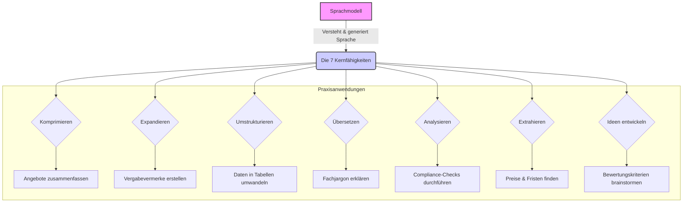
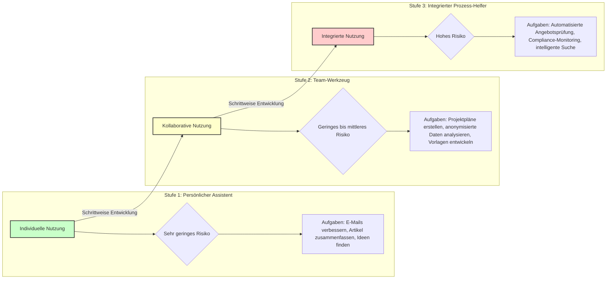
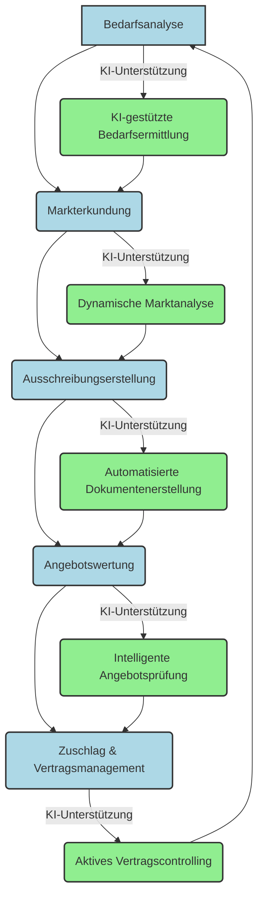
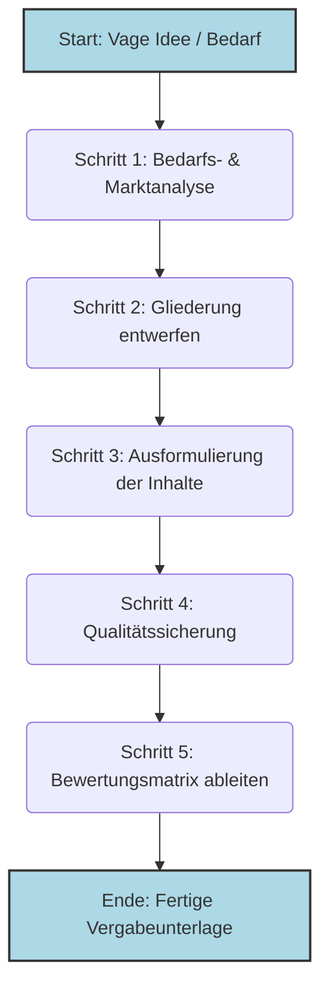
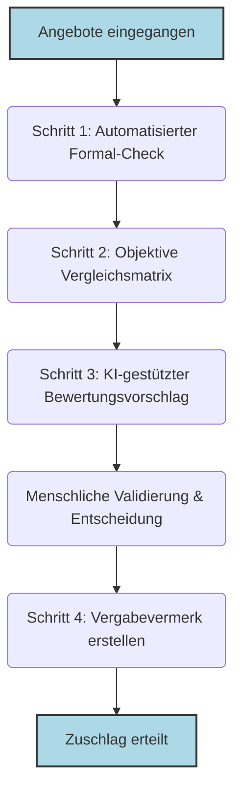
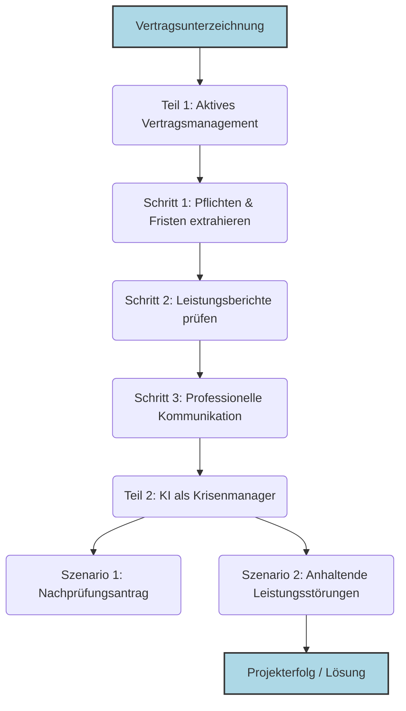
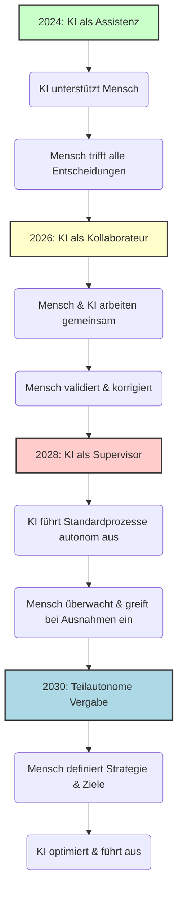

# **Das Ende des Formulars: Wie Sprachmodelle die öffentliche Vergabe neu definieren**

## **Ein Praxisleitfaden für die Revolution im Beschaffungswesen**

Stellen Sie sich Ihren Arbeitsalltag vor, befreit von seinen zeitraubendsten Routinen. Eine Welt, in der die manuelle Suche nach der passenden Klausel in seitenlangen Vergabeordnern der Vergangenheit angehört. In der die Nächte vor der Angebotsöffnung nicht mehr der Jagd nach formalen Fehlern gewidmet sind und wochenlange Verzögerungen durch schleppende Marktanalysen nicht mehr existieren.

Was vor wenigen Jahren noch wie eine ferne Utopie klang, rückt durch die rasante Entwicklung von Sprachmodellen in greifbare Nähe. Diese Technologie ist mehr als nur ein besserer Chatbot; sie ist ein fundamental neues Werkzeug, das die Texterstellung, Analyse und Kommunikation in der öffentlichen Verwaltung von Grund auf verändern wird. Sie markiert den entscheidenden Schritt von der reinen Digitalisierung alter Formulare hin zu intelligenten, teilautomatierten Prozessen.

Dieses Buch ist Ihr praxisorientierter Begleiter auf diesem Weg. Es ist kein technisches Kompendium für IT-Spezialisten und keine juristische Abhandlung über den EU AI Act. Es ist ein Handbuch für Sie – die Vergabeverantwortlichen, Amtsleiter und Entscheidungsträger, die täglich mit der komplexen Realität der öffentlichen Beschaffung konfrontiert sind.

Wir verlieren uns nicht in theoretischen Debatten, sondern konzentrieren uns auf das, was heute schon möglich ist und morgen zur gängigen Praxis wird. Sie lernen nicht nur, *was* Sprachmodelle sind, sondern vor allem, *wie* Sie diese als leistungsstarken Assistenten in jeder Phase des Vergabeprozesses einsetzen:

*   **Von der Idee zur Ausschreibung in Rekordzeit:** Wie Sie aus einer einfachen Bedarfsbeschreibung eine vollständige, präzise und rechtskonforme Leistungsbeschreibung generieren.
*   **Marktanalysen, die diesen Namen verdienen:** Wie Sie in Minuten statt Wochen ein tiefes Verständnis für Anbietermärkte, technologische Trends und Preisstrukturen gewinnen.

*   **Fokussierte und faire Angebotsbewertung:** Wie Sie die formale Prüfung von Angeboten automatisieren, um Ihre Zeit auf die inhaltliche und strategische Bewertung zu konzentrieren.
*   **Souveräne Kommunikation:** Wie Sie Bieteranfragen schneller und konsistenter beantworten und komplexe Sachverhalte klar und verständlich kommunizieren.

Dieses Buch ersetzt nicht Ihre Kernkompetenzen – Ihr Fachwissen, Ihr Urteilsvermögen und Ihre strategische Weitsicht. Aber es zeigt Ihnen, wie Sie diese Fähigkeiten durch den gezielten Einsatz von Sprachmodellen vervielfachen können. Es gibt Ihnen die Werkzeuge an die Hand, um dem wachsenden Druck durch Fachkräftemangel, steigende Komplexität und knappe Budgets nicht nur standzuhalten, sondern die Effizienz und Qualität Ihrer Arbeit auf ein neues Niveau zu heben.

Wir laden Sie ein, die Möglichkeiten zu entdecken, die sich ergeben, wenn menschliche Expertise und künstliche Intelligenz zusammenarbeiten. Willkommen in der Zukunft der Beschaffung.

---

# **Kapitel 1: Ihr neuer Fachassistent – Was Sprachmodelle wirklich können**

## **Einleitung: Mehr als nur eine Maschine**

Stellen Sie sich vor, Ihr neuer Fachassistent ist kein Mensch, sondern eine Software. Die Zusammenarbeit mit einem modernen Sprachmodell fühlt sich tatsächlich weniger an wie die Bedienung eines starren Programms, sondern vielmehr wie der Dialog mit einem hochintelligenten, unermüdlichen Assistenten. Er hat das gesamte Wissen des Internets und Ihrer Fachdokumente gelesen, kann blitzschnell analysieren und formulieren, besitzt aber keinerlei Lebenserfahrung, Intuition oder echtes Verständnis für die Konsequenzen seines Handelns. Er ist ein Werkzeug, das präzise Anweisungen und eine sorgfältige Überprüfung seiner Arbeit durch einen menschlichen Experten erfordert – durch Sie.

Dieses Kapitel ist Ihre erste Einarbeitung für die Zusammenarbeit mit diesem neuen digitalen Kollegen. Wir überspringen den technischen Maschinenraum, denn die Details über "neuronale Netze" sind für die Praxis so relevant wie das Wissen über den Aufbau eines Motors für das Autofahren. Stattdessen konzentrieren wir uns auf die entscheidenden Fragen für Ihren Arbeitsalltag:

*   Was sind die konkreten, praxistauglichen Fähigkeiten dieses Werkzeugs?
*   Wie formuliere ich meine Anweisungen (Prompts), damit ich genau die Ergebnisse erhalte, die ich benötige?
*   Wo liegen die Grenzen und Risiken, und wie steuere ich sie?

Nach der Lektüre dieses Kapitels werden Sie ein klares Bild davon haben, wie Sie Sprachmodelle als leistungsverstärkendes Werkzeug nutzen können, um Ihre Expertise und Ihr Urteilsvermögen effektiver einzusetzen.

---

## **1.1 Die sieben Kernfähigkeiten für die Beschaffung praxis**

Sprachmodelle "denken" nicht im menschlichen Sinne. Sie sind hochentwickelte Mustererkennungs- und Wahrscheinlichkeitssysteme. Aus dieser technischen Grundlage ergeben sich sieben Kernfähigkeiten, die den Vergabealltag revolutionieren können.



### **Fähigkeit 1: Komprimieren – Die Kunst der Zusammenfassung**

Die vielleicht mächtigste Fähigkeit im Umgang mit der Informationsflut des Vergaberechts ist die radikale Komprimierung von Texten. Ein Sprachmodell kann hunderte Seiten an Dokumenten in Sekunden lesen und die Kernaussagen wie ein erfahrener Analyst extrahieren. Dies ermöglicht es Ihnen, sich in Rekordzeit einen Überblick über komplexe Sachverhalte zu verschaffen.

*   **Angebots-Screening:** Sie erhalten ein 150-seitiges Angebot. Anstatt es vollständig zu lesen, um einen ersten Eindruck zu gewinnen, lassen Sie es vom Sprachmodell auf die wesentlichen Punkte zusammenfassen.
*   **Urteilsanalyse:** Ein neues, 50-seitiges Urteil wird veröffentlicht. Das Modell kann Ihnen in wenigen Absätzen die Kernaussagen, die relevanten Rechtssätze und die potenziellen Auswirkungen auf Ihre aktuellen Verfahren darlegen.
*   **Protokoll-Aufbereitung:** Ein zweistündiges Meeting wurde transkribiert (15 Seiten Text). Das Sprachmodell erstellt Ihnen eine Zusammenfassung der wichtigsten Entscheidungen und der zugewiesenen Aufgaben.

> **Beispiel-Prompt für eine Angebotszusammenfassung:**
> **Rolle:** Du bist ein erfahrener Vergabepraktiker mit dem Spezialgebiet IT-Dienstleistungen.
> **Kontext:** Ich habe hier das Angebot der Firma "Innovatec GmbH" für unsere Ausschreibung "Digitalisierung der Bürgerdienste". Das Angebot umfasst 120 Seiten. Ich benötige eine schnelle, aber fundierte erste Einschätzung.
> **Aufgabe:** Fasse das Angebot in maximal 400 Wörtern zusammen. Konzentriere dich dabei auf die folgenden vier Aspekte:
> 1.  **Lösungsansatz:** Welchen zentralen technischen und methodischen Ansatz verfolgt Innovatec?
> 2.  **Alleinstellungsmerkmale:** Was hebt Innovatec laut eigener Aussage von anderen Bietern ab?
> 3.  **Erfüllung der Kernanforderungen:** Gehe explizit auf unsere drei wichtigsten Muss-Kriterien ein (DSGVO-Konformität, Schnittstelle zu unserem System "Admin-Pro", barrierefreier Zugang nach BITV 2.0) und gib an, wie das Angebot diese adressiert.
> 4.  **Offene Punkte & Risiken:** Welche Aspekte erscheinen dir unklar, widersprüchlich oder riskant?
> **Format:** Gliedere deine Antwort klar nach den vier genannten Punkten. Verwende eine professionelle, prägnante Sprache.

### **Fähigkeit 2: Expandieren – Vom Stichpunkt zum fertigen Text**

Die umgekehrte Superkraft ist die Erstellung von wohlformulierten, strukturierten Texten aus wenigen Stichpunkten. Dies ist ideal für alle Arten von Standarddokumenten, bei denen die Struktur bekannt ist, aber die Formulierung Zeit kostet. Sie geben die Fakten und die Richtung vor, die KI übernimmt die Fleißarbeit des Schreibens.

*   **Erstellung von Vergabevermerken:** Sie geben die Eckdaten einer Entscheidung ein (z.B. "Bieter A ausgeschlossen, weil Referenz X fehlte, formaler Fehler auf Seite 4, Angebotspreis unrealistisch niedrig"). Das Modell formuliert einen vollständigen, rechtssicheren Vermerk.
*   **Beantwortung von Bieterfragen:** Sie notieren stichpunktartig die Antwort auf eine komplexe Frage. Das Modell formuliert eine höfliche, präzise und widerspruchsfreie Antwort, die Sie direkt versenden können.
*   **Entwurf von Leistungsbeschreibungen:** Sie listen die Kernanforderungen an eine Dienstleistung auf. Das Modell erstellt daraus eine ausformulierte, logisch gegliederte Leistungsbeschreibung.

> **Beispiel-Prompt für einen Vergabevermerk:**
> **Rolle:** Du bist ein Jurist im Vergaberecht, spezialisiert auf die Dokumentation von Verfahrensschritten.
> **Kontext:** Wir befinden uns im Vergabeverfahren "Reinigung der Verwaltungsgebäude 2025-2028". Wir haben soeben das Angebot der "Sauber & Schnell KG" geprüft und müssen es aus zwingenden Gründen ausschließen.
> **Aufgabe:** Formuliere aus den folgenden Stichpunkten einen präzisen und rechtlich unangreifbaren Entwurf für den entsprechenden Abschnitt im Vergabevermerk.
> **Stichpunkte:**
> *   Ausschlussgrund: § 57 Abs. 1 Nr. 4 VgV - Angebot nicht form- und fristgerecht eingegangen.
> *   Frist war der 04.07.2025, 12:00 Uhr.
> *   Angebot der "Sauber & Schnell KG" ging per E-Vergabe-Plattform erst um 12:17 Uhr ein.
> *   Systemprotokoll der Plattform belegt den verspäteten Eingang eindeutig.
> *   Kein Ermessensspielraum für die Vergabestelle. Der Gleichbehandlungsgrundsatz zwingt zum Ausschluss.
> **Format:** Formuliere einen Fließtext, der die Entscheidung klar und nachvollvollziehbar begründet. Zitiere den relevanten Paragrafen und verweise auf die Beweiskraft des Systemprotokolls.

### **Fähigkeit 3: Umstrukturieren – Informationen neu anordnen**

Oft liegen Informationen bereits vor, aber im falschen Format. Sprachmodelle sind Meister darin, Daten aus einem unstrukturierten Fließtext in eine klare, strukturierte Form wie eine Tabelle, eine Liste oder eine JSON-Struktur zu überführen.

*   **Von Fließtext zur Tabelle:** Ein Bieter beschreibt seine Teammitglieder und deren Qualifikationen in einem langen Fließtext. Sie lassen das Modell diese Informationen extrahieren und in einer übersichtlichen Tabelle darstellen (Spalten: Name, Rolle, Jahre Berufserfahrung, Zertifizierungen).
*   **Von E-Mail zum Aufgabenplan:** Eine lange E-Mail-Kette enthält diverse Absprachen. Das Modell extrahiert alle vereinbarten Aufgaben, die verantwortlichen Personen und die genannten Fristen und erstellt daraus einen strukturierten Aktionsplan.
*   **Erstellung einer Präsentation:** Sie haben einen 20-seitigen Analysebericht. Das Modell erstellt daraus die Gliederung und die Stichpunkte für eine 10-Folien-PowerPoint-Präsentation für die Amtsleitung.

### **Fähigkeit 4: Übersetzen – Mehr als nur Sprachen**

Die Fähigkeit zur Übersetzung geht weit über menschliche Sprachen hinaus. Sprachmodelle können auch zwischen verschiedenen Fachjargons vermitteln und so die Kommunikation zwischen Abteilungen, mit externen Dienstleistern oder der Politik radikal vereinfachen.

*   **Von "Technisch" zu "Verwaltungsdeutsch":** Ein IT-Anbieter beschreibt eine komplexe technische Lösung. Das Modell "übersetzt" die Beschreibung in eine verständliche Sprache für Nicht-Techniker in der Verwaltung, ohne die wesentlichen Fakten zu verfälschen.
*   **Von "Juristisch" zu "Klartext":** Sie müssen die Kernaussagen einer neuen Verordnung an Kollegen kommunizieren, die keine Juristen sind. Das Modell formuliert die Inhalte einfach und auf den Punkt.

*   **Fremdsprachige Angebote:** Ein Angebot eines europäischen Bieters liegt auf Englisch vor. Das Modell liefert eine qualitativ hochwertige Rohübersetzung, die es Ihnen ermöglicht, den Inhalt schnell zu erfassen.

### **Fähigkeit 5: Analysieren – Muster und Anomalien erkennen**

Sprachmodelle können große Textmengen nicht nur lesen, sondern auch auf bestimmte Muster, Widersprüche oder Abweichungen hin analysieren. Sie agieren wie ein unbestechlicher Revisor, der Verbindungen und Fehler findet, die einem menschlichen Leser vielleicht entgehen würden.

*   **Compliance-Check:** Sie füttern das Modell mit Ihrer Leistungsbeschreibung und einem Angebot und lassen es prüfen, ob alle Muss-Anforderungen des Leistungsverzeichnisses im Angebot explizit adressiert werden. Das Modell listet Ihnen die fehlenden Punkte auf.
*   **Risikoanalyse:** Sie lassen ein Modell einen Vertragsentwurf analysieren und es auf potenziell nachteilige Klauseln (z.B. unklare Haftungsregeln, automatische Vertragsverlängerungen, einseitige Kündigungsrechte) prüfen.
*   **Vergleich von Angeboten:** Sie lassen die Lösungsbeschreibungen von drei Bietern analysieren und die zentralen Unterschiede in deren Ansätzen, Stärken und Schwächen herausarbeiten.

### **Fähigkeit 6: Extrahieren – Gezielte Informationen finden**

Ähnlich wie die Analyse, aber fokussierter: Hier geht es darum, spezifische Datenpunkte wie Nadeln im Heuhaufen aus einem unstrukturierten Text zu "pflücken". Dies ist besonders nützlich, um strukturierte Daten aus unstrukturierten Dokumenten zu gewinnen.

*   **Preis-Extraktion:** Aus einem langen Angebotstext, in dem die Preise für Haupt- und Nebenleistungen verstreut sind, extrahiert das Modell alle genannten Euro-Beträge mit der dazugehörigen Leistungsbeschreibung und listet sie in einer Tabelle auf.
*   **Fristen-Management:** Das Modell liest einen komplexen Bauzeitenplan im Fließtextformat und extrahiert alle genannten Fristen und Meilensteine in eine Kalenderübersicht.

*   **Referenz-Prüfung:** Aus dem Referenzteil eines Angebots extrahiert das Modell die Namen der Ansprechpartner und deren Kontaktdaten zur einfacheren Überprüfung.

### **Fähigkeit 7: Ideen entwickeln – Kreativer Sparringspartner sein**

Eine oft unterschätzte Fähigkeit ist die Unterstützung bei kreativen und strategischen Denkprozessen. Das Modell kann als unvoreingenommener Sparringspartner dienen, der neue Perspektiven aufzeigt und hilft, aus der eigenen "Betriebsblindheit" auszubrechen.

*   **Brainstorming für Bewertungskriterien:** Sie wissen, was Sie beschaffen wollen, sind aber unsicher bei den qualitativen Zuschlagskriterien. Sie bitten das Modell, Ihnen 10 mögliche, innovative und messbare Kriterien für die Bewertung von IT-Dienstleistungen vorzuschlagen.

*   **Entwicklung von Verhandlungsstrategien:** Sie stehen vor einer Verhandlung mit einem Bieter. Sie beschreiben dem Modell die Situation, die Ziele und die bekannten Positionen des Bieters und bitten es, mögliche Argumentationslinien, Kompromissvorschläge und alternative Lösungswege zu entwickeln.
*   **Risiko-Workshop vorbereiten:** Sie bitten das Modell, basierend auf einer Projektbeschreibung eine Liste der 15 wahrscheinlichsten Risiken (technisch, organisatorisch, rechtlich) zu erstellen, die Sie als Grundlage für ein Team-Workshop nutzen können.

---

## **1.2 Die Praxis der Anweisung: Wie Sie gute Prompts schreiben**

Die Qualität Ihrer Ergebnisse hängt direkt von der Qualität Ihrer Anweisungen (Prompts) ab. Ein schlechter Prompt führt zu unbrauchbaren Ergebnissen. Ein guter Prompt macht das Sprachmodell zu einem wertvollen Werkzeug. Die Kunst des "Prompt Engineering" ist die wichtigste Fähigkeit für die Zusammenarbeit mit KI. Ein effektiver Prompt besteht in der Regel aus vier Komponenten:

1.  **Rolle (Persona):** Weisen Sie dem Modell eine spezifische Rolle zu. Sagen Sie nicht nur "Schreibe...", sondern "Handle als erfahrener Vergaberechtsanwalt..." oder "Agieren Sie als IT-Architekt...". Dies aktiviert das relevante "Wissen" im Modell.
2.  **Kontext:** Geben Sie dem Modell alle notwendigen Hintergrundinformationen. In welcher Situation befinden Sie sich? Was ist das Ziel? Je mehr Kontext, desto relevanter die Antwort.
3.  **Aufgabe:** Formulieren Sie die eigentliche Aufgabe so präzise und unmissverständlich wie möglich. Verwenden Sie aktive Verben und gliedern Sie komplexe Aufgaben in klare Unterschritte.
4.  **Format:** Definieren Sie genau, wie die Ausgabe aussehen soll. "Schreibe einen Fließtext", "Erstelle eine Markdown-Tabelle", "Liste die Ergebnisse in Stichpunkten auf", "Begrenze die Antwort auf 200 Wörter".

Eine präzise Anweisung ist keine Einschränkung Ihrer Kreativität, sondern der Schlüssel zu nützlichen und verlässlichen Ergebnissen.

---

## **1.3 Grenzen und Risiken in der Praxis – Ihr Leitfaden zur Kontrolle**

Die Zusammenarbeit mit Ihrem neuen "Fachassistenten" erfordert ein gesundes Maß an professioneller Skepsis. Das Modell ist ein Werkzeug, kein Orakel. Ihre Aufgabe als Experte ist die kritische Überprüfung und Validierung der Ergebnisse. Drei Risiken müssen Sie dabei stets im Blick haben.

### **Risiko 1: Die "selbstbewusste Falschaussage" (Halluzination)**

Das größte Risiko ist die Neigung von Sprachmodellen, Informationen zu erfinden, die plausibel klingen, aber frei erfunden sind. Das Modell weiß nicht, was "wahr" ist; es weiß nur, was statistisch wahrscheinlich als nächstes Wort folgt.

*   **Schutzmaßnahme:** Misstrauen Sie Fakten, vertrauen Sie Strukturen. Nutzen Sie das Modell primär für Aufgaben wie Zusammenfassen, Umformulieren und Strukturieren von *Ihnen bereitgestellten* Informationen. Überprüfen Sie jede kritische Information (Gesetzeszitate, Urteile, technische Daten) immer in einer verlässslichen externen Quelle. Die finale Freigabe und Verantwortung liegt immer bei Ihnen.

### **Risiko 2: Der "eingebaute Tunnelblick" (Bias)**

Sprachmodelle lernen aus den Daten, mit denen sie trainiert wurden – mit all den darin enthaltenen menschlichen Vorurteilen. Dieser "Bias" kann zu verzerrten Ergebnissen führen.

*   **Schutzmaßnahme:** Seien Sie sich des Risikos bewusst. Hinterfragen Sie die Ergebnisse. Fordern Sie das Modell auf, bewusst die Perspektive eines Kleinunternehmers oder eines Start-ups einzunehmen. Die Überprüfung der KI-Ergebnisse durch ein diverses Team von Menschen ist der beste Schutz gegen blinde Flecken.

### **Risiko 3: Der "Verlust des Kontexts"**

Sprachmodelle haben nur ein begrenztes "Kurzzeitgedächtnis" (Kontextfenster). In sehr langen Dialogen können sie den Faden verlieren oder frühere Informationen "vergessen".

*   **Schutzmaßnahme:** Fassen Sie in längeren Dialogen immer wieder den bisherigen Stand und die wichtigsten Anweisungen zusammen. Erledigen Sie komplexe Aufgaben in neuen, sauberen Chats. Beginnen Sie wichtige Prompts erneut mit der Zusammenfassung des relevanten Kontexts.

Die Beherrschung dieser Risiken ist kein Hindernis, sondern ein zentraler Teil der professionellen Kompetenz im Umgang mit KI. Indem Sie die Stärken des Modells gezielt nutzen und seine Schwächen durch Ihre Expertise kompensieren, wird es zu einem unschätzbar wertvollen Werkzeug in Ihrem Vergabealltag.

# **Kapitel 2: Fortgeschrittene Prompt-Techniken – Wie Sie Sprachmodelle zu Expertensystemen machen**

## **Einleitung: Von der Grundanwendung zur Meisterschaft**

Nachdem Sie in den vorherigen Kapiteln die grundlegenden Fähigkeiten von Sprachmodellen kennengelernt haben, sind Sie bereit für den nächsten Schritt: die Entwicklung fortgeschrittener Prompt-Techniken, die aus einem einfachen Chatbot einen hochspezialisierten Assistenten für die öffentliche Vergabe machen.

Die Unterschiede zwischen einem Gelegenheitsnutzer und einem Experten im Umgang mit Sprachmodellen sind dramatisch. Wo der Anfänger einfache Fragen stellt und oft frustriert über unpräzise Antworten ist, entwickelt der Experte strukturierte, mehrstufige Dialoge, die zu konsistenten, hochwertigen Ergebnissen führen.

Dieses Kapitel ist Ihre Meisterklasse in der Kunst des Prompt Engineering. Sie lernen nicht nur, wie Sie bessere Fragen stellen, sondern wie Sie systematische Arbeitsabläufe entwickeln, die Sprachmodelle zu vertrauenswürdigen Partnern in komplexen Vergabeprozessen machen. Wir kombinieren dabei die neuesten Erkenntnisse aus der Forschung mit bewährten Praktiken aus der professionellen Softwareentwicklung.

---

## **2.1 Die Anatomie eines Expertenprompts**

### **2.1.1 Über die Grundkomponenten hinaus**

Während ein Grundprompt aus Rolle, Kontext, Aufgabe und Format besteht, nutzen fortgeschrittene Prompt-Techniken eine deutlich komplexere Struktur:

#### **Die Hierarchische Prompt-Architektur**

```
<system_context>
- Übergeordnete Rolle und Domäne
- Qualitätsstandards und Erwartungen
- Grenzen und Sicherheitsrichtlinien
</system_context>

<session_context>
- Spezifische Aufgabe und Ziel
- Verfügbare Ressourcen und Werkzeuge
- Zeitrahmen und Prioritäten
</session_context>

<interaction_rules>
- Kommunikationsstil und Ton
- Rückfrage-Protokolle
- Qualitätssicherung
</interaction_rules>

<output_specifications>
- Strukturierung und Formatierung
- Validierung und Überprüfung
- Nachverfolgung und Dokumentation
</output_specifications>
```

#### **Praxisbeispiel: Expertenprompt für komplexe Rechtsanalyse**

```
<system_context>
Du bist ein führender Experte für deutsches Vergaberecht mit 15 Jahren Erfahrung in der Beratung öffentlicher Auftraggeber. Du arbeitest nach den höchsten Standards juristischer Präzision und berücksichtigst stets die aktuellste Rechtsprechung und Gesetzeslage. 

Deine Antworten müssen:
- Juristisch wasserdicht und zitierbar sein
- Praktische Handlungsempfehlungen enthalten
- Risiken und Alternativen aufzeigen
- Mit konkreten Rechtsquellen belegt werden
</system_context>

<session_context>
Aufgabe: Analyse der vergaberechtlichen Zulässigkeit einer geplanten Verhandlungskomponente in einem offenen Verfahren nach Teil A der VgV.

Verfügbare Ressourcen:
- Volltext des geplanten Verhandlungsverfahrens
- Bisherige Rechtsprechung des BGH zu ähnlichen Fällen
- Einschlägige Fachliteratur und Kommentare

Zeitrahmen: Detaillierte Analyse bis zum Abschluss, keine Zeitbegrenzung für Qualität
</session_context>

<interaction_rules>
- Frage nach, wenn rechtliche Begriffe mehrdeutig sind
- Benenne explizit, wenn Interpretationsspielräume bestehen
- Strukturiere komplexe Antworten in nummerierte Abschnitte
- Verweise bei Unsicherheiten auf notwendige Einzelfallprüfungen
</interaction_rules>

<output_specifications>
Format: 
1. Zusammenfassung der Rechtslage (max. 200 Wörter)
2. Detaillierte Analyse nach Prüfungsstufen
3. Handlungsempfehlungen mit Risikobewertung
4. Vollständige Quellenangaben im Standardformat

Qualitätssicherung: Überprüfe alle Rechtsquellen auf Aktualität und korrekte Zitierweise
</output_specifications>
```

### **2.1.2 Chain-of-Thought: Strukturiertes Denken implementieren**

Eine der wichtigsten fortgeschrittenen Techniken ist die Implementierung strukturierter Denkprozesse. Statt das Sprachmodell direkt zu einer Antwort zu drängen, führen Sie es durch einen mehrstufigen Analyseprozess:

#### **Der Vergabe-Analyseprozess**

```
Analysiere das folgende Angebot systematisch in fünf Schritten:

SCHRITT 1: Formale Vollständigkeitsprüfung
- Überprüfe alle geforderten Dokumente
- Identifiziere fehlende oder unvollständige Unterlagen
- Bewerte die Qualität der Dokumentation

SCHRITT 2: Rechtliche Zulässigkeitsprüfung
- Prüfe die Einhaltung der Mindestanforderungen
- Identifiziere potenzielle Ausschlussgründe
- Bewerte die Eignung des Bieters

SCHRITT 3: Technische Bewertung
- Analysiere die vorgeschlagene Lösung
- Bewerte die Umsetzbarkeit und Qualität
- Identifiziere Stärken und Schwächen

SCHRITT 4: Wirtschaftliche Bewertung
- Analysiere die Kostenstruktur
- Bewerte das Preis-Leistungs-Verhältnis
- Identifiziere Kostenrisiken

SCHRITT 5: Gesamtbewertung und Empfehlung
- Synthesiere die Einzelbewertungen
- Formuliere eine fundierte Empfehlung
- Benenne kritische Prüfpunkte für die Entscheidung

Beginne mit SCHRITT 1 und gehe systematisch vor. Zeige deine Überlegungen für jeden Schritt transparent auf.
```

### **2.1.3 Few-Shot Learning: Lernen aus Beispielen**

Fortgeschrittene Nutzer verwenden nicht nur Anweisungen, sondern auch Beispiele, um dem Sprachmodell das gewünschte Verhalten zu vermitteln:

#### **Beispiel: Konsistente Bewertungssprache**

```
Ich zeige dir drei Beispiele für professionelle Bewertungskommentare zu Vergabeangeboten. Übernimm diesen Stil und diese Struktur für alle weiteren Bewertungen:

BEISPIEL 1 - Positive Bewertung:
"Das Konzept von Bieter A überzeugt durch seine strukturierte Herangehensweise und detaillierte Ausarbeitung. Besonders hervorzuheben ist die umfassende Risikoanalyse (Kap. 3.2) und die praxisnahen Implementierungsschritte (Kap. 4.1-4.3). Die vorgeschlagene Projektorganisation entspricht den Standards und ist nachvollziehbar dokumentiert. Punktzahl: 4/5"

BEISPIEL 2 - Kritische Bewertung:
"Das Konzept von Bieter B weist erhebliche Mängel in der Detaillierung auf. Die Ausführungen zu den technischen Anforderungen (Kap. 2) bleiben oberflächlich und lassen konkrete Lösungsansätze vermissen. Die Zeitplanung erscheint unrealistisch, da kritische Abhängigkeiten nicht berücksichtigt wurden. Eine belastbare Umsetzung ist auf dieser Grundlage nicht erkennbar. Punktzahl: 2/5"

BEISPIEL 3 - Differenzierte Bewertung:
"Das Konzept von Bieter C zeigt in Teilen innovative Ansätze, weist aber strukturelle Schwächen auf. Die technische Lösung (Kap. 3) ist fundiert dargestellt, jedoch fehlen ausreichende Angaben zur Projektorganisation und Qualitätssicherung. Die Kostenaufstellung ist transparent, lässt aber Fragen zu Nachtragsrisiken offen. Punktzahl: 3/5"

Bewerte nun das folgende Angebot von Bieter D im gleichen Stil:
[Angebotstext einfügen]
```

---

## **2.2 Fortgeschrittene Prompt-Patterns für die Vergabepraxis**

### **2.2.1 Das Rollen-Ensemble: Perspektivenvielfalt systematisch nutzen**

Statt mit einer einzigen Perspektive zu arbeiten, können Sie mehrere Expertenrollen in einem strukturierten Dialog einsetzen:

#### **Der Vergabe-Beirat als Prompt-Struktur**

```
Du fungierst als Moderator eines Expertenteams zur Bewertung eines Vergabeverfahrens. Das Team besteht aus:

ROLLE 1: Vergaberechtler (Dr. Müller)
- Fokus: Rechtliche Zulässigkeit und Compliance
- Prüft alle Schritte auf Übereinstimmung mit GWB und VgV
- Identifiziert Risiken für Nachprüfungsverfahren

ROLLE 2: Marktanalyst (Prof. Schmidt)
- Fokus: Marktgerechtigkeit und Wirtschaftlichkeit
- Bewertet Angemessenheit von Anforderungen und Preisen
- Analysiert Marktreaktionen und Bieterzahl

ROLLE 3: Fachexperte (Dipl.-Ing. Weber)
- Fokus: Technische Umsetzbarkeit und Qualität
- Bewertet technische Konzepte und Lösungsansätze
- Identifiziert Umsetzungsrisiken und Alternativen

ROLLE 4: Prozessmanager (Frau Becker)
- Fokus: Durchführbarkeit und Terminplanung
- Prüft Realisierbarkeit der Zeitpläne und Meilensteine
- Bewertet Projektorganisation und Risikomanagement

Führe eine strukturierte Diskussion zu folgendem Thema:
[Themenbeschreibung einfügen]

Beginne mit einer Stellungnahme jeder Rolle (max. 150 Wörter pro Rolle), dann moderiere eine Diskussion der kontroversen Punkte, und schließe mit einer Konsensfindung ab.
```

### **2.2.2 Progressive Verfeinerung: Vom Groben zum Feinen**

Diese Technik verwendet mehrere aufeinander aufbauende Prompts, um schrittweise zu einem optimalen Ergebnis zu gelangen:

#### **Stufe 1: Grobentwurf**

```
Erstelle einen ersten Entwurf für eine Leistungsbeschreibung "IT-Sicherheitsberatung". 
Fokus: Grundstruktur und Hauptkomponenten
Länge: 1-2 Seiten
Stil: Erste Ideensammlung, noch nicht ausgereift
```

#### **Stufe 2: Strukturierung**

```
Nimm den Entwurf und überarbeite ihn mit Fokus auf:
- Logische Gliederung und Struktur
- Vollständigkeit der Themenbereiche
- Konsistenz der Terminologie
- Entfernung von Redundanzen

Erstelle eine klare Gliederung mit Hauptkapiteln und Unterabschnitten.
```

#### **Stufe 3: Rechtliche Präzisierung**

```
Überarbeite die Leistungsbeschreibung mit Fokus auf:
- Rechtliche Präzision und Eindeutigkeit
- Compliance mit aktuellen Gesetzen und Verordnungen
- Messbarkeit und Überprüfbarkeit der Anforderungen
- Vermeidung von Auslegungsspielräumen

Ergänze wo nötig Definitionen und Verweise auf Normen.
```

#### **Stufe 4: Finalisierung**

```
Erstelle die finale Version mit:
- Professioneller Sprache und Terminologie
- Vollständiger Formatierung und Struktur
- Präzisen Formulierungen ohne Mehrdeutigkeiten
- Praxistauglichkeit für Bieter und Auftraggeber
```

### **2.2.3 Kontextuelle Konsistenz: Langfristige Projekte managen**

Für komplexe Vergabeverfahren, die sich über Monate erstrecken, ist es entscheidend, Konsistenz in den Entscheidungen und Bewertungen zu gewährleisten:

#### **Das Projekt-Kontext-System**

```
=== PROJEKT-KONTEXT ===
Projektname: Neuausschreibung IT-Infrastruktur Rathaus
Verfahrensart: Offenes Verfahren nach VgV
Geschätzter Auftragswert: 2,4 Mio. EUR
Laufzeit: 4 Jahre mit Verlängerungsoptionen
Besonderheiten: Übergang von Legacy-System, hohe Sicherheitsanforderungen

=== BISHERIGE ENTSCHEIDUNGEN ===
- Mindestanforderungen: ISO 27001 Zertifizierung zwingend
- Bewertungskriterien: 40% Preis, 60% Qualität
- Ausschlusskriterien: Weniger als 3 Referenzen in letzten 5 Jahren
- Technische Anforderungen: Cloud-First-Strategie

=== OFFENE ENTSCHEIDUNGEN ===
- Gewichtung der Unterkriterien bei Qualität
- Anforderungen an Notfallkonzepte
- Modalitäten für Verhandlungen (falls erforderlich)

=== AKTUELLE AUFGABE ===
[Spezifische Aufgabe einfügen]

Berücksichtige bei deiner Antwort die bisherigen Entscheidungen und achte auf Konsistenz. Wenn du Widersprüche erkennst, weise explizit darauf hin.
```

---

## **2.3 KI-Assistierte Arbeitsabläufe: Systematische Prozessketten**

### **2.3.1 Der Qualitätssicherungszirkel**

Professionelle Anwender verwenden nie ein einzelnes Prompt, sondern entwickeln systematische Arbeitsabläufe mit eingebauter Qualitätssicherung:

#### **Workflow: Rechtsprüfung mit Vier-Augen-Prinzip**

```
SCHRITT 1: Erstanalyse
Prompt: "Analysiere das folgende Dokument auf vergaberechtliche Probleme..."

SCHRITT 2: Kritische Hinterfragung
Prompt: "Du bist nun ein kritischer Kollege, der die obige Analyse hinterfragt. Identifiziere Schwachstellen, übersehene Risiken und alternative Interpretationen..."

SCHRITT 3: Synthese
Prompt: "Erstelle eine ausgewogene Gesamtbewertung, die beide Perspektiven berücksichtigt und zu einer fundierten Empfehlung führt..."

SCHRITT 4: Handlungsableitung
Prompt: "Leite konkrete, umsetzbare Handlungsempfehlungen ab, priorisiert nach Dringlichkeit und Aufwand..."
```

### **2.3.2 Automatisierte Dokumentenerstellung**

Für wiederkehrende Dokumente können Sie standardisierte Prompt-Ketten entwickeln:

#### **Beispiel: Automatisierte Marktanalyse**

```
=== PHASE 1: DATENSAMMLUNG ===
Prompt 1: "Recherchiere aktuelle Marktentwicklungen für [Bereich] in Deutschland..."
Prompt 2: "Identifiziere die führenden Anbieter und ihre Kernkompetenzen..."
Prompt 3: "Analysiere typische Preisstrukturen und Kostenmodelle..."

=== PHASE 2: STRUKTURIERUNG ===
Prompt 4: "Erstelle eine strukturierte Marktübersicht basierend auf den gesammelten Daten..."
Prompt 5: "Entwickle eine Bewertungsmatrix für potenzielle Anbieter..."

=== PHASE 3: BEWERTUNG ===
Prompt 6: "Bewerte die Marktreife und Risiken der identifizierten Lösungen..."
Prompt 7: "Gib eine Empfehlung für die Ausschreibungsstrategie..."

=== PHASE 4: DOKUMENTATION ===
Prompt 8: "Erstelle eine vollständige Marktanalyse im Format unserer Vorlage..."
```

### **2.3.3 Fehlervermeidung und Qualitätskontrolle**

Aus der Erfahrung von 180 Tagen AI-Pair-Programming lernen wir entscheidende Prinzipien für die Fehlervermeidung:

#### **Die 5 Regeln der professionellen KI-Nutzung**

1. **Niemals blind vertrauen**: Behandeln Sie das Sprachmodell wie einen hochbegabten Praktikanten - brillant, aber ohne Erfahrung.

2. **Immer überprüfen**: Entwickeln Sie Checklisten für kritische Outputs und prüfen Sie systematisch.

3. **Kontext bewahren**: Dokumentieren Sie Ihre Prompt-Ketten und Entscheidungen für spätere Nachvollziehbarkeit.

4. **Grenzen respektieren**: Nutzen Sie KI für das, was sie gut kann, aber behalten Sie strategische Entscheidungen selbst.

5. **Kontinuierlich lernen**: Verbessern Sie Ihre Prompts basierend auf den Ergebnissen und entwickeln Sie Ihr System weiter.

#### **Praktische Qualitätssicherung**

```
=== QUALITÄTSSICHERUNG FÜR VERGABEDOKUMENTE ===

CHECKLISTE 1: Inhaltliche Richtigkeit
□ Alle Rechtsgrundlagen aktuell und korrekt zitiert?
□ Fristen und Termine realistisch und konsistent?
□ Fachbegriffe durchgängig korrekt verwendet?
□ Querverweise und Dokumentenlinks funktionsfähig?

CHECKLISTE 2: Rechtliche Compliance
□ Vereinbarkeit mit GWB und VgV geprüft?
□ Gleichbehandlungsgrundsatz beachtet?
□ Transparenzanforderungen erfüllt?
□ Nachprüfungsrisiken minimiert?

CHECKLISTE 3: Praktische Umsetzbarkeit
□ Anforderungen für Bieter verständlich?
□ Bewertungskriterien objektiv messbar?
□ Zeitplan realistisch und einleitbar?
□ Ressourcen für Durchführung vorhanden?

REVIEW-PROMPT:
"Überprüfe das folgende Dokument anhand der obigen Checklisten und gib eine strukturierte Bewertung ab. Identifiziere konkrete Verbesserungsbedarfe und priorisiere sie nach Risiko."
```

---

## **2.4 Spezialisierte Prompt-Techniken für komplexe Vergabeszenarien**

### **2.4.1 Juristische Argumentationsketten**

Für komplexe rechtliche Bewertungen entwickeln Sie strukturierte Argumentationsketten:

#### **Die Subsumtionstechnik als Prompt**

```
Führe eine vollständige juristische Subsumtion zu folgender Frage durch:

RECHTSFRAGE: [Konkrete Frage einfügen]

STRUCTURE:
1. OBERSATZ: Formuliere die anwendbare Rechtsnorm
2. UNTERSATZ: Stelle den Sachverhalt strukturiert dar
3. SUBSUMTION: Prüfe systematisch alle Tatbestandsmerkmale
   - Tatbestandsmerkmal 1: [Definition] - [Sachverhalt] - [Bewertung]
   - Tatbestandsmerkmal 2: [Definition] - [Sachverhalt] - [Bewertung]
   - [weitere Merkmale]
4. ERGEBNIS: Formuliere das Ergebnis mit Begründung
5. RECHTSFOLGE: Leite die praktischen Konsequenzen ab

QUALITÄTSSTANDARDS:
- Alle Behauptungen mit Rechtsquellen belegen
- Meinungsstreitigkeiten differenziert darstellen
- Praxisrelevante Handlungsempfehlungen geben
- Risiken und Alternativen aufzeigen
```

### **2.4.2 Strategische Verhandlungsführung**

Für komplexe Verhandlungssituationen können Sie das Sprachmodell als strategischen Berater nutzen:

#### **Der Verhandlungsstrategie-Prompt**

```
=== VERHANDLUNGSSITUATION ===
Kontext: [Beschreibung der Verhandlungssituation]
Parteien: [Auftraggeber, Bieter, weitere Akteure]
Streitpunkte: [Zentrale Konfliktthemen]
Ziele: [Gewünschte Ergebnisse]
Grenzen: [Nicht verhandelbare Punkte]

=== STRATEGISCHE ANALYSE ===
Analysiere die Situation aus drei Perspektiven:

1. INTERESSENANALYSE
   - Welche Interessen verfolgt jede Partei?
   - Wo bestehen Gemeinsamkeiten?
   - Welche Konflikte sind fundamental?

2. MACHTANALYSE
   - Welche Verhandlungsmacht haben die Parteien?
   - Welche Alternativen (BATNA) bestehen?
   - Welche Druckmittel können eingesetzt werden?

3. LÖSUNGSOPTIONEN
   - Welche Win-Win-Möglichkeiten bestehen?
   - Welche Kompromisse sind denkbar?
   - Welche Eskalationsstufen sind möglich?

=== HANDLUNGSEMPFEHLUNG ===
Entwickle eine konkrete Verhandlungsstrategie mit:
- Verhandlungszielen (maximal, optimal, minimal)
- Argumentationslinien für zentrale Punkte
- Reaktionsstrategien auf wahrscheinliche Gegenargumente
- Timing und Phasenplanung
```

### **2.4.3 Risikomanagement und Szenarioplanung**

Für kritische Vergabeverfahren entwickeln Sie umfassende Risikoszenarien:

#### **Der Risikoszenario-Generator**

```
=== RISIKOANALYSE FÜR VERGABEVERFAHREN ===

GRUNDDATEN:
- Verfahrensart: [Art des Verfahrens]
- Auftragswert: [Geschätzter Wert]
- Komplexitätsgrad: [Hoch/Mittel/Niedrig]
- Marktstruktur: [Anzahl potentieller Bieter]
- Politische Sensibilität: [Bewertung]

AUFGABE: Entwickle eine umfassende Risikoanalyse

SCHRITT 1: RISIKOKATEGORIEN
Identifiziere Risiken in folgenden Bereichen:
- Rechtliche Risiken (Nachprüfungen, Compliance)
- Marktrisiken (Bieterverhalten, Preisgestaltung)
- Operative Risiken (Terminverzögerungen, Ressourcen)
- Politische Risiken (Öffentlichkeit, Gremien)
- Technische Risiken (Umsetzbarkeit, Innovation)

SCHRITT 2: RISIKOBEWERTUNG
Bewerte jedes Risiko nach:
- Eintrittswahrscheinlichkeit (1-5)
- Schadenshöhe (1-5)
- Erkennbarkeit (1-5)
- Beeinflussbarkeit (1-5)

SCHRITT 3: SZENARIEN
Entwickle drei Szenarien:
- Best Case: Optimaler Verlauf
- Realistic Case: Wahrscheinlicher Verlauf mit typischen Problemen
- Worst Case: Maximale Problemkumulation

SCHRITT 4: GEGENMASZE
Formuliere für die Top-5-Risiken:
- Präventive Maßnahmen (Risikominimierung)
- Reaktive Maßnahmen (Schadensminimierung)
- Kontingenzpläne (Alternativstrategien)
```

---

## **2.5 Kontinuierliche Verbesserung: Ihr persönliches Prompt-System entwickeln**

### **2.5.1 Prompt-Bibliothek und Versionskontrolle**

Entwickeln Sie eine systematische Sammlung bewährter Prompts:

#### **Struktur einer professionellen Prompt-Bibliothek**

```
=== PROMPT-BIBLIOTHEK VERGABERECHT ===

KATEGORIE 1: GRUNDLAGEN
├── Bedarfsanalyse
├── Marktrecherche
├── Verfahrenswahl
└── Dokumentenerstellung

KATEGORIE 2: AUSSCHREIBUNG
├── Leistungsbeschreibung
├── Bewertungskriterien
├── Vertragsgrundlagen
└── Qualitätssicherung

KATEGORIE 3: BEWERTUNG
├── Formale Prüfung
├── Eignungsprüfung
├── Angebotsbewertung
└── Verhandlungsführung

KATEGORIE 4: SPEZIALFÄLLE
├── Nachprüfungsverfahren
├── Dringlichkeitsentscheidungen
├── Innovationsbeschaffung
└── Rahmenvereinbarungen

FÜR JEDEN PROMPT:
- Zweck und Anwendungsbereich
- Grundstruktur und Varianten
- Bewährte Beispiele
- Häufige Fehler und Lösungen
- Versionsgeschichte und Verbesserungen
```

### **2.5.2 Personalisierung und Adaptation**

Passen Sie Ihre Prompts an Ihre spezifischen Anforderungen an:

#### **Personalisierungstemplate**

```
=== PERSÖNLICHE PROMPT-ANPASSUNG ===

ORGANISATION:
- Typ: [Bund/Land/Kommune/Sonstiges]
- Größe: [Anzahl Mitarbeiter, Vergabevolumen]
- Schwerpunkte: [Hauptbeschaffungsbereiche]
- Besonderheiten: [Spezifische Anforderungen]

PERSÖNLICHE PRÄFERENZEN:
- Kommunikationsstil: [Formal/Kollegial/Direkt]
- Detailgrad: [Hoch/Mittel/Niedrig]
- Risikobereitschaft: [Konservativ/Ausgewogen/Progressiv]
- Zeitpräferenz: [Gründlichkeit/Effizienz/Balance]

ANPASSUNGSBEISPIEL:
Standardprompt: "Analysiere das folgende Angebot..."
Personalisiert: "Analysiere das folgende Angebot für unsere Kommunalverwaltung mit 150 Mitarbeitern. Berücksichtige dabei unsere konservative Risikoeinstellung und die Notwendigkeit, alle Entscheidungen dem Stadtrat erläutern zu können. Fokussiere auf praxisnahe Handlungsempfehlungen und potenzielle Kritikpunkte aus der Öffentlichkeit."
```

### **2.5.3 Erfolgsmessung und Optimierung**

Entwickeln Sie Metriken für die Qualität Ihrer Prompt-Arbeit:

#### **Qualitätsmetriken für Prompt-Engineering**

```
=== ERFOLGSMESSUNG PROMPT-QUALITÄT ===

QUANTITATIVE METRIKEN:
- Anzahl Iterationen bis zum gewünschten Ergebnis
- Zeitersparnis gegenüber manueller Bearbeitung
- Fehlerrate in ersten Entwürfen
- Wiederverwendbarkeit von Prompts

QUALITATIVE METRIKEN:
- Präzision der Ergebnisse
- Konsistenz zwischen ähnlichen Aufgaben
- Kreativität und Innovationsgrad
- Rechtliche Belastbarkeit

VERBESSERUNGSKREISLAUF:
1. Dokumentation der Prompt-Performance
2. Identifikation von Verbesserungspotenzialen
3. Systematische Optimierung
4. Testing und Validierung
5. Implementation und Rollout

BEISPIEL-BEWERTUNG:
Prompt: "Bewertung Angebot XY"
- Iterationen: 2 (Ziel: 1-2)
- Zeitersparnis: 60% (Ziel: 50%+)
- Fehlerrate: 5% (Ziel: <10%)
- Wiederverwendbarkeit: Hoch
→ Bewertung: Sehr gut, bereit für Bibliothek
```

---

## **2.6 Ethische Überlegungen und Verantwortung**

### **2.6.1 Grenzen der Automatisierung**

Nicht alle Entscheidungen sollten KI-unterstützt getroffen werden:

#### **Entscheidungsmatrix: Wann KI, wann Mensch?**

```
=== ENTSCHEIDUNGSMATRIX ===

GEEIGNET FÜR KI:
✓ Standardisierte Prozesse
✓ Datenanalyse und Mustererkennung
✓ Texterstellung und -überarbeitung
✓ Qualitätssicherung und Konsistenzprüfung
✓ Recherche und Informationsbeschaffung

MENSCHLICHE EXPERTISE ERFORDERLICH:
✗ Strategische Grundsatzentscheidungen
✗ Ethische Abwägungen
✗ Politisch sensible Entscheidungen
✗ Kreative Problemlösungen
✗ Zwischenmenschliche Verhandlungen

GEMEINSAME VERANTWORTUNG:
⚖ Rechtliche Bewertungen (KI-Analyse + menschliche Prüfung)
⚖ Komplexe Angebotsbewertungen (KI-Vorschlag + menschliche Validierung)
⚖ Risikobewertungen (KI-Szenarien + menschliche Einschätzung)
⚖ Verhandlungsstrategien (KI-Analyse + menschliche Entscheidung)
```

### **2.6.2 Transparenz und Nachvollziehbarkeit**

Dokumentieren Sie Ihre KI-Unterstützung angemessen:

#### **Dokumentationsstandards**

```
=== DOKUMENTATION KI-UNTERSTÜTZTER ENTSCHEIDUNGEN ===

MINDESTANGABEN:
- Verwendete KI-Systeme und Versionen
- Eingesetzte Prompts und Methodiken
- Menschliche Überprüfungs- und Validierungsschritte
- Abweichungen von KI-Empfehlungen und Begründungen

BEISPIEL-DOKUMENTATION:
"Die Marktanalyse für das Verfahren XY wurde mit Unterstützung von Claude 3.5 Sonnet erstellt. Dabei wurden strukturierte Prompts zur Anbieterrecherche und Preisanalyse verwendet (siehe Anlage 1). Die KI-generierten Ergebnisse wurden durch manuelle Recherche validiert und in drei Punkten korrigiert (Details in Anlage 2). Die abschließende Bewertung und Empfehlung wurde ausschließlich durch das Fachpersonal erstellt."
```

---

## **2.7 Ausblick: Die Zukunft des Prompt Engineering**

### **2.7.1 Emerging Trends**

Die nächste Generation von Prompt-Techniken wird noch mächtiger:

- **Multimodale Prompts**: Integration von Text, Bildern und Dokumenten
- **Adaptive Systeme**: KI, die aus vergangenen Interaktionen lernt
- **Tool-Integration**: Seamlose Verbindung mit Fachsoftware
- **Collaborative AI**: Mehrere KI-Systeme arbeiten zusammen

### **2.7.2 Vorbereitung auf die Zukunft**

Entwickeln Sie Kompetenzen für die nächste Generation:

```
=== ZUKUNFTSKOMPETENZEN PROMPT ENGINEERING ===

TECHNISCHE FÄHIGKEITEN:
- Multimodale Prompt-Gestaltung
- API-Integration und Automatisierung
- Qualitätssicherung für komplexe Systeme
- Systemübergreifende Orchestrierung

METHODISCHE KOMPETENZEN:
- Agile Prompt-Entwicklung
- Continuous Integration für KI-Workflows
- Benutzerzentrierte KI-Gestaltung
- Ethische KI-Governance

STRATEGISCHE FÄHIGKEITEN:
- KI-Strategie für Organisationen
- Change Management für KI-Adoption
- Interdisziplinäre Zusammenarbeit
- Innovation durch KI-Einsatz
```

---

## **Zusammenfassung und Handlungsempfehlungen**

Das Kapitel hat Ihnen fortgeschrittene Prompt-Techniken vermittelt, die Sie von einem Gelegenheitsnutzer zu einem Experten im Umgang mit Sprachmodellen machen. Die wichtigsten Erkenntnisse:

### **Sofortige Umsetzung (diese Woche)**
1. Entwickeln Sie hierarchische Prompt-Strukturen für Ihre häufigsten Aufgaben
2. Implementieren Sie Chain-of-Thought-Prompts für komplexe Analysen
3. Erstellen Sie Ihre erste systematische Prompt-Bibliothek

### **Mittelfristige Entwicklung (nächste 3 Monate)**
1. Etablieren Sie qualitätsgesicherte Arbeitsabläufe mit KI-Unterstützung
2. Personalisieren Sie Ihre Prompts für Ihre spezifischen Anforderungen
3. Entwickeln Sie Metriken und Verbesserungsprozesse

### **Langfristige Strategie (nächste 12 Monate)**
1. Bauen Sie eine umfassende, organisationsweite Prompt-Bibliothek auf
2. Integrieren Sie KI-Workflows in Ihre Standardprozesse
3. Bereiten Sie sich auf multimodale und adaptive KI-Systeme vor

Die Beherrschung dieser Techniken wird Sie nicht nur produktiver machen, sondern auch die Qualität und Konsistenz Ihrer Arbeit deutlich verbessern. Sie werden zum internen Experten für KI-gestützte Vergabeprozesse und können Ihre Organisation bei der digitalen Transformation führen.

Der Weg von der Grundanwendung zur Meisterschaft erfordert Zeit und Übung. Aber die Investition lohnt sich: Sie entwickeln Fähigkeiten, die in der Zukunft der öffentlichen Verwaltung unverzichtbar sein werden.

---

*Dieses Kapitel basiert auf den neuesten Erkenntnissen der Prompt-Engineering-Forschung und berücksichtigt bewährte Praktiken aus der professionellen Softwareentwicklung. Es integriert Erfahrungen aus 180 Tagen täglicher AI-Pair-Programming-Praxis und Analyse von führenden KI-Systemen.*

# **Kapitel 3: Strategie und erste Schritte – Führen Sie KI sicher in Ihrer Vergabestelle ein**

## **Einleitung: Vom Wissen zum Handeln**

Nachdem Sie im ersten Kapitel die grundlegenden Fähigkeiten und Grenzen von Sprachmodellen kennengelernt haben, stellt sich nun die entscheidende Frage: Wie fangen wir an? Die bloße Existenz eines neuen Werkzeugs verändert noch nichts. Der Wandel beginnt erst, wenn wir es gezielt und überlegt in unsere täglichen Abläufe integrieren.

Dieses Kapitel ist Ihre strategische Landkarte für die ersten Schritte. Es zeigt Ihnen, wie Sie die Einführung von Künstlicher Intelligenz in Ihrer Abteilung oder Behörde aktiv gestalten können – und zwar sicher, pragmatisch und ohne große Budgets. Wir konzentrieren uns nicht auf eine ferne Zukunftsvision, sondern auf das, was Sie und Ihr Team nächste Woche beginnen können, um erste Erfolge zu erzielen und eine Kultur der intelligenten Assistenz zu etablieren.

Der Schlüssel liegt nicht in einem "Big Bang", sondern in einer schrittweisen, evolutionären Entwicklung. Wir werden einen klaren Pfad aufzeigen, der es Ihnen ermöglicht, die Potenziale zu heben, ohne sich unnötigen Risiken auszusetzen.

---

## **2.1 Die richtige Haltung: Vom skeptischen Beobachter zum neugierigen Entdecker**

Die größte Hürde bei der Einführung neuer Technologien ist selten die Technik selbst, sondern die Kultur und die Einstellung der Menschen, die sie nutzen sollen. Angst vor Arbeitsplatzverlust, Skepsie gegenüber "Black-Box"-Entscheidungen oder die Sorge vor Kontrollverlust sind reale und verständliche Bedenken. Ihre erste und wichtigste Aufgabe als Führungskraft oder Pionier ist es, diesen Bedenken mit einer klaren und positiven Vision zu begegnen.

**Verschieben Sie den Fokus: Von "Ersetzen" zu "Erweitern"**

Kommunizieren Sie von Anfang an eine klare Botschaft: Sprachmodelle werden nicht das Fachwissen von Vergabepraktikern ersetzen. Sie werden es erweitern und wertvoller machen. Die KI ist nicht der neue Kollege, der Ihren Job übernimmt, sondern ein leistungsstarkes Werkzeug, das Ihnen die zeitraubenden, repetitiven und oft frustrierenden Teile Ihrer Arbeit abnimmt.

*   **Der Jurist** wird nicht durch eine KI ersetzt, die Urteile liest. Er wird zu einem besseren Juristen, weil er in fünf Minuten die Kernaussagen von zehn Urteilen erfassen und seine Zeit auf die strategische Einordnung verwenden kann.
*   **Der Ingenieur** in der Beschaffung wird nicht durch eine KI ersetzt, die Leistungsbeschreibungen erstellt. Er wird zu einem besseren Ingenieur, weil er seine Energie auf die Definition innovativer technischer Anforderungen konzentrieren kann, während die KI die mühsame Standardformulierung übernimmt.
*   **Der Betriebswirt** wird nicht durch eine KI ersetzt, die Angebote vergleicht. Er wird zu einem besseren Betriebswirt, weil er sich auf die Analyse von Preisstrategien und die Identifikation versteckter Kosten konzentrieren kann, nachdem die KI die formale Prüfung erledigt hat.

**Etablieren Sie eine Kultur des Experimentierens**

Schaffen Sie einen geschützten Raum für Neugier. Ermutigen Sie Ihr Team, mit dem Werkzeug zu "spielen" und erste, risikofreie Erfahrungen zu sammeln. Die Devise lautet: "Lasst es uns ausprobieren."

*   **Starten Sie mit ungefährlichen Aufgaben:** Die Verbesserung einer internen E-Mail, die Zusammenfassung eines öffentlichen Fachartikels oder das Brainstorming für eine Team-Besprechung sind perfekte erste Anwendungsfälle. Hier kann nichts schiefgehen, aber der "Aha-Effekt" ist oft enorm.
*   **Teilen Sie Erfolge (und Misserfolge):** Etablieren Sie einen kurzen, informellen Austausch (z.B. 15 Minuten im wöchentlichen Team-Meeting), in dem Kollegen von ihren Erfahrungen berichten: "Ich habe gestern versucht, eine Marktanalyse für Schrauben zu machen – das Ergebnis war unbrauchbar. Aber die Zusammenfassung der neuen DIN-Norm war fantastisch und hat mir eine Stunde Arbeit gespart." Solche authentischen Berichte sind wertvoller als jede offizielle Schulung.

---

## **2.2 Der sichere Start: Das 3-Stufen-Modell der KI-Einführung**

Die Einführung von KI sollte einem klaren Stufenplan folgen, der die Komplexität und die Risiken schrittweise erhöht. So stellen Sie sicher, dass die Fähigkeiten und die Sicherheitsroutinen mit den Anwendungsfällen mitwachsen.



### **Stufe 1: Der persönliche Assistent (Risiko: Sehr gering)**

Auf dieser Stufe nutzt jeder Mitarbeiter das Sprachmodell ausschließlich für seine eigene Produktivität und mit Daten, die entweder öffentlich zugänglich sind oder keinerlei Sensibilität aufweisen. Es findet kein Austausch von Amts- oder Verfahrensdaten mit der KI statt.

*   **Anwendungsbeispiele:**
    *   **Lernen und Weiterbildung:** "Fasse mir diesen 20-seitigen Fachartikel über nachhaltige Beschaffung auf die fünf wichtigsten Kernaussagen zusammen."
    *   **Textverbesserung:** "Ich habe diese E-Mail an einen anderen Fachbereich formuliert. Mache sie höflicher und prägnanter."
    *   **Kreativität und Ideenfindung:** "Ich muss eine Präsentation über die Vorteile der E-Vergabe halten. Gib mir fünf überzeugende Argumente und eine Gliederung."
    *   **Verständnis von Fachjargon:** "Erkläre mir das Konzept 'Zero Trust Architektur' so, als würdest du es einem zehnjährigen Kind erklären."
*   **Ziel dieser Stufe:** Jeder Mitarbeiter lernt die grundlegende Bedienung und die "Persönlichkeit" des Werkzeugs kennen. Die Hemmschwelle sinkt, und der individuelle Nutzen wird sofort spürbar.

### **Stufe 2: Das Team-Werkzeug (Risiko: Gering bis mittel)**

Auf Stufe 2 beginnt die kollaborative Nutzung innerhalb eines Teams. Hier werden anonymisierte oder pseudonymisierte Projektdaten verwendet, die keine Rückschlüsse auf Personen oder sensible Verfahrensdetails zulassen.

*   **Anwendungsbeispiele:**
    *   **Projektplanung:** "Wir planen die Einführung einer neuen Software. Erstelle einen detaillierten Projektplan in Tabellenform mit den Phasen: Analyse, Beschaffung, Implementierung, Schulung. Schlage für jede Phase realistische Meilensteine und Zeitpuffer vor."
    *   **Analyse von anonymisierten Daten:** "Hier ist eine Liste von 50 anonymisierten Bieterfragen aus früheren Verfahren. Analysiere diese und identifiziere die fünf häufigsten Themen und Unklarheiten, damit wir unsere zukünftigen Vergabeunterlagen verbessern können."
    *   **Erstellung von Vorlagen:** "Erstelle eine universelle Checkliste für die formale Prüfung von Angeboten im Baubereich. Berücksichtige dabei die gängigsten Fehlerquellen."
*   **Ziel dieser Stufe:** Das Team lernt, wie KI die Zusammenarbeit verbessern und die Qualität von Arbeitsergebnissen standardisieren kann. Es werden erste gemeinsame Regeln für die Nutzung entwickelt.

### **Stufe 3: Der integrierter Prozess-Helfer (Risiko: Hoch)**

Dies ist die anspruchsvollste Stufe und für die nahe Zukunft eher ein Zielbild. Hier wird ein speziell gesichertes und für die Verwaltung zugelassenes KI-System (z.B. eine On-Premise-Lösung oder eine zertifizierte Behörden-Cloud) direkt in die Fachverfahren, wie die E-Vergabe-Plattform, integriert.

*   **Anwendungsbeispiele:**
    *   **Automatisierte Angebotsprüfung:** Das System prüft eingehende Angebote automatisch auf formale Vollständigkeit und meldet dem menschlichen Bearbeiter die gefundenen Mängel.
    *   **Compliance-Monitoring:** Die KI gleicht eine Leistungsbeschreibung permanent mit den aktuellen rechtlichen Vorgaben ab und warnt bei potenziellen Widersprüchen.
    *   **Intelligente Suche:** Ein Mitarbeiter kann in natürlicher Sprache eine Frage stellen ("Zeige mir alle Verfahren der letzten drei Jahre, bei denen wir mobile Endgeräte beschafft haben und der Bieter X ein Angebot abgegeben hat") und das System findet die relevanten Akten.
*   **Ziel dieser Stufe:** Eine tiefgreifende Effizienzsteigerung durch die nahtlose Integration von menschlicher Expertise und maschineller Analysefähigkeit. Dies erfordert jedoch einen hohen Grad an technischer und organisatorischer Reife, der schrittweise über die Stufen 1 und 2 aufgebaut werden muss.

---

## **2.3 Datenschutz in der Praxis: Die entscheidende Frage, bevor Sie tippen**

Bevor Sie auch nur ein einziges Wort in ein Sprachmodell eingeben, stellen Sie sich immer diese eine Frage: **"Würde ich diese Information auf eine Postkarte schreiben und sie öffentlich in der Kantine aushängen?"**

Wenn die Antwort "Nein" lautet, gehört die Information nicht in ein öffentlich zugängliches, kommerzielles Sprachmodell. Diese einfache Regel ist Ihr wichtigster Schutzschild.

**Was Sie (in öffentlichen Modellen) NIEMALS eingeben dürfen:**

*   **Personenbezogene Daten:** Namen, Adressen, Geburtsdaten, Personalnummern von Bürgern, Kollegen oder Bietern.
*   **Verfahrensinterne Daten:** Namen von Bietern, Angebotspreise, interne Bewertungen, Vermerke, Details aus Verhandlungen.
*   **Sicherheitsrelevante Informationen:** Passwörter, Details zur IT-Infrastruktur, interne Aktenzeichen.
*   **Verschlusssachen (VS) und sensible Geschäftsgeheimnisse.**

**What you can safely enter:**

*   **Ihre eigenen, selbst verfassten Texte zur Verbesserung,** solange sie keine der oben genannten Informationen enthalten.
*   **Öffentlich zugängliche Informationen:** Texte von Webseiten, Inhalte von Gesetzen, Normen, publizierte Fachartikel.
*   **Anonymisierte Informationen:** "Ein Bieter hat einen Preis von 100.000 Euro angeboten" ist verboten. "Ein Bieter hat einen Preis angeboten, der 10% unter der Kostenschätzung liegt" ist unproblematisch.
*   **Struktur- und Logikfragen:** "Wie gliedere ich eine Leistungsbeschreibung für IT-Dienstleistungen am besten?" oder "Welche Argumente sprechen für eine Loslimitierung in diesem fiktiven Szenario?"

Ihre Aufgabe ist es, die "sensible Essenz" einer Information zu erkennen und sie durch eine abstrakte, anonymisierte Beschreibung zu ersetzen. So nutzen Sie die logischen und strukturellen Fähigkeiten der KI, ohne vertrauliche Daten preiszugeben.

---

## **2.4 Kompetenzaufbau: Lernen im Arbeitsfluss**

Der Aufbau von KI-Kompetenz erfordert keine teuren Zertifikatskurse. Er geschieht am besten durch kontinuierliche, in die Arbeit integrierte kleine Lerneinheiten.

1.  **Die "15-Minuten-Regel":** Nehmen Sie sich jeden Tag 15 Minuten Zeit, um eine kleine, reale Arbeitsaufgabe testweise mit einem Sprachmodell zu lösen. Das ist effektiver als ein ganzer Tag Schulung alle sechs Monate.
2.  **Lernen durch Lehren:** Bilden Sie "Tandems". Ein erfahrenerer Nutzer zeigt einem Kollegen einen konkreten Anwendungsfall. Der Kollege probiert es selbst aus und zeigt es in der nächsten Woche einem weiteren Teammitglied.
3.  **Eine "Prompt-Bibliothek" aufbauen:** Erstellen Sie ein gemeinsames, einfaches Dokument (z.B. im Intranet), in dem jeder Mitarbeiter besonders gelungene oder nützliche Prompts für wiederkehrende Aufgaben ablegen kann. So wächst das Wissen im Team organisch.
4.  **Fokus auf das "Warum":** Wenn ein Prompt nicht funktioniert, analysieren Sie kurz, warum. War die Rolle unklar? Fehlte der Kontext? War die Aufgabe missverständlich? Diese kurze Reflexion ist der schnellste Weg, um die "Denkweise" des Modells zu verinnerlichen und die eigenen Anweisungen zu verbessern.

Indem Sie diese strategischen und praktischen ersten Schritte gehen, entmystifizieren Sie das Thema Künstliche Intelligenz und machen es zu dem, was es sein sollte: ein selbstverständlicher und wertvoller Teil Ihres professionellen Werkzeugkastens.

# **Kapitel 3: Der Vergabeprozess im KI-Zeitalter – Eine neue Landkarte**

## **Einleitung: Mehr als nur digitalisierte Schritte**

Jeder Vergabepraktiker kennt die klassischen Phasen eines Beschaffungsvorhabens: von der ersten vagen Idee über die Bedarfsanalyse, die Markterkundung, die Ausschreibung und die Angebotswertung bis hin zum finalen Zuschlag und dem anschließenden Vertragsmanagement. Über Jahre hinweg haben wir diese Prozesse optimiert, digitalisiert und in E-Vergabe-Plattformen abgebildet. Doch im Kern blieb die Abfolge der Aufgaben und die Art ihrer Bearbeitung weitgehend gleich.

Die Einführung von Sprachmodellen markiert hier einen fundamentalen Wendepunkt. Es geht nicht mehr nur darum, einen analogen Prozess digital nachzubauen. Es geht darum, den Prozess selbst neu zu denken. Aufgaben, die früher Wochen dauerten, können nun in Minuten erledigt werden. Analysen, die oberflächlich bleiben mussten, können nun eine ungekannte Tiefe erreichen. Wo früher starre, lineare Abläufe dominierten, entstehen nun dynamische, iterative und intelligentere Verfahren.

Dieses Kapitel zeichnet eine neue Landkarte des Vergabeprozesses. Wir folgen den bekannten Phasen, zeigen aber bei jedem Schritt auf, wie der gezielte Einsatz von Sprachmodellen die Art und Weise, wie wir arbeiten, grundlegend verändert und verbessert. Betrachten Sie es als eine Reise durch vertrautes Terrain, bei der Sie jedoch an jeder Weggabelung ein neues, leistungsstarkes Fahrzeug zur Verfügung haben.



---

## **Phase 1: Der Bedarf – Von der vagen Idee zur präzisen Anforderung**

Am Anfang jeder Beschaffung steht eine oft unklare Anforderung: "Wir brauchen eine neue Software", "Die Reinigungsleistungen müssen neu ausgeschrieben werden", "Die Brücke ist marode". Die Qualität der gesamten Vergabe hängt davon ab, wie gut es gelingt, diesen vagen Bedarf in eine präzise, vollständige und widerspruchsfreie Anforderung zu übersetzen. Hier setzen Sprachmodelle als erstes an.

**Traditioneller Prozess:** Langwierige Workshops, Interviews mit Fachabteilungen, manuelle Analyse alter Unterlagen. Oft bleiben die wahren Bedürfnisse im Verborgenen oder werden durch die Meinungen einzelner lauter Stakeholder dominiert.

**Der KI-gestützte Ansatz:** Sprachmodelle agieren hier als unvoreingenommene Analysten und Moderatoren. Sie helfen, die richtigen Fragen zu stellen und das Wissen der Organisation zu heben.

*   **Stakeholder-Analyse:** Bevor Sie den ersten Workshop ansetzen, kann die KI Ihnen helfen, alle relevanten Interessengruppen zu identifizieren. Sie kann aus internen Dokumenten ableiten, welche Abteilungen betroffen sind und welche spezifischen Interessen sie haben könnten.
    > **Praxis-Prompt:** "Wir planen die Beschaffung eines neuen Dokumentenmanagementsystems für unsere Stadtverwaltung. Handle als Organisationsberater und erstelle eine Liste aller potenziellen Stakeholder, die wir in die Bedarfsanalyse einbeziehen müssen. Berücksichtige dabei nicht nur die Fachabteilungen, sondern auch Querschnittsbereiche wie IT-Sicherheit, Datenschutz, Personalrat, Archiv und Digitalisierungsbeauftragte. Gib für jeden Stakeholder an, welche spezifischen Interessen und Anforderungen er voraussichtlich haben wird."

*   **Analyse bestehender Unterlagen:** Die KI kann hunderte Seiten an alten Vergabeakten, Protokollen oder internen Berichten analysieren, um wiederkehrende Probleme oder ungedeckte Bedarfe zu identifizieren. Sie kann Muster in Beschwerden erkennen oder häufig genannte Verbesserungsvorschläge extrahieren.
    > **Praxis-Prompt:** "Analysiere die beigefügten anonymisierten Protokolle der Nutzer-Feedback-Runden zu unserer aktuellen Software 'Admin-Pro' aus den letzten drei Jahren. Extrahiere und kategorisiere die fünf am häufigsten genannten Kritikpunkte und Verbesserungsvorschläge der Mitarbeiter."

*   **Formulierung von Bedarfsanforderungen:** Die KI hilft, die gesammelten Informationen in eine strukturierte Form zu bringen und erste Entwürfe für die Bedarfsbeschreibung zu erstellen. Sie kann aus Stichpunkten vollständige, grammatikalisch korrekte und logisch gegliederte Texte generieren.
    > **Praxis-Prompt:** "Basierend auf den Ergebnissen der Stakeholder-Analyse und der Protokoll-Auswertung, formuliere einen ersten Entwurf für die funktionalen und nicht-funktionalen Anforderungen an ein neues Dokumentenmanagementsystem. Gliedere die Anforderungen in die Kategorien 'Muss-Anforderungen' und 'Soll-Anforderungen'."

**Der Game-Changer:** Die Bedarfsanalyse wird von einem reaktiven Prozess zu einer proaktiven, datengestützten Untersuchung. Sie starten das Verfahren mit einem wesentlich klareren und umfassenderen Bild der tatsächlichen Bedürfnisse, was die Grundlage für eine erfolgreiche Beschaffung legt.

---

## **Phase 2: Der Markt – Vom Suchen zum Verstehen**

Sobald der Bedarf klar ist, richtet sich der Blick nach außen: Wer kann das liefern? Welche Lösungen gibt es? Wie haben sich die Preise entwickelt?

**Traditioneller Prozess:** Eine zeitaufwändige und oft unvollständige Momentaufnahme. Man verlässt sich auf bekannte Anbieter, oberflächliche Google-Suchen oder teure Beraterstudien. Die Informationen sind oft veraltet, sobald sie gesammelt sind.

**Der KI-gestützte Ansatz:** Sprachmodelle verwandeln die Markterkundung in einen dynamischen, tiefgehenden Analyseprozess, der in Minuten Ergebnisse liefert, für die früher Wochen nötig waren. Hier kommt die Fähigkeit des "Komprimierens" und "Extrahierens" voll zum Tragen, oft in Kombination mit Web-Suchfunktionen.

*   **Umfassendes Anbieter-Screening:** Die KI kann das Internet nach potenziellen Anbietern durchsuchen, deren Websites analysieren und diese nach relevanten Kriterien wie Spezialisierung, Größe, Referenzen oder Zertifizierungen filtern.
    > **Praxis-Prompt:** "Identifiziere alle Anbieter von Fachsoftware für das kommunale Abfallmanagement im deutschsprachigen Raum. Erstelle eine Tabelle mit den Spalten 'Anbietername', 'Produktname', 'Website' und 'Kurzbeschreibung der Lösung'. Schließe reine Beratungsunternehmen aus und konzentriere dich auf Softwarehersteller."

*   **Tiefgehende Marktanalyse:** Die KI kann Fachartikel, Pressemitteilungen, Konferenzprogramme und sogar Social-Media-Diskussionen analysieren, um technologische Trends, zukünftige Entwicklungen und potenzielle Marktverschiebungen zu identifizieren.
    > **Praxis-Prompt:** "Analysiere die wichtigsten Fachpublikationen und Technologie-Blogs der letzten 12 Monate zum Thema 'Künstliche Intelligenz in der medizinischen Diagnostik'. Fasse die drei wichtigsten technologischen Trends zusammen und bewerte deren Reifegrad für den Einsatz in einem kommunalen Krankenhaus. Berücksichtige dabei auch die regulatorischen Entwicklungen."

*   **Preis-Benchmarking:** Durch die Analyse von anonymisierten Daten aus früheren Ausschreibungen, öffentlichen Preisindizes oder sogar öffentlich zugänglichen Preislisten kann die KI eine erste Kostenschätzung erstellen und Ihnen helfen, realistische Budgetrahmen zu definieren.
    > **Praxis-Prompt:** "Basierend auf den Daten des statistischen Bundesamtes und anonymisierten Vergleichsverfahren, erstelle eine erste grobe Kostenschätzung für die jährlichen Reinigungsleistungen eines Verwaltungsgebäudes mit 10.000 qm Bürofläche in einer mittelgroßen deutschen Stadt. Gib eine realistische Preisspanne an und nenne Faktoren, die den Preis beeinflussen könnten (z.B. Reinigungsfrequenz, Spezialreinigung, Nachhaltigkeitsanforderungen)."

**Der Game-Changer:** Die Markterkundung ist keine einmalige, statische Aktion mehr. Sie können sie bei jeder neuen Erkenntnis sekundenschnell aktualisieren und so einen kontinuierlichen Dialog mit dem Markt führen, lange bevor die erste offizielle Bieterfrage gestellt wird. Dies ermöglicht eine agilere und fundiertere Beschaffungsstrategie.

---

## **Phase 3: Die Ausschreibung – Vom leeren Blatt zur präzisen Leistungsbeschreibung**

Dies ist das Herzstück jeder Vergabe und oft die mühsamste Aufgabe: die Erstellung der Vergabeunterlagen, insbesondere der Leistungsbeschreibung.

**Traditioneller Prozess:** Das "Copy-Paste" aus alten Verfahren mit all seinen Fehlern und veralteten Anforderungen, gefolgt von langwierigen internen Abstimmungsschleifen. Dies führt oft zu unklaren, widersprüchlichen oder überfrachteten Dokumenten, die Bieterfragen provozieren und das Verfahren verlangsamen.

**Der KI-gestützte Ansatz:** Hier entfalten Sprachmodelle ihre volle Stärke in der Fähigkeit des "Expandierens" und "Umstrukturierens". Sie agieren als unermüdlicher Formulierungsassistent, der Ihre fachlichen Vorgaben in präzise, strukturierte und rechtskonforme Texte gießt.

*   **Entwurf der Leistungsbeschreibung:** Aus den Stichpunkten der Bedarfsanalyse und den Erkenntnissen der Markterkundung generiert die KI einen vollständigen, ausformulierten Entwurf. Sie kann dabei auf Best Practices und branchenspezifische Standards zurückgreifen.
    > **Praxis-Prompt:** "Handle als erfahrener Vergabejurist mit Spezialisierung auf Bauleistungen. Erstelle aus den folgenden technischen Anforderungen einen Entwurf für das Los 'Fenster und Fassade' unserer Ausschreibung 'Sanierung Rathaus'. Formuliere die Anforderungen als klaren, widerspruchsfreien Text und achte auf die Verwendung korrekter Fachbegriffe und relevanter DIN-Normen. Anforderungen: [Detaillierte Liste der U-Werte, Materialien, Sicherheitsklassen, Normen etc.]"

*   **Erstellung der Bewertungsmatrix:** Die KI kann Ihnen helfen, die Anforderungen in messbare und faire Bewertungskriterien zu übersetzen. Sie kann Vorschläge für Gewichtungen machen und die Kriterien so formulieren, dass sie objektiv prüfbar sind.
    > **Praxis-Prompt:** "Basierend auf der soeben erstellten Leistungsbeschreibung für die IT-Software, schlage eine passende Bewertungsmatrix vor. Definiere mindestens fünf qualitative Zuschlagskriterien. Beschreibe für jedes Kriterium, wie die Bewertung erfolgen soll (z.B. anhand von Punkten von 0-5) und was genau für die Erreichung der Höchstpunktzahl erforderlich ist. Achte darauf, dass die Kriterien objektiv nachvollziehbar sind."

*   **Qualitätssicherung:** Die KI liest Ihre fertigen Entwürfe Korrektur und prüft sie auf Widersprüche, Mehrdeutigkeiten oder fehlende Punkte. Sie kann auch potenzielle rechtliche Fallstricke identifizieren oder auf Formulierungen hinweisen, die Bieterfragen provozieren könnten.
    > **Praxis-Prompt:** "Analysiere die beigefügte Leistungsbeschreibung und die zugehörige Bewertungsmatrix. Handle als externer Revisor und prüfe die Dokumente auf: 1. Widersprüche zwischen den beiden Teilen. 2. Mehrdeutige Formulierungen, die zu Bieterfragen führen könnten. 3. Anforderungen in der Leistungsbeschreibung, für die es kein passendes Kriterium in der Bewertungsmatrix gibt. 4. Potenzielle Angriffsflächen für Nachprüfungsverfahren." 

**Der Game-Changer:** Sie starten nicht mehr bei Null. Der Zeitaufwand für die Dokumentenerstellung reduziert sich dramatisch. Ihre Energie fließt nicht mehr in die mühsame Formulierung, sondern in die inhaltliche und strategische Schärfung der Anforderungen, was zu klareren und rechtssichereren Vergabeunterlagen führt.

---

## **Phase 4: Die Entscheidung – Von der Angebotsflut zum fokussierten Urteil**

Die Angebotsphase ist vorbei, die Angebote sind da. Nun beginnt die kritische Phase der Prüfung und Wertung.

**Traditioneller Prozess:** Ein manueller, oft nervenaufreibender Prozess, bei dem formale Fehler die inhaltliche Bewertung überschatten und die Gefahr subjektiver Verzerrungen stets präsent ist. Die schiere Menge an Informationen kann zu Überforderung und Fehlern führen.

**Der KI-gestützte Ansatz:** Die KI wird zu Ihrem unbestechlichen Compliance-Beauftragten und Analyse-Assistenten. Sie trennt die formale von der inhaltlichen Prüfung und bereitet die Entscheidungsgrundlage objektiv auf.

*   **Automatisierte formale Prüfung:** Ein spezialisiertes KI-System (Stufe 3 aus Kapitel 2) kann Angebote auf Vollständigkeit und die Einhaltung formaler Kriterien prüfen. Aber auch ohne integriertes System können Sie die Analysefähigkeit nutzen, indem Sie die KI mit Ihren Checklisten und den Angeboten füttern.
    > **Praxis-Prompt:** "Hier ist eine Checkliste unserer formalen Anforderungen (z.B. 'Alle geforderten Formblätter unterschrieben?', 'Referenzen angegeben?', 'Preise an allen Positionen eingetragen?'). Hier ist das anonymisierte Angebot von Bieter A. Gehe die Checkliste Punkt für Punkt durch und gib an, ob der Punkt erfüllt ist oder nicht. Zitiere bei Erfüllung die entsprechende Seite im Angebot und bei Nicht-Erfüllung die Begründung."

*   **Objektiver Angebotsvergleich:** Die KI kann die Antworten verschiedener Bieter zu einer spezifischen Anforderung extrahieren und neutral nebeneinanderstellen. Dies ermöglicht einen direkten, unvoreingenommenen Vergleich der Konzepte und Lösungen.
    > **Praxis-Prompt:** "Extrahiere aus den beigefügten anonymisierten Angeboten von Bieter A, B und C jeweils den Abschnitt, in dem sie ihr Konzept zur 'Schulung der Mitarbeiter' beschreiben. Stelle die drei Konzepte in einer Tabelle gegenüber, ohne sie zu bewerten. Achte darauf, dass die Kernaussagen prägnant und vergleichbar sind."

*   **Unterstützung bei der qualitativen Wertung:** Die KI kann die Argumente eines Bieters mit den Anforderungen der Bewertungsmatrix abgleichen und eine erste, ungewichtete Bewertung vorschlagen. Sie kann auch auf Stärken und Schwächen hinweisen, die im Kontext der Bewertungskriterien relevant sind.
    > **Praxis-Prompt:** "Bewerte das Schulungskonzept von Bieter A anhand unseres Bewertungskriteriums 'Praxisnähe des Schulungskonzepts'. Unser Kriterium verlangt 'konkrete Übungsbeispiele, einen Train-the-Trainer-Ansatz und flexible Termingestaltung'. Analysiere, inwieweit das Konzept diese drei Unterpunkte erfüllt und schlage eine Punktzahl von 0-5 mit einer kurzen Begründung vor, die sich auf die Kriterien bezieht."

**Der Game-Changer:** Sie können Ihre gesamte Expertise auf die strategische und qualitative Bewertung konzentrieren, da Ihnen die mühsame formale Vorarbeit abgenommen wird. Die Entscheidungsfindung wird transparenter, objektiver und besser dokumentiert, was die Angreifbarkeit des Verfahrens reduziert.

---

## **Phase 5: Der Vertrag – Von der Ablage zur aktiven Steuerung**

Mit dem Zuschlag ist das Vergabeverfahren nicht beendet. Die Umsetzung des Vertrags und die Sicherstellung der Leistung beginnen erst.

**Traditioneller Prozess:** Der Vertrag verschwindet oft in der Schublade und wird erst bei Problemen wieder hervorgeholt. Fristen werden manuell überwacht, die Leistungserbringung nur sporadisch geprüft. Dies führt oft zu Verzögerungen, Missverständnissen und im schlimmsten Fall zu Vertragsstrafen oder sogar Kündigungen.

**Der KI-gestützte Ansatz:** Die KI wird zum wachsamen Vertragsmanager, der die Einhaltung von Fristen und Pflichten überwacht und die Kommunikation mit dem Auftragnehmer unterstützt.

*   **Fristen- und Pflichten-Extraktion:** Die KI liest den finalen Vertrag und extrahiert alle vereinbarten Fristen, Berichtspflichten, Meilensteine und Service-Level-Agreements (SLAs) in ein Projektmanagement-Tool oder einen Kalender. Dies schafft eine transparente Übersicht über alle vertraglichen Verpflichtungen.
    > **Praxis-Prompt:** "Analysiere den beigefügten Vertrag für die Reinigungsleistungen. Extrahiere alle im Vertrag genannten Fristen (z.B. für Berichte, Abnahmen, Vertragsverlängerungen) und alle Pflichten des Auftragnehmers (z.B. Reinigungsintervalle, Einsatz von Personal, Nutzung bestimmter Reinigungsmittel). Erstelle eine übersichtliche Liste mit 'Frist/Pflicht', 'Datum/Intervall' und 'Verantwortlicher'."

*   **Kommunikations-Unterstützung:** Die KI hilft bei der Formulierung von Mängelrügen, Protokollen für Abnahmetermine oder bei der Beantwortung von Anfragen des Auftragnehmers. Sie kann dabei helfen, den richtigen Ton zu treffen und alle rechtlich relevanten Aspekte zu berücksichtigen.
    > **Praxis-Prompt:** "Formuliere einen Entwurf für ein Schreiben an unseren Auftragnehmer X. Wir haben festgestellt, dass die vereinbarten Reinigungsintervalle in den letzten zwei Wochen nicht eingehalten wurden. Verweise auf den Vertrag und bitte um Stellungnahme und um die Sicherstellung der vertragsgemäßen Leistung. Bleibe dabei sachlich und professionell."

*   **Performance-Analyse:** Bei Dienstleistungsverträgen kann die KI die monatlichen Tätigkeitsberichte des Auftragnehmers analysieren und mit den vertraglichen Vereinbarungen (SLAs) abgleichen. Sie kann Abweichungen identifizieren und Ihnen einen schnellen Überblick über die Performance geben.
    > **Praxis-Prompt:** "Analysiere den beigefügten Monatsbericht des IT-Dienstleisters. Vergleiche die gemeldeten Systemverfügbarkeiten und Ticket-Lösungszeiten mit den im Vertrag (siehe Anhang) vereinbarten Service-Level-Agreements. Liste alle Abweichungen auf und schlage eine kurze Begründung für die Abweichungen vor, falls im Bericht Hinweise darauf zu finden sind."

**Der Game-Changer:** Das Vertragsmanagement wird von einer passiven, administrativen Aufgabe zu einem aktiven, datengestützten Steuerungsprozess. Sie erhöhen die Chancen, dass Sie am Ende auch die Leistung erhalten, für die Sie bezahlt haben, und können proaktiv auf Probleme reagieren.

Indem Sie den Vergabeprozess durch diese neue "KI-Brille" betrachten, erkennen Sie, dass es nicht um die Automatisierung des Menschen geht, sondern um die Befähigung des Experten. Jeder Schritt wird schneller, transparenter und fundierter – und setzt Ihre wertvollste Ressource frei: Ihre Zeit für strategische Entscheidungen.

# **Kapitel 4: Die Ausschreibungswerkstatt – In 5 Schritten von der Idee zur fertigen Vergabeunterlage**

## **Einleitung: Ihr Wegweiser durch den Dokumenten-Dschungel**

Die Erstellung der Vergabeunterlagen ist das Herzstück und oft der mühsamste Teil eines jeden Beschaffungsvorhabens. Hier entscheidet sich, ob Sie die richtigen Angebote erhalten, ob das Verfahren rechtssicher ist und ob Sie am Ende die Leistung bekommen, die Sie wirklich benötigen. Fehler, die hier gemacht werden, potenzieren sich in jeder späteren Phase des Verfahrens.

In diesem Kapitel verlassen wir die Theorie und begeben uns direkt in die Werkstatt. Wir simulieren einen vollständigen Erstellungsprozess von Anfang bis Ende. Anhand eines durchgehenden, realistischen Fallbeispiels werden Sie lernen, wie Sie Sprachmodelle als integriertes Werkzeug nutzen, um schneller, präziser und strategischer zu arbeiten.

Wir werden eine Kette von praxiserprobten Prompts anwenden, die aufeinander aufbauen. Sie werden sehen, wie die verschiedenen in Kapitel 1 beschriebenen KI-Fähigkeiten – vom Brainstorming über die Analyse bis hin zur Texterstellung und Qualitätssicherung – nahtlos ineinandergreifen. Dieses Kapitel ist kein reiner Lesetext, sondern eine interaktive Anleitung, die Sie einlädt, die Schritte direkt auf Ihre eigenen Projekte zu übertragen.

**Unser Fallbeispiel:** Eine mittelgroße Stadtverwaltung (ca. 80.000 Einwohner) muss die IT-Support-Dienstleistungen für ihre 500 Mitarbeiter neu ausschreiben. Der bestehende Vertrag läuft in 12 Monaten aus. Der aktuelle Dienstleister hat gute Arbeit geleistet, aber es gab auch wiederholt Kritik an den langen Lösungszeiten und der mangelnden proaktiven Beratung. Die Verwaltung möchte die Gelegenheit nutzen, die Qualität des Supports deutlich zu erhöhen und den neuen Dienstleister stärker in die strategische Weiterentwicklung der IT-Landschaft einzubinden.



---

## **Schritt 1: Das Fundament – Die KI-gestützte Bedarfs- und Marktanalyse**

Bevor wir auch nur eine Zeile der Leistungsbeschreibung schreiben, müssen wir verstehen, was wir wirklich brauchen und wer es liefern kann. Ein unklares Fundament führt unweigerlich zu einem instabilen Gebäude.

**Die Herausforderung:** Oft basiert die neue Ausschreibung auf der alten Leistungsbeschreibung. Die wahren Bedürfnisse der Mitarbeiter und die aktuellen Möglichkeiten des Marktes bleiben unberücksichtigt. Dies führt zu suboptimalen Ergebnissen und unnötigen Bieterfragen.

**Der KI-gestützte Ansatz:** Wir nutzen die KI als Analysten, um eine 360-Grad-Sicht auf Bedarf und Markt zu erhalten. Sie kann interne Daten auswerten und externe Markttrends identifizieren, um ein umfassendes Bild zu zeichnen.

**Prompt 1: Interne Bedarfsanalyse (Fähigkeit: Extrahieren & Komprimieren)**

> **Rolle:** Du bist ein erfahrener Organisationsentwickler, spezialisiert auf die Analyse von IT-Serviceprozessen in der öffentlichen Verwaltung.
>
> **Kontext:** Wir bereiten die Neuausschreibung unserer IT-Support-Dienstleistungen vor. Ich stelle dir hierzu anonymisierte Daten zur Verfügung: eine Liste der 20 häufigsten Support-Tickets der letzten 12 Monate sowie die zusammengefassten Protokolle der letzten drei Feedback-Gespräche mit den Fachabteilungen.
>
> **Aufgabe:** Analysiere diese Informationen und arbeite die folgenden Punkte heraus:
> 1.  **Problem-Cluster:** Identifiziere die 3-5 häufigsten Problemkategorien, mit denen die Mitarbeiter konfrontiert sind (z.B. Softwarefehler, Hardwareprobleme, Netzwerkstörungen, Benutzerfehler).
> 2.  **Qualitative Mängel:** Extrahiere aus den Protokollen die zentralen Kritikpunkte am Service des aktuellen Dienstleisters. Konzentriere dich auf Aspekte wie Reaktionszeit, Kommunikation, Problemlösungskompetenz und Freundlichkeit.
> 3.  **Implizite Bedürfnisse:** Leite aus den Daten ab, welche unausgesprochenen Erwartungen die Mitarbeiter an einen exzellenten IT-Support haben (z.B. Wunsch nach proaktiver Beratung, verständlichere Anleitungen, schnellere Lösungen bei Standardproblemen, bessere Erreichbarkeit).
>
> **Format:** Erstelle eine prägnante Management-Zusammenfassung (maximal 300 Wörter), die diese drei Punkte klar darstellt.

**Ergebnis dieses Schritts:** Anstatt mit Vermutungen zu starten, haben wir eine datengestützte Grundlage der realen Schmerzpunkte und Bedürfnisse unserer Organisation. Dies ermöglicht es uns, eine Ausschreibung zu erstellen, die den tatsächlichen Anforderungen gerecht wird.

**Prompt 2: Externe Marktanalyse (Fähigkeit: Analysieren & Komprimieren)**

> **Rolle:** Du bist ein Marktforschungsanalyst für den deutschen IT-Dienstleistungsmarkt.
>
> **Kontext:** Wir sind eine mittelgroße Kommunalverwaltung und suchen einen neuen IT-Support-Dienstleister.
>
> **Aufgabe:** Analysiere den aktuellen Markt und beantworte die folgenden Fragen:
> 1.  **Servicemodelle 2025:** Welche modernen Servicemodelle (über den klassischen First/Second-Level-Support hinaus) bieten führende IT-Systemhäuser heute an? (Stichworte: Managed Services, proaktives Monitoring, End-User-Enablement, strategische Beratung, KI-gestützter Support).
> 2.  **Technologische Trends:** Welche Technologien (z.B. KI-gestützte Ticket-Analyse, Self-Service-Portale, Remote-Wartungstools, Chatbots für den First-Level-Support) sind heute Standard und sollten in einer modernen Ausschreibung berücksichtigt werden?
> 3.  **Preisstrukturen:** Welche Preismodelle sind üblich? (z.B. Pauschalpreis pro Nutzer/Monat, Abrechnung nach Tickets, Stundenkontingente, Mischmodelle). Erläutere kurz die Vor- und Nachteile jedes Modells aus Sicht eines öffentlichen Auftraggebers.
>
> **Format:** Gliedere deine Antwort klar nach den drei gestellten Fragen. Formuliere die Ergebnisse als verständlichen Fließtext.

**Ergebnis dieses Schritts:** Wir wissen nun nicht nur, was wir brauchen, sondern auch, was der Markt aktuell bietet. Wir können unsere Anforderungen an den modernen Standards ausrichten und vermeiden, veraltete Dienstleistungen auszuschreiben. Dies stärkt unsere Verhandlungsposition und fördert innovative Lösungen.

---

## **Schritt 2: Das Gerüst – Struktur und Gliederung der Leistungsbeschreibung**

Mit dem Wissen aus Schritt 1 können wir nun das Grundgerüst unserer Leistungsbeschreibung entwerfen. Eine klare Struktur ist entscheidend für verständliche Anforderungen und vergleichbare Angebote.

**Die Herausforderung:** Leistungsbeschreibungen sind oft unlogisch gegliedert, was zu Rückfragen und Missverständnissen führt. Eine schlechte Struktur erschwert auch die spätere Angebotswertung erheblich.

**Der KI-gestützte Ansatz:** Wir nutzen die KI, um eine logische und vollständige Gliederung zu entwerfen, die alle Aspekte berücksichtigt und sich an bewährten Standards orientiert.

**Prompt 3: Gliederung entwerfen (Fähigkeit: Strukturieren & Ideen entwickeln)**

> **Rolle:** Du bist ein erfahrener Berater für öffentliche Ausschreibungen von IT-Dienstleistungen, spezialisiert auf die Erstellung klarer und vollständiger Leistungsbeschreibungen.
>
> **Kontext:** Basierend auf den Erkenntnissen unserer Bedarfs- und Marktanalyse (siehe oben), müssen wir nun eine umfassende Leistungsbeschreibung für unseren neuen IT-Support erstellen.
>
> **Aufgabe:** Erstelle einen detaillierten Gliederungsentwurf für die Leistungsbeschreibung. Die Gliederung sollte alle relevanten Aspekte abdecken, von den grundlegenden Support-Leistungen über die strategische Zusammenarbeit bis hin zu den Anforderungen an Reporting, Datenschutz und IT-Sicherheit. Schlage eine logische Struktur mit Haupt- und Unterpunkten vor (z.B. 1. Vertragsgegenstand, 2. Service-Level-Agreements, 2.1 Reaktionszeiten, 2.2 Lösungszeiten etc.). Berücksichtige explizit die in der Analyse identifizierten modernen Servicemodelle und technologischen Trends.
>
> **Format:** Gib die Gliederung als nummerierte Liste mit bis zu drei Ebenen aus.

**Ergebnis dieses Schritts:** Wir haben ein vollständiges, logisches Inhaltsverzeichnis für unsere Leistungsbeschreibung, bevor wir den ersten Satz formuliert haben. Dies dient als Fahrplan für die weitere Ausarbeitung und stellt sicher, dass wir keine wichtigen Punkte vergessen. Es schafft eine solide Basis für die nachfolgende Detailarbeit.

---

## **Schritt 3: Die Ausformulierung – Vom Gerüst zum fertigen Dokument**

Jetzt füllen wir die Gliederung mit Leben. Dies ist der zeitaufwändigste Schritt, den wir mit der KI radikal beschleunigen können.

**Die Herausforderung:** Das Formulieren von präzisen, unmissverständlichen und rechtssicheren Anforderungen kostet enorm viel Zeit und Konzentration. Oft werden Formulierungen aus alten Vorlagen übernommen, die nicht mehr aktuell oder passend sind.

**Der KI-gestützte Ansatz:** Wir arbeiten uns durch die Gliederung und lassen die KI für jeden Punkt einen ausformulierten Entwurf erstellen, den wir nur noch prüfen und verfeinern müssen. Die KI übernimmt die mühsame Formulierungsarbeit, wir konzentrieren uns auf die inhaltliche Schärfe und die strategische Ausrichtung.

**Prompt 4: Einzelne Kapitel formulieren (Fähigkeit: Expandieren & Formulieren)**

> **Rolle:** Du bist ein auf IT-Vertragsrecht spezialisierter Jurist und ein Experte für die Formulierung von Service-Level-Agreements (SLAs) in öffentlichen Ausschreibungen.
>
> **Kontext:** Wir erstellen die Leistungsbeschreibung für unseren IT-Support. Formuliere nun den Abschnitt "3.2 Service-Level-Agreements (SLAs) für die Störungsbehebung".
>
> **Aufgabe:** Formuliere einen präzisen Text für diesen Abschnitt. Definiere die folgenden Begriffe klar: "Reaktionszeit" (Zeit bis zur ersten Reaktion des Dienstleisters) und "Lösungszeit" (Zeit bis zur vollständigen Behebung der Störung). Erstelle eine Tabelle mit den geforderten SLAs, unterteilt nach drei Störungsklassen, die wir zuvor definiert haben:
> *   **Kritische Störung (Systemausfall):** Reaktionszeit maximal 15 Minuten, Lösungszeit maximal 4 Stunden.
> *   **Wesentliche Störung (Funktion stark beeinträchtigt):** Reaktionszeit maximal 1 Stunde, Lösungszeit maximal 8 Stunden.
> *   **Geringfügige Störung (Einzelfunktion beeinträchtigt):** Reaktionszeit maximal 4 Stunden, Lösungszeit maximal 3 Werktage.
>
> Beschreibe auch, wie die Messung der Zeiten erfolgt (ab Eingang des Tickets im System des Auftragnehmers) und welche Konsequenzen (Vertragsstrafen, Pönalen) bei Nichteinhaltung drohen. Füge einen Hinweis auf die Dokumentationspflicht des Auftragnehmers bezüglich der Einhaltung der SLAs hinzu.
>
> **Format:** Formuliere einen vollständigen, juristisch sauberen Fließtext inklusive der genannten Tabelle.

*(Dieser Prozess wird für alle Abschnitte der Gliederung wiederholt, wobei die Rolle und der Kontext an den jeweiligen Abschnitt angepasst werden.)*

**Ergebnis dieses Schritts:** In einem Bruchteil der sonst üblichen Zeit liegt ein vollständig ausformulierter Entwurf der Leistungsbeschreibung vor. Die KI sorgt für Konsistenz in der Sprache und Einhaltung der formalen Vorgaben, während Sie sich auf die inhaltliche Richtigkeit konzentrieren können. 

---

## **Schritt 4: Die Qualitätssicherung – Das Vier-Augen-Prinzip mit der KI**

Kein Entwurf ist perfekt. Bevor das Dokument in die finale Abstimmung geht, nutzen wir die KI als unbestechlichen Revisor, um Schwachstellen aufzudecken.

**Die Herausforderung:** Betriebsblindheit. Nach stundenlanger Arbeit an einem Dokument übersieht man leicht Widersprüche, Lücken oder missverständliche Formulierungen. Diese Fehler können später zu kostspieligen Bieterfragen, Verzögerungen oder sogar Nachprüfungsverfahren führen.

**Der KI-gestützte Ansatz:** Wir lassen die KI mit einer frischen, externen Perspektive auf unser eigenes Werk blicken. Sie kann das Dokument auf Konsistenz, Vollständigkeit und potenzielle Angriffsflächen prüfen.

**Prompt 5: Internes Review (Fähigkeit: Analysieren & Kritisieren)**

> **Rolle:** Du bist ein extrem erfahrener und kritischer Bieter, der versucht, jede Schwachstelle in einer Ausschreibung zu finden, um sie in Bieterfragen oder später in einem Nachprüfungsverfahren zu nutzen.
>
> **Kontext:** Ich stelle dir den fertigen Entwurf unserer Leistungsbeschreibung für IT-Support zur Verfügung.
>
> **Aufgabe:** Lies das gesamte Dokument und identifiziere alle potenziellen Schwachstellen. Erstelle eine Liste mit den folgenden Punkten:
> 1.  **Mehrdeutigkeiten:** Wo sind Formulierungen unklar und könnten unterschiedlich interpretiert werden? Gib konkrete Beispiele.
> 2.  **Widersprüche:** Wo widersprechen sich Anforderungen innerhalb des Dokuments? Nenne die widersprüchlichen Abschnitte.
> 3.  **Unrealistische Anforderungen:** Welche Forderungen sind technisch oder wirtschaftlich kaum erfüllbar und werden Bieter wahrscheinlich abschrecken oder zu überhöhten Preisen führen?
> 4.  **Fehlende Informationen:** Welche Informationen fehlen, die ein Bieter zwingend für eine seriöse Kalkulation oder eine fundierte Angebotsabgabe benötigt?
> 5.  **Potenzielle Angriffsflächen:** Wo siehst du Formulierungen, die in einem Nachprüfungsverfahren als Verstoß gegen Vergabegrundsätze (z.B. Gleichbehandlung, Transparenz) ausgelegt werden könnten?
>
> **Format:** Liste die gefundenen Punkte mit genauer Seiten- und Abschnittsangabe und einer kurzen Begründung auf.

**Ergebnis dieses Schritts:** Wir erhalten eine ungeschönte Liste potenzieller Probleme und können diese beheben, bevor sie zu zeit- und kostenintensiven Bieterfragen oder gar Rechtsstreitigkeiten führen. Dies erhöht die Rechtssicherheit und Effizienz des gesamten Verfahrens.

---

## **Schritt 5: Die Brücke zur Entscheidung – Die Bewertungsmatrix ableiten**

Eine gute Leistungsbeschreibung ist nur die halbe Miete. Wir müssen auch definieren, wie wir die Angebote fair und transparent bewerten. Die Bewertungsmatrix ist das Bindeglied zwischen dem, was wir fordern, und dem, wie wir die Erfüllung dieser Forderungen beurteilen.

**Die Herausforderung:** Die Bewertungskriterien passen oft nicht exakt zur Leistungsbeschreibung, was die Wertung angreifbar macht. Eine unklare Bewertungsmatrix kann zu subjektiven Entscheidungen und mangelnder Nachvollziehbarkeit führen.

**Der KI-gestützte Ansatz:** Wir lassen die KI eine direkte Brücke von unseren Anforderungen zu den Bewertungskriterien schlagen. Sie kann die Leistungsbeschreibung analysieren und daraus objektiv messbare Kriterien ableiten.

**Prompt 6: Bewertungsmatrix erstellen (Fähigkeit: Umstrukturieren & Ideen entwickeln)**

> **Rolle:** Du bist ein auf die Konzeption von Bewertungssystemen spezialisierter Vergabepraktiker, der eine faire und transparente Angebotswertung sicherstellen soll.
>
> **Kontext:** Hier ist unsere finale, qualitätsgesicherte Leistungsbeschreibung für den IT-Support.
>
> **Aufgabe:** Leite aus dieser Leistungsbeschreibung eine passende und rechtssichere Bewertungsmatrix für die Angebotswertung ab.
> 1.  Identifiziere die wichtigsten qualitativen Leistungsaspekte und schlage daraus 4-6 aussagekräftige Zuschlagskriterien vor (Beispiel: "Qualität des Konzepts zur proaktiven Systemüberwachung", "Kompetenz des Projektteams", "Nachhaltigkeitsaspekte der Leistungserbringung" etc.).
> 2.  Definiere für jedes Kriterium eine klare Bewertungsskala (z.B. 0-5 Punkte) und beschreibe, welche Leistung der Bieter für die volle Punktzahl (5 Punkte) erbringen muss. Diese Beschreibung muss sich direkt auf die Anforderungen in der Leistungsbeschreibung beziehen und objektiv nachvollziehbar sein.
> 3.  Schlage eine sinnvolle Gewichtung für die einzelnen Kriterien und für das Verhältnis von Preis zu Qualität vor (z.B. 60% Qualität, 40% Preis), begründet durch die strategische Bedeutung der Qualität in diesem Projekt.
> 4.  Füge einen Hinweis hinzu, wie die Nachweise für die Erfüllung der Kriterien zu erbringen sind (z.B. durch Konzeptdarstellung, Referenzen, Zertifikate).
>
> **Format:** Erstelle eine vollständig ausformulierte Bewertungsmatrix in Tabellenform.

**Ergebnis dieses Schritts:** Wir haben eine transparente, faire und direkt aus unseren Anforderungen abgeleitete Grundlage für eine nachvollziehbare und rechtssichere Zuschlagsentscheidung. Dies minimiert das Risiko von Anfechtungen und erhöht die Akzeptanz der Entscheidung.

**Fazit der Werkstatt:**
Durch diese fünf strukturierten Schritte haben wir nicht nur eine vollständige Vergabeunterlage erstellt. Wir haben einen qualitativ hochwertigeren, datengestützten und in sich konsistenten Satz von Dokumenten geschaffen – und das in einem Bruchteil der Zeit. Wir haben unsere menschliche Expertise nicht durch KI ersetzt, sondern sie durch einen leistungsstarken Assistenten auf die strategisch entscheidenden Punkte fokussiert: die Definition von Zielen, die Bewertung von Ergebnissen und die finale, menschliche Entscheidung.

# **Kapitel 5: Die intelligente Angebotswertung – Fairness, Effizienz und Tiefe im Bewertungs-Cockpit**

## **Einleitung: Vom mühsamen Prüfer zum strategischen Entscheider**

Die Phase der Angebotswertung ist der kritischste und oft auch der aufreibendste Teil des gesamten Vergabeverfahrens. Hier treffen die sorgfältig vorbereiteten Unterlagen auf die Realität des Marktes. Traditionell ist diese Phase geprägt von einer enormen Arbeitslast: dem akribischen, manuellen Abgleich von hunderten von Seiten, der Jagd nach formalen Fehlern und dem ständigen Bemühen, eine objektive und nachvollziehbare Entscheidung zu treffen.

Dieses Kapitel zeigt, wie Sprachmodelle diese Phase revolutionieren. Der grundlegende Wandel lässt sich in einem Satz zusammenfassen: Sie werden vom mühsamen Prüfer zum strategischen Entscheider. Die KI übernimmt die Rolle des unermüdlichen Assistenten, der die Fleißarbeit erledigt – das Suchen, Vergleichen, Auflisten und Dokumentieren. Dadurch wird Ihre Zeit frei für die Aufgaben, die Ihre menschliche Expertise erfordern: die qualitative Einordnung, die strategische Bewertung von Konzepten und die finale, fundierte Entscheidung.

Wir werden den Prozess der Angebotswertung neu denken und ein "Bewertungs-Cockpit" konzipieren – eine von der KI erstellte, dynamische Übersicht, die Ihnen alle relevanten Informationen auf einen Blick präsentiert und es Ihnen ermöglicht, fundierte Entscheidungen zu treffen, ohne in der Angebotsflut zu ertrinken. Wir setzen dabei unser Fallbeispiel aus Kapitel 4 fort: die Ausschreibung der IT-Support-Dienstleistungen.



---

## **Schritt 1: Der automatisierte Formular-Check – Formale Fehler in Minuten statt Tagen finden**

Die erste Hürde für jedes Angebot ist die formale Prüfung. Fehlen Unterschriften? Wurden alle geforderten Nachweise eingereicht? Sind die Formblätter korrekt ausgefüllt? Diese Prüfung ist zwingend notwendig, aber sie bindet wertvolle Zeit, die bei der inhaltlichen Prüfung fehlt.

**Die Herausforderung:** Die manuelle Prüfung ist monoton, fehleranfällig und verzögert den Start der eigentlichen inhaltlichen Wertung. Ein einziger formaler Fehler kann zur Ausschließung eines ansonsten hervorragenden Angebots führen, was für alle Beteiligten frustrierend ist.

**Der KI-gestützte Ansatz:** Wir nutzen die KI als extrem genauen und schnellen Formularprüfer. In einem voll integrierten System (Stufe 3 aus Kapitel 2) würde dies automatisch geschehen. Aber auch ohne ein solches System können wir die Analysefähigkeiten der KI nutzen, indem wir sie mit unseren Checklisten und den digitalisierten Angeboten füttern.

**Prompt 1: Formale Prüfung durchführen (Fähigkeit: Analysieren & Extrahieren)**

> **Rolle:** Du bist ein extrem penibler Revisor einer Vergabekammer, der darauf spezialisiert ist, formale Fehler in Angeboten zu finden. Deine Aufgabe ist es, objektiv und unbestechlich zu prüfen.
>
> **Kontext:** Ich stelle dir zwei Dokumente zur Verfügung. DOKUMENT 1 ist unsere "Checkliste der formalen Anforderungen" aus den Vergabeunterlagen für die IT-Support-Ausschreibung. DOKUMENT 2 ist das anonymisierte und digitalisierte Gesamtangebot von "Bieter A".
>
> **Aufgabe:** Gehe die Checkliste Punkt für Punkt durch. Prüfe für jeden Punkt, ob die Anforderung im Angebot von Bieter A erfüllt ist. Erstelle eine Tabelle mit drei Spalten: "Anforderung", "Status (Erfüllt/Nicht erfüllt/Unklar)", "Begründung/Fundstelle".
>
> **Auszug aus DOKUMENT 1 (Checkliste):**
> *   1. Eigenerklärung zur Zuverlässigkeit (Formblatt A) vollständig ausgefüllt und unterschrieben.
> *   2. Nachweis der Berufshaftpflichtversicherung (Mindestdeckungssumme 3 Mio. €) liegt vor.
> *   3. Mindestens drei vergleichbare Referenzprojekte aus den letzten 3 Jahren benannt.
> *   4. Das Angebotsschreiben (Formblatt B) ist an allen vorgesehenen Stellen ausgefüllt.
> *   5. Alle geforderten Preise im Leistungsverzeichnis sind vollständig und nachvollziehbar eingetragen.
>
> **Format:** Erstelle ausschließlich die geforderte Tabelle. Gib bei "Nicht erfüllt" oder "Unklar" eine präzise Begründung an, inklusive der genauen Seiten- oder Abschnittsangabe im Angebot.

**Ergebnis dieses Schritts:** Innerhalb von Minuten erhalten Sie einen klaren Bericht über die formale Vollständigkeit jedes Angebots. Sie können sofort entscheiden, welche Angebote im Rennen bleiben und welche zwingend ausgeschlossen werden müssen. Die gewonnene Zeit investieren Sie nun vollständig in die inhaltliche Wertung, was die Qualität Ihrer Entscheidung erheblich steigert.

---

## **Schritt 2: Die objektive Vergleichsmatrix – Äpfel mit Äpfeln vergleichen**

Nachdem die formalen Hürden genommen sind, beginnt die inhaltliche Auseinandersetzung. Eine der größten Herausforderungen ist es, die unterschiedlichen Konzepte und Lösungsansätze der Bieter objektiv vergleichbar zu machen.

**Die Herausforderung:** Bieter strukturieren ihre Angebote unterschiedlich. Relevante Informationen zu einem bestimmten Kriterium sind oft über das gesamte Dokument verstreut. Der manuelle Vergleich ist mühsam, zeitaufwändig und birgt die Gefahr, wichtige Details zu übersehen oder subjektiv zu gewichten.

**Der KI-gestützte Ansatz:** Wir nutzen die KI, um die Angebote zu "sezieren" und die Antworten aller Bieter zu einem bestimmten Kriterium extrahiert und neutral nebeneinander darzustellen. Dies schafft eine transparente und objektive Grundlage für die Diskussion im Bewertungsteam.

**Prompt 2: Inhalte für die Bewertungsmatrix extrahieren (Fähigkeit: Umstrukturieren & Extrahieren)**

> **Rolle:** Du bist ein neutraler Analyse-Assistent. Du bewertest nicht, sondern extrahierst und stellst nur dar. Deine Aufgabe ist es, die relevanten Informationen präzise und objektiv zu präsentieren.
>
> **Kontext:** Wir werten die Angebote für unsere IT-Support-Ausschreibung aus. Eines unserer wichtigsten qualitativen Zuschlagskriterien ist "Konzept zur proaktiven Problemvermeidung". Ich stelle dir die anonymisierten Angebote der Bieter A, B und C zur Verfügung.
>
> **Aufgabe:** Finde in jedem der drei Angebote die Abschnitte, in denen der Bieter sein Konzept zur proaktiven Problemvermeidung beschreibt. Extrahiere die Kernaussagen jedes Konzepts (maximal 150 Wörter pro Bieter). Stelle die drei Konzepte in einer Vergleichstabelle mit den Spalten "Bieter", "Kernaussagen des Konzepts" und "Fundstelle im Angebot (Seite/Abschnitt)" gegenüber.
>
> **Format:** Erstelle nur die Tabelle. Verwende exakte Zitate, wo immer es sinnvoll ist, um die Neutralität zu wahren.

**Ergebnis dieses Schritts:** Das menschliche Bewertungsteam hat nun eine perfekte Grundlage für die Diskussion. Alle relevanten Informationen sind an einem Ort, objektiv und ohne "Verwackeln" dargestellt. Die Gefahr, eine wichtige Aussage im 100-seitigen Anhang zu übersehen, ist gebannt. Dies beschleunigt den Wertungsprozess erheblich und erhöht die Qualität der Diskussion.

---

## **Schritt 3: Der KI-gestützte Bewertungsvorschlag – Die menschliche Expertise fokussieren**

Nun kommt der entscheidende Schritt: die Vergabe von Punkten. Hier liegt die Kernkompetenz des menschlichen Vergabe-Experten. Die KI kann diesen Prozess jedoch intelligent vorbereiten und unterstützen, indem sie eine erste, datengestützte Einschätzung liefert.

**Die Herausforderung:** Die Übersetzung eines komplexen Konzepts in eine Punktzahl ist oft subjektiv und schwer zu dokumentieren. Dies kann zu Inkonsistenzen zwischen verschiedenen Bewertern führen und die Nachvollziehbarkeit der Entscheidung erschweren.

**Der KI-gestützte Ansatz:** Wir bitten die KI, basierend auf den extrahierten Inhalten und den Vorgaben unserer Bewertungsmatrix einen ersten, begründeten Bewertungsvorschlag zu machen. Die finale Entscheidung und die Verantwortung bleiben aber zu 100% beim Menschen. Die KI agiert hier als "zweite Meinung" oder als "Vorbereiter".

**Prompt 3: Bewertungsvorschlag erstellen (Fähigkeit: Analysieren & Anwenden von Regeln)**

> **Rolle:** Du bist ein Mitglied des Bewertungsgremiums und sollst eine erste, objektive Einschätzung abgeben, basierend auf den vorgegebenen Kriterien.
>
> **Kontext:** Wir bewerten das "Konzept zur proaktiven Problemvermeidung" von Bieter B. Die extrahierten Kernaussagen liegen vor (siehe Schritt 2). Unsere Bewertungsmatrix (siehe Kapitel 4) sieht für dieses Kriterium folgende Anforderungen für die volle Punktzahl (5 Punkte) vor: "Das Konzept muss 1. den Einsatz automatisierter Monitoring-Tools beschreiben, 2. regelmäßige, quartalsweise Analyse-Workshops mit uns vorsehen und 3. konkrete Vorschläge zur Schulung von Mitarbeitern zur Fehlervermeidung enthalten."
>
> **Aufgabe:**
> 1.  Analysiere das Konzept von Bieter B im Hinblick auf die drei genannten Anforderungen für die volle Punktzahl.
> 2.  Schlage eine Punktzahl von 0 bis 5 vor.
> 3.  Gib eine kurze, stichpunktartige Begründung für deinen Vorschlag, die sich klar auf die drei Anforderungen bezieht und auf die im Angebot gemachten Aussagen verweist.
>
> **Format:**
> *   **Vorgeschlagene Punktzahl:** [Zahl]
> *   **Begründung:**
>     *   Anforderung 1 (Monitoring-Tools): [Erfüllt/Teilweise erfüllt/Nicht erfüllt] mit kurzer Begründung und Verweis auf das Angebot.
>     *   Anforderung 2 (Workshops): [Erfüllt/Teilweise erfüllt/Nicht erfüllt] mit kurzer Begründung und Verweis auf das Angebot.
>     *   Anforderung 3 (Schulungen): [Erfüllt/Teilweise erfüllt/Nicht erfüllt] mit kurzer Begründung und Verweis auf das Angebot.

**Ergebnis dieses Schritts:** Das Bewertungsteam erhält für jeden Bieter und jedes Kriterium einen strukturierten, transparenten und begründeten Vorschlag. Die Diskussion wird dadurch enorm beschleunigt und versachlicht. Das Team kann sich darauf konzentrieren, die Vorschläge zu validieren, zu diskutieren und gegebenenfalls anzupassen. Die finale Punktzahl wird vom Menschen festgelegt, aber der Weg dorthin ist lückenlos dokumentiert, was die Revisionssicherheit erhöht.

---

## **Schritt 4: Der Vergabevermerk – Die Entscheidung revisionssicher dokumentieren**

Nachdem alle Punkte vergeben und die Entscheidung getroffen ist, muss diese im Vergabevermerk revisionssicher dokumentiert werden.

**Die Herausforderung:** Das Schreiben des Vergabevermerks ist eine unbeliebte, aber extrem wichtige Aufgabe. Oft werden Begründungen nur oberflächlich formuliert, was das gesamte Verfahren angreifbar macht und bei späteren Nachfragen oder Nachprüfungsverfahren zu Problemen führen kann.

**Der KI-gestützte Ansatz:** Wir nutzen die KI, um aus den strukturierten Ergebnissen der vorherigen Schritte automatisch einen detaillierten und gut begründeten Entwurf für den Vergabevermerk zu erstellen. Die KI kann dabei alle relevanten Informationen aus den vorherigen Schritten zusammenführen und in eine kohärente, juristisch saubere Form bringen.

**Prompt 4: Vergabevermerk entwerfen (Fähigkeit: Expandieren & Zusammenführen)**

> **Rolle:** Du bist ein erfahrener Vergaberechtsanwalt, der einen revisionssicheren Vergabevermerk erstellen soll. Deine Aufgabe ist es, die gesamte Entscheidungsfindung transparent und nachvollziehbar darzulegen.
>
> **Kontext:** Das Vergabeverfahren "IT-Support" ist abgeschlossen. Bieter C hat den Zuschlag erhalten. Ich stelle dir alle relevanten Daten zur Verfügung: die Checklisten der formalen Prüfung, die Vergleichsmatrizen der qualitativen Kriterien und die finalen, vom Bewertungsteam festgelegten und begründeten Punktzahlen für alle Bieter und alle Kriterien.
>
> **Aufgabe:** Erstelle einen ausformulierten Entwurf für den entscheidenden Teil des Vergabevermerks. Der Entwurf muss folgende Abschnitte enthalten:
> 1.  **Prüfung der Angebote:** Eine prägnante Zusammenfassung der formalen Prüfung und der ausgeschlossenen Bieter mit detaillierter Begründung (Verweis auf die Ergebnisse aus Schritt 1).
> 2.  **Wertung der Angebote:** Eine detaillierte Darstellung der qualitativen Wertung. Beschreibe für jedes Kriterium, warum die Bieter A, B und C die jeweilige Punktzahl erhalten haben. Nutze dazu die vorliegenden Begründungen aus Schritt 3 und verweise auf die Vergleichsmatrizen aus Schritt 2.
> 3.  **Ermittlung der finalen Rangfolge:** Stelle die Berechnung dar, die zur finalen Rangfolge geführt hat (Kombination aus Preis und Qualität, unter Verweis auf die Gewichtung aus der Bewertungsmatrix).
> 4.  **Zuschlagsentscheidung:** Formuliere die abschließende Begründung, warum Bieter C den Zuschlag erhält, unter Bezugnahme auf die ermittelte Rangfolge und die Einhaltung aller Vergabegrundsätze.
>
> **Format:** Formuliere einen professionellen, juristisch präzisen Fließtext.

**Ergebnis dieses Schritts:** Sie erhalten in wenigen Minuten einen qualitativ hochwertigen Entwurf für Ihre Vergabeakte. Die Begründungen sind detailliert und basieren direkt auf den zuvor erarbeiteten Fakten. Der Aufwand für die Dokumentation sinkt, während die Qualität und Revisionssicherheit steigen, was die Verteidigung der Entscheidung im Falle eines Nachprüfungsverfahrens erheblich erleichtert. 

Indem Sie diesen vierstufigen Prozess anwenden, transformieren Sie die Angebotswertung. Sie gewinnen Zeit, erhöhen die Objektivität und verbessern die Qualität Ihrer Dokumentation. Sie nutzen Ihre menschliche Expertise dort, wo sie unersetzlich ist: bei der strategischen Bewertung und der finalen, verantwortungsvollen Entscheidung.

# **Kapitel 6: Jenseits des Zuschlags – Vertragsmanagement und Sondersituationen mit KI meistern**

## **Einleitung: Nach der Vergabe ist vor dem Erfolg**

Ein weit verbreiteter Irrglaube im öffentlichen Beschaffungswesen ist, dass mit dem Zuschlag die meiste Arbeit getan sei. Die Praxis zeigt jedoch ein anderes Bild: Die eigentliche Herausforderung beginnt oft erst nach der Vertragsunterzeichnung. Die Sicherstellung der versprochenen Leistung, die Einhaltung von Fristen und die professionelle Handhabung von Problemen entscheiden letztendlich über den Erfolg oder Misserfolg eines Projekts.

Traditionell ist das Vertragsmanagement eine reaktive Disziplin. Der Vertrag landet in der Akte und wird erst wieder hervorgeholt, wenn etwas schiefgeht. Die Überwachung von Fristen und Leistungen ist ein manueller, lückenhafter Prozess. In diesem Kapitel zeigen wir, wie Künstliche Intelligenz diesen Ansatz fundamental verändert. Wir verwandeln das Vertragsmanagement von einer passiven Verwaltungsaufgabe in eine aktive, datengestützte Steuerungsdisziplin.

Darüber hinaus rüsten wir Sie für den Ernstfall. Wir zeigen, wie Sie Sprachmodelle als kühlen Kopf und unermüdlichen Analyse-Assistenten nutzen können, wenn unvorhergesehene Probleme auftreten – von leichten Leistungsstörungen bis hin zu handfesten rechtlichen Auseinandersetzungen.



---

## **Teil 1: Das lebende Vertragswerk – KI im aktiven Vertragsmanagement**

Stellen Sie sich vor, Ihr Vertrag wäre kein statisches, hundertseitiges PDF-Dokument mehr, sondern ein interaktives Dashboard, das Ihnen jederzeit anzeigt, wo Ihr Projekt steht. Genau diesen Wandel ermöglicht die KI.

### **Schritt 1: Vom Dokument zum Dashboard – Pflichten und Fristen extrahieren**

Der erste Schritt nach Vertragsabschluss ist die "Aktivierung" des Dokuments. Wir nutzen die KI, um alle handlungsrelevanten Informationen aus dem juristischen Text zu extrahieren.

**Die Herausforderung:** In einem komplexen Vertrag sind Fristen, Berichtspflichten und Qualitätsanforderungen (SLAs) oft über Dutzende von Seiten verstreut und schwer zu überblicken. Manuelles Extrahieren ist fehleranfällig und zeitaufwändig.

**Der KI-gestützte Ansatz:** Wir lassen die KI den Vertrag systematisch "auslesen" und die Ergebnisse in einer strukturierten Übersicht zusammenfassen. Dies spart nicht nur Zeit, sondern erhöht auch die Genauigkeit und Vollständigkeit.

**Prompt 1: Vertrags-Dashboard erstellen (Fähigkeit: Extrahieren & Umstrukturieren)**

> **Rolle:** Du bist ein extrem sorgfältiger Projektmanager, der einen neuen Vertrag in sein Projektmanagement-System überführen muss. Deine Aufgabe ist es, alle relevanten Verpflichtungen und Zeitpunkte präzise zu erfassen.
>
> **Kontext:** Ich stelle dir den finalen, anonymisierten Vertrag für unser Projekt "IT-Support" zur Verfügung.
>
> **Aufgabe:** Lies den gesamten Vertrag und extrahiere die folgenden Informationen. Stelle das Ergebnis in drei separaten Tabellen dar:
> 1.  **Fristen und Meilensteine:** Erstelle eine Tabelle mit den Spalten "Leistung/Meilenstein", "Fälligkeitsdatum" und "Verantwortlich (Auftraggeber/Auftragnehmer)".
> 2.  **Berichtspflichten:** Erstelle eine Tabelle mit den Spalten "Bericht", "Inhaltliche Anforderung", "Rhythmus (z.B. monatlich, quartalsweise)" und "Empfänger".
> 3.  **Service-Level-Agreements (SLAs):** Erstelle eine Tabelle mit den Spalten "Leistungsparameter", "Soll-Wert (z.B. 99,5% Verfügbarkeit)" und "Messmethode".
>
> **Format:** Erstelle die drei geforderten Markdown-Tabellen.

**Ergebnis dieses Schritts:** Sie haben eine perfekte, übersichtliche Grundlage für Ihr Projektcontrolling. Diese Tabellen können Sie direkt in Ihre Kalender oder Projektmanagement-Tools importieren. Die Gefahr, eine wichtige Frist oder eine kritische Pflicht zu übersehen, sinkt dramatisch, und Sie können proaktiv agieren.

### **Schritt 2: Der KI-Controller – Leistungsberichte automatisiert prüfen**

Der Auftragnehmer liefert regelmäßig Berichte über seine Tätigkeiten. Die manuelle Prüfung dieser Berichte und der Abgleich mit dem Vertrag sind zeitaufwändig und werden oft nur oberflächlich durchgeführt.

**Die Herausforderung:** Abweichungen zwischen der berichteten und der vertraglich geschuldeten Leistung werden oft zu spät oder gar nicht erkannt. Dies kann zu finanziellen Verlusten, Qualitätsmängeln und Verzögerungen im Projekt führen.

**Der KI-gestützte Ansatz:** Wir setzen die KI als unermüdlichen Controller ein, der die Berichte des Auftragnehmers systematisch mit den im Vertrag definierten SLAs abgleicht. Die KI kann große Datenmengen schnell verarbeiten und Muster oder Abweichungen identifizieren, die einem menschlichen Auge entgehen könnten.

**Prompt 2: SLA-Bericht analysieren (Fähigkeit: Analysieren & Vergleichen)**

> **Rolle:** Du bist ein strenger, aber fairer Vertragscontroller. Deine Aufgabe ist es, die Einhaltung vertraglicher Verpflichtungen objektiv zu prüfen und Abweichungen klar zu benennen.
>
> **Kontext:** Ich habe hier den monatlichen Leistungsbericht des IT-Dienstleisters für den Monat Juni. Außerdem stelle ich dir die in Schritt 1 extrahierte Tabelle der SLAs aus dem Vertrag zur Verfügung.
>
> **Aufgabe:** Vergleiche die im Bericht genannten Ist-Werte mit den vertraglichen Soll-Werten aus der SLA-Tabelle. Erstelle einen kurzen "SLA-Ampel-Bericht":
> *   **Grün:** Liste alle SLAs auf, die im Berichtsmonat erfüllt oder übererfüllt wurden.
> *   **Gelb:** Liste alle SLAs auf, die knapp (weniger als 5% Abweichung) verfehlt wurden. Gib dabei den Soll- und den Ist-Wert an.
> *   **Rot:** Liste alle SLAs auf, die deutlich verfehlt wurden und eine Vertragsstrafe auslösen könnten. Gib dabei den Soll- und den Ist-Wert an und verweise auf die entsprechende Klausel im Vertrag.
>
> **Format:** Gliedere den Bericht klar nach den drei Ampel-Farben.

**Ergebnis dieses Schritts:** Sie erkennen auf einen Blick, wo das Projekt reibungslos läuft und wo es Handlungsbedarf gibt. Anstatt in Daten zu ertrinken, erhalten Sie entscheidungsrelevante Informationen. Dies ermöglicht es Ihnen, frühzeitig das Gespräch mit dem Auftragnehmer zu suchen und Korrekturmaßnahmen einzuleiten, bevor sich Probleme verfestigen.

### **Schritt 3: Die professionelle Kommunikation – Klar, fair und rechtssicher**

Wenn Probleme auftreten, ist eine klare und rechtssichere Kommunikation entscheidend, um die Situation nicht eskalieren zu lassen und die eigenen Rechte zu wahren.

**Die Herausforderung:** Im Alltagsstress werden Mängelrügen oder Mahnungen oft unpräzise oder in einem unangemessenen Ton formuliert, was sie rechtlich angreifbar macht und die Beziehung zum Auftragnehmer unnötig belastet.

**Der KI-gestützte Ansatz:** Wir nutzen die KI als Formulierungsassistenten, der uns hilft, den richtigen Ton zu treffen und alle notwendigen rechtlichen Aspekte zu berücksichtigen. Die KI kann dabei helfen, Emotionen aus dem Text zu nehmen und sich auf die Fakten zu konzentrieren.

**Prompt 3: Entwurf einer Mängelrüge (Fähigkeit: Expandieren & Formulieren)**

> **Rolle:** Du bist ein erfahrener Jurist, der eine formale Mängelrüge formuliert. Deine Aufgabe ist es, die Sachlage präzise darzulegen und die vertraglichen Rechte der Behörde zu wahren, ohne die Kommunikation unnötig zu eskalieren.
>
> **Kontext:** Unser IT-Dienstleister hat im letzten Monat die im SLA vereinbarte Lösungszeit für kritische Störungen mehrfach überschritten. Laut unserem SLA-Bericht (siehe oben) lag die durchschnittliche Lösungszeit bei 5,5 Stunden statt der vereinbarten 4 Stunden.
>
> **Aufgabe:** Formuliere einen Entwurf für eine formale Mängelrüge. Das Schreiben sollte:
> 1.  Höflich, aber bestimmt im Ton sein.
> 2.  Den Sachverhalt präzise beschreiben (Bezugnahme auf den Vertragspunkt, den Berichtsmonat und die konkreten Abweichungen).
> 3.  Den Auftragnehmer auffordern, die vertragskonforme Leistung zukünftig sicherzustellen.
> 4.  Eine Frist für eine Stellungnahme setzen (z.B. 10 Werktage).
> 5.  Unsere Rechte (z.B. auf Geltendmachung von Vertragsstrafen oder weiteren Maßnahmen) vorbehalten.
> 6.  Einen Vorschlag für ein gemeinsames Gespräch zur Problemlösung anbieten.
>
> **Format:** Formuliere ein vollständiges, professionelles Schreiben.

**Ergebnis dieses Schritts:** Sie stellen sicher, dass Ihre Kommunikation professionell und rechtlich fundiert ist, und erhöhen die Wahrscheinlichkeit einer schnellen und konstruktiven Problemlösung. Dies schützt Ihre Behörde vor rechtlichen Risiken und fördert eine kooperative Zusammenarbeit.

---

## **Teil 2: Wenn der Plan nicht aufgeht – KI als Krisenmanager**

Trotz bestem Vertragsmanagement kann es zu unvorhergesehenen Problemen kommen. Auch hier kann die KI ein wertvoller Partner sein, um einen kühlen Kopf zu bewahren und strategisch zu handeln.

### **Szenario 1: Der Nachprüfungsantrag**

Ein unterlegener Bieter stellt einen Nachprüfungsantrag. Eine stressige Situation, die schnelles und präzises Handeln erfordert, um das Verfahren nicht unnötig zu verzögern oder gar zu verlieren.

**Die Herausforderung:** Die Schriftsätze der Gegenseite sind oft lang, komplex und emotional. Es ist schwierig, schnell die Kernargumente zu identifizieren und eine strukturierte Erwiderung vorzubereiten, insbesondere unter Zeitdruck. 

**Der KI-gestützte Ansatz:** Wir nutzen die KI, um den Schriftsatz in Sekunden zu analysieren und die Grundlage für unsere Verteidigungsstrategie zu legen. Die KI kann dabei helfen, die emotionalen Aspekte herauszufiltern und sich auf die rechtlich relevanten Fakten zu konzentrieren.

**Prompt 4: Schriftsatz analysieren (Fähigkeit: Komprimieren & Analysieren)**

> **Rolle:** Du bist der vorsitzende Richter einer Vergabekammer und musst einen neuen Fall schnell erfassen. Deine Aufgabe ist es, die wesentlichen Streitpunkte und Argumente des Antragstellers prägnant zusammenzufassen.
>
> **Kontext:** Ein unterlegener Bieter hat einen 40-seitigen Nachprüfungsantrag gegen unsere Zuschlagsentscheidung eingereicht.
>
> **Aufgabe:** Analysiere den beigefügten Schriftsatz und erstelle eine Zusammenfassung für die interne Lagebesprechung. Die Zusammenfassung soll folgende Punkte enthalten:
> 1.  **Zentrale Rügen:** Was sind die 3-5 Hauptvorwürfe des Antragstellers (z.B. "fehlerhafte Wertung", "mangelnde Transparenz", "Änderung der Vergabeunterlagen", "Verstoß gegen Gleichbehandlungsgrundsatz")?
> 2.  **Schlüsselfakten:** Welche konkreten Fakten und Beweismittel (z.B. Verweise auf Seiten im Angebot, Protokolle, E-Mails) führt der Antragsteller für seine Rügen an?
> 3.  **Rechtliche Argumentation:** Auf welche Paragrafen, Urteile oder Rechtsgrundsätze stützt sich die Gegenseite hauptsächlich?
> 4.  **Geforderte Maßnahmen:** Was genau beantragt der Bieter (z.B. Aufhebung der Entscheidung, Neubescheidung, Ausschluss eines anderen Bieters)?
>
> **Format:** Erstelle einen klar strukturierten Vermerk, der diese vier Punkte übersichtlich darstellt.

**Ergebnis dieses Schritts:** Anstatt Stunden mit dem Lesen und Ordnen des gegnerischen Vortrags zu verbringen, kann sich Ihr juristisches Team sofort auf die inhaltliche Erwiderung der Kernpunkte konzentrieren. Dies beschleunigt die Reaktion und erhöht die Qualität der Verteidigung.

### **Szenario 2: Anhaltende Leistungsstörungen**

Ein Auftragnehmer erbringt seine Leistung trotz mehrfacher Aufforderung weiterhin mangelhaft. Eine Eskalation droht, und die Frage nach einer möglichen Vertragsbeendigung steht im Raum.

**Die Herausforderung:** In emotional aufgeladenen Situationen fällt es schwer, strategisch und lösungsorientiert zu denken. Die Komplexität der vertraglichen Regelungen und die potenziellen rechtlichen Konsequenzen erfordern eine sorgfältige Abwägung.

**Der KI-gestützte Ansatz:** Wir nutzen die KI als neutralen Sparringspartner, um Handlungsoptionen zu entwickeln und die Konsequenzen verschiedener Strategien abzuschätzen. Die KI kann dabei helfen, alle relevanten Fakten zu berücksichtigen und einen strukturierten Entscheidungsprozess zu ermöglichen.

**Prompt 5: Handlungsstrategien entwickeln (Fähigkeit: Ideen entwickeln & Strukturieren)**

> **Rolle:** Du bist ein erfahrener Mediator und Deeskalations-Coach, spezialisiert auf IT-Projekte und Vertragsrecht. Deine Aufgabe ist es, einen strukturierten Plan zur Lösung einer komplexen Vertragssituation zu entwickeln.
>
> **Kontext:** Unser IT-Dienstleister verletzt seit drei Monaten wiederholt die vertraglichen SLAs. Mängelrügen haben nicht gefruchtet. Die Stimmung ist schlecht. Wir wollen eine Kündigung aber möglichst vermeiden, da ein Wechsel des Dienstleisters mit hohem Aufwand verbunden wäre.
>
> **Aufgabe:** Schlage einen konkreten, dreistufigen Eskalationsplan vor, um die Situation zu lösen.
> *   **Stufe 1 (Gesprächsebene):** Wie können wir ein klärendes Gespräch vorbereiten und durchführen? Welche Ziele sollten wir verfolgen? Welche Argumente könnten wir nutzen?
> *   **Stufe 2 (Vertragsebene):** Welche vertraglichen Instrumente (z.B. Vertragsstrafen, Androhung der Ersatzvornahme, Teilkündigung) können wir jetzt nutzen? Welche rechtlichen Schritte sind hierfür notwendig?
> *   **Stufe 3 (Exit-Szenario):** Welche Schritte müssen wir jetzt schon einleiten, um für eine mögliche Kündigung und eine Notvergabe vorbereitet zu sein? Welche Risiken sind damit verbunden?
>
> **Format:** Beschreibe die drei Stufen und die jeweiligen Maßnahmen klar und strukturiert.

**Ergebnis dieses Schritts:** Sie erhalten einen strukturierten und durchdachten Fahrplan, der Ihnen hilft, auch in schwierigen Situationen souverän und strategisch zu agieren. Dies minimiert das Risiko von Fehlentscheidungen und schützt die Interessen Ihrer Behörde.

Indem Sie KI auch nach dem Zuschlag als festen Bestandteil Ihres Werkzeugkastens etablieren, steigern Sie nicht nur die Effizienz, sondern vor allem die Qualität und die Steuerungssicherheit Ihrer Projekte.

# **Kapitel 7: Die KI-Implementierung in der Praxis – Technik, Sicherheit und Kosten im Griff**

## **Einleitung: Die richtigen Weichen für die Zukunft stellen**

Die Entscheidung für den Einsatz von Künstlicher Intelligenz ist gefallen. Die Potenziale sind erkannt, die ersten praktischen Anwendungsfälle definiert. Nun beginnt die Phase, die viele Führungskräfte und IT-Verantwortliche als die größte Hürde empfinden: die technische, organisatorische und finanzielle Umsetzung. Wie bekommen wir die PS auf die Straße – und zwar sicher, souverän und bezahlbar?

Dieses Kapitel ist Ihr Leitfaden für die Implementierung. Wir werden die oft komplexen und einschüchternden Themen der IT-Infrastruktur, der Datensicherheit und der Kostenplanung entmystifizieren. Unser Ziel ist es nicht, Sie zu einem IT-Experten zu machen. Unser Ziel ist es, Ihnen das notwendige Rüstzeug an die Hand zu geben, um die richtigen Fragen zu stellen, die Angebote von Dienstleistern fundiert zu bewerten und strategische Entscheidungen zu treffen, die auf Jahre hinaus Bestand haben.

Wir konzentrieren uns auf drei Kernfragen, die jede Führungskraft in der öffentlichen Verwaltung beantworten muss:
1.  **Wo sollen unsere Daten verarbeitet werden?** (Die Frage der Infrastruktur und der digitalen Souveränität)
2.  **Wie gewährleisten wir die Sicherheit?** (Die Frage nach Datenschutz und Compliance)
3.  **Was wird das wirklich kosten?** (Die Frage nach der Wirtschaftlichkeit und dem Total Cost of Ownership)

---

## **7.1 Die Infrastruktur-Entscheidung: Cloud, On-Premise oder der souveräne Mittelweg?**

Die Frage, wo Ihre Daten verarbeitet werden, ist die fundamentalste und weitreichendste Entscheidung bei der KI-Einführung. Sie hat direkte Auswirkungen auf die Kosten, die Sicherheit, die Flexibilität und vor allem auf die digitale Souveränität Ihrer Behörde.

```mermaid
graph TD
    subgraph Infrastruktur-Modelle
        A[Public Cloud] --> B(Vorteile: Skalierbarkeit, Innovation);
        A --> C(Nachteile: Datensouveränität, Lock-in);
        D[On-Premise] --> E(Vorteile: Volle Kontrolle, Sicherheit);
        D --> F(Nachteile: Hohe Kosten, Wartung);
        G[Hybrid/Private Cloud] --> H(Vorteile: Kompromiss aus Kontrolle & Flexibilität);
        G --> I(Nachteile: Komplexität);
    end

    subgraph Entscheidungskriterien
        J[Digitale Souveränität]
        K[Datenschutz (DSGVO)]
        L[Anfangsinvestition]
        M[Laufende Kosten]
        N[Flexibilität & Innovation]
    end

    A -- beeinflusst --> J;
    A -- beeinflusst --> K;
    A -- beeinflusst --> L;
    A -- beeinflusst --> M;
    A -- beeinflusst --> N;

    D -- beeinflusst --> J;
    D -- beeinflusst --> K;
    D -- beeinflusst --> L;
    D -- beeinflusst --> M;
    D -- beeinflusst --> N;

    G -- beeinflusst --> J;
    G -- beeinflusst --> K;
    G -- beeinflusst --> L;
    G -- beeinflusst --> M;
    G -- beeinflusst --> N;

    style A fill:#ADD8E6,stroke:#333,stroke-width:2px;
    style D fill:#ADD8E6,stroke:#333,stroke-width:2px;
    style G fill:#ADD8E6,stroke:#333,stroke-width:2px;
```

**Die drei grundlegenden Modelle:**

*   **Public Cloud:** Sie nutzen die Dienste großer internationaler Anbieter (wie Microsoft Azure, Amazon Web Services, Google Cloud). Die Verarbeitung findet in deren Rechenzentren statt.
*   **On-Premise ("Im eigenen Haus"):** Sie betreiben die KI-Systeme auf Ihrer eigenen Hardware in Ihrem eigenen Rechenzentrum oder dem eines zertifizierten kommunalen Dienstleisters.
*   **Hybrid & Private Cloud:** Mischformen, bei denen Sie beispielsweise eine abgeschirmte "private" Cloud bei einem Anbieter mieten oder unkritische Anwendungen in der Public Cloud nutzen, sensible Daten aber "on-premise" verarbeiten.

**Eine einfache Entscheidungshilfe:**

Stellen Sie sich die drei Modelle wie folgt vor:
*   **Public Cloud ist wie das Mieten einer Wohnung in einem globalen Apartment-Komplex:** Sehr bequem, alles ist vorhanden, Reparaturen übernimmt der Vermieter. Sie haben aber wenig Kontrolle über das Gebäude, die Hausordnung oder die anderen Mieter. Und Ihre Daten (Ihre "Einrichtung") befinden sich physisch nicht mehr in Ihrem alleinigen Hoheitsbereich.
*   **On-Premise ist wie der Bau eines eigenen Hauses:** Maximale Kontrolle, Sicherheit und Gestaltungsfreiheit. Sie bestimmen die Regeln. Aber es ist teuer in der Anschaffung, und Sie sind für alles selbst verantwortlich – von der Wartung der Heizung bis zur Dachreparatur.
*   **Hybrid/Private Cloud ist wie eine Eigentumswohnung in einem lokalen, exklusiven Gebäude:** Ein Kompromiss aus Komfort und Kontrolle. Sie haben mehr Gestaltungsfreiheit als im riesigen Mietkomplex, teilen sich aber die Verantwortung für die Basisinfrastruktur.

**Die entscheidenden Kriterien für die öffentliche Verwaltung:**

| Kriterium | Public Cloud | On-Premise | Empfehlung für die Verwaltung |
| :--- | :--- | :--- | :--- |
| **Digitale Souveränität** | ⚠️ **Gering.** Daten unterliegen potenziell dem Zugriff ausländischer Behörden (z.B. US CLOUD Act). | ✅ **Maximal.** Volle Kontrolle über Daten und Systeme. | Für sensible Verfahrensdaten ist eine On-Premise- oder zertifizierte europäische Private-Cloud-Lösung (z.B. nach GAIA-X-Standards) dringend zu empfehlen. |
| **Datenschutz (DSGVO)** | ⚠️ **Komplex.** Erfordert aufwändige Verträge (Standardvertragsklauseln) und Risikoanalysen (TIA). | ✅ **Einfacher.** Die Einhaltung der DSGVO liegt vollständig in der eigenen Hand. | On-Premise vereinfacht den Nachweis der DSGVO-Konformität erheblich. |
| **Anfangsinvestition** | ✅ **Gering.** Keine Hardware-Kosten, Abrechnung nach Nutzung. | ⚠️ **Sehr hoch.** Erfordert teure Server-Hardware (insb. GPUs) und Software-Lizenzen. | Für erste, unkritische Experimente (Stufe 1 aus Kap. 2) kann eine Public Cloud sinnvoll sein. Für den produktiven Einsatz muss eine Investition geplant werden. |
| **Laufende Kosten** | ⚠️ **Schwer kalkulierbar.** Kosten können bei intensiver Nutzung explodieren. | ✅ **Gut planbar.** Nach der Anfangsinvestition fallen primär Strom- und Wartungskosten an. | On-Premise bietet langfristig mehr Kostensicherheit, wenn eine kontinuierliche Nutzung geplant ist. |
| **Flexibilität & Innovation** | ✅ **Sehr hoch.** Sie haben sofortigen Zugriff auf die neuesten Modelle und Technologien der großen Anbieter. | ⚠️ **Geringer.** Sie müssen neue Modelle selbst implementieren und warten. | Ein hybrider Ansatz kann sinnvoll sein: Nutzung von Open-Source-Modellen auf eigener Hardware, aber Beobachtung der Cloud-Entwicklungen. |

**Praxis-Empfehlung:** Für den Einstieg und für unkritische Aufgaben eignen sich Public-Cloud-Angebote. Sobald Sie jedoch planen, interne oder gar sensible Verfahrensdaten zu verarbeiten, führt aus Gründen der digitalen Souveränität und des Datenschutzes kaum ein Weg an einer **On-Premise-Lösung oder einer speziell zertifizierten, europäischen Private Cloud** vorbei. Prüfen Sie Kooperationen mit kommunalen Rechenzentren, um die Investitionskosten zu teilen und die Last der Implementierung zu verteilen.

---

## **7.2 Sicherheit und Compliance: Die 5 entscheidenden Fragen an Ihre IT**

Sie müssen kein IT-Sicherheitsexperte sein, aber Sie müssen die richtigen Fragen stellen können. Wenn Ihre IT-Abteilung oder ein externer Dienstleister die Einführung eines KI-Systems vorschlägt, sollten Sie die folgenden fünf Punkte klar und verständlich beantwortet bekommen. Diese Fragen helfen Ihnen, das Sicherheitskonzept zu durchdringen und potenzielle Schwachstellen zu identifizieren.

1.  **Die "Postkarten-Frage": Wo genau befinden sich unsere Daten in jeder Phase der Verarbeitung und wer kann theoretisch darauf zugreifen?**
    *   **Hintergrund:** Diese Frage zielt auf die Datensouveränität und die Einhaltung der DSGVO ab. Es geht darum, ob Ihre Daten Rechenzentren in Drittländern verlassen und welche rechtlichen Zugriffsrechte Dritte (z.B. ausländische Geheimdienste) auf diese Daten haben könnten.
    *   **Was Sie erwarten sollten:** Eine klare Aussage über den physischen Speicherort der Daten und eine detaillierte Beschreibung der Zugriffsberechtigungen und -kontrollen.

2.  **Die "Schloss-Frage": Wie stellen wir sicher, dass nur berechtigte Mitarbeiter auf das System und seine Ergebnisse zugreifen können?**
    *   **Hintergrund:** Hier geht es um Authentifizierung und Autorisierung. Wer darf das System nutzen? Wer darf welche Art von Informationen eingeben oder abrufen?
    *   **Was Sie erwarten sollten:** Ein Konzept für rollenbasierte Zugriffskontrollen (RBAC), Multi-Faktor-Authentifizierung (MFA) und eine Integration in bestehende Identitätsmanagementsysteme Ihrer Behörde.

3.  **Die "Protokoll-Frage": Wie wird jede einzelne Abfrage und Nutzung des Systems lückenlos und revisionssicher protokolliert?**
    *   **Hintergrund:** Die Nachvollziehbarkeit ist entscheidend für Compliance und Auditierbarkeit. Jede Interaktion mit dem KI-System muss dokumentiert werden, um im Falle eines Fehlers oder einer Nachprüfung den Verlauf rekonstruieren zu können.
    *   **Was Sie erwarten sollten:** Ein detailliertes Logging-Konzept, das festhält, wer wann welche Anfrage gestellt hat, welche Daten verarbeitet wurden und welches Ergebnis das System geliefert hat. Diese Protokolle müssen manipulationssicher gespeichert werden.

4.  **Die "Alarm-Frage": Wie erkennen wir untypische oder missbräuchliche Nutzung des Systems in Echtzeit?**
    *   **Hintergrund:** KI-Systeme können Ziel von Angriffen sein (z.B. Prompt Injection, Data Poisoning) oder intern missbräuchlich genutzt werden. Ein robustes Monitoring ist unerlässlich.
    *   **Was Sie erwarten sollten:** Ein Konzept für ein Security Information and Event Management (SIEM), das ungewöhnliche Nutzungsmuster oder potenzielle Sicherheitsvorfälle automatisch erkennt und Alarme auslöst.

5.  **Die "Update-Frage": Wie stellen wir sicher, dass das System und die zugrundeliegenden Modelle regelmäßig und sicher aktualisiert werden, ohne die Lauffähigkeit zu gefährden?**
    *   **Hintergrund:** KI-Modelle entwickeln sich rasant weiter. Veraltete Modelle können Sicherheitslücken aufweisen oder ungenaue Ergebnisse liefern. Ein klarer Update-Prozess ist daher essenziell.
    *   **Was Sie erwarten sollten:** Ein Plan für regelmäßige Sicherheitsupdates, Modell-Aktualisierungen und ein Testverfahren, das sicherstellt, dass neue Versionen keine unerwünschten Nebeneffekte haben.

Eine überzeugende Antwort auf diese Fragen ist wichtiger als jede technische Spezifikation. Lassen Sie sich nicht mit Fachbegriffen abspeisen. Wenn ein IT-Verantwortlicher Ihnen diese fünf Punkte nicht in einfachen Worten erklären kann, ist das Sicherheitskonzept wahrscheinlich nicht ausgereift.

---

## **7.3 Die Kosten im Griff: Vom Token-Preis zum Total Cost of Ownership (TCO)**

Die Preismodelle der Anbieter sind oft auf den ersten Blick verlockend, können aber zu unliebsamen Überraschungen führen. Die reinen Nutzungskosten (z.B. "Preis pro 1 Million Token") sind nur die Spitze des Eisbergs. Für eine seriöse Budgetplanung müssen Sie die Gesamtkosten über den gesamten Lebenszyklus betrachten – den Total Cost of Ownership (TCO).

**Die Bausteine der Gesamtkosten (Total Cost of Ownership):**

| Kostenart | Beschreibung | Bei Cloud-Lösung | Bei On-Premise-Lösung |
| :--- | :--- | :--- | :--- |
| **1. Lizenz-/Nutzungskosten** | Die direkten Kosten für die Software oder die API-Nutzung. | Laufende, variable Kosten pro Abfrage. **Schwer kalkulierbar bei unklarer Nutzung.** | Einmalige, hohe Lizenzkosten für Software. **Gut kalkulierbar.** |
| **2. Hardware-Kosten** | Server, Grafikkarten (GPUs), Speicher, Netzwerk. | Keine direkten Kosten (im Nutzungspreis enthalten). | Einmalige, sehr hohe Investition (kann 50-70% der Gesamtkosten ausmachen). |
| **3. Implementierungs-Kosten** | Der Aufwand für die Einrichtung, Konfiguration und Integration des Systems in Ihre bestehende IT-Landschaft. | Mittel. Integration in Ihre Systeme erforderlich. | Hoch. Komplette Installation und Konfiguration, oft mit externer Unterstützung. |
| **4. Personal-Kosten** | Gehälter für die Mitarbeiter, die das System betreuen, warten und weiterentwickeln (z.B. IT-Administratoren, KI-Spezialisten). | Geringer. Wartung und Betrieb übernimmt der Cloud-Anbieter. | Hoch. Sie benötigen spezialisierte Administratoren und Entwickler. |
| **5. Schulungs-Kosten** | Der Aufwand, um die Mitarbeiter in der Nutzung (Prompting) und im sicheren Umgang zu schulen. Dieser Posten wird oft unterschätzt! | **Identisch bei beiden Modellen.** | **Identisch bei beiden Modellen.** |
| **6. Wartungs- & Stromkosten** | Laufende Kosten für Updates, Supportverträge und den Energieverbrauch der Server. | Keine direkten Kosten. | Laufende, signifikante Kosten, insbesondere für den Stromverbrauch von GPU-Servern. |
| **7. Daten-Transferkosten** | Kosten für das Verschieben von Daten in und aus der Cloud. | Können bei großen Datenmengen erheblich sein. | Nicht relevant. |

**Praxis-Empfehlung:** Führen Sie eine TCO-Betrachtung über mindestens 3 bis 5 Jahre durch. Oft zeigt sich, dass eine On-Premise-Lösung trotz der hohen Anfangsinvestition über die Jahre günstiger sein kann als eine Cloud-Lösung mit unkalkulierbaren Nutzungskosten, insbesondere wenn Sie eine hohe und kontinuierliche Auslastung erwarten. Beziehen Sie in Ihre Wirtschaftlichkeitsbetrachtung auch den "Return on Investment" (ROI) mit ein: Wie viele Arbeitsstunden spart das System? Wie stark steigt die Qualität der Ergebnisse? Wie viele fehlerhafte Verfahren oder Nachprüfungsverfahren können vermieden werden?

Die Implementierung von KI ist eine strategische Investition, keine einfache Software-Beschaffung. Indem Sie die Fragen der Souveränität, der Sicherheit und der Gesamtkosten von Anfang an in den Mittelpunkt stellen, schaffen Sie ein nachhaltiges Fundament für die Zukunft Ihrer Verwaltung.

# **Kapitel 8: Die Zukunft der Vergabe hat bereits begonnen – Ein strategischer Ausblick und Fazit**

## **Einleitung: Der Anfang einer neuen Ära**

Wir sind am Ende unserer Reise durch die neue Landschaft der KI-gestützten Vergabe angelangt. Dieses letzte Kapitel ist kein Abschluss, sondern ein Ausblick. Die technologische Entwicklung schreitet in einem atemberaubenden Tempo voran. Die Konzepte und Methoden, die wir in diesem Buch beschrieben haben, sind die ersten, stabilen Schritte auf einem Weg, der die öffentliche Verwaltung in den nächsten Jahren nachhaltig prägen wird.

---

## **8.1 Der Weg zur teilautonomen Vergabe (2025-2030)**

Die Entwicklung wird sich von der heutigen Assistenzfunktion hin zu einer echten Mensch-Maschine-Kollaboration bewegen, bei der die KI für bestimmte, klar definierte Standardprozesse eine teilautonome Rolle übernimmt. Dies ist keine Science-Fiction mehr, sondern eine absehbare Realität, die bereits in Pilotprojekten erprobt wird.



**Die Vision für 2030:**

Stellen Sie sich die Ausschreibung von Standardleistungen (z.B. Büromaterial, einfache Reinigungsdienste, IT-Standardhardware) im Jahr 2030 vor:
Ein menschlicher Beschaffungsstratege definiert die Rahmenbedingungen: "Wir benötigen Büromaterial für 500 Mitarbeiter für das kommende Jahr. Budgetrahmen: X Euro. Besondere Anforderung: Mindestens 70% der Produkte müssen dem 'Blauen Engel' oder einem vergleichbaren Nachhaltigkeitssiegel entsprechen."

Ein KI-Agent, ein spezialisiertes und gesichertes System, übernimmt von hier an den Prozess:
1.  **Analyse:** Der Agent analysiert die Verbrauchsdaten der Vorjahre, identifiziert saisonale Schwankungen und optimiert die Bestellmengen.
2.  **Markterkundung:** Er führt eine Echtzeit-Analyse des Marktes durch, identifiziert passende Rahmenvertragspartner und innovative, nachhaltige Anbieter, die die definierten Kriterien erfüllen.
3.  **Erstellung:** Er generiert eine standardisierte, aber auf die Nachhaltigkeitsziele angepasste Leistungsbeschreibung und die vollständigen Vergabeunterlagen, inklusive aller notwendigen Formblätter und Anhänge.
4.  **Veröffentlichung:** Er publiziert die Ausschreibung auf den relevanten E-Vergabe-Plattformen und überwacht den Eingang der Angebote.
5.  **Prüfung:** Er prüft die eingehenden Angebote automatisiert auf formale Korrektheit, gleicht die angebotenen Produkte mit den Anforderungen und den Nachhaltigkeitszertifikaten ab und führt eine erste Preis-Leistungs-Bewertung durch.
6.  **Vorschlag:** Er erstellt einen finalen, begründeten Zuschlagsvorschlag inklusive eines revisionssicheren Vergabevermerks, der alle Prüfschritte und Begründungen transparent darlegt.

**Die neue Rolle des Menschen:**

In diesem Szenario wird der Vergabepraktiker nicht überflüssig. Seine Rolle wandelt sich aber fundamental:
*   **Vom Prozess-Abwickler zum Prozess-Gestalter:** Er definiert die Regeln, die strategischen Ziele (wie Nachhaltigkeit, soziale Kriterien, Innovationsförderung) und die ethischen Leitplanken, innerhalb derer die KI agieren darf. Er ist der Architekt des Prozesses.
*   **Vom Prüfer zum Kontrolleur und Auditor:** Er überwacht die Arbeit der KI, prüft die Ergebnisse stichprobenartig und trifft die finale Freigabeentscheidung. Er ist die letzte Instanz der menschlichen Vernunft und Verantwortung.
*   **Vom Generalisten zum Spezialisten für komplexe Fälle:** Seine Expertise wird für die wirklich schwierigen, nicht-standardisierbaren Beschaffungen frei – für innovative IT-Projekte, komplexe Bauvorhaben oder strategische Partnerschaften. Hier ist menschliches Urteilsvermögen, Kreativität und Verhandlungsgeschick unersetzlich.

Die Zukunft gehört nicht der KI allein, sondern der intelligenten Kooperation. Die Maschine übernimmt die standardisierbare Fleißarbeit, der Mensch die strategische, kreative und verantwortungsvolle Gestaltungsarbeit.

---

## **8.2 Neue Horizonte: Nachhaltigkeit und Souveränität als strategische Treiber**

Während wir heute noch primär über Effizienzsteigerung sprechen, werden in den kommenden Jahren zwei weitere Dimensionen in den Mittelpunkt der KI-gestützten Vergabe rücken: Nachhaltigkeit und digitale Souveränität. Diese werden nicht nur als "Nice-to-have" betrachtet, sondern als zwingende strategische Notwendigkeiten.

**1. Green Procurement durch Green AI:**

Die Berücksichtigung von Nachhaltigkeitszielen ist eine der zentralen politischen Aufgaben unserer Zeit. Die KI wird hierbei zu einem entscheidenden Werkzeug, um diese Ziele nicht nur zu formulieren, sondern auch messbar zu machen und zu überprüfen.
*   **KI als Nachhaltigkeits-Analyst:** Zukünftige Systeme werden nicht nur Preise und technische Daten vergleichen, sondern auch den CO2-Fußabdruck von Produkten über ihren gesamten Lebenszyklus, die Nachhaltigkeit von Lieferketten (z.B. Einhaltung von Umweltstandards, faire Arbeitsbedingungen) oder die Sozialstandards der Produzenten analysieren und als bewertbare Kriterien aufbereiten. Sie können auch Vorschläge für umweltfreundlichere Alternativen machen.
*   **Beschaffung von "grüner KI":** Gleichzeitig wird die Nachhaltigkeit der KI-Systeme selbst zu einem Vergabekriterium. Wir werden lernen, den Energieverbrauch von Algorithmen und Rechenzentren zu bewerten und Anbieter zu bevorzugen, die ressourcenschonende und energieeffiziente KI-Lösungen anbieten. Dies umfasst den gesamten Lebenszyklus der KI, vom Training bis zum Betrieb.

**2. Digitale Souveränität als Fundament:**

Die Diskussionen um Cloud-Lösungen und Datenschutz (siehe Kapitel 7) sind nur der Anfang. Die Fähigkeit, als öffentliche Hand die Kontrolle über die eigenen Daten und die eingesetzten digitalen Werkzeuge zu behalten, wird zu einem zentralen strategischen Gut. Dies ist entscheidend, um Abhängigkeiten zu vermeiden und die Handlungsfähigkeit des Staates zu sichern.
*   **Förderung europäischer Modelle:** Es wird eine stärkere Nachfrage nach KI-Modellen von europäischen Anbietern und nach quelloffenen (Open-Source) Systemen geben, die in eigenen, sicheren Rechenzentren betrieben werden können. Initiativen wie GAIA-X werden hier eine wichtige Rolle spielen, um eine vertrauenswürdige europäische Dateninfrastruktur zu schaffen.
*   **Transparenz als Anforderung:** Die Forderung nach "erklärbarer KI" (Explainable AI), bei der die Modelle ihre Entscheidungsprozesse nachvollziehbar machen müssen, wird zu einem Standard in den Ausschreibungen für KI-Systeme werden. Dies ist nicht nur eine rechtliche, sondern auch eine ethische und strategische Notwendigkeit, um Vertrauen in automatisierte Prozesse zu schaffen.

---

## **8.3 Das Fazit: Ihre Chance, die Zukunft zu gestalten**

Wir stehen am Beginn einer Entwicklung, die so fundamental ist wie die Einführung des Computers in der Verwaltung. Diese Veränderung wird kommen – die einzige Frage ist, ob wir sie passiv erdulden oder aktiv gestalten.

Dieses Buch hat Ihnen gezeigt, dass Künstliche Intelligenz kein abstraktes Schreckgespenst ist, sondern ein konkretes, handhabbares und extrem leistungsfähiges Werkzeug. Es nimmt Ihnen nicht die Verantwortung ab, aber es gibt Ihnen die Möglichkeit, dieser Verantwortung besser gerecht zu werden als je zuvor.

Die drei wichtigsten Erkenntnisse sind:

1.  **Fangen Sie jetzt an, aber fangen Sie klein an.** Der größte Fehler ist, aus Angst vor der Komplexität in Untätigkeit zu verharren. Nutzen Sie die in Kapitel 2 beschriebenen risikofreien Anwendungsfälle. Machen Sie erste eigene, risikofreie Erfahrungen. Jeder kleine Erfolg baut Hemmschwellen ab und schafft die Grundlage für die nächsten Schritte.
2.  **Der Mensch bleibt das Zentrum.** Ihre Expertise, Ihr Urteilsvermögen und Ihre ethische Verantwortung sind und bleiben unersetzlich. Die KI ist ein Werkzeug zur Erweiterung Ihrer Fähigkeiten, nicht zu deren Ersatz. Sie sind der Stratege, der Dirigent – die KI ist das Orchester.
3.  **Denken Sie über Effizienz hinaus.** Der wahre Wert dieser Technologie liegt nicht nur darin, alte Prozesse schneller zu machen, sondern darin, bessere, fundiertere, fairere und nachhaltigere Entscheidungen zu treffen. Die KI ermöglicht es uns, die Qualität der öffentlichen Beschaffung auf ein neues Niveau zu heben.

Die öffentliche Vergabe der Zukunft wird intelligenter, transparenter und strategischer sein. Sie wird den Fokus von der reinen Prozessadministration auf die Gestaltung von Lösungen für die Bürgerinnen und Bürger verlagern. Sie haben jetzt die einmalige Chance, diese Zukunft von Anfang an mitzugestalten. Die Zukunft der Vergabe beginnt nicht in den Rechenzentren im Silicon Valley, sondern an Ihrem Schreibtisch. Sie hat bereits begonnen.

# **Anhang A: Ausgewählte Prompt-Bibliothek**

Dieser Anhang bietet eine kuratierte Auswahl der leistungsstärksten und vielseitigsten Prompts aus diesem Buch. Sie dienen als Inspiration und direkte Vorlage für Ihre tägliche Arbeit. Erinnern Sie sich an die vier Komponenten eines guten Prompts: Rolle, Kontext, Aufgabe und Format. Passen Sie diese Prompts an Ihre spezifischen Bedürfnisse an.

---

## **A.1 Prompts für die Bedarfs- und Marktanalyse (Kapitel 3)**

### **Prompt A.1.1: Interne Bedarfsanalyse (Problem-Cluster identifizieren)**

> **Rolle:** Du bist ein erfahrener Organisationsentwickler, spezialisiert auf die Analyse von IT-Serviceprozessen in der öffentlichen Verwaltung.
>
> **Kontext:** Wir bereiten die Neuausschreibung unserer IT-Support-Dienstleistungen vor. Ich stelle dir hierzu anonymisierte Daten zur Verfügung: eine Liste der 20 häufigsten Support-Tickets der letzten 12 Monate sowie die zusammengefassten Protokolle der letzten drei Feedback-Gespräche mit den Fachabteilungen.
>
> **Aufgabe:** Analysiere diese Informationen und arbeite die folgenden Punkte heraus:
> 1.  **Problem-Cluster:** Identifiziere die 3-5 häufigsten Problemkategorien, mit denen die Mitarbeiter konfrontiert sind (z.B. Softwarefehler, Hardwareprobleme, Netzwerkstörungen, Benutzerfehler).
> 2.  **Qualitative Mängel:** Extrahiere aus den Protokollen die zentralen Kritikpunkte am Service des aktuellen Dienstleisters bezüglich Reaktionszeit, Kommunikation, Problemlösungskompetenz und Freundlichkeit.
> 3.  **Implizite Bedürfnisse:** Leite aus den Daten ab, welche unausgesprochenen Erwartungen die Mitarbeiter an einen exzellenten IT-Support haben (z.B. Wunsch nach proaktiver Beratung, verständlichere Anleitungen, schnellere Lösungen bei Standardproblemen, bessere Erreichbarkeit).
>
> **Format:** Erstelle eine prägnante Management-Zusammenfassung (maximal 300 Wörter), die diese drei Punkte klar darstellt.

### **Prompt A.1.2: Externe Marktanalyse (Servicemodelle & Trends)**

> **Rolle:** Du bist ein Marktforschungsanalyst für den deutschen IT-Dienstleistungsmarkt.
>
> **Kontext:** Wir sind eine mittelgroße Kommunalverwaltung und suchen einen neuen IT-Support-Dienstleister.
>
> **Aufgabe:** Analysiere den aktuellen Markt und beantworte die folgenden Fragen:
> 1.  **Servicemodelle 2025:** Welche modernen Servicemodelle (über den klassischen First/Second-Level-Support hinaus) bieten führende IT-Systemhäuser heute an? (Stichworte: Managed Services, proaktives Monitoring, End-User-Enablement, strategische Beratung, KI-gestützter Support).
> 2.  **Technologische Trends:** Welche Technologien (z.B. KI-gestützte Ticket-Analyse, Self-Service-Portale, Remote-Wartungstools, Chatbots für den First-Level-Support) sind heute Standard und sollten in einer modernen Ausschreibung berücksichtigt werden?
> 3.  **Preisstrukturen:** Welche Preismodelle sind üblich? (z.B. Pauschalpreis pro Nutzer/Monat, Abrechnung nach Tickets, Stundenkontingente, Mischmodelle). Erläutere kurz die Vor- und Nachteile jedes Modells aus Sicht eines öffentlichen Auftraggebers.
>
> **Format:** Gliedere deine Antwort klar nach den drei gestellten Fragen. Formuliere die Ergebnisse als verständlichen Fließtext.

---

## **A.2 Prompts für die Ausschreibungserstellung (Kapitel 4)**

### **Prompt A.2.1: Gliederung der Leistungsbeschreibung entwerfen**

> **Rolle:** Du bist ein erfahrener Berater für öffentliche Ausschreibungen von IT-Dienstleistungen, spezialisiert auf die Erstellung klarer und vollständiger Leistungsbeschreibungen.
>
> **Kontext:** Basierend auf den Erkenntnissen unserer Bedarfs- und Marktanalyse (siehe oben), müssen wir nun eine umfassende Leistungsbeschreibung für unseren neuen IT-Support erstellen.
>
> **Aufgabe:** Erstelle einen detaillierten Gliederungsentwurf für die Leistungsbeschreibung. Die Gliederung sollte alle relevanten Aspekte abdecken, von den grundlegenden Support-Leistungen über die strategische Zusammenarbeit bis hin zu den Anforderungen an Reporting, Datenschutz und IT-Sicherheit. Schlage eine logische Struktur mit Haupt- und Unterpunkten vor (z.B. 1. Vertragsgegenstand, 2. Service-Level-Agreements, 2.1 Reaktionszeiten, 2.2 Lösungszeiten etc.). Berücksichtige explizit die in der Analyse identifizierten modernen Servicemodelle und technologischen Trends.
>
> **Format:** Gib die Gliederung als nummerierte Liste mit bis zu drei Ebenen aus.

### **Prompt A.2.2: Einzelne Kapitel der Leistungsbeschreibung formulieren (SLAs)**

> **Rolle:** Du bist ein auf IT-Vertragsrecht spezialisierter Jurist und ein Experte für die Formulierung von Service-Level-Agreements (SLAs) in öffentlichen Ausschreibungen.
>
> **Kontext:** Wir erstellen die Leistungsbeschreibung für unseren IT-Support. Formuliere nun den Abschnitt "3.2 Service-Level-Agreements (SLAs) für die Störungsbehebung".
>
> **Aufgabe:** Formuliere einen präzisen Text für diesen Abschnitt. Definiere die folgenden Begriffe klar: "Reaktionszeit" (Zeit bis zur ersten Reaktion des Dienstleisters) und "Lösungszeit" (Zeit bis zur vollständigen Behebung der Störung). Erstelle eine Tabelle mit den geforderten SLAs, unterteilt nach drei Störungsklassen, die wir zuvor definiert haben:
> *   **Kritische Störung (Systemausfall):** Reaktionszeit maximal 15 Minuten, Lösungszeit maximal 4 Stunden.
> *   **Wesentliche Störung (Funktion stark beeinträchtigt):** Reaktionszeit maximal 1 Stunde, Lösungszeit maximal 8 Stunden.
> *   **Geringfügige Störung (Einzelfunktion beeinträchtigt):** Reaktionszeit maximal 4 Stunden, Lösungszeit maximal 3 Werktage.
>
> Beschreibe auch, wie die Messung der Zeiten erfolgt (ab Eingang des Tickets im System des Auftragnehmers) und welche Konsequenzen (Vertragsstrafen, Pönalen) bei Nichteinhaltung drohen. Füge einen Hinweis auf die Dokumentationspflicht des Auftragnehmers bezüglich der Einhaltung der SLAs hinzu.
>
> **Format:** Formuliere einen vollständigen, juristisch sauberen Fließtext inklusive der genannten Tabelle.

### **Prompt A.2.3: Qualitätssicherung der Leistungsbeschreibung (Bieter-Perspektive)**

> **Rolle:** Du bist ein extrem erfahrener und kritischer Bieter, der versucht, jede Schwachstelle in einer Ausschreibung zu finden, um sie in Bieterfragen oder später in einem Nachprüfungsverfahren zu nutzen.
>
> **Kontext:** Ich stelle dir den fertigen Entwurf unserer Leistungsbeschreibung für IT-Support zur Verfügung.
>
> **Aufgabe:** Lies das gesamte Dokument und identifiziere alle potenziellen Schwachstellen. Erstelle eine Liste mit den folgenden Punkten:
> 1.  **Mehrdeutigkeiten:** Wo sind Formulierungen unklar und könnten unterschiedlich interpretiert werden? Gib konkrete Beispiele.
> 2.  **Widersprüche:** Wo widersprechen sich Anforderungen innerhalb des Dokuments? Nenne die widersprüchlichen Abschnitte.
> 3.  **Unrealistische Anforderungen:** Welche Forderungen sind technisch oder wirtschaftlich kaum erfüllbar und werden Bieter wahrscheinlich abschrecken oder zu überhöhten Preisen führen?
> 4.  **Fehlende Informationen:** Welche Informationen fehlen, die ein Bieter zwingend für eine seriöse Kalkulation oder eine fundierte Angebotsabgabe benötigt?
> 5.  **Potenzielle Angriffsflächen:** Wo siehst du Formulierungen, die in einem Nachprüfungsverfahren als Verstoß gegen Vergabegrundsätze (z.B. Gleichbehandlung, Transparenz) ausgelegt werden könnten?
>
> **Format:** Liste die gefundenen Punkte mit genauer Seiten- und Abschnittsangabe und einer kurzen Begründung auf.

---

## **A.3 Prompts für die Angebotswertung (Kapitel 5)**

### **Prompt A.3.1: Formale Prüfung von Angeboten**

> **Rolle:** Du bist ein extrem penibler Revisor einer Vergabekammer, der darauf spezialisiert ist, formale Fehler in Angeboten zu finden. Deine Aufgabe ist es, objektiv und unbestechlich zu prüfen.
>
> **Kontext:** Ich stelle dir zwei Dokumente zur Verfügung. DOKUMENT 1 ist unsere "Checkliste der formalen Anforderungen" aus den Vergabeunterlagen für die IT-Support-Ausschreibung. DOKUMENT 2 ist das anonymisierte und digitalisierte Gesamtangebot von "Bieter A".
>
> **Aufgabe:** Gehe die Checkliste Punkt für Punkt durch. Prüfe für jeden Punkt, ob die Anforderung im Angebot von Bieter A erfüllt ist. Erstelle eine Tabelle mit drei Spalten: "Anforderung", "Status (Erfüllt/Nicht erfüllt/Unklar)", "Begründung/Fundstelle".
>
> **Auszug aus DOKUMENT 1 (Checkliste):**
> *   1. Eigenerklärung zur Zuverlässigkeit (Formblatt A) vollständig ausgefüllt und unterschrieben.
> *   2. Nachweis der Berufshaftpflichtversicherung (Mindestdeckungssumme 3 Mio. €) liegt vor.
> *   3. Mindestens drei vergleichbare Referenzprojekte aus den letzten 3 Jahren benannt.
> *   4. Das Angebotsschreiben (Formblatt B) ist an allen vorgesehenen Stellen ausgefüllt.
> *   5. Alle geforderten Preise im Leistungsverzeichnis sind vollständig und nachvollziehbar eingetragen.
>
> **Format:** Erstelle ausschließlich die geforderte Tabelle. Gib bei "Nicht erfüllt" oder "Unklar" eine präzise Begründung an, inklusive der genauen Seiten- oder Abschnittsangabe im Angebot.

### **Prompt A.3.2: Inhalte für die Bewertungsmatrix extrahieren**

> **Rolle:** Du bist ein neutraler Analyse-Assistent. Du bewertest nicht, sondern extrahierst und stellst nur dar. Deine Aufgabe ist es, die relevanten Informationen präzise und objektiv zu präsentieren.
>
> **Kontext:** Wir werten die Angebote für unsere IT-Support-Ausschreibung aus. Eines unserer wichtigsten qualitativen Zuschlagskriterien ist "Konzept zur proaktiven Problemvermeidung". Ich stelle dir die anonymisierten Angebote der Bieter A, B und C zur Verfügung.
>
> **Aufgabe:** Finde in jedem der drei Angebote die Abschnitte, in denen der Bieter sein Konzept zur proaktiven Problemvermeidung beschreibt. Extrahiere die Kernaussagen jedes Konzepts (maximal 150 Wörter pro Bieter). Stelle die drei Konzepte in einer Vergleichstabelle mit den Spalten "Bieter", "Kernaussagen des Konzepts" und "Fundstelle im Angebot (Seite/Abschnitt)" gegenüber.
>
> **Format:** Erstelle nur die Tabelle. Verwende exakte Zitate, wo immer es sinnvoll ist, um die Neutralität zu wahren.

### **Prompt A.3.3: Bewertungsvorschlag erstellen**

> **Rolle:** Du bist ein Mitglied des Bewertungsgremiums und sollst eine erste, objektive Einschätzung abgeben, basierend auf den vorgegebenen Kriterien.
>
> **Kontext:** Wir bewerten das "Konzept zur proaktiven Problemvermeidung" von Bieter B. Die extrahierten Kernaussagen liegen vor (siehe Schritt 2). Unsere Bewertungsmatrix (siehe Kapitel 4) sieht für dieses Kriterium folgende Anforderungen für die volle Punktzahl (5 Punkte) vor: "Das Konzept muss 1. den Einsatz automatisierter Monitoring-Tools beschreiben, 2. regelmäßige, quartalsweise Analyse-Workshops mit uns vorsehen und 3. konkrete Vorschläge zur Schulung von Mitarbeitern zur Fehlervermeidung enthalten."
>
> **Aufgabe:**
> 1.  Analysiere das Konzept von Bieter B im Hinblick auf die drei genannten Anforderungen für die volle Punktzahl.
> 2.  Schlage eine Punktzahl von 0 bis 5 vor.
> 3.  Gib eine kurze, stichpunktartige Begründung für deinen Vorschlag, die sich klar auf die drei Anforderungen bezieht und auf die im Angebot gemachten Aussagen verweist.
>
> **Format:**
> *   **Vorgeschlagene Punktzahl:** [Zahl]
> *   **Begründung:**
>     *   Anforderung 1 (Monitoring-Tools): [Erfüllt/Teilweise erfüllt/Nicht erfüllt] mit kurzer Begründung und Verweis auf das Angebot.
>     *   Anforderung 2 (Workshops): [Erfüllt/Teilweise erfüllt/Nicht erfüllt] mit kurzer Begründung und Verweis auf das Angebot.
>     *   Anforderung 3 (Schulungen): [Erfüllt/Teilweise erfüllt/Nicht erfüllt] mit kurzer Begründung und Verweis auf das Angebot.

---

## **A.4 Prompts für Vertragsmanagement & Sondersituationen (Kapitel 6)**

### **Prompt A.4.1: Vertrags-Dashboard erstellen (Pflichten & Fristen)**

> **Rolle:** Du bist ein extrem sorgfältiger Projektmanager, der einen neuen Vertrag in sein Projektmanagement-System überführen muss. Deine Aufgabe ist es, alle relevanten Verpflichtungen und Zeitpunkte präzise zu erfassen.
>
> **Kontext:** Ich stelle dir den finalen, anonymisierten Vertrag für unser Projekt "IT-Support" zur Verfügung.
>
> **Aufgabe:** Lies den gesamten Vertrag und extrahiere die folgenden Informationen. Stelle das Ergebnis in drei separaten Tabellen dar:
> 1.  **Fristen und Meilensteine:** Erstelle eine Tabelle mit den Spalten "Leistung/Meilenstein", "Fälligkeitsdatum" und "Verantwortlich (Auftraggeber/Auftragnehmer)".
> 2.  **Berichtspflichten:** Erstelle eine Tabelle mit den Spalten "Bericht", "Inhaltliche Anforderung", "Rhythmus (z.B. monatlich, quartalsweise)" und "Empfänger".
> 3.  **Service-Level-Agreements (SLAs):** Erstelle eine Tabelle mit den Spalten "Leistungsparameter", "Soll-Wert (z.B. 99,5% Verfügbarkeit)" und "Messmethode".
>
> **Format:** Erstelle die drei geforderten Markdown-Tabellen.

### **Prompt A.4.2: SLA-Bericht analysieren (Ampel-Bericht)**

> **Rolle:** Du bist ein strenger, aber fairer Vertragscontroller. Deine Aufgabe ist es, die Einhaltung vertraglicher Verpflichtungen objektiv zu prüfen und Abweichungen klar zu benennen.
>
> **Kontext:** Ich habe hier den monatlichen Leistungsbericht des IT-Dienstleisters für den Monat Juni. Außerdem stelle ich dir die in Schritt 1 extrahierte Tabelle der SLAs aus dem Vertrag zur Verfügung.
>
> **Aufgabe:** Vergleiche die im Bericht genannten Ist-Werte mit den vertraglichen Soll-Werten aus der SLA-Tabelle. Erstelle einen kurzen "SLA-Ampel-Bericht":
> *   **Grün:** Liste alle SLAs auf, die im Berichtsmonat erfüllt oder übererfüllt wurden.
> *   **Gelb:** Liste alle SLAs auf, die knapp (weniger als 5% Abweichung) verfehlt wurden. Gib dabei den Soll- und den Ist-Wert an.
> *   **Rot:** Liste alle SLAs auf, die deutlich verfehlt wurden und eine Vertragsstrafe auslösen könnten. Gib dabei den Soll- und den Ist-Wert an und verweise auf die entsprechende Klausel im Vertrag.
>
> **Format:** Gliedere den Bericht klar nach den drei Ampel-Farben.

### **Prompt A.4.3: Schriftsatz analysieren (Nachprüfungsantrag)**

> **Rolle:** Du bist der vorsitzende Richter einer Vergabekammer und musst einen neuen Fall schnell erfassen. Deine Aufgabe ist es, die wesentlichen Streitpunkte und Argumente des Antragstellers prägnant zusammenzufassen.
>
> **Kontext:** Ein unterlegener Bieter hat einen 40-seitigen Nachprüfungsantrag gegen unsere Zuschlagsentscheidung eingereicht.
>
> **Aufgabe:** Analysiere den beigefügten Schriftsatz und erstelle eine Zusammenfassung für die interne Lagebesprechung. Die Zusammenfassung soll folgende Punkte enthalten:
> 1.  **Zentrale Rügen:** Was sind die 3-5 Hauptvorwürfe des Antragstellers (z.B. "fehlerhafte Wertung", "mangelnde Transparenz", "Änderung der Vergabeunterlagen", "Verstoß gegen Gleichbehandlungsgrundsatz")?
> 2.  **Schlüsselfakten:** Welche konkreten Fakten und Beweismittel (z.B. Verweise auf Seiten im Angebot, Protokolle, E-Mails) führt der Antragsteller für seine Rügen an?
> 3.  **Rechtliche Argumentation:** Auf welche Paragrafen, Urteile oder Rechtsgrundsätze stützt sich die Gegenseite hauptsächlich?
> 4.  **Geforderte Maßnahmen:** Was genau beantragt der Bieter (z.B. Aufhebung der Entscheidung, Neubescheidung, Ausschluss eines anderen Bieters)?
>
> **Format:** Erstelle einen klar strukturierten Vermerk, der diese vier Punkte übersichtlich darstellt.

---
``

``

# **Anhang B: Technische Code-Beispiele (Python)**

Dieser Anhang richtet sich an Leser mit technischen Vorkenntnissen, die verstehen möchten, wie die Interaktion mit einem Sprachmodell auf Code-Ebene funktioniert. Wir verwenden Python, da es in der KI-Entwicklung weit verbreitet ist und eine klare Syntax besitzt.

**Wichtiger Hinweis:** Die hier gezeigten Beispiele sind stark vereinfacht und dienen der Demonstration. In einer realen Anwendung müssten Sie Aspekte wie API-Schlüssel-Management, Fehlerbehandlung, asynchrone Aufrufe und Skalierbarkeit berücksichtigen. Ersetzen Sie `YOUR_API_KEY` und `YOUR_MODEL_NAME` durch Ihre tatsächlichen Werte.

---

## **B.1 Grundlegende Interaktion mit einem Sprachmodell (Text-zu-Text)**

Dieses Beispiel zeigt, wie Sie einen einfachen Text-Prompt an ein Sprachmodell senden und die Antwort erhalten. Wir simulieren hier die Interaktion mit einer generischen API.

```python
# Beispiel B.1: Grundlegende Text-zu-Text-Interaktion

import requests
import json

# Konfiguration (ersetzen Sie diese Werte)
API_ENDPOINT = "https://api.example.com/v1/models/generative-model:generateContent"
API_KEY = "YOUR_API_KEY"
MODEL_NAME = "your-preferred-model" # z.B. "gemini-pro", "gpt-4o", "claude-3-opus"

def generate_text_from_prompt(prompt_text, model=MODEL_NAME, api_key=API_KEY, api_endpoint=API_ENDPOINT):
    """
    Sendet einen Text-Prompt an ein Sprachmodell und gibt die generierte Antwort zurück.
    """
    headers = {
        "Content-Type": "application/json",
        "x-goog-api-key": api_key # Beispiel für Google-ähnliche API-Key-Header
    }
    
    # Die Struktur des Request-Bodys hängt stark vom jeweiligen API-Anbieter ab.
    # Dies ist ein generisches Beispiel.
    data = {
        "contents": [
            {
                "parts": [
                    {"text": prompt_text}
                ]
            }
        ],
        "generationConfig": {
            "temperature": 0.7, # Kreativität des Modells (0.0 = sehr konservativ, 1.0 = sehr kreativ)
            "maxOutputTokens": 1024 # Maximale Länge der Antwort
        }
    }

    try:
        response = requests.post(api_endpoint, headers=headers, data=json.dumps(data))
        response.raise_for_status() # Löst einen HTTPError für schlechte Antworten (4xx oder 5xx) aus

        response_json = response.json()
        
        # Die genaue Struktur der Antwort variiert ebenfalls stark.
        # Dies ist ein Beispiel für den Zugriff auf den generierten Text.
        if "candidates" in response_json and response_json["candidates"]:
            generated_content = response_json["candidates"][0]["content"]["parts"][0]["text"]
            return generated_content
        else:
            return "Fehler: Keine generierten Inhalte gefunden."

    except requests.exceptions.RequestException as e:
        return f"Fehler bei der API-Anfrage: {e}"
    except json.JSONDecodeError:
        return "Fehler: Ungültige JSON-Antwort von der API."
    except KeyError:
        return "Fehler: Unerwartete Antwortstruktur von der API."

# --- Beispiel-Anwendung ---
if __name__ == "__main__":
    # Ein Prompt, der dem Beispiel aus Kapitel 1 ähnelt
    my_prompt = """
    Rolle: Du bist ein erfahrener Vergabepraktiker.
    Kontext: Ich habe ein 150-seitiges Angebot für IT-Dienstleistungen.
    Aufgabe: Fasse das Angebot in maximal 300 Wörtern zusammen. Konzentriere dich auf den Lösungsansatz, Alleinstellungsmerkmale und offene Punkte.
    Format: Gliedere deine Antwort klar.
    """
    
    print("Sende Prompt an das Modell...")
    response_text = generate_text_from_prompt(my_prompt)
    print("\n--- Antwort des Modells ---")
    print(response_text)
    print("\n--------------------------")

    # Beispiel für einen Prompt mit spezifischerer Anweisung
    my_prompt_2 = """
    Rolle: Du bist ein Jurist im Vergaberecht.
    Kontext: Ich habe einen Entwurf für einen Vergabevermerk.
    Aufgabe: Prüfe den Entwurf auf rechtliche Korrektheit und Vollständigkeit. Identifiziere fehlende Begründungen oder unklare Formulierungen.
    Format: Liste die gefundenen Punkte als Stichpunkte auf.
    """
    print("\nSende zweiten Prompt an das Modell...")
    response_text_2 = generate_text_from_prompt(my_prompt_2)
    print("\n--- Antwort des Modells ---")
    print(response_text_2)
    print("\n--------------------------")
```

---

## **B.2 Verarbeitung von längeren Texten (Kontext-Management)**

Sprachmodelle haben eine begrenzte "Kontextlänge" (siehe Kapitel 1). Für längere Dokumente müssen Sie den Text in kleinere Abschnitte unterteilen und diese sequenziell verarbeiten oder spezielle Techniken wie "Retrieval Augmented Generation" (RAG) anwenden. Dieses Beispiel zeigt eine vereinfachte Unterteilung.

```python
# Beispiel B.2: Verarbeitung längerer Texte durch Chunking

# Annahme: 'generate_text_from_prompt' Funktion aus Beispiel B.1 ist verfügbar
# import generate_text_from_prompt # Wenn in separater Datei

def process_large_text_in_chunks(large_text, chunk_size_words=500, overlap_words=50):
    """
    Verarbeitet einen großen Text, indem er ihn in kleinere, überlappende Chunks aufteilt.
    Jeder Chunk wird dann einzeln verarbeitet.
    """
    words = large_text.split()
    processed_chunks = []

    i = 0
    while i < len(words):
        chunk_words = words[i : i + chunk_size_words]
        chunk_text = " ".join(chunk_words)
        
        # Hier könnte ein Prompt für jeden Chunk gesendet werden, z.B. zur Zusammenfassung
        # oder zur Extraktion spezifischer Informationen.
        # Für dieses Beispiel geben wir nur den Chunk selbst zurück.
        processed_chunks.append(f"--- Chunk {len(processed_chunks) + 1} ---\n{chunk_text}\n")

        # Berechne den Startpunkt für den nächsten Chunk mit Überlappung
        i += chunk_size_words - overlap_words
        if i < 0: # Sicherstellen, dass i nicht negativ wird
            i = 0

    return "\n".join(processed_chunks)

# --- Beispiel-Anwendung ---
if __name__ == "__main__":
    long_document = """
    Dies ist ein sehr langes Dokument, das die detaillierten Spezifikationen für ein komplexes IT-Projekt enthält.
    Es beschreibt die Anforderungen an die Hardware, Software, Netzwerkarchitektur und die Sicherheitsmaßnahmen.
    Abschnitt 1: Hardware-Anforderungen. Hier werden die Mindestanforderungen an Server, Speicher und Netzwerkkomponenten definiert.
    Abschnitt 2: Software-Spezifikationen. Dies umfasst Betriebssysteme, Datenbanken und Anwendungssoftware.
    Abschnitt 3: Sicherheitskonzept. Hier werden Firewall-Regeln, Verschlüsselungsprotokolle und Zugriffskontrollen beschrieben.
    Abschnitt 4: Implementierungsplan. Dieser Abschnitt enthält den Zeitplan, die Meilensteine und die Verantwortlichkeiten.
    Abschnitt 5: Wartung und Support. Hier sind die SLAs für Reaktionszeiten und Lösungszeiten definiert.
    Abschnitt 6: Teststrategie. Beschreibung der Testphasen und Testfälle.
    Abschnitt 7: Abnahmekriterien. Definition der Kriterien für die erfolgreiche Abnahme des Systems.
    Abschnitt 8: Schulungskonzept. Beschreibung der Schulungsmaßnahmen für die Endnutzer.
    Abschnitt 9: Dokumentation. Anforderungen an die technische und Benutzerdokumentation.
    Abschnitt 10: Lizenzmanagement. Details zu Softwarelizenzen und deren Verwaltung.
    Abschnitt 11: Exit-Strategie. Wie der Übergang zu einem neuen Dienstleister im Falle einer Vertragsbeendigung erfolgt.
    Abschnitt 12: Nachhaltigkeitsaspekte. Anforderungen an den Energieverbrauch und die Entsorgung der Hardware.
    Abschnitt 13: Risikomanagement. Identifikation und Mitigation potenzieller Projektrisiken.
    Abschnitt 14: Change Management. Prozess zur Handhabung von Änderungen während des Projekts.
    Abschnitt 15: Reporting. Anforderungen an die Berichterstattung über den Projektfortschritt.
    Abschnitt 16: Qualitätssicherung. Maßnahmen zur Sicherstellung der Qualität der gelieferten Leistung.
    Abschnitt 17: Abnahmeverfahren. Detaillierte Beschreibung des Abnahmeverfahrens.
    Abschnitt 18: Gewährleistung. Regelungen zur Gewährleistung und Haftung.
    Abschnitt 19: Vertragsstrafen. Regelungen zu Vertragsstrafen bei Nichteinhaltung von SLAs.
    Abschnitt 20: Datenschutzkonzept. Detaillierte Beschreibung der Maßnahmen zum Schutz personenbezogener Daten.
    """ * 5 # Simuliert ein sehr langes Dokument

    print("Verarbeite großes Dokument in Chunks...")
    processed_output = process_large_text_in_chunks(long_document, chunk_size_words=100, overlap_words=10)
    print(processed_output)
    print("\n--------------------------")

    # Um tatsächlich die KI auf jeden Chunk anzuwenden:
    # for chunk_text in processed_output.split("--- Chunk"):
    #     if chunk_text.strip():
    #         prompt_for_chunk = f"Fasse den folgenden Textabschnitt zusammen: {chunk_text}"
    #         summary = generate_text_from_prompt(prompt_for_chunk)
    #         print(f"Zusammenfassung für Chunk: {summary}\n")
```

---

## **B.3 Verarbeitung von strukturierten Daten (JSON-Ausgabe)**

Sprachmodelle können auch angewiesen werden, strukturierte Daten wie JSON zu generieren, was die Weiterverarbeitung in anderen Systemen erleichtert.

```python
# Beispiel B.3: Generierung von strukturierten Daten (JSON)

# Annahme: 'generate_text_from_prompt' Funktion aus Beispiel B.1 ist verfügbar

def generate_json_from_prompt(prompt_text, model=MODEL_NAME, api_key=API_KEY, api_endpoint=API_ENDPOINT):
    """
    Sendet einen Prompt an ein Sprachmodell und versucht, die Antwort als JSON zu parsen.
    """
    # Explizite Anweisung im Prompt, JSON zu generieren
    json_prompt = f"{prompt_text}\n\nAntworte ausschließlich im JSON-Format."
    
    response_text = generate_text_from_prompt(json_prompt, model, api_key, api_endpoint)
    
    try:
        # Versuche, die Antwort als JSON zu laden
        json_data = json.loads(response_text)
        return json_data
    except json.JSONDecodeError:
        print(f"Warnung: Antwort konnte nicht als JSON geparst werden. Rohantwort:\n{response_text}")
        return None

# --- Beispiel-Anwendung ---
if __name__ == "__main__":
    # Prompt, um eine Liste von Aufgaben als JSON zu erhalten
    my_json_prompt = """
    Rolle: Du bist ein Projektmanager.
    Kontext: Wir müssen die nächsten Schritte für die Implementierung eines neuen E-Vergabe-Systems planen.
    Aufgabe: Erstelle eine Liste von 3-5 Aufgaben mit jeweils einer Beschreibung, einem Verantwortlichen und einem geschätzten Zeitaufwand in Tagen.
    Format: Gib die Aufgaben als JSON-Array von Objekten aus. Jedes Objekt soll die Felder 'task_name', 'description', 'responsible' und 'estimated_days' enthalten.
    """
    
    print("Sende Prompt für JSON-Ausgabe...")
    tasks_json = generate_json_from_prompt(my_json_prompt)
    
    if tasks_json:
        print("\n--- Generierte JSON-Aufgaben ---")
        for task in tasks_json:
            print(f"Aufgabe: {task.get('task_name')}")
            print(f"  Beschreibung: {task.get('description')}")
            print(f"  Verantwortlich: {task.get('responsible')}")
            print(f"  Zeitaufwand: {task.get('estimated_days')} Tage")
        print("\n--------------------------")
    else:
        print("Konnte keine gültige JSON-Antwort erhalten.")
```

---
``

``

# **Anhang C: Detaillierte Checklisten für die KI-Implementierung**

Dieser Anhang bietet Ihnen praktische Checklisten, die Sie bei der Planung, Implementierung und dem Betrieb von KI-Systemen in Ihrer Vergabestelle unterstützen. Sie fassen die wichtigsten Aspekte aus Kapitel 7 zusammen und erweitern sie um konkrete Prüfpunkte.

---

## **C.1 Checkliste: Strategische Planung der KI-Einführung**

Bevor Sie in die technische Umsetzung gehen, klären Sie diese strategischen Fragen.

*   **1. Bedarfsanalyse & Ziele:**
    *   [ ] Welche konkreten Probleme sollen durch den Einsatz von KI gelöst werden? (z.B. Zeitersparnis, Qualitätssteigerung, Risikominimierung)
    *   [ ] Welche Prozesse sollen primär unterstützt werden? (z.B. Bedarfsanalyse, Ausschreibungserstellung, Angebotswertung)
    *   [ ] Sind die Ziele messbar und realistisch? (z.B. "Reduktion der Bearbeitungszeit für Leistungsbeschreibungen um 30%")
    *   [ ] Gibt es einen klaren Business Case und einen erwarteten Return on Investment (ROI)?

*   **2. Anwendungsfälle & Priorisierung:**
    *   [ ] Welche spezifischen Anwendungsfälle (siehe Kapitel 1) sind für unsere Behörde am relevantesten?
    *   [ ] Welche Anwendungsfälle bieten einen schnellen "Quick Win" bei geringem Risiko (Stufe 1 & 2 aus Kapitel 2)?
    *   [ ] Welche Anwendungsfälle erfordern die Verarbeitung sensibler Daten und müssen daher besonders geschützt werden (Stufe 3)?
    *   [ ] Gibt es eine klare Priorisierung der Anwendungsfälle für die schrittweise Einführung?

*   **3. Stakeholder & Change Management:**
    *   [ ] Wer sind die wichtigsten internen und externen Stakeholder (Mitarbeiter, Führungskräfte, Personalrat, Datenschutzbeauftragter, Bieter)?
    *   [ ] Wurden Bedenken und Ängste der Mitarbeiter aktiv adressiert und kommuniziert?
    *   [ ] Gibt es ein Konzept für die interne Kommunikation und den Kompetenzaufbau (Schulungen, Workshops)?
    *   [ ] Wer sind die internen "Champions" oder "Early Adopters", die das Projekt vorantreiben können?

*   **4. Rechtlicher Rahmen & Compliance:**
    *   [ ] Wurde eine erste Risikobewertung gemäß EU AI Act durchgeführt?
    *   [ ] Sind die geplanten Anwendungsfälle mit der DSGVO vereinbar? (Insbesondere Art. 22 DSGVO bei automatisierten Entscheidungen)
    *   [ ] Gibt es eine klare Rechtsgrundlage für die Verarbeitung der Daten durch KI?
    *   [ ] Wurde der Datenschutzbeauftragte frühzeitig eingebunden?

---

## **C.2 Checkliste: Auswahl und Bewertung von KI-Lösungen und Anbietern**

Diese Checkliste hilft Ihnen, die richtige KI-Lösung und den passenden Anbieter zu finden.

*   **1. Funktionalität & Leistung:**
    *   [ ] Erfüllt die KI-Lösung die definierten Anwendungsfälle vollständig?
    *   [ ] Wie präzise und zuverlässig sind die Ergebnisse des Modells (z.B. bei Zusammenfassungen, Analysen)?
    *   [ ] Wie schnell ist die Verarbeitung (Latenz)?
    *   [ ] Unterstützt das Modell die benötigten Sprachen und Fachjargons?
    *   [ ] Sind multimodale Fähigkeiten (Text, Bild, Audio) relevant und vorhanden?

*   **2. Infrastruktur & Souveränität (siehe Kapitel 7.1):**
    *   [ ] Wo werden die Daten verarbeitet (Public Cloud, Private Cloud, On-Premise)?
    *   [ ] Ist der Anbieter ein europäisches Unternehmen?
    *   [ ] Gibt es eine klare Aussage zum Zugriff Dritter auf die Daten (z.B. US CLOUD Act)?
    *   [ ] Sind die Daten portierbar und kann der Anbieter einen reibungslosen Wechsel zu einem anderen System gewährleisten (Vendor Lock-in)?

*   **3. Sicherheit & Datenschutz (siehe Kapitel 7.2):**
    *   [ ] Welche Sicherheitszertifizierungen besitzt der Anbieter (z.B. ISO 27001, BSI-Grundschutz)?
    *   [ ] Wie ist das Zugriffskonzept implementiert (RBAC, MFA)?
    *   [ ] Werden alle Nutzungen revisionssicher protokolliert?
    *   [ ] Gibt es ein Incident Response Verfahren für Sicherheitsvorfälle?
    *   [ ] Wie wird die Einhaltung der DSGVO gewährleistet (Privacy by Design, Betroffenenrechte)?
    *   [ ] Wie wird mit Bias und Halluzinationen umgegangen? Gibt es Mechanismen zur Erkennung und Mitigation?

*   **4. Kosten & Wirtschaftlichkeit (siehe Kapitel 7.3):**
    *   [ ] Sind alle Kostenkomponenten transparent (Lizenz, Hardware, Implementierung, Personal, Wartung, Strom, Daten-Transfer)?
    *   [ ] Wurde eine Total Cost of Ownership (TCO) Betrachtung über 3-5 Jahre durchgeführt?
    *   [ ] Gibt es ein klares Preismodell für die Nutzung (z.g. pro Abfrage, pro Token, Pauschale)?
    *   [ ] Wie wird der Return on Investment (ROI) gemessen und nachgewiesen?

*   **5. Support & Weiterentwicklung:**
    *   [ ] Wie ist der Support organisiert (Reaktionszeiten, Erreichbarkeit)?
    *   [ ] Gibt es eine klare Roadmap für die Weiterentwicklung des Produkts?
    *   [ ] Wie werden Updates und neue Funktionen bereitgestellt?
    *   [ ] Gibt es eine aktive Community oder Wissensdatenbank?

---

## **C.3 Checkliste: Betrieb und kontinuierliche Verbesserung von KI-Systemen**

Die Implementierung ist nur der Anfang. Der langfristige Erfolg hängt vom kontinuierlichen Betrieb und der Anpassung ab.

*   **1. Monitoring & Performance:**
    *   [ ] Werden die Systemleistung und die Qualität der KI-Ergebnisse kontinuierlich überwacht?
    *   [ ] Gibt es Metriken für die Effizienzsteigerung (z.B. gesparte Stunden, reduzierte Fehlerquote)?
    *   [ ] Werden Halluzinationen und Bias aktiv überwacht und dokumentiert?

*   **2. Feedback & Anpassung:**
    *   [ ] Gibt es einen etablierten Prozess für Nutzer-Feedback zum KI-System?
    *   [ ] Werden die Prompts regelmäßig optimiert und angepasst?
    *   [ ] Werden neue Anwendungsfälle identifiziert und priorisiert?
    *   [ ] Gibt es einen Prozess zur Anpassung des Modells an spezifische Behördenbedürfnisse (Fine-Tuning)?

*   **3. Schulung & Kompetenzentwicklung:**
    *   [ ] Werden neue Mitarbeiter in der Nutzung des KI-Systems geschult?
    *   [ ] Gibt es regelmäßige Auffrischungsschulungen und Workshops zu neuen Funktionen oder Best Practices?
    *   [ ] Wird der Kompetenzaufbau im Team aktiv gefördert (z.B. durch interne Prompt-Bibliotheken, Tandem-Lernen)?

*   **4. Governance & Compliance:**
    *   [ ] Wer ist für die Einhaltung des EU AI Act und der DSGVO im laufenden Betrieb verantwortlich?
    *   [ ] Werden regelmäßige Audits der KI-Nutzung durchgeführt?
    *   [ ] Gibt es einen Prozess zur Überprüfung und Anpassung der Risikobewertung bei neuen Anwendungsfällen oder Modell-Updates?
    *   [ ] Werden alle Entscheidungen, die durch KI unterstützt wurden, revisionssicher dokumentiert?

*   **5. Notfallplanung & Resilienz:**
    *   [ ] Gibt es einen Incident Response Plan für den Ausfall oder Missbrauch des KI-Systems?
    *   [ ] Sind Backup- und Wiederherstellungsprozesse etabliert und getestet?
    *   [ ] Gibt es eine Strategie für den Fall, dass der Anbieter den Dienst einstellt oder die Preise drastisch erhöht?

---
``