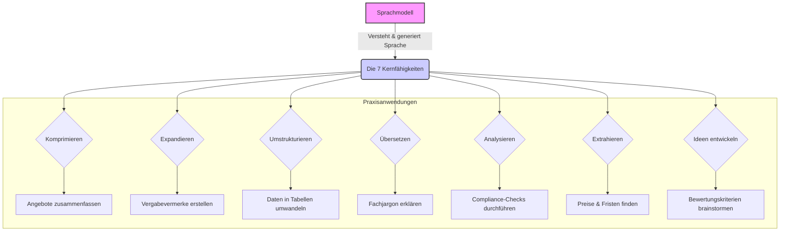
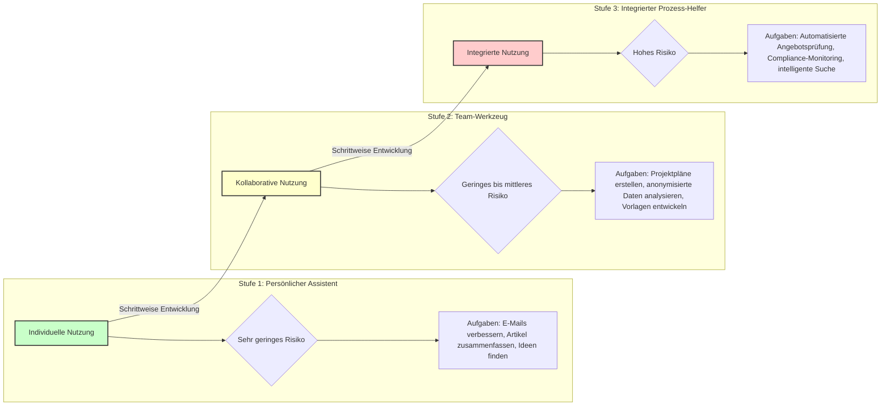
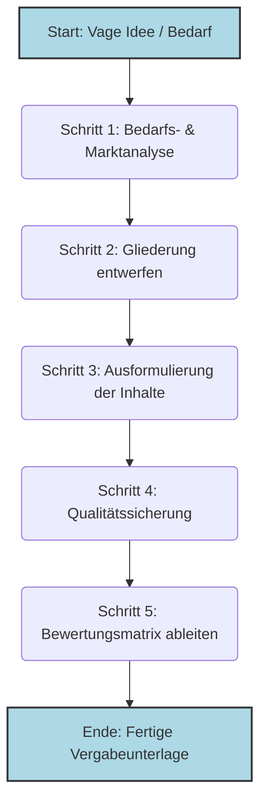
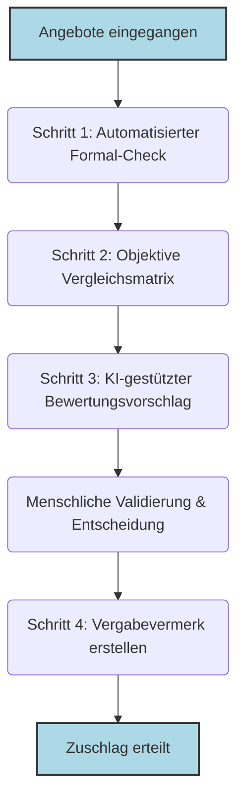
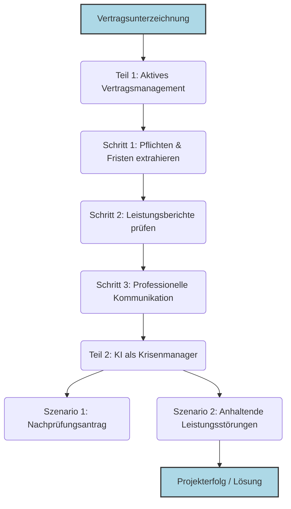

<!-- ==================== START OF BOOK ==================== -->

# **Das Ende des Formulars: Wie Sprachmodelle die öffentliche Vergabe neu definieren**

## **Ein Praxisleitfaden für die Revolution im Beschaffungswesen**

**Teil 1: Die Grundlagen – Was Sie über KI wissen müssen**

*   **Kapitel 1: Ein neues Werkzeug für die Verwaltung**
*   **Kapitel 2: Wie Sprachmodelle "denken" – Input, Verarbeitung, Output**
*   **Kapitel 3: Die Kunst der Anweisung – Effektives Prompt Engineering**

**Teil 2: Strategie und Implementierung – KI sicher einführen**

*   **Kapitel 4: Der sichere Start – Das 3-Stufen-Modell und der Kulturwandel**
*   **Kapitel 5: Infrastruktur und Souveränität – Die richtige technische Basis schaffen**

**Teil 3: Der Vergabeprozess in der Praxis – KI als Co-Pilot**

*   **Kapitel 6: Bedarfs- und Marktanalyse**
*   **Kapitel 7: Die Ausschreibungswerkstatt**
*   **Kapitel 8: Intelligente Angebotswertung**
*   **Kapitel 9: Aktives Vertragsmanagement und Sondersituationen**

**Teil 4: Governance und Zukunft – Verantwortung und Vision**

*   **Kapitel 10: Legal Tech im Vergaberecht: Ein Deep Dive**
*   **Kapitel 11: Rechtliche und ethische Leitplanken**
*   **Kapitel 12: Die menschzentrierte Verwaltung der Zukunft**
*   **Kapitel 13: Fazit und Ausblick**

**Anhänge**

*   **Anhang A: Ausgewählte Prompt-Bibliothek**
*   **Anhang B: Technische Code-Beispiele (Python)**
*   **Anhang C: Detaillierte Checklisten für die KI-Implementierung**

---

# **Teil 1: Die Grundlagen – Was Sie über KI wissen müssen**

## **Kapitel 1: Ein neues Werkzeug für die Verwaltung**

Stellen Sie sich Ihren Arbeitsalltag vor, befreit von seinen zeitraubendsten Routinen. Eine Welt, in der die manuelle Suche nach der passenden Klausel in seitenlangen Vergabeordnern der Vergangenheit angehört. In der die Nächte vor der Angebotsöffnung nicht mehr der Jagd nach formalen Fehlern gewidmet sind und wochenlange Verzögerungen durch schleppende Marktanalysen nicht mehr existieren.

Was vor wenigen Jahren noch wie eine ferne Utopie klang, rückt durch die rasante Entwicklung von **Künstlicher Intelligenz (KI)**, insbesondere von großen Sprachmodellen (Large Language Models, LLMs), in greifbare Nähe. Doch was bedeutet KI in diesem Kontext? Im Kern ist KI eine Teildisziplin der Informatik, die sich mit der Frage befasst, wie Computersysteme Aufgaben bewältigen können, bei denen der Mensch derzeit noch überlegen ist. Es geht darum, Maschinen zu entwickeln, die sich so verhalten, als wären sie intelligent.

Für Ihren Arbeitsalltag bedeutet das: Diese fortschrittliche Technologie ist weit mehr als nur ein verbesserter Chatbot. Sie stellt ein grundlegend neues Werkzeug dar, das die Art und Weise, wie Texte erstellt, Informationen analysiert und die Kommunikation in der öffentlichen Verwaltung abläuft, von Grund auf transformieren wird. Sie markiert den entscheidenden Übergang von der bloßen Digitalisierung bestehender Formulare hin zu intelligenten, teilweise automatisierten Prozessen. KI-Systeme können dabei vielfältige Aufgaben übernehmen: Sie können **informieren** (z.B. durch Chatbots), **Muster erkennen** (z.B. Anomalien in Angeboten) und in definierten Bereichen sogar **agieren** (z.B. bei der automatisierten Prüfung von Unterlagen).

Dieses Buch ist Ihr praxisorientierter Begleiter auf diesem Weg. Es ist kein technisches Kompendium für IT-Spezialisten und keine juristische Abhandlung über den EU AI Act. Es ist ein Handbuch für Sie – die Vergabeverantwortlichen, Amtsleiter und Entscheidungsträger, die täglich mit der komplexen Realität der öffentlichen Beschaffung konfrontiert sind.

Wir verlieren uns nicht in theoretischen Debatten, sondern konzentrieren uns auf das, was heute schon möglich ist und morgen zur gängigen Praxis wird. Sie lernen nicht nur, *was* Sprachmodelle sind, sondern vor allem, *wie* Sie diese als leistungsstarken Assistenten in jeder Phase des Vergabeprozesses einsetzen:

*   **Von der Idee zur Ausschreibung in Rekordzeit:** Wie Sie aus einer einfachen Bedarfsbeschreibung eine vollständige, präzise und rechtskonforme Leistungsbeschreibung generieren.
*   **Marktanalysen, die diesen Namen verdienen:** Wie Sie in Minuten statt Wochen ein tiefes Verständnis für Anbietermärkte, technologische Trends und Preisstrukturen gewinnen.
*   **Fokussierte und faire Angebotsbewertung:** Wie Sie die formale Prüfung von Angeboten automatisieren, um Ihre Zeit auf die inhaltliche und strategische Bewertung zu konzentrieren.
*   **Souveräne Kommunikation:** Wie Sie Bieteranfragen schneller und konsistenter beantworten und komplexe Sachverhalte klar und verständlich kommunizieren.

Dieses Buch ersetzt nicht Ihre Kernkompetenzen – Ihr Fachwissen, Ihr Urteilsvermögen und Ihre strategische Weitsicht. Aber es zeigt Ihnen, wie Sie diese Fähigkeiten durch den gezielten Einsatz von Sprachmodellen vervielfachen können. Es gibt Ihnen die Werkzeuge an die Hand, um dem wachsenden Druck durch Fachkräftemangel, steigende Komplexität und knappe Budgets nicht nur standzuhalten, sondern die Effizienz und Qualität Ihrer Arbeit auf ein neues Niveau zu heben.

Wir laden Sie ein, die Möglichkeiten zu entdecken, die sich ergeben, wenn menschliche Expertise und künstliche Intelligenz zusammenarbeiten. Willkommen in der Zukunft der Beschaffung.

---

## **Kapitel 2: Wie Sprachmodelle "denken" – Input, Verarbeitung, Output**

### **Einleitung: Mehr als nur eine Maschine**

Stellen Sie sich vor, Ihr neuer Fachassistent ist kein Mensch, sondern eine Software. Die Zusammenarbeit mit einem modernen Sprachmodell fühlt sich tatsächlich weniger an wie die Bedienung eines starren Programms, sondern vielmehr wie der Dialog mit einem hochintelligenten, unermüdlichen Assistenten. Er hat das gesamte Wissen des Internets und Ihrer Fachdokumente gelesen, kann blitzschnell analysieren und formulieren, besitzt aber keinerlei Lebenserfahrung, Intuition oder echtes Verständnis für die Konsequenzen seines Handelns. Er ist ein Werkzeug, das präzise Anweisungen und eine sorgfältige Überprüfung seiner Arbeit durch einen menschlichen Experten erfordert – durch Sie.

Dieses Kapitel ist Ihre erste Einarbeitung für die Zusammenarbeit mit diesem neuen digitalen Kollegen. Wir überspringen den technischen Maschinenraum, denn die Details über "neuronale Netze" sind für die Praxis so relevant wie das Wissen über den Aufbau eines Motors für das Autofahren. Stattdessen konzentrieren wir uns auf die entscheidenden Fragen für Ihren Arbeitsalltag:

*   Was sind die konkreten, praxistauglichen Fähigkeiten dieses Werkzeugs?
*   Wie funktioniert es "unter der Haube" – einfach erklärt?
*   Wie formuliere ich meine Anweisungen (Prompts), damit ich genau die Ergebnisse erhalte, die ich benötige?
*   Wo liegen die Grenzen und Risiken, und wie steuere ich sie?

Nach der Lektüre dieses Kapitels werden Sie ein klares Bild davon haben, wie Sie Sprachmodelle als leistungsverstärkendes Werkzeug nutzen können, um Ihre Expertise und Ihr Urteilsvermögen effektiver einzusetzen.

### **Ein Blick unter die Haube: Input, Verarbeitung, Output**

Um die Fähigkeiten und Risiken von KI-Systemen wirklich zu verstehen, hilft ein vereinfachtes Grundmodell ihrer Funktionsweise. Jede KI-Anwendung, egal wie komplex, folgt einem einfachen Prinzip: **Input -> Verarbeitung -> Output**.

*   **Input (Die Daten):** Eine KI benötigt "Futter", und im Vergabewesen ist das meist Text. Das können unstrukturierte Daten sein (z.B. der Fließtext einer Leistungsbeschreibung, E-Mails von Bietern) oder strukturierte Daten (z.B. eine Preistabelle in einem Angebot). Die Qualität des Inputs ist entscheidend: Sind die Daten unvollständig, veraltet oder enthalten sie Vorurteile, wird der Output unweigerlich ebenfalls von schlechter Qualität sein. Man spricht hier vom Prinzip "Garbage In, Garbage Out".
*   **Verarbeitung (Das "Lernen"):** Hier geschieht die eigentliche "Magie". Das System wird mit riesigen Datenmengen trainiert, um Muster zu erkennen. Dies geschieht durch maschinelles Lernen. Die zwei wichtigsten Methoden für unsere Zwecke sind:
    *   **Überwachtes Lernen (Supervised Learning):** Das Modell lernt anhand von Beispielen, die bereits von Menschen "gelabelt" (kategorisiert) wurden. Beispiel: Man zeigt dem System 1.000 Vertragsklauseln und markiert jede als "zulässig" oder "unzulässig". Nach dem Training kann das System eine neue, unbekannte Klausel selbstständig klassifizieren.
    *   **Unüberwachtes Lernen (Unsupervised Learning):** Das Modell erhält Daten ohne Labels und versucht, selbstständig Strukturen oder Cluster zu finden. Beispiel: Man gibt dem System 500 anonymisierte Bieterfragen, und es gruppiert diese selbstständig in Themencluster wie "Fragen zur Frist", "Fragen zu technischen Details" oder "Fragen zu Eignungsnachweisen".
*   **Output (Das Ergebnis):** Das Resultat der Verarbeitung. Im Vergabealltag ist dies meist ein neu generierter Text (ein Antwortentwurf), eine Klassifizierung (z.B. "Angebot ist formal vollständig"), eine Zusammenfassung oder eine strukturierte Information (z.B. eine Tabelle mit extrahierten Preisen).

Dieses Grundverständnis hilft Ihnen, die Ergebnisse der KI besser einzuordnen und die Ursachen für Fehler zu verstehen.

### **Die sieben Kernfähigkeiten für die Vergabepraxis**

Aus diesem Zusammenspiel von Input, Verarbeitung und Output ergeben sich sieben Kernfähigkeiten, die den Vergabealltag revolutionieren können.



#### **Fähigkeit 1: Komprimieren – Die Kunst der Zusammenfassung**

Die vielleicht mächtigste Fähigkeit im Umgang mit der Informationsflut des Vergaberechts ist die radikale Komprimierung von Texten. Ein Sprachmodell kann hunderte Seiten an Dokumenten in Sekunden lesen und die Kernaussagen wie ein erfahrener Analyst extrahieren.

*   **Angebots-Screening:** Sie erhalten ein 150-seitiges Angebot. Anstatt es vollständig zu lesen, um einen ersten Eindruck zu gewinnen, lassen Sie es vom Sprachmodell auf die wesentlichen Punkte zusammenfassen.
*   **Urteilsanalyse:** Ein neues, 50-seitiges Urteil wird veröffentlicht. Das Modell kann Ihnen in wenigen Absätzen die Kernaussagen, die relevanten Rechtssätze und die potenziellen Auswirkungen auf Ihre aktuellen Verfahren darlegen.
*   **Protokoll-Aufbereitung:** Ein zweistündiges Meeting wurde transkribiert (15 Seiten Text). Das Sprachmodell erstellt Ihnen eine Zusammenfassung der wichtigsten Entscheidungen und der zugewiesenen Aufgaben.

> **Beispiel-Prompt für eine Angebotszusammenfassung:**
> **Rolle:** Du bist ein erfahrener Vergabepraktiker mit dem Spezialgebiet IT-Dienstleistungen.
> **Kontext:** Ich habe hier das Angebot der Firma "Innovatec GmbH" für unsere Ausschreibung "Digitalisierung der Bürgerdienste". Das Angebot umfasst 120 Seiten. Ich benötige eine schnelle, aber fundierte erste Einschätzung.
> **Aufgabe:** Fasse das Angebot in maximal 400 Wörtern zusammen. Konzentriere dich dabei auf die folgenden vier Aspekte:
> 1.  **Lösungsansatz:** Welchen zentralen technischen und methodischen Ansatz verfolgt Innovatec?
> 2.  **Alleinstellungsmerkmale:** Was hebt Innovatec laut eigener Aussage von anderen Bietern ab?
> 3.  **Erfüllung der Kernanforderungen:** Gehe explizit auf unsere drei wichtigsten Muss-Kriterien ein (DSGVO-Konformität, Schnittstelle zu unserem System "Admin-Pro", barrierefreier Zugang nach BITV 2.0) und gib an, wie das Angebot diese adressiert.
> 4.  **Offene Punkte & Risiken:** Welche Aspekte erscheinen dir unklar, widersprüchlich oder riskant?
> **Format:** Gliedere deine Antwort klar nach den vier genannten Punkten. Verwende eine professionelle, prägnante Sprache.

#### **Fähigkeit 2: Expandieren – Vom Stichpunkt zum fertigen Text**

Die umgekehrte Superkraft ist die Erstellung von wohlformulierten, strukturierten Texten aus wenigen Stichpunkten. Dies ist ideal für alle Arten von Standarddokumenten, bei denen die Struktur bekannt ist, aber die Formulierung Zeit kostet. Sie geben die Fakten und die Richtung vor, die KI übernimmt die Fleißarbeit des Schreibens.

*   **Erstellung von Vergabevermerken:** Sie geben die Eckdaten einer Entscheidung ein (z.B. "Bieter A ausgeschlossen, weil Referenz X fehlte, formaler Fehler auf Seite 4, Angebotspreis unrealistisch niedrig"). Das Modell formuliert einen vollständigen, rechtssicheren Vermerk.
*   **Beantwortung von Bieterfragen:** Sie notieren stichpunktartig die Antwort auf eine komplexe Frage. Das Modell formuliert eine höfliche, präzise und widerspruchsfreie Antwort, die Sie direkt versenden können.
*   **Entwurf von Leistungsbeschreibungen:** Sie listen die Kernanforderungen an eine Dienstleistung auf. Das Modell erstellt daraus eine ausformulierte, logisch gegliederte Leistungsbeschreibung.

> **Beispiel-Prompt für einen Vergabevermerk:**
> **Rolle:** Du bist ein Jurist im Vergaberecht, spezialisiert auf die Dokumentation von Verfahrensschritten.
> **Kontext:** Wir befinden uns im Vergabeverfahren "Reinigung der Verwaltungsgebäude 2025-2028". Wir haben soeben das Angebot der "Sauber & Schnell KG" geprüft und müssen es aus zwingenden Gründen ausschließen.
> **Aufgabe:** Formuliere aus den folgenden Stichpunkten einen präzisen und rechtlich unangreifbaren Entwurf für den entsprechenden Abschnitt im Vergabevermerk.
> **Stichpunkte:**
> *   Ausschlussgrund: § 57 Abs. 1 Nr. 4 VgV - Angebot nicht form- und fristgerecht eingegangen.
> *   Frist war der 04.07.2025, 12:00 Uhr.
> *   Angebot der "Sauber & Schnell KG" ging per E-Vergabe-Plattform erst um 12:17 Uhr ein.
> *   Systemprotokoll der Plattform belegt den verspäteten Eingang eindeutig.
> *   Kein Ermessensspielraum für die Vergabestelle. Der Gleichbehandlungsgrundsatz zwingt zum Ausschluss.
> **Format:** Formuliere einen Fließtext, der die Entscheidung klar und nachvollvollziehbar begründet. Zitiere den relevanten Paragrafen und verweise auf die Beweiskraft des Systemprotokolls.

#### **Fähigkeit 3: Umstrukturieren – Informationen neu anordnen**

Oft liegen Informationen bereits vor, aber im falschen Format. Sprachmodelle sind Meister darin, Daten aus einem unstrukturierten Fließtext in eine klare, strukturierte Form wie eine Tabelle, eine Liste oder eine JSON-Struktur zu überführen.

*   **Von Fließtext zur Tabelle:** Ein Bieter beschreibt seine Teammitglieder und deren Qualifikationen in einem langen Fließtext. Sie lassen das Modell diese Informationen extrahieren und in einer übersichtlichen Tabelle darstellen (Spalten: Name, Rolle, Jahre Berufserfahrung, Zertifizierungen).
*   **Von E-Mail zum Aufgabenplan:** Eine lange E-Mail-Kette enthält diverse Absprachen. Das Modell extrahiert alle vereinbarten Aufgaben, die verantwortlichen Personen und die genannten Fristen und erstellt daraus einen strukturierten Aktionsplan.
*   **Erstellung einer Präsentation:** Sie haben einen 20-seitigen Analysebericht. Das Modell erstellt daraus die Gliederung und die Stichpunkte für eine 10-Folien-PowerPoint-Präsentation für die Amtsleitung.

#### **Fähigkeit 4: Übersetzen – Mehr als nur Sprachen**

Die Fähigkeit zur Übersetzung geht weit über menschliche Sprachen hinaus. Sprachmodelle können auch zwischen verschiedenen Fachjargons vermitteln und so die Kommunikation zwischen Abteilungen, mit externen Dienstleistern oder der Politik radikal vereinfachen.

*   **Von "Technisch" zu "Verwaltungsdeutsch":** Ein IT-Anbieter beschreibt eine komplexe technische Lösung. Das Modell "übersetzt" die Beschreibung in eine verständliche Sprache für Nicht-Techniker in der Verwaltung, ohne die wesentlichen Fakten zu verfälschen.
*   **Von "Juristisch" zu "Klartext":** Sie müssen die Kernaussagen einer neuen Verordnung an Kollegen kommunizieren, die keine Juristen sind. Das Modell formuliert die Inhalte einfach und auf den Punkt.
*   **Fremdsprachige Angebote:** Ein Angebot eines europäischen Bieters liegt auf Englisch vor. Das Modell liefert eine qualitativ hochwertige Rohübersetzung, die es Ihnen ermöglicht, den Inhalt schnell zu erfassen.

#### **Fähigkeit 5: Analysieren – Muster und Anomalien erkennen**

Hier nutzt die KI maschinelles Lernen, um Muster, Widersprüche oder Abweichungen zu erkennen. Sie agiert wie ein unbestechlicher Revisor, der Verbindungen und Fehler findet, die einem menschlichen Leser vielleicht entgehen würden. Dies kann durch **Klassifikation** (eine Form des überwachten Lernens) oder **Clustering** (unüberwachtes Lernen) geschehen.

*   **Compliance-Check (Klassifikation):** Sie füttern das Modell mit Ihrer Leistungsbeschreibung und einem Angebot und lassen es prüfen, ob alle Muss-Anforderungen im Angebot explizit adressiert werden. Das Modell klassifiziert jede Anforderung als "erfüllt" oder "nicht erfüllt".
*   **Risikoanalyse (Klassifikation/Mustererkennung):** Sie lassen ein Modell einen Vertragsentwurf analysieren und es auf potenziell nachteilige Klauseln (z.B. unklare Haftungsregeln, automatische Vertragsverlängerungen) prüfen, die es aus Trainingsdaten als riskant gelernt hat.
*   **Vergleich von Angeboten (Clustering/Analyse):** Sie lassen die Lösungsbeschreibungen von drei Bietern analysieren und die zentralen Unterschiede in deren Ansätzen, Stärken und Schwächen herausarbeiten.

#### **Fähigkeit 6: Extrahieren – Gezielte Informationen finden**

Ähnlich wie die Analyse, aber fokussierter: Hier geht es darum, spezifische Datenpunkte wie Nadeln im Heuhaufen aus einem unstrukturierten Text zu "pflücken". Dies ist besonders nützlich, um strukturierte Daten aus unstrukturierten Dokumenten zu gewinnen.

*   **Preis-Extraktion:** Aus einem langen Angebotstext, in dem die Preise für Haupt- und Nebenleistungen verstreut sind, extrahiert das Modell alle genannten Euro-Beträge mit der dazugehörigen Leistungsbeschreibung und listet sie in einer Tabelle auf.
*   **Fristen-Management:** Das Modell liest einen komplexen Bauzeitenplan im Fließtextformat und extrahiert alle genannten Fristen und Meilensteine in eine Kalenderübersicht.
*   **Referenz-Prüfung:** Aus dem Referenzteil eines Angebots extrahiert das Modell die Namen der Ansprechpartner und deren Kontaktdaten zur einfacheren Überprüfung.

#### **Fähigkeit 7: Ideen entwickeln – Kreativer Sparringspartner sein**

Eine oft unterschätzte Fähigkeit ist die Unterstützung bei kreativen und strategischen Denkprozessen. Das Modell kann als unvoreingenommener Sparringspartner dienen, der neue Perspektiven aufzeigt und hilft, aus der eigenen "Betriebsblindheit" auszubrechen.

*   **Brainstorming für Bewertungskriterien:** Sie wissen, was Sie beschaffen wollen, sind aber unsicher bei den qualitativen Zuschlagskriterien. Sie bitten das Modell, Ihnen 10 mögliche, innovative und messbare Kriterien für die Bewertung von IT-Dienstleistungen vorzuschlagen.
*   **Entwicklung von Verhandlungsstrategien:** Sie stehen vor einer Verhandlung mit einem Bieter. Sie beschreiben dem Modell die Situation, die Ziele und die bekannten Positionen des Bieters und bitten es, mögliche Argumentationslinien, Kompromissvorschläge und alternative Lösungswege zu entwickeln.
*   **Risiko-Workshop vorbereiten:** Sie bitten das Modell, basierend auf einer Projektbeschreibung eine Liste der 15 wahrscheinlichsten Risiken (technisch, organisatorisch, rechtlich) zu erstellen, die Sie als Grundlage für ein Team-Workshop nutzen können.

---

## **Kapitel 3: Die Kunst der Anweisung – Effektives Prompt Engineering**

Die Qualität Ihrer Ergebnisse hängt direkt von der Qualität Ihrer Anweisungen (Prompts) ab. Ein schlechter Prompt führt zu unbrauchbaren Ergebnissen. Ein guter Prompt macht das Sprachmodell zu einem wertvollen Werkzeug. Die Kunst des "Prompt Engineering" ist die wichtigste Fähigkeit für die Zusammenarbeit mit KI. Ein effektiver Prompt besteht in der Regel aus vier Komponenten:

1.  **Rolle (Persona):** Weisen Sie dem Modell eine spezifische Rolle zu. Sagen Sie nicht nur "Schreibe...", sondern "Handle als erfahrener Vergaberechtsanwalt..." oder "Agieren Sie als IT-Architekt...". Dies aktiviert das relevante "Wissen" im Modell.
2.  **Kontext:** Geben Sie dem Modell alle notwendigen Hintergrundinformationen. In welcher Situation befinden Sie sich? Was ist das Ziel? Je mehr Kontext, desto relevanter die Antwort.
3.  **Aufgabe:** Formulieren Sie die eigentliche Aufgabe so präzise und unmissverständlich wie möglich. Verwenden Sie aktive Verben und gliedern Sie komplexe Aufgaben in klare Unterschritte.
4.  **Format:** Definieren Sie genau, wie die Ausgabe aussehen soll. "Schreibe einen Fließtext", "Erstelle eine Markdown-Tabelle", "Liste die Ergebnisse in Stichpunkten auf", "Begrenze die Antwort auf 200 Wörter".

Eine präzise Anweisung ist keine Einschränkung Ihrer Kreativität, sondern der Schlüssel zu nützlichen und verlässlichen Ergebnissen.

### **Fortgeschrittene Prompting-Techniken für die Rechtsanalyse**

Für komplexe juristische Analysen können Sie über die Grundstruktur hinausgehen und fortgeschrittene Techniken anwenden, um die Tiefe und Präzision der KI-Antworten zu erhöhen:

*   **Chain-of-Thought (Gedankenkette):** Weisen Sie die KI an, ihre Analyse Schritt für Schritt zu entwickeln. Dies zwingt das Modell zu einem logischeren, nachvollziehbaren Vorgehen.
    > **Beispiel:** "Analysiere Klausel 8.3 in einer schrittweisen Kette von Gedanken: 1. Zitiere die Klausel. 2. Interpretiere ihre Bedeutung. 3. Identifiziere die Risiken für den Auftraggeber. 4. Formuliere einen Alternativvorschlag."
*   **Multi-Perspektiven-Analyse:** Lassen Sie die KI dasselbe Dokument aus den gegensätzlichen Perspektiven verschiedener Stakeholder analysieren (z.B. Auftraggeber vs. Auftragnehmer).
    > **Beispiel:** "Analysiere den Vertragsentwurf zuerst aus der Sicht des Risikomanagers des Auftraggebers und identifiziere die Top-5-Risiken. Analysiere ihn dann aus der Sicht des Anwalts des Auftragnehmers und identifiziere die drei wichtigsten Verhandlungspunkte."
*   **Red Teaming:** Fordern Sie die KI aktiv auf, ihre eigene Analyse zu hinterfragen oder eine Gegenposition einzunehmen, um Bestätigungsfehler zu vermeiden.
    > **Beispiel:** "In einer vorherigen Analyse hast du Klausel 12 als 'vorteilhaft' bewertet. Argumentiere nun so überzeugend wie möglich, warum diese Klausel in bestimmten Szenarien erhebliche Nachteile mit sich bringen könnte."

---

# **Teil 2: Strategie und Implementierung – KI sicher einführen**

## **Kapitel 4: Der sichere Start – Das 3-Stufen-Modell und der Kulturwandel**

### **Einleitung: Vom Wissen zum Handeln**

Nachdem Sie im ersten Kapitel die grundlegenden Fähigkeiten und Grenzen von Sprachmodellen kennengelernt haben, stellt sich nun die entscheidende Frage: Wie fangen wir an? Die bloße Existenz eines neuen Werkzeugs verändert noch nichts. Der Wandel beginnt erst, wenn wir es gezielt und überlegt in unsere täglichen Abläufe integrieren.

Dieses Kapitel ist Ihre strategische Landkarte für die ersten Schritte. Es zeigt Ihnen, wie Sie die Einführung von Künstlicher Intelligenz in Ihrer Abteilung oder Behörde aktiv gestalten können – und zwar sicher, pragmatisch und ohne große Budgets. Wir konzentrieren uns nicht auf eine ferne Zukunftsvision, sondern auf das, was Sie und Ihr Team nächste Woche beginnen können, um erste Erfolge zu erzielen und eine Kultur der intelligenten Assistenz zu etablieren.

Der Schlüssel liegt nicht in einem "Big Bang", sondern in einer schrittweisen, evolutionären Entwicklung. Wir werden einen klaren Pfad aufzeigen, der es Ihnen ermöglicht, die Potenziale zu heben, ohne sich unnötigen Risiken auszusetzen.

### **Die richtige Haltung: Vom skeptischen Beobachter zum neugierigen Entdecker**

Die größte Hürde bei der Einführung neuer Technologien ist selten die Technik selbst, sondern die Kultur und die Einstellung der Menschen, die sie nutzen sollen. Angst vor Arbeitsplatzverlust, Skepsie gegenüber "Black-Box"-Entscheidungen oder die Sorge vor Kontrollverlust sind reale und verständliche Bedenken. Ihre erste und wichtigste Aufgabe als Führungskraft oder Pionier ist es, diesen Bedenken mit einer klaren und positiven Vision zu begegnen.

**Verschieben Sie den Fokus: Von "Ersetzen" zu "Erweitern"**

Kommunizieren Sie von Anfang an eine klare Botschaft: Sprachmodelle werden nicht das Fachwissen von Vergabepraktikern ersetzen. Sie werden es erweitern und wertvoller machen. Die KI ist nicht der neue Kollege, der Ihren Job übernimmt, sondern ein leistungsstarkes Werkzeug, das Ihnen die zeitraubenden, repetitiven und oft frustrierenden Teile Ihrer Arbeit abnimmt.

*   **Der Jurist** wird nicht durch eine KI ersetzt, die Urteile liest. Er wird zu einem besseren Juristen, weil er in fünf Minuten die Kernaussagen von zehn Urteilen erfassen und seine Zeit auf die strategische Einordnung verwenden kann.
*   **Der Ingenieur** in der Beschaffung wird nicht durch eine KI ersetzt, die Leistungsbeschreibungen erstellt. Er wird zu einem besseren Ingenieur, weil er seine Energie auf die Definition innovativer technischer Anforderungen konzentrieren kann, während die KI die mühsame Standardformulierung übernimmt.
*   **Der Betriebswirt** wird nicht durch eine KI ersetzt, die Angebote vergleicht. Er wird zu einem besseren Betriebswirt, weil er sich auf die Analyse von Preisstrategien und die Identifikation versteckter Kosten konzentrieren kann, nachdem die KI die formale Prüfung erledigt hat.

**Etablieren Sie eine Kultur des Experimentierens**

Schaffen Sie einen geschützten Raum für Neugier. Ermutigen Sie Ihr Team, mit dem Werkzeug zu "spielen" und erste, risikofreie Erfahrungen zu sammeln. Die Devise lautet: "Lasst es uns ausprobieren."

*   **Starten Sie mit ungefährlichen Aufgaben:** Die Verbesserung einer internen E-Mail, die Zusammenfassung eines öffentlichen Fachartikels oder das Brainstorming für eine Team-Besprechung sind perfekte erste Anwendungsfälle. Hier kann nichts schiefgehen, aber der "Aha-Effekt" ist oft enorm.
*   **Teilen Sie Erfolge (und Misserfolge):** Etablieren Sie einen kurzen, informellen Austausch (z.B. 15 Minuten im wöchentlichen Team-Meeting), in dem Kollegen von ihren Erfahrungen berichten: "Ich habe gestern versucht, eine Marktanalyse für Schrauben zu machen – das Ergebnis war unbrauchbar. Aber die Zusammenfassung der neuen DIN-Norm war fantastisch und hat mir eine Stunde Arbeit gespart." Solche authentischen Berichte sind wertvoller als jede offizielle Schulung.

### **Der sichere Start: Das 3-Stufen-Modell der KI-Einführung**

Die Einführung von KI sollte einem klaren Stufenplan folgen, der die Komplexität und die Risiken schrittweise erhöht. So stellen Sie sicher, dass die Fähigkeiten und die Sicherheitsroutinen mit den Anwendungsfällen mitwachsen.



#### **Stufe 1: Der persönliche Assistent (Risiko: Sehr gering)**

Auf dieser Stufe nutzt jeder Mitarbeiter das Sprachmodell ausschließlich für seine eigene Produktivität und mit Daten, die entweder öffentlich zugänglich sind oder keinerlei Sensibilität aufweisen. Es findet kein Austausch von Amts- oder Verfahrensdaten mit der KI statt.

*   **Anwendungsbeispiele:**
    *   **Lernen und Weiterbildung:** "Fasse mir diesen 20-seitigen Fachartikel über nachhaltige Beschaffung auf die fünf wichtigsten Kernaussagen zusammen."
    *   **Textverbesserung:** "Ich habe diese E-Mail an einen anderen Fachbereich formuliert. Mache sie höflicher und prägnanter."
    *   **Kreativität und Ideenfindung:** "Ich muss eine Präsentation über die Vorteile der E-Vergabe halten. Gib mir fünf überzeugende Argumente und eine Gliederung."
    *   **Verständnis von Fachjargon:** "Erkläre mir das Konzept 'Zero Trust Architektur' so, als würdest du es einem zehnjährigen Kind erklären."
*   **Ziel dieser Stufe:** Jeder Mitarbeiter lernt die grundlegende Bedienung und die "Persönlichkeit" des Werkzeugs kennen. Die Hemmschwelle sinkt, und der individuelle Nutzen wird sofort spürbar.

#### **Stufe 2: Das Team-Werkzeug (Risiko: Gering bis mittel)**

Auf Stufe 2 beginnt die kollaborative Nutzung innerhalb eines Teams. Hier werden anonymisierte oder pseudonymisierte Projektdaten verwendet, die keine Rückschlüsse auf Personen oder sensible Verfahrensdetails zulassen.

*   **Anwendungsbeispiele:**
    *   **Projektplanung:** "Wir planen die Einführung einer neuen Software. Erstelle einen detaillierten Projektplan in Tabellenform mit den Phasen: Analyse, Beschaffung, Implementierung, Schulung. Schlage für jede Phase realistische Meilensteine und Zeitpuffer vor."
    *   **Analyse von anonymisierten Daten:** "Hier ist eine Liste von 50 anonymisierten Bieterfragen aus früheren Verfahren. Analysiere diese und identifiziere die fünf häufigsten Themen und Unklarheiten, damit wir unsere zukünftigen Vergabeunterlagen verbessern können."
    *   **Erstellung von Vorlagen:** "Erstelle eine universelle Checkliste für die formale Prüfung von Angeboten im Baubereich. Berücksichtige dabei die gängigsten Fehlerquellen."
*   **Ziel dieser Stufe:** Das Team lernt, wie KI die Zusammenarbeit verbessern und die Qualität von Arbeitsergebnissen standardisieren kann. Es werden erste gemeinsame Regeln für die Nutzung entwickelt.

#### **Stufe 3: Der integrierte Prozess-Helfer (Risiko: Hoch)**

Dies ist die anspruchsvollste Stufe und für die nahe Zukunft eher ein Zielbild. Hier wird ein speziell gesichertes und für die Verwaltung zugelassenes KI-System (z.B. eine On-Premise-Lösung oder eine zertifizierte Behörden-Cloud) direkt in die Fachverfahren, wie die E-Vergabe-Plattform, integriert.

*   **Anwendungsbeispiele:**
    *   **Automatisierte Angebotsprüfung:** Das System prüft eingehende Angebote automatisch auf formale Vollständigkeit und meldet dem menschlichen Bearbeiter die gefundenen Mängel.
    *   **Compliance-Monitoring:** Die KI gleicht eine Leistungsbeschreibung permanent mit den aktuellen rechtlichen Vorgaben ab und warnt bei potenziellen Widersprüchen.
    *   **Intelligente Suche:** Ein Mitarbeiter kann in natürlicher Sprache eine Frage stellen ("Zeige mir alle Verfahren der letzten drei Jahre, bei denen wir mobile Endgeräte beschafft haben und der Bieter X ein Angebot abgegeben hat") und das System findet die relevanten Akten.
*   **Ziel dieser Stufe:** Eine tiefgreifende Effizienzsteigerung durch die nahtlose Integration von menschlicher Expertise und maschineller Analysefähigkeit. Dies erfordert jedoch einen hohen Grad an technischer und organisatorischer Reife, der schrittweise über die Stufen 1 und 2 aufgebaut werden muss.

---

## **Kapitel 5: Infrastruktur und Souveränität – Die richtige technische Basis schaffen**

### **Die Infrastruktur-Entscheidung: Cloud, On-Premise oder der souveräne Mittelweg?**

Die Frage, wo Ihre Daten verarbeitet werden, ist die fundamentalste und weitreichendste Entscheidung bei der KI-Einführung. Sie hat direkte Auswirkungen auf die Kosten, die Sicherheit, die Flexibilität und vor allem auf die digitale Souveränität Ihrer Behörde.

```mermaid
graph TD
    subgraph Infrastruktur-Modelle
        A[Public Cloud] --> B(Vorteile: Skalierbarkeit, Innovation);
        A --> C(Nachteile: Datensouveränität, Lock-in);
        D[On-Premise] --> E(Vorteile: Volle Kontrolle, Sicherheit);
        D --> F(Nachteile: Hohe Kosten, Wartung);
        G[Hybrid/Private Cloud] --> H(Vorteile: Kompromiss aus Kontrolle & Flexibilität);
        G --> I(Nachteile: Komplexität);
    end

    subgraph Entscheidungskriterien
        J[Digitale Souveränität]
        K[Datenschutz (DSGVO)]
        L[Anfangsinvestition]
        M[Laufende Kosten]
        N[Flexibilität & Innovation]
    end

    A -- beeinflusst --> J;
    A -- beeinflusst --> K;
    A -- beeinflusst --> L;
    A -- beeinflusst --> M;
    A -- beeinflusst --> N;

    D -- beeinflusst --> J;
    D -- beeinflusst --> K;
    D -- beeinflusst --> L;
    D -- beeinflusst --> M;
    D -- beeinflusst --> N;

    G -- beeinflusst --> J;
    G -- beeinflusst --> K;
    G -- beeinflusst --> L;
    G -- beeinflusst --> M;
    G -- beeinflusst --> N;

    style A fill:#ADD8E6,stroke:#333,stroke-width:2px;
    style D fill:#ADD8E6,stroke:#333,stroke-width:2px;
    style G fill:#ADD8E6,stroke:#333,stroke-width:2px;
```

**Die drei grundlegenden Modelle:**

*   **Public Cloud:** Sie nutzen die Dienste großer internationaler Anbieter (wie Microsoft Azure, Amazon Web Services, Google Cloud). Die Verarbeitung findet in deren Rechenzentren statt.
*   **On-Premise ("Im eigenen Haus"):** Sie betreiben die KI-Systeme auf Ihrer eigenen Hardware in Ihrem eigenen Rechenzentrum oder dem eines zertifizierten kommunalen Dienstleisters.
*   **Hybrid & Private Cloud:** Mischformen, bei denen Sie beispielsweise eine abgeschirmte "private" Cloud bei einem Anbieter mieten oder unkritische Anwendungen in der Public Cloud nutzen, sensible Daten aber "on-premise" verarbeiten.

**Eine einfache Entscheidungshilfe:**

Stellen Sie sich die drei Modelle wie folgt vor:
*   **Public Cloud ist wie das Mieten einer Wohnung in einem globalen Apartment-Komplex:** Sehr bequem, alles ist vorhanden, Reparaturen übernimmt der Vermieter. Sie haben aber wenig Kontrolle über das Gebäude, die Hausordnung oder die anderen Mieter. Und Ihre Daten (Ihre "Einrichtung") befinden sich physisch nicht mehr in Ihrem alleinigen Hoheitsbereich.
*   **On-Premise ist wie der Bau eines eigenen Hauses:** Maximale Kontrolle, Sicherheit und Gestaltungsfreiheit. Sie bestimmen die Regeln. Aber es ist teuer in der Anschaffung, und Sie sind für alles selbst verantwortlich – von der Wartung der Heizung bis zur Dachreparatur.
*   **Hybrid/Private Cloud ist wie eine Eigentumswohnung in einem lokalen, exklusiven Gebäude:** Ein Kompromiss aus Komfort und Kontrolle. Sie haben mehr Gestaltungsfreiheit als im riesigen Mietkomplex, teilen sich aber die Verantwortung für die Basisinfrastruktur.

**Die entscheidenden Kriterien für die öffentliche Verwaltung:**

| Kriterium | Public Cloud | On-Premise | Empfehlung für die Verwaltung |
| :--- | :--- | :--- | :--- |
| **Digitale Souveränität** | ⚠️ **Gering.** Daten unterliegen potenziell dem Zugriff ausländischer Behörden (z.B. US CLOUD Act). | ✅ **Maximal.** Volle Kontrolle über Daten und Systeme. | Für sensible Verfahrensdaten ist eine On-Premise- oder zertifizierte europäische Private-Cloud-Lösung (z.B. nach GAIA-X-Standards) dringend zu empfehlen. |
| **Datenschutz (DSGVO)** | ⚠️ **Komplex.** Erfordert aufwändige Verträge (Standardvertragsklauseln) und Risikoanalysen (TIA). | ✅ **Einfacher.** Die Einhaltung der DSGVO liegt vollständig in der eigenen Hand. | On-Premise vereinfacht den Nachweis der DSGVO-Konformität erheblich. |
| **Anfangsinvestition** | ✅ **Gering.** Keine Hardware-Kosten, Abrechnung nach Nutzung. | ⚠️ **Sehr hoch.** Erfordert teure Server-Hardware (insb. GPUs) und Software-Lizenzen. | Für erste, unkritische Experimente (Stufe 1 aus Kap. 2) kann eine Public Cloud sinnvoll sein. Für den produktiven Einsatz muss eine Investition geplant werden. |
| **Laufende Kosten** | ⚠️ **Schwer kalkulierbar.** Kosten können bei intensiver Nutzung explodieren. | ✅ **Gut planbar.** Nach der Anfangsinvestition fallen primär Strom- und Wartungskosten an. | On-Premise bietet langfristig mehr Kostensicherheit, wenn eine kontinuierliche Nutzung geplant ist. |
| **Flexibilität & Innovation** | ✅ **Sehr hoch.** Sie haben sofortigen Zugriff auf die neuesten Modelle und Technologien der großen Anbieter. | ⚠️ **Geringer.** Sie müssen neue Modelle selbst implementieren und warten. | Ein hybrider Ansatz kann sinnvoll sein: Nutzung von Open-Source-Modellen auf eigener Hardware, aber Beobachtung der Cloud-Entwicklungen. |

**Praxis-Empfehlung:** Für den Einstieg und für unkritische Aufgaben eignen sich Public-Cloud-Angebote. Sobald Sie jedoch planen, interne oder gar sensible Verfahrensdaten zu verarbeiten, führt aus Gründen der digitalen Souveränität und des Datenschutzes kaum ein Weg an einer **On-Premise-Lösung oder einer speziell zertifizierten, europäischen Private Cloud** vorbei. Prüfen Sie Kooperationen mit kommunalen Rechenzentren, um die Investitionskosten zu teilen und die Last der Implementierung zu verteilen.

---

# **Teil 3: Der Vergabeprozess in der Praxis – KI als Co-Pilot**

## **Kapitel 6: Bedarfs- und Marktanalyse**

Am Anfang jeder Beschaffung steht eine oft unklare Anforderung: "Wir brauchen eine neue Software", "Die Reinigungsleistungen müssen neu ausgeschrieben werden", "Die Brücke ist marode". Die Qualität der gesamten Vergabe hängt davon ab, wie gut es gelingt, diesen vagen Bedarf in eine präzise, vollständige und widerspruchsfreie Anforderung zu übersetzen. Hier setzen Sprachmodelle als erstes an.

**Traditioneller Prozess:** Langwierige Workshops, Interviews mit Fachabteilungen, manuelle Analyse alter Unterlagen. Oft bleiben die wahren Bedürfnisse im Verborgenen oder werden durch die Meinungen einzelner lauter Stakeholder dominiert.

**Der KI-gestützte Ansatz:** Sprachmodelle agieren hier als unvoreingenommene Analysten und Moderatoren. Sie helfen, die richtigen Fragen zu stellen und das Wissen der Organisation zu heben. Dabei ist die Qualität der **Input-Daten** entscheidend. Die KI kann nur so gut arbeiten wie die Informationen, die ihr zur Verfügung gestellt werden. Dies umfasst **unstrukturierte Daten** (wie Protokolle, Berichte) und **strukturierte Daten** (wie Tabellen mit Nutzungsstatistiken).

*   **Stakeholder-Analyse:** Bevor Sie den ersten Workshop ansetzen, kann die KI Ihnen helfen, alle relevanten Interessengruppen zu identifizieren. Sie kann aus internen Dokumenten ableiten, welche Abteilungen betroffen sind und welche spezifischen Interessen sie haben könnten.
    > **Praxis-Prompt:** "Wir planen die Beschaffung eines neuen Dokumentenmanagementsystems für unsere Stadtverwaltung. Handle als Organisationsberater und erstelle eine Liste aller potenziellen Stakeholder, die wir in die Bedarfsanalyse einbeziehen müssen. Berücksichtige dabei nicht nur die Fachabteilungen, sondern auch Querschnittsbereiche wie IT-Sicherheit, Datenschutz, Personalrat, Archiv und Digitalisierungsbeauftragte. Gib für jeden Stakeholder an, welche spezifischen Interessen und Anforderungen er voraussichtlich haben wird."

*   **Analyse bestehender Unterlagen:** Die KI kann hunderte Seiten an alten Vergabeakten, Protokollen oder internen Berichten analysieren, um wiederkehrende Probleme oder ungedeckte Bedarfe zu identifizieren. Sie kann Muster in Beschwerden erkennen oder häufig genannte Verbesserungsvorschläge extrahieren. Hierbei ist die **Datenqualität** entscheidend: Sind die Daten **vollständig**, **genau** und **aktuell**? Nur dann kann die KI verlässliche Muster erkennen.
    > **Praxis-Prompt:** "Analysiere die beigefügten anonymisierten Protokolle der Nutzer-Feedback-Runden zu unserer aktuellen Software 'Admin-Pro' aus den letzten drei Jahren. Extrahiere und kategorisiere die fünf am häufigsten genannten Kritikpunkte und Verbesserungsvorschläge der Mitarbeiter."

*   **Formulierung von Bedarfsanforderungen:** Die KI hilft, die gesammelten Informationen in eine strukturierte Form zu bringen und erste Entwürfe für die Bedarfsbeschreibung zu erstellen. Sie kann aus Stichpunkten vollständige, grammatikalisch korrekte und logisch gegliederte Texte generieren.
    > **Praxis-Prompt:** "Basierend auf den Ergebnissen der Stakeholder-Analyse und der Protokoll-Auswertung, formuliere einen ersten Entwurf für die funktionalen und nicht-funktionalen Anforderungen an ein neues Dokumentenmanagementsystem. Gliedere die Anforderungen in die Kategorien 'Muss-Anforderungen' und 'Soll-Anforderungen'."

**Der Game-Changer:** Die Bedarfsanalyse wird von einem reaktiven Prozess zu einer proaktiven, datengestützten Untersuchung. Sie starten das Verfahren mit einem wesentlich klareren und umfassenderen Bild der tatsächlichen Bedürfnisse, was die Grundlage für eine erfolgreiche Beschaffung legt.

---

## **Kapitel 7: Die Ausschreibungswerkstatt**

In diesem Kapitel verlassen wir die Theorie und begeben uns direkt in die Werkstatt. Wir simulieren einen vollständigen Erstellungsprozess von Anfang bis Ende. Anhand eines durchgehenden, realistischen Fallbeispiels werden Sie lernen, wie Sie Sprachmodelle als integriertes Werkzeug nutzen, um schneller, präziser und strategischer zu arbeiten.

Wir werden eine Kette von praxiserprobten Prompts anwenden, die aufeinander aufbauen. Sie werden sehen, wie die verschiedenen in Kapitel 1 beschriebenen KI-Fähigkeiten – vom Brainstorming über die Analyse bis hin zur Texterstellung und Qualitätssicherung – nahtlos ineinandergreifen. Dieses Kapitel ist kein reiner Lesetext, sondern eine interaktive Anleitung, die Sie einlädt, die Schritte direkt auf Ihre eigenen Projekte zu übertragen.

**Unser Fallbeispiel:** Eine mittelgroße Stadtverwaltung (ca. 80.000 Einwohner) muss die IT-Support-Dienstleistungen für ihre 500 Mitarbeiter neu ausschreiben. Der bestehende Vertrag läuft in 12 Monaten aus. Der aktuelle Dienstleister hat gute Arbeit geleistet, aber es gab auch wiederholt Kritik an den langen Lösungszeiten und der mangelnden proaktiven Beratung. Die Verwaltung möchte die Gelegenheit nutzen, die Qualität des Supports deutlich zu erhöhen und den neuen Dienstleister stärker in die strategische Weiterentwicklung der IT-Landschaft einzubinden.



---

## **Kapitel 8: Intelligente Angebotswertung**

Die Phase der Angebotswertung ist der kritischste und oft auch der aufreibendste Teil des gesamten Vergabeverfahrens. Hier treffen die sorgfältig vorbereiteten Unterlagen auf die Realität des Marktes. Traditionell ist diese Phase geprägt von einer enormen Arbeitslast: dem akribischen, manuellen Abgleich von hunderten von Seiten, der Jagd nach formalen Fehlern und dem ständigen Bemühen, eine objektive und nachvollziehbare Entscheidung zu treffen.

Dieses Kapitel zeigt, wie Sprachmodelle diese Phase revolutionieren. Der grundlegende Wandel lässt sich in einem Satz zusammenfassen: Sie werden vom mühsamen Prüfer zum strategischen Entscheider. Die KI übernimmt die Rolle des unermüdlichen Assistenten, der die Fleißarbeit erledigt – das Suchen, Vergleichen, Auflisten und Dokumentieren. Dadurch wird Ihre Zeit frei für die Aufgaben, die Ihre menschliche Expertise erfordern: die qualitative Einordnung, die strategische Bewertung von Konzepten und die finale, fundierte Entscheidung.

Wir werden den Prozess der Angebotswertung neu denken und ein "Bewertungs-Cockpit" konzipieren – eine von der KI erstellte, dynamische Übersicht, die Ihnen alle relevanten Informationen auf einen Blick präsentiert und es Ihnen ermöglicht, fundierte Entscheidungen zu treffen, ohne in der Angebotsflut zu ertrinken. Wir setzen dabei unser Fallbeispiel aus Kapitel 4 fort: die Ausschreibung der IT-Support-Dienstleistungen.



---

## **Kapitel 9: Aktives Vertragsmanagement und Sondersituationen**

Ein weit verbreiteter Irrglaube im öffentlichen Beschaffungswesen ist, dass mit dem Zuschlag die meiste Arbeit getan sei. Die Praxis zeigt jedoch ein anderes Bild: Die eigentliche Herausforderung beginnt oft erst nach der Vertragsunterzeichnung. Die Sicherstellung der versprochenen Leistung, die Einhaltung von Fristen und die professionelle Handhabung von Problemen entscheiden letztendlich über den Erfolg oder Misserfolg eines Projekts.

Traditionell ist das Vertragsmanagement eine reaktive Disziplin. Der Vertrag landet in der Akte und wird erst wieder hervorgeholt, wenn etwas schiefgeht. Die Überwachung von Fristen und Leistungen ist ein manueller, lückenhafter Prozess. In diesem Kapitel zeigen wir, wie Künstliche Intelligenz diesen Ansatz fundamental verändert. Wir verwandeln das Vertragsmanagement von einer passiven Verwaltungsaufgabe in eine aktive, datengestützte Steuerungsdisziplin.

Darüber hinaus rüsten wir Sie für den Ernstfall. Wir zeigen, wie Sie Sprachmodelle als kühlen Kopf und unermüdlichen Analyse-Assistenten nutzen können, wenn unvorhergesehene Probleme auftreten – von leichten Leistungsstörungen bis hin zu handfesten rechtlichen Auseinandersetzungen.



---

# **Teil 4: Governance und Zukunft – Verantwortung und Vision**

## **Kapitel 10: Legal Tech im Vergaberecht: Ein Deep Dive**

Legal Tech transformiert das Vergaberecht tiefgreifend, indem es Prozesse automatisiert, die Effizienz steigert und neue Wege für die Rechtsberatung eröffnet. Die Entwicklung reicht von einfachen digitalen Werkzeugen bis hin zu komplexen Anwendungen mit künstlicher Intelligenz (KI).

### **Aktuelle Anwendungen von Legal Tech im Vergaberecht**

Schon heute sind diverse Legal-Tech-Lösungen im Vergaberecht im Einsatz, um die Effizienz und Qualität juristischer Arbeit zu verbessern. Diese lassen sich grob in drei Entwicklungsstufen einteilen:

*   **Legal Tech 1.0:** Diese erste Stufe umfasst grundlegende digitale Werkzeuge wie spezialisierte Rechtsdatenbanken (z. B. Beck-Online), Dokumentenmanagement-Systeme und Software zur Kanzleiverwaltung. Diese Anwendungen rationalisieren vor allem interne Arbeitsabläufe.
*   **Legal Tech 2.0:** Hierzu zählen fortschrittlichere Technologien, die juristische Prozesse teilweise automatisieren. Beispiele sind Tools zur automatisierten Erstellung und Prüfung von Verträgen und anderen juristischen Dokumenten. Plattformen, die auf Basis von Algorithmen standardisierte Rechtsdienstleistungen anbieten, fallen ebenfalls in diese Kategorie.
*   **Legal Tech 3.0:** Die jüngste Entwicklungsstufe nutzt künstliche Intelligenz und maschinelles Lernen. KI-Systeme können große Mengen an Dokumenten analysieren, relevante Informationen extrahieren und sogar Prognosen über den Ausgang von Rechtsstreitigkeiten erstellen (Predictive Analytics). Im Vergaberecht können solche Tools bei der Analyse von Ausschreibungsunterlagen oder der Erkennung von Mustern in Gerichtsurteilen helfen.

Konkrete Anwendungsfälle im Vergaberecht umfassen:
*   **Automatisierte Dokumentenerstellung:** Erstellung von Vergabeunterlagen, Verträgen oder Rügen mit intelligenten Vorlagen und Textbausteinen.
*   **Digitale Vergabeplattformen:** Abwicklung des gesamten Vergabeverfahrens über spezialisierte Online-Portale.
*   **Recherche und Analyse:** KI-gestützte semantische Suche in Datenbanken und Aktenbeständen zur schnellen Auffindung relevanter Urteile, Gesetze oder früherer Fälle.
*   **Vertragsprüfung:** Automatisierte Analyse von Verträgen auf Risiken, unübliche Klauseln oder die Einhaltung von Compliance-Vorgaben.
*   **Wissensmanagement:** Zentralisierung und automatische Bündelung des internen Kanzleiwissens, um es für aktuelle Fälle nutzbar zu machen.

### **Zukunft von Legal Tech im Vergaberecht**

Die Zukunft von Legal Tech im Vergaberecht wird maßgeblich von künstlicher Intelligenz geprägt sein. Große Sprachmodelle (Large Language Models, LLMs) wie ChatGPT werden zunehmend in spezialisierte juristische Anwendungen integriert.

Zukünftige Trends und Entwicklungen umfassen:
*   **Generative KI:** Der Einsatz von generativer KI zur Erstellung von juristischen Texten wie Schriftsätzen, Gutachten oder Vertragsentwürfen wird weiter zunehmen. Ein erfahrener Jurist wird jedoch weiterhin zur Überprüfung und Steuerung der KI unerlässlich sein.
*   **Predictive Analytics:** Die Fähigkeit, den Ausgang von Nachprüfungsverfahren oder die Erfolgsaussichten einer Rüge auf Basis von Datenanalysen vorherzusagen, wird präziser werden.
*   **Automatisierung von Routineaufgaben:** KI-gestützte Systeme werden Anwälte und Mitarbeiter in Vergabestellen weiter von Standardaufgaben entlasten, sodass diese sich auf strategische und komplexe Fragestellungen konzentrieren können.
*   **Chatbots und virtuelle Assistenten:** Intelligente Chatbots könnten erste Anfragen von Bietern beantworten oder durch die komplexen Regelungen des Vergaberechts führen.
*   **Cloud-basierte Zusammenarbeit:** Die Nutzung von Cloud-Plattformen für die sichere und flexible Zusammenarbeit zwischen Auftraggebern, Bietern und Beratern wird zum Standard.

### **Herausforderungen und Ausblick**

Trotz des enormen Potenzials gibt es Herausforderungen. Dazu gehören die Gewährleistung von Datensicherheit und Vertraulichkeit, die Notwendigkeit klarer regulatorischer Rahmenbedingungen und die hohen Anforderungen an die Implementierung in bestehende IT-Infrastrukturen. Insbesondere öffentliche Ausschreibungen für Legal-Tech-Lösungen werden oft als bürokratisch und langwierig empfunden, was Innovationen hemmen kann.

Dennoch ist der Trend unumkehrbar: Legal Tech wird den Arbeitsalltag im Vergaberecht grundlegend verändern. Die Technologie wird menschliche Expertise nicht ersetzen, sondern erweitern und Juristen zu effizienteren und strategischeren Beratern machen. Für den juristischen Nachwuchs wird eine interdisziplinäre Ausbildung mit technischem Verständnis immer wichtiger.

---

## **Kapitel 11: Rechtliche und ethische Leitplanken**

Die Einführung von KI in der öffentlichen Vergabe ist nicht nur eine technische, sondern auch eine tiefgreifende rechtliche und ethische Herausforderung. Dieses Kapitel beleuchtet die wichtigsten Rahmenbedingungen und zeigt auf, wie ein verantwortungsvoller Umgang mit der Technologie aussehen kann.

### **Rechtliche Rahmenbedingungen: DSGVO und AI Act**

Zwei zentrale rechtliche Regelwerke prägen den Einsatz von KI in der Verwaltung:

*   **Datenschutz-Grundverordnung (DSGVO):** Sobald personenbezogene Daten verarbeitet werden – und sei es nur der Name eines Bieters in einem Angebot – ist die DSGVO anwendbar. Besonders relevant ist Artikel 22, der das Recht auf nicht ausschließlich auf einer automatisierten Verarbeitung beruhende Entscheidungen festschreibt. Dies unterstreicht die Notwendigkeit, dass der Mensch immer die letzte Entscheidungsinstanz bleiben muss.
*   **EU AI Act:** Der AI Act der EU ist die erste umfassende Regulierung für künstliche Intelligenz. Er verfolgt einen risikobasierten Ansatz und stuft KI-Systeme in verschiedene Risikoklassen ein. Viele Anwendungen in der öffentlichen Verwaltung, insbesondere im Bereich der Vergabe, könnten als Hochrisiko-Systeme eingestuft werden, was strenge Anforderungen an Transparenz, Nachvollziehbarkeit und menschliche Aufsicht mit sich bringt.

### **Die Notwendigkeit der Nachvollziehbarkeit (Explainable AI, XAI)**

Das Vertrauen der Bürger und Unternehmen in die öffentliche Verwaltung ist deren höchstes Gut. Bei dem Einsatz von KI-Systemen, die Entscheidungen vorbereiten oder sogar treffen, ist Transparenz daher keine Option, sondern eine Pflicht. Die Forderung nach **"erklärbarer KI" (Explainable AI, XAI)** wird zu einem Standard in den Ausschreibungen für KI-Systeme werden.

*   **Was bedeutet Erklärbarkeit?** Es bedeutet, dass das KI-System nicht nur ein Ergebnis liefert (z.B. "Bieter A ausschließen"), sondern auch eine nachvollziehbare Begründung dafür geben kann (z.B. "...weil die geforderte Referenz X in den Unterlagen auf Seite 17 nicht nachgewiesen wurde"). Dies ist entscheidend, um Entscheidungen überprüfen, rechtfertigen und im Falle eines Fehlers korrigieren zu können.
*   **Warum ist das wichtig?** Erklärbarkeit ist die Grundlage für **Rechenschaftspflicht** und **Fairness**. Sie ermöglicht es, Diskriminierung durch verzerrte Daten (Bias) aufzudecken und sicherzustellen, dass die KI nicht nach Kriterien entscheidet, die unzulässig oder unerwünscht sind. Eine nicht nachvollziehbare KI-Entscheidung untergräbt das Rechtsstaatsprinzip.

### **Alignment: KI auf menschliche Werte ausrichten**

Die Frage, wie große Sprachmodelle an die eigenen Bedürfnisse und Wertvorstellungen angepasst werden können, wird derzeit intensiv diskutiert. Ein vielversprechender Ansatz ist das sogenannte **Alignment** - die Ausrichtung von KI-Systemen auf menschliche Werte und Ziele, um unerwünschtes oder schädliches Verhalten zu vermeiden. Dies erfordert die sorgfältige Gestaltung von Anreizsystemen, Regelwerken und Überwachungsmechanismen, um die gewünschte Ausrichtung sicherzustellen und Abweichungen zu minimieren oder ganz auszuschließen.

In der öffentlichen Verwaltung könnte eine zentralisierte Steuerung dieser Alignment-Prozesse sinnvoll sein, um sicherzustellen, dass die in der Verwaltung eingesetzten KI-Systeme den grundlegenden Werten des demokratischen Rechtsstaats entsprechen.

---

## **Kapitel 12: Die menschzentrierte Verwaltung der Zukunft**

Die Einführung von KI ist mehr als nur ein technologisches Upgrade. Sie erfordert einen Kulturwandel hin zu einer Verwaltung, die den Menschen in den Mittelpunkt stellt – sowohl den Bürger als auch den Mitarbeiter.

### **Der Kulturwandel: Von der Risikovermeidung zur Partizipation**

Traditionell ist die Verwaltungskultur von einer starken Risikovermeidung geprägt. Der Einsatz von KI erfordert jedoch eine neue Offenheit für Experimente und eine Kultur des Lernens aus Fehlern. Partizipative Ansätze sind hier der Schlüssel zum Erfolg:

*   **Leuchtturmprojekte und Reallabore:** Durch klar definierte Pilotprojekte können neue Technologien in einem geschützten Raum erprobt und evaluiert werden. Dies schafft Akzeptanz und liefert wertvolle Erkenntnisse für den breiteren Einsatz.
*   **Einbindung der Mitarbeiter:** Diejenigen, die die Technologie am Ende nutzen sollen, müssen von Anfang an in den Gestaltungsprozess einbezogen werden. Ihre Expertise und ihre Bedenken sind entscheidend für die Entwicklung gebrauchstauglicher und akzeptierter Lösungen.

### **Die neue Rolle des Menschen: Gestalter und Kontrolleur**

In der Verwaltung der Zukunft wird der Mensch nicht durch die KI ersetzt, sondern befähigt. Seine Rolle wandelt sich vom reinen Prozessabwickler zum strategischen Gestalter und Kontrolleur:

*   **Vom Prozess-Abwickler zum Prozess-Gestalter und Ethiker:** Er definiert die Regeln, die strategischen Ziele (wie Nachhaltigkeit, soziale Kriterien, Innovationsförderung) und die **ethischen Leitplanken**, innerhalb derer die KI agieren darf. Er ist der Architekt des Prozesses und stellt sicher, dass die Automatisierung fair und diskriminierungsfrei bleibt.
*   **Vom Prüfer zum Kontrolleur und Auditor:** Er überwacht die Arbeit der KI, prüft die Ergebnisse stichprobenartig und trifft die finale Freigabeentscheidung. Er ist die letzte Instanz der menschlichen Vernunft und Verantwortung.
*   **Vom Generalisten zum Spezialisten für komplexe Fälle:** Seine Expertise wird für die wirklich schwierigen, nicht-standardisierbaren Beschaffungen frei – für innovative IT-Projekte, komplexe Bauvorhaben oder strategische Partnerschaften. Hier ist menschliches Urteilsvermögen, Kreativität und Verhandlungsgeschick unersetzlich.

### **Gebrauchstauglichkeit als Erfolgsfaktor**

Eine technisch perfekte KI-Lösung ist nutzlos, wenn sie von den Mitarbeitern nicht akzeptiert oder falsch bedient wird. **Gebrauchstauglichkeit (Usability)** und eine positive **Nutzererfahrung (User Experience)** sind daher entscheidend für den Erfolg. Dies erfordert einen **menschzentrierten Gestaltungsprozess**, der die Bedürfnisse der Nutzer in den Mittelpunkt stellt und sicherstellt, dass die Technologie verständlich, effizient und zufriedenstellend zu bedienen ist.

---

## **Kapitel 13: Fazit und Ausblick**

Wir stehen am Beginn einer Entwicklung, die so fundamental ist wie die Einführung des Computers in der Verwaltung. Diese Veränderung wird kommen – die einzige Frage ist, ob wir sie passiv erdulden oder aktiv gestalten.

Dieses Buch hat Ihnen gezeigt, dass Künstliche Intelligenz kein abstraktes Schreckgespenst ist, sondern ein konkretes, handhabbares und extrem leistungsfähiges Werkzeug. Es nimmt Ihnen nicht die Verantwortung ab, aber es gibt Ihnen die Möglichkeit, dieser Verantwortung besser gerecht zu werden als je zuvor.

Die drei wichtigsten Erkenntnisse sind:

1.  **Fangen Sie jetzt an, aber fangen Sie klein an.** Der größte Fehler ist, aus Angst vor der Komplexität in Untätigkeit zu verharren. Nutzen Sie die in Kapitel 4 beschriebenen risikofreien Anwendungsfälle. Machen Sie erste eigene, risikofreie Erfahrungen. Jeder kleine Erfolg baut Hemmschwellen ab und schafft die Grundlage für die nächsten Schritte.
2.  **Der Mensch bleibt das Zentrum.** Ihre Expertise, Ihr Urteilsvermögen und Ihre ethische Verantwortung sind und bleiben unersetzlich. Die KI ist ein Werkzeug zur Erweiterung Ihrer Fähigkeiten, nicht zu deren Ersatz. Sie sind der Stratege, der Dirigent – die KI ist das Orchester.
3.  **Denken Sie über Effizienz hinaus.** Der wahre Wert dieser Technologie liegt nicht nur darin, alte Prozesse schneller zu machen, sondern darin, bessere, fundiertere, fairere und nachhaltigere Entscheidungen zu treffen. Die KI ermöglicht es uns, die Qualität der öffentlichen Beschaffung auf ein neues Niveau zu heben.

Die öffentliche Vergabe der Zukunft wird intelligenter, transparenter und strategischer sein. Sie wird den Fokus von der reinen Prozessadministration auf die Gestaltung von Lösungen für die Bürgerinnen und Bürger verlagern. Sie haben jetzt die einmalige Chance, diese Zukunft von Anfang an mitzugestalten. Die Zukunft der Vergabe beginnt nicht in den Rechenzentren im Silicon Valley, sondern an Ihrem Schreibtisch. Sie hat bereits begonnen.

<!-- ==================== ENDE KAPITEL: Kapitel_13_Fazit_und_Ausblick.md ==================== -->

<!-- ==================== ANHANG: Anhang_A_Prompt_Bibliothek.md ==================== -->

# **Anhang A: Ausgewählte Prompt-Bibliothek**

Dieser Anhang bietet eine kuratierte Auswahl der leistungsstärksten und vielseitigsten Prompts aus diesem Buch. Sie dienen als Inspiration und direkte Vorlage für Ihre tägliche Arbeit. Erinnern Sie sich an die vier Komponenten eines guten Prompts: Rolle, Kontext, Aufgabe und Format. Passen Sie diese Prompts an Ihre spezifischen Bedürfnisse an. 

**Wichtiger Hinweis zur Verantwortung:** Bedenken Sie bei der Formulierung Ihrer Prompts stets die in Kapitel 1.4 diskutierten Risiken wie Bias. Gestalten Sie Ihre Anweisungen so, dass Fairness gefördert wird, indem Sie die KI beispielsweise bitten, verschiedene Perspektiven zu berücksichtigen, ihre Annahmen offenzulegen oder eine neutrale Position einzunehmen.

---

## **A.1 Prompts für die Bedarfs- und Marktanalyse (Kapitel 6)**

### **Prompt A.1.1: Interne Bedarfsanalyse (Problem-Cluster identifizieren)**

> **Rolle:** Du bist ein erfahrener Organisationsentwickler, spezialisiert auf die Analyse von IT-Serviceprozessen in der öffentlichen Verwaltung.
>
> **Kontext:** Wir bereiten die Neuausschreibung unserer IT-Support-Dienstleistungen vor. Ich stelle dir hierzu anonymisierte Daten zur Verfügung: eine Liste der 20 häufigsten Support-Tickets der letzten 12 Monate sowie die zusammengefassten Protokolle der letzten drei Feedback-Gespräche mit den Fachabteilungen.
>
> **Aufgabe:** Analysiere diese Informationen und arbeite die folgenden Punkte heraus:
> 1.  **Problem-Cluster:** Identifiziere die 3-5 häufigsten Problemkategorien, mit denen die Mitarbeiter konfrontiert sind (z.B. Softwarefehler, Hardwareprobleme, Netzwerkstörungen, Benutzerfehler).
> 2.  **Qualitative Mängel:** Extrahiere aus den Protokollen die zentralen Kritikpunkte am Service des aktuellen Dienstleisters bezüglich Reaktionszeit, Kommunikation, Problemlösungskompetenz und Freundlichkeit.
> 3.  **Implizite Bedürfnisse:** Leite aus den Daten ab, welche unausgesprochenen Erwartungen die Mitarbeiter an einen exzellenten IT-Support haben (z.B. Wunsch nach proaktiver Beratung, verständlichere Anleitungen, schnellere Lösungen bei Standardproblemen, bessere Erreichbarkeit).
>
> **Format:** Erstelle eine prägnante Management-Zusammenfassung (maximal 300 Wörter), die diese drei Punkte klar darstellt.

### **Prompt A.1.2: Externe Marktanalyse (Servicemodelle & Trends)**

> **Rolle:** Du bist ein Marktforschungsanalyst für den deutschen IT-Dienstleistungsmarkt.
>
> **Kontext:** Wir sind eine mittelgroße Kommunalverwaltung und suchen einen neuen IT-Support-Dienstleister.
>
> **Aufgabe:** Analysiere den aktuellen Markt und beantworte die folgenden Fragen:
> 1.  **Servicemodelle 2025:** Welche modernen Servicemodelle (über den klassischen First/Second-Level-Support hinaus) bieten führende IT-Systemhäuser heute an? (Stichworte: Managed Services, proaktives Monitoring, End-User-Enablement, strategische Beratung, KI-gestützter Support).
> 2.  **Technologische Trends:** Welche Technologien (z.B. KI-gestützte Ticket-Analyse, Self-Service-Portale, Remote-Wartungstools, Chatbots für den First-Level-Support) sind heute Standard und sollten in einer modernen Ausschreibung berücksichtigt werden?
> 3.  **Preisstrukturen:** Welche Preismodelle sind üblich? (z.B. Pauschalpreis pro Nutzer/Monat, Abrechnung nach Tickets, Stundenkontingente, Mischmodelle). Erläutere kurz die Vor- und Nachteile jedes Modells aus Sicht eines öffentlichen Auftraggebers.
>
> **Format:** Gliedere deine Antwort klar nach den drei gestellten Fragen. Formuliere die Ergebnisse als verständlichen Fließtext.

---

## **A.2 Prompts für die Ausschreibungserstellung (Kapitel 7)**

### **Prompt A.2.1: Gliederung der Leistungsbeschreibung entwerfen**

> **Rolle:** Du bist ein erfahrener Berater für öffentliche Ausschreibungen von IT-Dienstleistungen, spezialisiert auf die Erstellung klarer und vollständiger Leistungsbeschreibungen.
>
> **Kontext:** Basierend auf den Erkenntnissen unserer Bedarfs- und Marktanalyse (siehe oben), müssen wir nun eine umfassende Leistungsbeschreibung für unseren neuen IT-Support erstellen.
>
> **Aufgabe:** Erstelle einen detaillierten Gliederungsentwurf für die Leistungsbeschreibung. Die Gliederung sollte alle relevanten Aspekte abdecken, von den grundlegenden Support-Leistungen über die strategische Zusammenarbeit bis hin zu den Anforderungen an Reporting, Datenschutz und IT-Sicherheit. Schlage eine logische Struktur mit Haupt- und Unterpunkten vor (z.B. 1. Vertragsgegenstand, 2. Service-Level-Agreements, 2.1 Reaktionszeiten, 2.2 Lösungszeiten etc.). Berücksichtige explizit die in der Analyse identifizierten modernen Servicemodelle und technologischen Trends.
>
> **Format:** Gib die Gliederung als nummerierte Liste mit bis zu drei Ebenen aus.

### **Prompt A.2.2: Einzelne Kapitel der Leistungsbeschreibung formulieren (SLAs)**

> **Rolle:** Du bist ein auf IT-Vertragsrecht spezialisierter Jurist und ein Experte für die Formulierung von Service-Level-Agreements (SLAs) in öffentlichen Ausschreibungen.
>
> **Kontext:** Wir erstellen die Leistungsbeschreibung für unseren IT-Support. Formuliere nun den Abschnitt "3.2 Service-Level-Agreements (SLAs) für die Störungsbehebung".
>
> **Aufgabe:** Formuliere einen präzisen Text für diesen Abschnitt. Definiere die folgenden Begriffe klar: "Reaktionszeit" (Zeit bis zur ersten Reaktion des Dienstleisters) und "Lösungszeit" (Zeit bis zur vollständigen Behebung der Störung). Erstelle eine Tabelle mit den geforderten SLAs, unterteilt nach drei Störungsklassen, die wir zuvor definiert haben:
> *   **Kritische Störung (Systemausfall):** Reaktionszeit maximal 15 Minuten, Lösungszeit maximal 4 Stunden.
> *   **Wesentliche Störung (Funktion stark beeinträchtigt):** Reaktionszeit maximal 1 Stunde, Lösungszeit maximal 8 Stunden.
> *   **Geringfügige Störung (Einzelfunktion beeinträchtigt):** Reaktionszeit maximal 4 Stunden, Lösungszeit maximal 3 Werktage.
>
> Beschreibe auch, wie die Messung der Zeiten erfolgt (ab Eingang des Tickets im System des Auftragnehmers) und welche Konsequenzen (Vertragsstrafen, Pönalen) bei Nichteinhaltung drohen. Füge einen Hinweis auf die Dokumentationspflicht des Auftragnehmers bezüglich der Einhaltung der SLAs hinzu.
>
> **Format:** Formuliere einen vollständigen, juristisch sauberen Fließtext inklusive der genannten Tabelle.

### **Prompt A.2.3: Qualitätssicherung der Leistungsbeschreibung (Bieter-Perspektive)**

> **Rolle:** Du bist ein extrem erfahrener und kritischer Bieter, der versucht, jede Schwachstelle in einer Ausschreibung zu finden, um sie in Bieterfragen oder später in einem Nachprüfungsverfahren zu nutzen.
>
> **Kontext:** Ich stelle dir den fertigen Entwurf unserer Leistungsbeschreibung für IT-Support zur Verfügung.
>
> **Aufgabe:** Lies das gesamte Dokument und identifiziere alle potenziellen Schwachstellen. Erstelle eine Liste mit den folgenden Punkten:
> 1.  **Mehrdeutigkeiten:** Wo sind Formulierungen unklar und könnten unterschiedlich interpretiert werden? Gib konkrete Beispiele.
> 2.  **Widersprüche:** Wo widersprechen sich Anforderungen innerhalb des Dokuments? Nenne die widersprüchlichen Abschnitte.
> 3.  **Unrealistische Anforderungen:** Welche Forderungen sind technisch oder wirtschaftlich kaum erfüllbar und werden Bieter wahrscheinlich abschrecken oder zu überhöhten Preisen führen?
> 4.  **Fehlende Informationen:** Welche Informationen fehlen, die ein Bieter zwingend für eine seriöse Kalkulation oder eine fundierte Angebotsabgabe benötigt?
> 5.  **Potenzielle Angriffsflächen:** Wo siehst du Formulierungen, die in einem Nachprüfungsverfahren als Verstoß gegen Vergabegrundsätze (z.B. Gleichbehandlung, Transparenz) ausgelegt werden könnten?
>
> **Format:** Liste die gefundenen Punkte mit genauer Seiten- und Abschnittsangabe und einer kurzen Begründung auf.

---

## **A.3 Prompts für die Angebotswertung (Kapitel 8)**

### **Prompt A.3.1: Formale Prüfung von Angeboten**

> **Rolle:** Du bist ein extrem penibler Revisor einer Vergabekammer, der darauf spezialisiert ist, formale Fehler in Angeboten zu finden. Deine Aufgabe ist es, objektiv und unbestechlich zu prüfen.
>
> **Kontext:** Ich stelle dir zwei Dokumente zur Verfügung. DOKUMENT 1 ist unsere "Checkliste der formalen Anforderungen" aus den Vergabeunterlagen für die IT-Support-Ausschreibung. DOKUMENT 2 ist das anonymisierte und digitalisierte Gesamtangebot von "Bieter A".
>
> **Aufgabe:** Gehe die Checkliste Punkt für Punkt durch. Prüfe für jeden Punkt, ob die Anforderung im Angebot von Bieter A erfüllt ist. Erstelle eine Tabelle mit drei Spalten: "Anforderung", "Status (Erfüllt/Nicht erfüllt/Unklar)", "Begründung/Fundstelle".
>
> **Auszug aus DOKUMENT 1 (Checkliste):**
> *   1. Eigenerklärung zur Zuverlässigkeit (Formblatt A) vollständig ausgefüllt und unterschrieben.
> *   2. Nachweis der Berufshaftpflichtversicherung (Mindestdeckungssumme 3 Mio. €) liegt vor.
> *   3. Mindestens drei vergleichbare Referenzprojekte aus den letzten 3 Jahren benannt.
> *   4. Das Angebotsschreiben (Formblatt B) ist an allen vorgesehenen Stellen ausgefüllt.
> *   5. Alle geforderten Preise im Leistungsverzeichnis sind vollständig und nachvollziehbar eingetragen.
>
> **Format:** Erstelle ausschließlich die geforderte Tabelle. Gib bei "Nicht erfüllt" oder "Unklar" eine präzise Begründung an, inklusive der genauen Seiten- oder Abschnittsangabe im Angebot.

### **Prompt A.3.2: Inhalte für die Bewertungsmatrix extrahieren**

> **Rolle:** Du bist ein neutraler Analyse-Assistent. Du bewertest nicht, sondern extrahierst und stellst nur dar. Deine Aufgabe ist es, die relevanten Informationen präzise und objektiv zu präsentieren.
>
> **Kontext:** Wir werten die Angebote für unsere IT-Support-Ausschreibung aus. Eines unserer wichtigsten qualitativen Zuschlagskriterien ist "Konzept zur proaktiven Problemvermeidung". Ich stelle dir die anonymisierten Angebote der Bieter A, B und C zur Verfügung.
>
> **Aufgabe:** Finde in jedem der drei Angebote die Abschnitte, in denen der Bieter sein Konzept zur proaktiven Problemvermeidung beschreibt. Extrahiere die Kernaussagen jedes Konzepts (maximal 150 Wörter pro Bieter). Stelle die drei Konzepte in einer Vergleichstabelle mit den Spalten "Bieter", "Kernaussagen des Konzepts" und "Fundstelle im Angebot (Seite/Abschnitt)" gegenüber.
>
> **Format:** Erstelle nur die Tabelle. Verwende exakte Zitate, wo immer es sinnvoll ist, um die Neutralität zu wahren.

### **Prompt A.3.3: Bewertungsvorschlag erstellen**

> **Rolle:** Du bist ein Mitglied des Bewertungsgremiums und sollst eine erste, objektive Einschätzung abgeben, basierend auf den vorgegebenen Kriterien.
>
> **Kontext:** Wir bewerten das "Konzept zur proaktiven Problemvermeidung" von Bieter B. Die extrahierten Kernaussagen liegen vor (siehe Schritt 2). Unsere Bewertungsmatrix (siehe Kapitel 4) sieht für dieses Kriterium folgende Anforderungen für die volle Punktzahl (5 Punkte) vor: "Das Konzept muss 1. den Einsatz automatisierter Monitoring-Tools beschreiben, 2. regelmäßige, quartalsweise Analyse-Workshops mit uns vorsehen und 3. konkrete Vorschläge zur Schulung von Mitarbeitern zur Fehlervermeidung enthalten."
>
> **Aufgabe:**
> 1.  Analysiere das Konzept von Bieter B im Hinblick auf die drei genannten Anforderungen für die volle Punktzahl.
> 2.  Schlage eine Punktzahl von 0 bis 5 vor.
> 3.  Gib eine kurze, stichpunktartige Begründung für deinen Vorschlag, die sich klar auf die drei Anforderungen bezieht und auf die im Angebot gemachten Aussagen verweist.
>
> **Format:**
> *   **Vorgeschlagene Punktzahl:** [Zahl]
> *   **Begründung:**
>     *   Anforderung 1 (Monitoring-Tools): [Erfüllt/Teilweise erfüllt/Nicht erfüllt] mit kurzer Begründung und Verweis auf das Angebot.
>     *   Anforderung 2 (Workshops): [Erfüllt/Teilweise erfüllt/Nicht erfüllt] mit kurzer Begründung und Verweis auf das Angebot.
>     *   Anforderung 3 (Schulungen): [Erfüllt/Teilweise erfüllt/Nicht erfüllt] mit kurzer Begründung und Verweis auf das Angebot.

---

## **A.4 Prompts für Vertragsmanagement & Sondersituationen (Kapitel 9)**

### **Prompt A.4.1: Vertrags-Dashboard erstellen (Pflichten & Fristen)**

> **Rolle:** Du bist ein extrem sorgfältiger Projektmanager, der einen neuen Vertrag in sein Projektmanagement-System überführen muss. Deine Aufgabe ist es, alle relevanten Verpflichtungen und Zeitpunkte präzise zu erfassen.
>
> **Kontext:** Ich stelle dir den finalen, anonymisierten Vertrag für unser Projekt "IT-Support" zur Verfügung.
>
> **Aufgabe:** Lies den gesamten Vertrag und extrahiere die folgenden Informationen. Stelle das Ergebnis in drei separaten Tabellen dar:
> 1.  **Fristen und Meilensteine:** Erstelle eine Tabelle mit den Spalten "Leistung/Meilenstein", "Fälligkeitsdatum" und "Verantwortlich (Auftraggeber/Auftragnehmer)".
> 2.  **Berichtspflichten:** Erstelle eine Tabelle mit den Spalten "Bericht", "Inhaltliche Anforderung", "Rhythmus (z.B. monatlich, quartalsweise)" und "Empfänger".
> 3.  **Service-Level-Agreements (SLAs):** Erstelle eine Tabelle mit den Spalten "Leistungsparameter", "Soll-Wert (z.B. 99,5% Verfügbarkeit)" und "Messmethode".
>
> **Format:** Erstelle die drei geforderten Markdown-Tabellen.

### **Prompt A.4.2: SLA-Bericht analysieren (Ampel-Bericht)**

> **Rolle:** Du bist ein strenger, aber fairer Vertragscontroller. Deine Aufgabe ist es, die Einhaltung vertraglicher Verpflichtungen objektiv zu prüfen und Abweichungen klar zu benennen.
>
> **Kontext:** Ich habe hier den monatlichen Leistungsbericht des IT-Dienstleisters für den Monat Juni. Außerdem stelle ich dir die in Schritt 1 extrahierte Tabelle der SLAs aus dem Vertrag zur Verfügung.
>
> **Aufgabe:** Vergleiche die im Bericht genannten Ist-Werte mit den vertraglichen Soll-Werten aus der SLA-Tabelle. Erstelle einen kurzen "SLA-Ampel-Bericht":
> *   **Grün:** Liste alle SLAs auf, die im Berichtsmonat erfüllt oder übererfüllt wurden.
> *   **Gelb:** Liste alle SLAs auf, die knapp (weniger als 5% Abweichung) verfehlt wurden. Gib dabei den Soll- und den Ist-Wert an.
> *   **Rot:** Liste alle SLAs auf, die deutlich verfehlt wurden und eine Vertragsstrafe auslösen könnten. Gib dabei den Soll- und den Ist-Wert an und verweise auf die entsprechende Klausel im Vertrag.
>
> **Format:** Gliedere den Bericht klar nach den drei Ampel-Farben.

### **Prompt A.4.3: Schriftsatz analysieren (Nachprüfungsantrag)**

> **Rolle:** Du bist der vorsitzende Richter einer Vergabekammer und musst einen neuen Fall schnell erfassen. Deine Aufgabe ist es, die wesentlichen Streitpunkte und Argumente des Antragstellers prägnant zusammenzufassen.
>
> **Kontext:** Ein unterlegener Bieter hat einen 40-seitigen Nachprüfungsantrag gegen unsere Zuschlagsentscheidung eingereicht.
>
> **Aufgabe:** Analysiere den beigefügten Schriftsatz und erstelle eine Zusammenfassung für die interne Lagebesprechung. Die Zusammenfassung soll folgende Punkte enthalten:
> 1.  **Zentrale Rügen:** Was sind die 3-5 Hauptvorwürfe des Antragstellers (z.B. "fehlerhafte Wertung", "mangelnde Transparenz", "Änderung der Vergabeunterlagen", "Verstoß gegen Gleichbehandlungsgrundsatz")?
> 2.  **Schlüsselfakten:** Welche konkreten Fakten und Beweismittel (z.B. Verweise auf Seiten im Angebot, Protokolle, E-Mails) führt der Antragsteller für seine Rügen an?
> 3.  **Rechtliche Argumentation:** Auf welche Paragrafen, Urteile oder Rechtsgrundsätze stützt sich die Gegenseite hauptsächlich?
> 4.  **Geforderte Maßnahmen:** Was genau beantragt der Bieter (z.B. Aufhebung der Entscheidung, Neubescheidung, Ausschluss eines anderen Bieters)?
>
> **Format:** Erstelle einen klar strukturierten Vermerk, der diese vier Punkte übersichtlich darstellt.

---
`<!-- ==================== ENDE ANHANG: Anhang_A_Prompt_Bibliothek.md ==================== -->`

`<!-- ==================== ANHANG: Anhang_B_Technische_Code_Beispiele.md ==================== -->`

# **Anhang B: Technische Code-Beispiele (Python)**

Dieser Anhang richtet sich an Leser mit technischen Vorkenntnissen, die verstehen möchten, wie die Interaktion mit einem Sprachmodell auf Code-Ebene funktioniert. Wir verwenden Python, da es in der KI-Entwicklung weit verbreitet ist und eine klare Syntax besitzt.

**Wichtiger Hinweis:** Die hier gezeigten Beispiele sind stark vereinfacht und dienen der Demonstration. In einer realen Anwendung müssten Sie Aspekte wie API-Schlüssel-Management, Fehlerbehandlung, asynchrone Aufrufe und Skalierbarkeit berücksichtigen. Ersetzen Sie `YOUR_API_KEY` und `YOUR_MODEL_NAME` durch Ihre tatsächlichen Werte.

---

## **B.1 Grundlegende Interaktion mit einem Sprachmodell (Text-zu-Text)**

Dieses Beispiel zeigt, wie Sie einen einfachen Text-Prompt an ein Sprachmodell senden und die Antwort erhalten. Wir simulieren hier die Interaktion mit einer generischen API.

```python
# Beispiel B.1: Grundlegende Text-zu-Text-Interaktion

import requests
import json

# Konfiguration (ersetzen Sie diese Werte)
API_ENDPOINT = "https://api.example.com/v1/models/generative-model:generateContent"
API_KEY = "YOUR_API_KEY"
MODEL_NAME = "your-preferred-model" # z.B. "gemini-pro", "gpt-4o", "claude-3-opus"

def generate_text_from_prompt(prompt_text, model=MODEL_NAME, api_key=API_KEY, api_endpoint=API_ENDPOINT):
    """
    Sendet einen Text-Prompt an ein Sprachmodell und gibt die generierte Antwort zurück.
    """
    headers = {
        "Content-Type": "application/json",
        "x-goog-api-key": api_key # Beispiel für Google-ähnliche API-Key-Header
    }
    
    # Die Struktur des Request-Bodys hängt stark vom jeweiligen API-Anbieter ab.
    # Dies ist ein generisches Beispiel.
    data = {
        "contents": [
            {
                "parts": [
                    {"text": prompt_text}
                ]
            }
        ],
        "generationConfig": {
            "temperature": 0.7, # Kreativität des Modells (0.0 = sehr konservativ, 1.0 = sehr kreativ)
            "maxOutputTokens": 1024 # Maximale Länge der Antwort
        }
    }

    try:
        response = requests.post(api_endpoint, headers=headers, data=json.dumps(data))
        response.raise_for_status() # Löst einen HTTPError für schlechte Antworten (4xx oder 5xx) aus

        response_json = response.json()
        
        # Die genaue Struktur der Antwort variiert ebenfalls stark.
        # Dies ist ein Beispiel für den Zugriff auf den generierten Text.
        if "candidates" in response_json and response_json["candidates"]:
            generated_content = response_json["candidates"][0]["content"]["parts"][0]["text"]
            return generated_content
        else:
            return "Fehler: Keine generierten Inhalte gefunden."

    except requests.exceptions.RequestException as e:
        return f"Fehler bei der API-Anfrage: {e}"
    except json.JSONDecodeError:
        return "Fehler: Ungültige JSON-Antwort von der API."
    except KeyError:
        return "Fehler: Unerwartete Antwortstruktur von der API."

# --- Beispiel-Anwendung ---
if __name__ == "__main__":
    # Ein Prompt, der dem Beispiel aus Kapitel 1 ähnelt
    my_prompt = """
    Rolle: Du bist ein erfahrener Vergabepraktiker.
    Kontext: Ich habe ein 150-seitiges Angebot für IT-Dienstleistungen.
    Aufgabe: Fasse das Angebot in maximal 300 Wörtern zusammen. Konzentriere dich auf den Lösungsansatz, Alleinstellungsmerkmale und offene Punkte.
    Format: Gliedere deine Antwort klar.
    """
    
    print("Sende Prompt an das Modell...")
    response_text = generate_text_from_prompt(my_prompt)
    print("\n--- Antwort des Modells ---")
    print(response_text)
    print("\n--------------------------")

    # Beispiel für einen Prompt mit spezifischerer Anweisung
    my_prompt_2 = """
    Rolle: Du bist ein Jurist im Vergaberecht.
    Kontext: Ich habe einen Entwurf für einen Vergabevermerk.
    Aufgabe: Prüfe den Entwurf auf rechtliche Korrektheit und Vollständigkeit. Identifiziere fehlende Begründungen oder unklare Formulierungen.
    Format: Liste die gefundenen Punkte als Stichpunkte auf.
    """
    print("\nSende zweiten Prompt an das Modell...")
    response_text_2 = generate_text_from_prompt(my_prompt_2)
    print("\n--- Antwort des Modells ---")
    print(response_text_2)
    print("\n--------------------------")
```

---

## **B.2 Verarbeitung von längeren Texten (Kontext-Management)**

Sprachmodelle haben eine begrenzte "Kontextlänge" (siehe Kapitel 1). Für längere Dokumente müssen Sie den Text in kleinere Abschnitte unterteilen und diese sequenziell verarbeiten oder spezielle Techniken wie "Retrieval Augmented Generation" (RAG) anwenden. Dieses Beispiel zeigt eine vereinfachte Unterteilung.

```python
# Beispiel B.2: Verarbeitung längerer Texte durch Chunking

# Annahme: 'generate_text_from_prompt' Funktion aus Beispiel B.1 ist verfügbar
# import generate_text_from_prompt # Wenn in separater Datei

def process_large_text_in_chunks(large_text, chunk_size_words=500, overlap_words=50):
    """
    Verarbeitet einen großen Text, indem er ihn in kleinere, überlappende Chunks aufteilt.
    Jeder Chunk wird dann einzeln verarbeitet.
    """
    words = large_text.split()
    processed_chunks = []

    i = 0
    while i < len(words):
        chunk_words = words[i : i + chunk_size_words]
        chunk_text = " ".join(chunk_words)
        
        # Hier könnte ein Prompt für jeden Chunk gesendet werden, z.B. zur Zusammenfassung
        # oder zur Extraktion spezifischer Informationen.
        # Für dieses Beispiel geben wir nur den Chunk selbst zurück.
        processed_chunks.append(f"--- Chunk {len(processed_chunks) + 1} ---\n{chunk_text}\n")

        # Berechne den Startpunkt für den nächsten Chunk mit Überlappung
        i += chunk_size_words - overlap_words
        if i < 0: # Sicherstellen, dass i nicht negativ wird
            i = 0

    return "\n".join(processed_chunks)

# --- Beispiel-Anwendung ---
if __name__ == "__main__":
    long_document = """
    Dies ist ein sehr langes Dokument, das die detaillierten Spezifikationen für ein komplexes IT-Projekt enthält.
    Es beschreibt die Anforderungen an die Hardware, Software, Netzwerkarchitektur und die Sicherheitsmaßnahmen.
    Abschnitt 1: Hardware-Anforderungen. Hier werden die Mindestanforderungen an Server, Speicher und Netzwerkkomponenten definiert.
    Abschnitt 2: Software-Spezifikationen. Dies umfasst Betriebssysteme, Datenbanken und Anwendungssoftware.
    Abschnitt 3: Sicherheitskonzept. Hier werden Firewall-Regeln, Verschlüsselungsprotokolle und Zugriffskontrollen beschrieben.
    Abschnitt 4: Implementierungsplan. Dieser Abschnitt enthält den Zeitplan, die Meilensteine und die Verantwortlichkeiten.
    Abschnitt 5: Wartung und Support. Hier sind die SLAs für Reaktionszeiten und Lösungszeiten definiert.
    Abschnitt 6: Teststrategie. Beschreibung der Testphasen und Testfälle.
    Abschnitt 7: Abnahmekriterien. Definition der Kriterien für die erfolgreiche Abnahme des Systems.
    Abschnitt 8: Schulungskonzept. Beschreibung der Schulungsmaßnahmen für die Endnutzer.
    Abschnitt 9: Dokumentation. Anforderungen an die technische und Benutzerdokumentation.
    Abschnitt 10: Lizenzmanagement. Details zu Softwarelizenzen und deren Verwaltung.
    Abschnitt 11: Exit-Strategie. Wie der Übergang zu einem neuen Dienstleister im Falle einer Vertragsbeendigung erfolgt.
    Abschnitt 12: Nachhaltigkeitsaspekte. Anforderungen an den Energieverbrauch und die Entsorgung der Hardware.
    Abschnitt 13: Risikomanagement. Identifikation und Mitigation potenzieller Projektrisiken.
    Abschnitt 14: Change Management. Prozess zur Handhabung von Änderungen während des Projekts.
    Abschnitt 15: Reporting. Anforderungen an die Berichterstattung über den Projektfortschritt.
    Abschnitt 16: Qualitätssicherung. Maßnahmen zur Sicherstellung der Qualität der gelieferten Leistung.
    Abschnitt 17: Abnahmeverfahren. Detaillierte Beschreibung des Abnahmeverfahrens.
    Abschnitt 18: Gewährleistung. Regelungen zur Gewährleistung und Haftung.
    Abschnitt 19: Vertragsstrafen. Regelungen zu Vertragsstrafen bei Nichteinhaltung von SLAs.
    Abschnitt 20: Datenschutzkonzept. Detaillierte Beschreibung der Maßnahmen zum Schutz personenbezogener Daten.
    """ * 5 # Simuliert ein sehr langes Dokument

    print("Verarbeite großes Dokument in Chunks...")
    processed_output = process_large_text_in_chunks(long_document, chunk_size_words=100, overlap_words=10)
    print(processed_output)
    print("\n--------------------------")

    # Um tatsächlich die KI auf jeden Chunk anzuwenden:
    # for chunk_text in processed_output.split("--- Chunk"):
    #     if chunk_text.strip():
    #         prompt_for_chunk = f"Fasse den folgenden Textabschnitt zusammen: {chunk_text}"
    #         summary = generate_text_from_prompt(prompt_for_chunk)
    #         print(f"Zusammenfassung für Chunk: {summary}\n")
```

---

## **B.3 Verarbeitung von strukturierten Daten (JSON-Ausgabe)**

Sprachmodelle können auch angewiesen werden, strukturierte Daten wie JSON zu generieren, was die Weiterverarbeitung in anderen Systemen erleichtert.

```python
# Beispiel B.3: Generierung von strukturierten Daten (JSON)

# Annahme: 'generate_text_from_prompt' Funktion aus Beispiel B.1 ist verfügbar

def generate_json_from_prompt(prompt_text, model=MODEL_NAME, api_key=API_KEY, api_endpoint=API_ENDPOINT):
    """
    Sendet einen Prompt an ein Sprachmodell und versucht, die Antwort als JSON zu parsen.
    """
    # Explizite Anweisung im Prompt, JSON zu generieren
    json_prompt = f"{prompt_text}\n\nAntworte ausschließlich im JSON-Format."
    
    response_text = generate_text_from_prompt(json_prompt, model, api_key, api_endpoint)
    
    try:
        # Versuche, die Antwort als JSON zu laden
        json_data = json.loads(response_text)
        return json_data
    except json.JSONDecodeError:
        print(f"Warnung: Antwort konnte nicht als JSON geparst werden. Rohantwort:\n{response_text}")
        return None

# --- Beispiel-Anwendung ---
if __name__ == "__main__":
    # Prompt, um eine Liste von Aufgaben als JSON zu erhalten
    my_json_prompt = """
    Rolle: Du bist ein Projektmanager.
    Kontext: Wir müssen die nächsten Schritte für die Implementierung eines neuen E-Vergabe-Systems planen.
    Aufgabe: Erstelle eine Liste von 3-5 Aufgaben mit jeweils einer Beschreibung, einem Verantwortlichen und einem geschätzten Zeitaufwand in Tagen.
    Format: Gib die Aufgaben als JSON-Array von Objekten aus. Jedes Objekt soll die Felder 'task_name', 'description', 'responsible' und 'estimated_days' enthalten.
    """
    
    print("Sende Prompt für JSON-Ausgabe...")
    tasks_json = generate_json_from_prompt(my_json_prompt)
    
    if tasks_json:
        print("\n--- Generierte JSON-Aufgaben ---")
        for task in tasks_json:
            print(f"Aufgabe: {task.get('task_name')}")
            print(f"  Beschreibung: {task.get('description')}")
            print(f"  Verantwortlich: {task.get('responsible')}")
            print(f"  Zeitaufwand: {task.get('estimated_days')} Tage")
        print("\n--------------------------")
    else:
        print("Konnte keine gültige JSON-Antwort erhalten.")
```

---
`<!-- ==================== ENDE ANHANG: Anhang_B_Technische_Code_Beispiele.md ==================== -->`

`<!-- ==================== ANHANG: Anhang_C_Detaillierte_Checklisten.md ==================== -->`

# **Anhang C: Detaillierte Checklisten für die KI-Implementierung**

Dieser Anhang bietet Ihnen praktische Checklisten, die Sie bei der Planung, Implementierung und dem Betrieb von KI-Systemen in Ihrer Vergabestelle unterstützen. Sie fassen die wichtigsten Aspekte aus Kapitel 7 zusammen und erweitern sie um konkrete Prüfpunkte.

---

## **C.1 Checkliste: Strategische Planung der KI-Einführung**

Bevor Sie in die technische Umsetzung gehen, klären Sie diese strategischen Fragen.

*   **1. Bedarfsanalyse & Ziele:**
    *   [ ] Welche konkreten Probleme sollen durch den Einsatz von KI gelöst werden? (z.B. Zeitersparnis, Qualitätssteigerung, Risikominimierung)
    *   [ ] Welche Prozesse sollen primär unterstützt werden? (z.B. Bedarfsanalyse, Ausschreibungserstellung, Angebotswertung)
    *   [ ] Sind die Ziele messbar und realistisch? (z.B. "Reduktion der Bearbeitungszeit für Leistungsbeschreibungen um 30%")
    *   [ ] Gibt es einen klaren Business Case und einen erwarteten Return on Investment (ROI)?

*   **2. Anwendungsfälle & Priorisierung:**
    *   [ ] Welche spezifischen Anwendungsfälle (siehe Kapitel 1) sind für unsere Behörde am relevantesten?
    *   [ ] Welche Anwendungsfälle bieten einen schnellen "Quick Win" bei geringem Risiko (Stufe 1 & 2 aus Kapitel 2)?
    *   [ ] Welche Anwendungsfälle erfordern die Verarbeitung sensibler Daten und müssen daher besonders geschützt werden (Stufe 3)?
    *   [ ] Gibt es eine klare Priorisierung der Anwendungsfälle für die schrittweise Einführung?

*   **3. Stakeholder & Change Management:**
    *   [ ] Wer sind die wichtigsten internen und externen Stakeholder (Mitarbeiter, Führungskräfte, Personalrat, Datenschutzbeauftragter, Bieter)?
    *   [ ] Wurden Bedenken und Ängste der Mitarbeiter aktiv adressiert und kommuniziert?
    *   [ ] Gibt es ein Konzept für die interne Kommunikation und den Kompetenzaufbau (Schulungen, Workshops)?
    *   [ ] Wer sind die internen "Champions" oder "Early Adopters", die das Projekt vorantreiben können?

*   **4. Rechtlicher Rahmen & Compliance:**
    *   [ ] Wurde eine erste Risikobewertung gemäß EU AI Act durchgeführt?
    *   [ ] Sind die geplanten Anwendungsfälle mit der DSGVO vereinbar? (Insbesondere Art. 22 DSGVO bei automatisierten Entscheidungen)
    *   [ ] Gibt es eine klare Rechtsgrundlage für die Verarbeitung der Daten durch KI?
    *   [ ] Wurde der Datenschutzbeauftragte frühzeitig eingebunden?

---

## **C.2 Checkliste: Auswahl und Bewertung von KI-Lösungen und Anbietern**

Diese Checkliste hilft Ihnen, die richtige KI-Lösung und den passenden Anbieter zu finden.

*   **1. Funktionalität & Leistung:**
    *   [ ] Erfüllt die KI-Lösung die definierten Anwendungsfälle vollständig?
    *   [ ] Wie präzise und zuverlässig sind die Ergebnisse des Modells (z.B. bei Zusammenfassungen, Analysen)?
    *   [ ] Wie schnell ist die Verarbeitung (Latenz)?
    *   [ ] Unterstützt das Modell die benötigten Sprachen und Fachjargons?
    *   [ ] Sind multimodale Fähigkeiten (Text, Bild, Audio) relevant und vorhanden?

*   **2. Infrastruktur & Souveränität (siehe Kapitel 7.1):**
    *   [ ] Wo werden die Daten verarbeitet (Public Cloud, Private Cloud, On-Premise)?
    *   [ ] Ist der Anbieter ein europäisches Unternehmen?
    *   [ ] Gibt es eine klare Aussage zum Zugriff Dritter auf die Daten (z.B. US CLOUD Act)?
    *   [ ] Sind die Daten portierbar und kann der Anbieter einen reibungslosen Wechsel zu einem anderen System gewährleisten (Vendor Lock-in)?

*   **3. Sicherheit & Datenschutz (siehe Kapitel 7.2):**
    *   [ ] Welche Sicherheitszertifizierungen besitzt der Anbieter (z.B. ISO 27001, BSI-Grundschutz)?
    *   [ ] Wie ist das Zugriffskonzept implementiert (RBAC, MFA)?
    *   [ ] Werden alle Nutzungen revisionssicher protokolliert?
    *   [ ] Gibt es ein Incident Response Verfahren für Sicherheitsvorfälle?
    *   [ ] Wie wird die Einhaltung der DSGVO gewährleistet (Privacy by Design, Betroffenenrechte)?
    *   [ ] Wie wird mit Bias und Halluzinationen umgegangen? Gibt es Mechanismen zur Erkennung und Mitigation?

*   **4. Kosten & Wirtschaftlichkeit (siehe Kapitel 7.3):**
    *   [ ] Sind alle Kostenkomponenten transparent (Lizenz, Hardware, Implementierung, Personal, Wartung, Strom, Daten-Transfer)?
    *   [ ] Wurde eine Total Cost of Ownership (TCO) Betrachtung über 3-5 Jahre durchgeführt?
    *   [ ] Gibt es ein klares Preismodell für die Nutzung (z.g. pro Abfrage, pro Token, Pauschale)?
    *   [ ] Wie wird der Return on Investment (ROI) gemessen und nachgewiesen?

*   **5. Support & Weiterentwicklung:**
    *   [ ] Wie ist der Support organisiert (Reaktionszeiten, Erreichbarkeit)?
    *   [ ] Gibt es eine klare Roadmap für die Weiterentwicklung des Produkts?
    *   [ ] Wie werden Updates und neue Funktionen bereitgestellt?
    *   [ ] Gibt es eine aktive Community oder Wissensdatenbank?

---

## **C.3 Checkliste: Betrieb und kontinuierliche Verbesserung von KI-Systemen**

Die Implementierung ist nur der Anfang. Der langfristige Erfolg hängt vom kontinuierlichen Betrieb und der Anpassung ab.

*   **1. Monitoring & Performance:**
    *   [ ] Werden die Systemleistung und die Qualität der KI-Ergebnisse kontinuierlich überwacht?
    *   [ ] Gibt es Metriken für die Effizienzsteigerung (z.B. gesparte Stunden, reduzierte Fehlerquote)?
    *   [ ] Werden Halluzinationen und Bias aktiv überwacht und dokumentiert?

*   **2. Feedback & Anpassung:**
    *   [ ] Gibt es einen etablierten Prozess für Nutzer-Feedback zum KI-System?
    *   [ ] Werden die Prompts regelmäßig optimiert und angepasst?
    *   [ ] Werden neue Anwendungsfälle identifiziert und priorisiert?
    *   [ ] Gibt es einen Prozess zur Anpassung des Modells an spezifische Behördenbedürfnisse (Fine-Tuning)?

*   **3. Schulung & Kompetenzentwicklung:**
    *   [ ] Werden neue Mitarbeiter in der Nutzung des KI-Systems geschult?
    *   [ ] Gibt es regelmäßige Auffrischungsschulungen und Workshops zu neuen Funktionen oder Best Practices?
    *   [ ] Wird der Kompetenzaufbau im Team aktiv gefördert (z.B. durch interne Prompt-Bibliotheken, Tandem-Lernen)?

*   **4. Governance & Compliance:**
    *   [ ] Wer ist für die Einhaltung des EU AI Act und der DSGVO im laufenden Betrieb verantwortlich?
    *   [ ] Werden regelmäßige Audits der KI-Nutzung durchgeführt?
    *   [ ] Gibt es einen Prozess zur Überprüfung und Anpassung der Risikobewertung bei neuen Anwendungsfällen oder Modell-Updates?
    *   [ ] Werden alle Entscheidungen, die durch KI unterstützt wurden, revisionssicher dokumentiert?

*   **5. Notfallplanung & Resilienz:**
    *   [ ] Gibt es einen Incident Response Plan für den Ausfall oder Missbrauch des KI-Systems?
    *   [ ] Sind Backup- und Wiederherstellungsprozesse etabliert und getestet?
    *   [ ] Gibt es eine Strategie für den Fall, dass der Anbieter den Dienst einstellt oder die Preise drastisch erhöht?

---
`<!-- ==================== ENDE ANHANG: Anhang_C_Detaillierte_Checklisten.md ==================== -->`

<!-- ==================== END OF BOOK ==================== -->