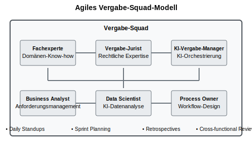

# Das Ende des Formulars: Wie Sprachmodelle die öffentliche Vergabe neu definieren

## Zusammenarbeit zwischen Fachbereichen und Vergabestellen

### Traditioneller Beschaffungsprozess

Die traditionelle Zusammenarbeit zwischen Fachbereichen und Vergabestellen folgt einem sequentiellen Muster:

### KI-Transformation der Zusammenarbeit

Künstliche Intelligenz ermöglicht völlig neue Formen der Kollaboration:

### Optimierter Workflow

Der KI-gestützte Workflow reduziert Durchlaufzeiten erheblich:

### Prozessoptimierung

Von sequentieller zu paralleler Bearbeitung:

### Agile Arbeitsweisen

Neue Organisationsformen für die digitale Transformation:

### Implementierungsroadmap

Strukturierter Ansatz für die Umsetzung:

## Kernvorteile der KI-Transformation

- 70-80% Zeitersparnis bei Routineprozessen
- 30-50% Reduzierung der Durchlaufzeiten  
- 90% weniger manuelle Abstimmungsschleifen
- 5-10% Kosteneinsparungen durch optimierte Prozesse

## Fazit

Die KI-Transformation der Zusammenarbeit zwischen Fachbereichen und Vergabestellen ist eine fundamentale Neugestaltung der öffentlichen Beschaffung. Durch intelligente Kollaboration, parallele Prozesse und agile Arbeitsweisen können Behörden effizienter, transparenter und innovativer agieren.

**Beginnen Sie heute. Die Zukunft der intelligenten Verwaltung wartet auf Sie.**
